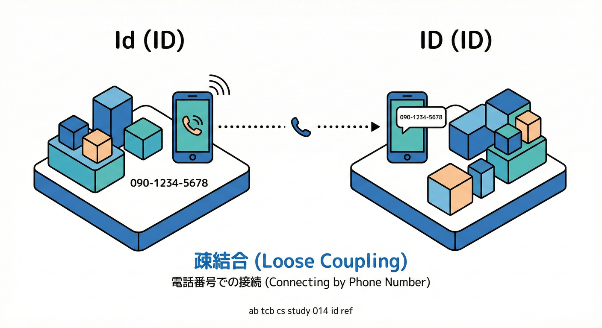
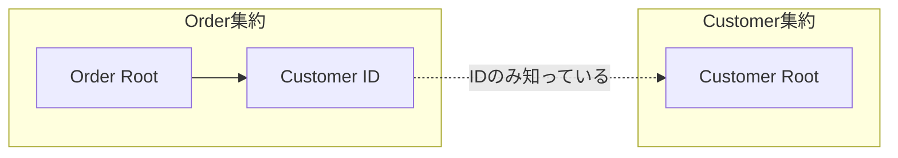
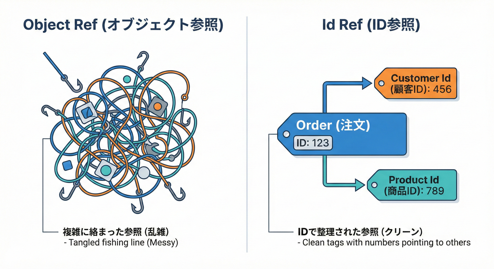
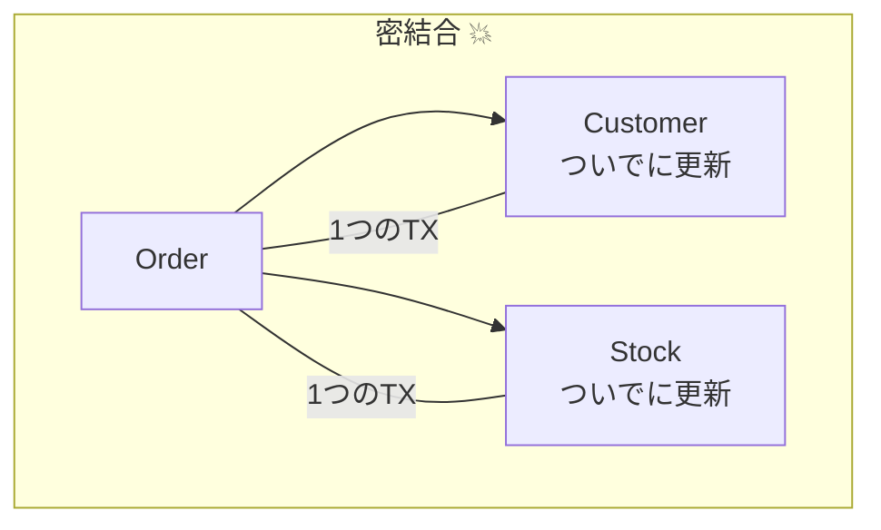
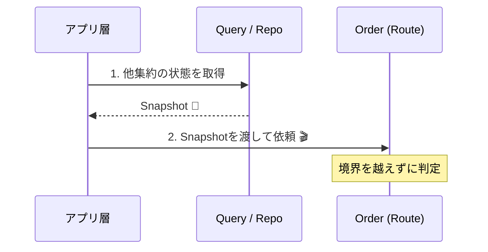
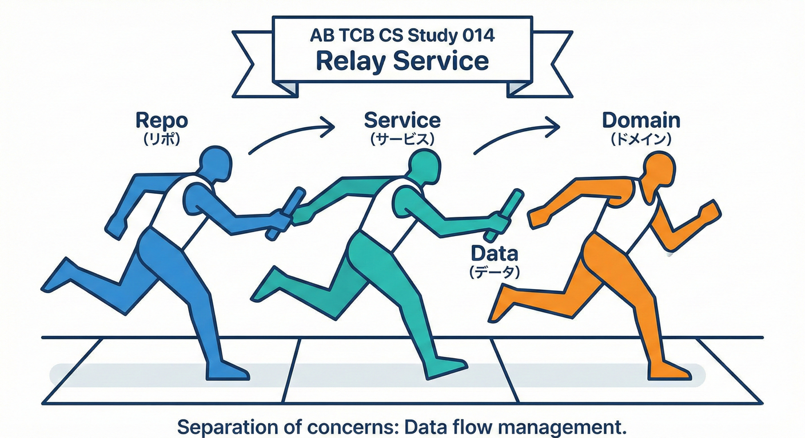

# 第14章：境界の判断軸②「参照はIDで持つ」🆔✨

## この章でできるようになること🎯

* 「集約Aが集約Bを “オブジェクト参照” しちゃう事故」を見抜ける👀💥
* 他集約が必要なときに **ID参照 + Query** で安全に取りに行ける🔎🧠
* 「更新はルート、参照は別」感覚で、境界がブレなくなる🚪🔒

---

## まず結論：他集約は “IDだけ” を持つ🆔✅




集約の外にいるもの（＝他集約）を、ドメインモデルの中でこう持ちたくなる👇

* ❌ `Order` が `Customer` オブジェクトをプロパティで持つ
* ❌ `Order` が `PaymentMethod` を丸ごと抱える
* ❌ `Order` → `Customer` → `Address` → … と “オブジェクトの鎖” が伸びる

でも集約設計では、基本こうする👇

* ✅ `Order` は `CustomerId`（ID）だけ持つ
* ✅ 参照が必要なら **Query（検索）で取りに行く**
* ✅ “更新したいもの” と “表示したい情報” を分ける


```mermaid
graph LR
    subgraph OrderAgg [Order集約]
        Order[Order Root] --> CID[Customer ID]
    end
    subgraph CustAgg [Customer集約]
        Cust[Customer Root]
    end
    CID -. "IDのみ知っている" .-> Cust
```

この考え方は、MicrosoftのDDD解説でも「集約は他集約への参照を持つ（REF）」という形で示されてるよ🧩✨ ([Microsoft Learn][1])

---

## なんでID参照が大事なの？（事故が起きやすいから）🚑😵




### 事故①：境界が溶けて “ついで更新” が始まる🫠

「注文確定のついでに顧客ランク更新もしよ〜」
「注文のついでに在庫も引いとこ〜」

…ってなると、いつの間にか **複数集約を1トランザクションで更新**したくなる😇💥
結果：

* 変更が怖くなる😱


```mermaid
graph TD
    subgraph TightCoupling [密結合 💥]
        Order --> Customer[Customer <br/>ついでに更新]
        Order --> Stock[Stock <br/>ついでに更新]
    end
    Order -- 1つのTX --- Customer
    Order -- 1つのTX --- Stock
```

### 事故②：読み取りだけのはずが、更新が混ざる🧨

オブジェクト参照してると、うっかり

* `customer.Name = ...` とか書けちゃう
* コレクションに `Add` しちゃう
* OR/Mが “変更検知” して保存対象に入れちゃう

「表示のために取っただけ」だったのに、保存で巻き込みが起こるのがあるある💦

### 事故③：取りに行くたび “巨大なグラフ” をロードしがち🧱

`Order` 取ったら `Customer` も `Payment` も…みたいに
DBアクセスやメモリ負荷が増え、パフォーマンスの話が急に難しくなる😵‍💫

---

## イメージ図でつかもう📦➡️📦

```text
【Order集約】🌳                 【Customer集約】🌳
- OrderId                      - CustomerId
- CustomerId --------------->  - Name
- Items[]                      - Status
- OrderStatus                  - ...
(※Customerを丸ごと持たない)      (別の集約として独立)
```

ポイントはこれ👇

* `Order` は **Customerそのもの** を抱えない
* つながりは **CustomerId（ID）** だけ
* Customerの情報が欲しいなら “取りに行く”（Query）🔎

---

## カフェ注文で具体例☕️🍰（やりがちなNG→OK）

### ❌ NG：他集約をオブジェクト参照しちゃう

```csharp
public class Order // 集約ルート（のつもり）
{
    public Customer Customer { get; private set; }  // ❌ 他集約を丸ごと
    public List<OrderItem> Items { get; private set; } = new();
    
    public void Place()
    {
        if (Customer.IsBanned) throw new Exception("NG"); // 参照して判断
        // ...
    }
}
```

この形だと、Orderの変更なのにCustomerの状態や変更まで “巻き込みやすい” 😵‍💫💥

---

### ✅ OK：他集約はID参照にする（型安全だとなお良い）🆔💖

#### 1) まずIDをValueObject化（おすすめ）✨

```csharp
public readonly record struct CustomerId(Guid Value);
public readonly record struct OrderId(Guid Value);
```

#### 2) Order集約は CustomerId だけ持つ✅

```csharp
public class Order
{
    public OrderId Id { get; private set; }
    public CustomerId CustomerId { get; private set; }  // ✅ IDだけ
    private readonly List<OrderItem> _items = new();
    public IReadOnlyList<OrderItem> Items => _items;

    public OrderStatus Status { get; private set; } = OrderStatus.Draft;

    private Order() { } // EFなど都合があるとき用（必要なら）

    public Order(OrderId id, CustomerId customerId)
    {
        Id = id;
        CustomerId = customerId;
    }

    public void AddItem(MenuItemId menuItemId, int qty)
    {
        if (Status != OrderStatus.Draft) throw new InvalidOperationException("確定後は追加できないよ🧾🚫");
        if (qty <= 0) throw new ArgumentOutOfRangeException(nameof(qty));
        _items.Add(new OrderItem(menuItemId, qty));
    }

    // ✅ 「他集約の状態」は “引数で受け取る” のがコツ
    public void Place(CustomerStateSnapshot customer)
    {
        if (Status != OrderStatus.Draft) throw new InvalidOperationException("もう確定済みだよ✅");
        if (customer.IsBanned) throw new InvalidOperationException("利用停止中だよ🙅‍♀️");
        Status = OrderStatus.Placed;
    }
}

public readonly record struct CustomerStateSnapshot(bool IsBanned);
```

ここが超大事👇

* `Order` は Customer を取りに行かない（＝境界を守る）🔒
* 必要な情報だけ **スナップショット** で渡す📸✨

* 必要な情報だけ **スナップショット** で渡す📸✨


```mermaid
sequenceDiagram
    participant App as アプリ層
    participant Q as Query / Repo
    participant Order as Order (Route)
    App->>Q: 1. 他集約の状態を取得
    Q-->>App: Snapshot 📸
    App->>Order: 2. Snapshotを渡して依頼 🎬
    Note over Order: 境界を越えずに判定
```

---

## 「参照が必要なら Query で取りに行く」ってどうやるの？🔎💡




### Command（更新）と Query（表示）を分ける🌈

* **更新（Command）**：集約ルートを呼ぶ（不変条件を守る）🔒
* **参照（Query）**：必要な表示データを取りに行ってDTOで返す📦

#### 例：注文確定ユースケース（Application層の仕事）🎬🔒

```csharp
public sealed class PlaceOrderService
{
    private readonly IOrderRepository _orders;
    private readonly ICustomerQueryService _customers; // 参照専用（Query）

    public PlaceOrderService(IOrderRepository orders, ICustomerQueryService customers)
    {
        _orders = orders;
        _customers = customers;
    }

    public async Task PlaceAsync(OrderId orderId, CancellationToken ct)
    {
        var order = await _orders.GetAsync(orderId, ct);

        // ✅ 参照はQueryで取得（他集約を抱えない）
        var customerState = await _customers.GetStateAsync(order.CustomerId, ct);
        order.Place(customerState);

        await _orders.SaveAsync(order, ct);
    }
}

public interface ICustomerQueryService
{
    Task<CustomerStateSnapshot> GetStateAsync(CustomerId id, CancellationToken ct);
}
```

この「**集約は純粋にルールを守る**」「**参照は外で取る**」分離は、.NETのDDD実装ガイドでも “ドメインがORM依存で汚れない” ことが重要って説明されてるよ🧼✨ ([Microsoft Learn][2])

---

## EF Coreでのコツ（ID参照を崩さない）🧪🧩

### コツ①：ドメインに “他集約ナビゲーション” を置かない🚫

* `public Customer Customer {get;set;}` みたいなのは基本置かない🙅‍♀️
* DBにはFKがあってOK（DBの都合）
* でもドメインは「IDしか知らない」状態を守る🛡️

### コツ②：VOのIDは “値” として保存する🧷

`CustomerId(Guid)` をそのまま扱うときは、ValueConverterなどで `Guid` に落とす形が王道だよ（EFの設定で調整）🛠️

### コツ③：最新の土台（2026年時点）を知っておく🆕

* **C# 14 が最新**で、**.NET 10** と **Visual Studio 2026** で試せるよ✨ ([Microsoft Learn][3])
* .NET 10 は 2026-01-13 に最新更新が出てる（Windows Update等で配布）🪟🔄 ([マイクロソフトサポート][4])

（※章の目的はID参照だから、ここは “いまの前提” を知る程度でOKだよ〜🙂）

---

## ありがちなQ&A🙋‍♀️💬

### Q1. 「でもCustomerの名前、画面に出したい…」😿

A. **Queryで取る**のが正解！

* 画面表示用DTOに `CustomerName` を入れる
* ドメイン（Order）には入れない

### Q2. 「注文確定のとき、顧客の状態チェックしたい…」🤔

A. “必要な情報だけ” を引数で渡す📦✨
`CustomerStateSnapshot` みたいに最小でOK！

### Q3. 「ID参照だと、整合性が弱くならない？」😨

A. 弱くしないために

* “同時に守るべきルール” は集約内に閉じ込める🔒
* 他集約にまたがるなら **設計で分離**（後半章でイベントや最終的整合へ）🌉⏳

---

## ミニワーク✍️🎀（手を動かすと一気にわかる！）

### ワーク1：NGコードをID参照に直してみよう🔧

次の状態を想像して、`Order` が `Customer` を持ってたらどう直す？🆔

* `Order.Customer`（オブジェクト参照）を
* `Order.CustomerId`（ID参照）へ✨

やること👇

* `CustomerId` を作る
* `Order` のプロパティを差し替える
* `Place()` に必要な情報を引数で渡す形にする

---

### ワーク2：「表示用」のデータをDTOに分けよう📦

注文詳細画面で出したい項目👇

* 注文番号、注文ステータス
* 商品一覧
* 顧客名（Customer集約）
* 顧客の会員ランク（Customer集約）

✅ ルール：Order集約に “顧客名” を入れない
→ Queryで取ってDTOに詰めよう🌸

---

### ワーク3：境界チェッククイズ⚖️

次の参照はどれがOK？（理由も書こう）🧠✨

1. `Order` が `Address`（VO）を持つ
2. `Order` が `Customer`（他集約）を持つ
3. `Order` が `CustomerId` を持つ
4. `OrderItem` が `MenuItemId` を持つ

---

## AI活用（Copilot/Codex向け）🤖✨

### 1) リファクタ支援プロンプト🔧

```text
このOrderクラスは他集約(Customer)をオブジェクト参照しています。
DDDの集約境界を守るため、Customer参照をCustomerIdに置き換えてください。
さらに、注文確定(Place)に必要なCustomer情報はスナップショット引数で受け取る形にリファクタしてください。
変更点の理由も短く説明してください。
```

### 2) テスト作成プロンプト🧪

```text
次の仕様を満たすユニットテストをxUnitで作ってください。
- OrderはDraftのときだけAddItemできる
- PlaceはCustomerStateSnapshot.IsBannedがtrueなら失敗する
- Place後はOrderStatusがPlacedになる
境界を守るため、Order内でRepositoryを使わない形にしてください。
```

### 3) 設計レビュー用プロンプト👀

```text
この設計は「他集約をID参照する」ルールを守れていますか？
守れていない場合、どこが密結合で、どんな事故（巻き込み更新/巨大トランザクション/オブジェクトグラフ肥大）が起き得るか指摘してください。
改善案を3つ出してください（1つはQuery分離、1つは引数スナップショット、1つはDTO設計）。
```

---

## まとめ🌸✨

* 集約どうしは **オブジェクト参照しない**、基本は **ID参照** 🆔✅
* 参照が必要なら **Queryで取りに行く** 🔎
* ルールチェックに必要な情報は **最小スナップショットを引数で渡す** 📦
* これだけで「境界が溶ける事故」が激減するよ🛡️✨

[1]: https://learn.microsoft.com/en-us/azure/architecture/microservices/model/tactical-ddd "Using tactical DDD to design microservices - Azure Architecture Center | Microsoft Learn"
[2]: https://learn.microsoft.com/en-us/dotnet/architecture/microservices/microservice-ddd-cqrs-patterns/net-core-microservice-domain-model "Implementing a microservice domain model with .NET - .NET | Microsoft Learn"
[3]: https://learn.microsoft.com/en-us/dotnet/csharp/whats-new/csharp-14 "What's new in C# 14 | Microsoft Learn"
[4]: https://support.microsoft.com/en-us/topic/-net-10-0-update-january-13-2026-64f1e2a4-3eb6-499e-b067-e55852885ad5 ".NET 10.0 Update - January 13, 2026 - Microsoft Support"
