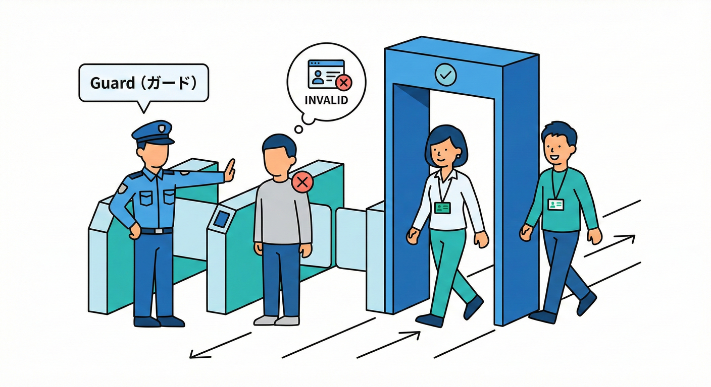
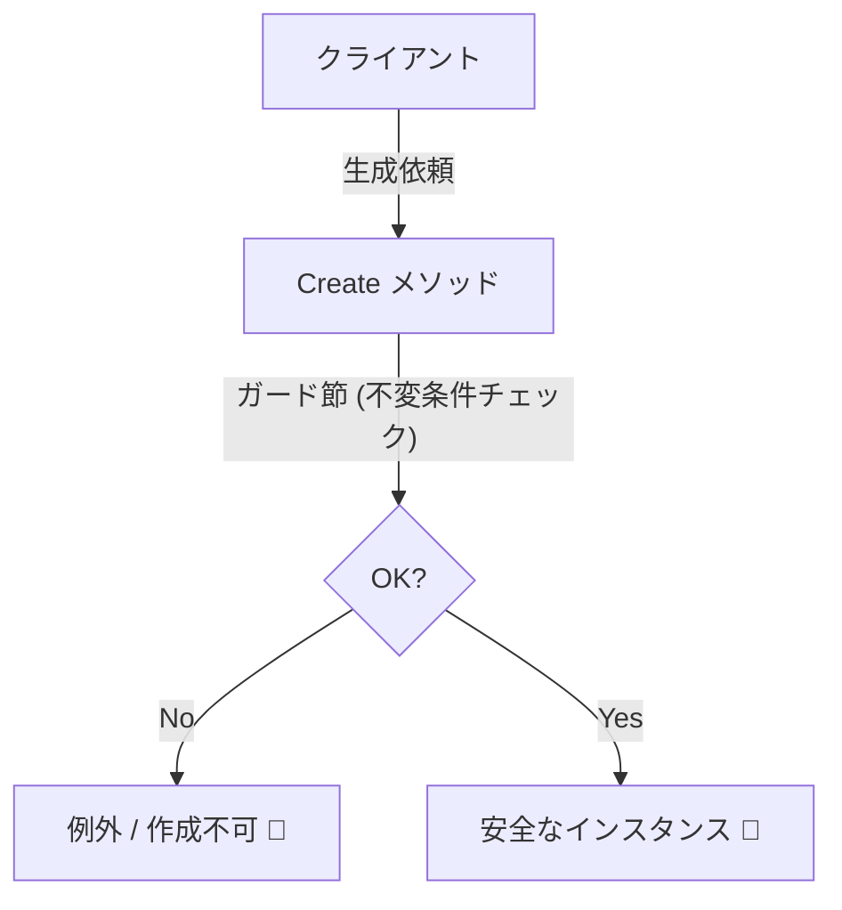
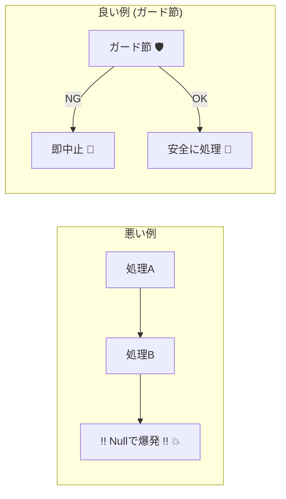
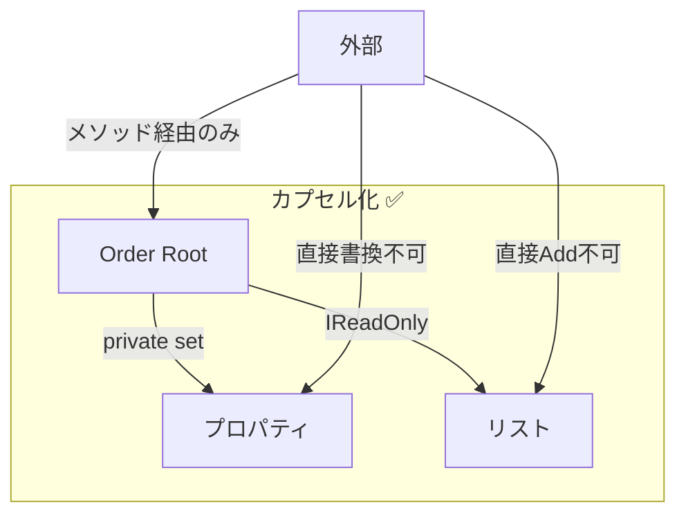

# 第18章：C#で不変条件を守る①（生成とガード節）🛠️🔐

## この章でできるようになること🎯✨

* 「**無効な状態のオブジェクト**」を最初から作らない設計ができる🏗️
* **ガード節（Guard Clause）**で、壊れた入力を早めに弾ける🚫
* **public setter を封印**して、外部から勝手に壊されないモデルにできる🧱
* EF Core と共存するための「落とし所」もわかる🤝🧪

> なお、ここでは **C# 14 / .NET 10** の前提で進めるよ🌸
> C# 14 は .NET 10 でサポートされていて、Visual Studio 2026 か .NET 10 SDK で試せるよ🧡 ([Microsoft Learn][1])
> .NET 10 の SDK/Runtime は 10.0.x として配布されてるよ📦 ([Microsoft][2])

---

## 18.1 不変条件（Invariants）を“生成”で守ると強い理由💪🔐




不変条件っていうのは、「このオブジェクトは**いつ見ても**これが成り立ってないとダメ！」っていう約束事だよ📌✨

たとえばカフェ注文なら…☕️

* 注文は **注文者が必須** 👤
* 注文明細は **1件以上** 🧾
* 数量は **1以上** 🔢
* 合計金額は **0円以上** 💰

ここで怖いのが👇😱
「作った瞬間から壊れてる注文（明細ゼロとか）」が存在しちゃうと、**どこで爆発するかわからない**💥

だから結論はこれ✅
生成時に守れれば、その後のコードが一気にラクになるよ😊


```mermaid
graph TD
    Client[クライアント] -- 生成依頼 --> Create[Create メソッド]
    Create -- "ガード節 (不変条件チェック)" --> Guard{OK?}
    Guard -- No --> Error[例外 / 作成不可 🚫]
    Guard -- Yes --> Instance[安全なインスタンス 🌱]
```

---

## 18.2 まず覚える3つの鉄則🧱✨

## 鉄則①：無効な状態を「作れない」ようにする🏗️🚫

* 生成時にチェックして、ダメなら弾く（例外 or エラー）
* そもそも `new` を外から呼べないようにするのが強い💪

## 鉄則②：入力チェックは「最初に・短く」✨

* メソッドの冒頭で弾く
* 後ろに行くほどバグが見えにくい😵‍💫

## 鉄則③：public setter をやめる😇🔒

* 外部から `order.Status = Confirmed;` みたいにできると、ルールが壊れる💔
* **更新はメソッドに閉じ込める**（第19章で本格化するよ🚦）

---

## 18.3 ガード節（Guard Clause）ってなに？🚪🛡️

ガード節は「**変な入力なら即終了**」の早期リターン（or 例外）スタイルだよ✨

## 悪い例（奥の方で気づく）😵

* いろいろ処理したあとに null で落ちる
* スタックトレースが遠くて原因が見えない😇

## 良い例（入口で止める）😊

* 最初に条件チェックして、即止める
* バグが「ここで止まる」から調査が超ラク🔍✨


```mermaid
flowchart LR
    subgraph Bad [悪い例]
        Step1[処理A] --> Step2[処理B] --> Step3["!! Nullで爆発 !! 💥"]
    end
    subgraph Good ["良い例 (ガード節)"]
        G["ガード節 🛡️"] -- NG --> Stop["即中止 🚫"]
        G -- OK --> Exec["安全に処理 🚀"]
    end
```

---

## 18.4 まずは標準機能：`ThrowIfNull` を使おう🧰✨

.NET には引数 null チェック用の **`ArgumentNullException.ThrowIfNull`** があるよ🌸
これ、コードが短くなって読みやすい✨ ([Microsoft Learn][3])

```csharp
public void SetCustomerName(string name)
{
    ArgumentNullException.ThrowIfNull(name);

    // ここから先は name が null じゃない前提で書ける✨
}
```

## null 以外もチェックしたいとき🧩

たとえば「空文字はダメ」とか「範囲外はダメ」とかね👇

```csharp
public void SetCustomerName(string name)
{
    ArgumentNullException.ThrowIfNull(name);

    if (string.IsNullOrWhiteSpace(name))
        throw new ArgumentException("名前は空にできません", nameof(name));
}
```

---

## 18.5 “ガードの書き方”テンプレ3点セット📌✨

よく使うのはこの3つ！覚えると速いよ🚀

## ① null チェック🧊

```csharp
ArgumentNullException.ThrowIfNull(value);
```

## ② 空・空白チェック🫥

```csharp
if (string.IsNullOrWhiteSpace(value))
    throw new ArgumentException("空はダメ", nameof(value));
```

## ③ 数値の範囲チェック🔢

```csharp
if (quantity <= 0)
    throw new ArgumentOutOfRangeException(nameof(quantity), "1以上にしてね");
```

---

## 18.6 小さな Guard ヘルパーを作る（書き味UP）🧰💖

毎回 `if (...) throw ...` を書くのもアリだけど、増えると見た目がゴチャつくよね😵‍💫
そこで、**小さな Guard クラス**を作るとスッキリする✨

```csharp
using System.Runtime.CompilerServices;

internal static class Guard
{
    public static string NotNullOrWhiteSpace(
        string? value,
        [CallerArgumentExpression("value")] string? name = null)
    {
        ArgumentNullException.ThrowIfNull(value, name);

        if (string.IsNullOrWhiteSpace(value))
            throw new ArgumentException("空白はダメだよ", name);

        return value;
    }

    public static int Positive(
        int value,
        [CallerArgumentExpression("value")] string? name = null)
    {
        if (value <= 0)
            throw new ArgumentOutOfRangeException(name, "1以上にしてね");

        return value;
    }
}
```

使う側はこう👇（読みやすい！）✨

```csharp
public void ChangeQuantity(int quantity)
{
    quantity = Guard.Positive(quantity);

    // quantity は 1以上が保証される🎀
}
```

---

## 18.7 例題：Order 集約を「安全に生成」してみよう☕️📦

ここからは “カフェ注文” のミニモデルでいくよ🌸
ポイントは👇

* `new Order(...)` を外から禁止🚫
* `Create(...)` で **必ずチェック**✅
* `public set` は作らない😇

## 18.7.1 注文明細（OrderItem）🧾

```csharp
public readonly record struct OrderItem(string MenuCode, int Quantity, int UnitPriceYen)
{
    public static OrderItem Create(string menuCode, int quantity, int unitPriceYen)
    {
        menuCode = Guard.NotNullOrWhiteSpace(menuCode);
        quantity = Guard.Positive(quantity);

        if (unitPriceYen < 0)
            throw new ArgumentOutOfRangeException(nameof(unitPriceYen), "0円以上にしてね");

        return new OrderItem(menuCode, quantity, unitPriceYen);
    }
}
```

## 18.7.2 注文（Aggregate Root）🌳👑

```csharp
public enum OrderStatus
{
    Draft = 0,
    Confirmed = 1,
}

public sealed class Order
{
    public Guid Id { get; }
    public Guid CustomerId { get; }
    public OrderStatus Status { get; private set; }

    private readonly List<OrderItem> _items = new();
    public IReadOnlyList<OrderItem> Items => _items;

    private Order(Guid id, Guid customerId, IEnumerable<OrderItem> items)
    {
        if (id == Guid.Empty) throw new ArgumentException("Idが空だよ", nameof(id));
        if (customerId == Guid.Empty) throw new ArgumentException("CustomerIdが空だよ", nameof(customerId));

        ArgumentNullException.ThrowIfNull(items);

        _items.AddRange(items);

        if (_items.Count == 0)
            throw new InvalidOperationException("明細が0件の注文は作れません🧾🚫");

        Status = OrderStatus.Draft;
        Id = id;
        CustomerId = customerId;
    }

    public static Order Create(Guid customerId, IEnumerable<OrderItem> items)
    {
        // 入口で弾く（ガード節）✨
        if (customerId == Guid.Empty) throw new ArgumentException("CustomerIdが空だよ", nameof(customerId));
        ArgumentNullException.ThrowIfNull(items);

        // items が遅延評価だと地味に怖いので、いったん固定化するのが安全🎀
        var list = items.ToList();

        // ここでまとめて不変条件チェック✅
        if (list.Count == 0)
            throw new InvalidOperationException("明細が0件の注文は作れません🧾🚫");

        return new Order(Guid.NewGuid(), customerId, list);
    }
}
```

✅ これで「明細0件の注文」が **世界から消える**🎉✨
（少なくとも `Create` 経由なら絶対に作れない！）

---

## 18.8 public setter を禁止する理由（超だいじ）🚫😇

たとえばこういうのがあると…👇

```csharp
public sealed class BadOrder
{
    public Guid CustomerId { get; set; }  // ← 誰でも変更できる😱
    public List<OrderItem> Items { get; set; } = new(); // ← 外からAddできる😱
}
```

これだと、どこからでも👇ができちゃう💥

* `CustomerId = Guid.Empty;`
* `Items.Clear();`（明細0件にできる）
* `Items.Add(new(... quantity: -10 ...))`（変な明細が入る）

だから安全な形は👇✨

* コレクションは `IReadOnlyList` で公開（中身を直接いじらせない）


```mermaid
graph TD
    subgraph Closed [カプセル化 ✅]
        Order[Order Root] -- "private set" --> Prop[プロパティ]
        Order -- "IReadOnly" --> Items[リスト]
    end
    External[外部] -- "メソッド経由のみ" --> Order
    External -- "直接書換不可" --> Prop
    External -- "直接Add不可" --> Items
```

---

## 18.9 EF Core と共存する“現実的な落とし所”🤝🧪

「カプセル化したい」vs「ORMが勝手に作りたい」ってケンカになりがち😵‍💫
でも EF Core 側にはこういう仕組みがあるよ👇

## ① EF Core は “コンストラクタ” を使って生成できる🏗️

EF Core は、マップされたプロパティに合う **パラメータ付きコンストラクタ**を呼べるよ📦 ([Microsoft Learn][4])

## ② バッキングフィールドで「外から触れない」を保てる🧱

EF Core は **フィールドに読み書き**する設定もできるから、公開プロパティを汚さずに済むよ✨ ([Microsoft Learn][5])

> この教材ではまず「ドメインの安全第一」でOK🌸
> EF の細かいマッピングは、必要になったタイミングで強化していこう😊

---

## 18.10 ミニテスト：不変条件が守れてるか確認しよう✅🧪

「守ってるつもり」が一番危ない😇
テストで “壊せない” を証明しよう✨

## xUnit の例🧁

```csharp
using Xunit;

public class OrderTests
{
    [Fact]
    public void Create_Throws_When_ItemsEmpty()
    {
        var customerId = Guid.NewGuid();

        Assert.Throws<InvalidOperationException>(() =>
            Order.Create(customerId, Array.Empty<OrderItem>()));
    }

    [Fact]
    public void Create_Succeeds_When_Valid()
    {
        var customerId = Guid.NewGuid();
        var items = new[]
        {
            OrderItem.Create("LATTE", 1, 500),
            OrderItem.Create("CAKE",  2, 450),
        };

        var order = Order.Create(customerId, items);

        Assert.Equal(OrderStatus.Draft, order.Status);
        Assert.Equal(2, order.Items.Count);
    }
}
```

---

## 18.11 AI（Copilot/Codex）で速くするコツ🤖✨

AIは「ガード節」や「テストパターン」みたいな定型作業が得意💪
ただし、**不変条件そのもの（業務ルール）は人間が決める**のが超大事だよ🧠💕

## 使えるプロンプト例💬

* 「この Order の不変条件を箇条書きで提案して。カフェ注文として自然なルールで」
* 「上の不変条件に対する xUnit テストケースを “失敗系中心” で10個出して」
* 「Guard クラスに追加すると便利なメソッド案を出して（NotNull, Range, MaxLength など）」

## チェックポイント✅

* そのルール、**業務的に本当に必要？**
* “ユーザー入力ミス” と “プログラムミス” を混ぜてない？（第20章で整理するよ🧾）

---

## 18.12 ミニ課題（手を動かそう）📝🌸

## 課題A：ルール追加🍰

次の不変条件を追加して、生成時に弾いてね✅

* 明細は最大10件まで
* `MenuCode` は 1〜20文字
* `UnitPriceYen` は 0〜50,000円

## 課題B：テスト追加🧪

* 「11件だと失敗」
* 「空白メニューコードだと失敗」
* 「価格がマイナスだと失敗」

## 課題C：public setter 根絶🚫

* `Order` と `OrderItem` から public setter を完全に消す✨
* 外から `Items.Add` できないようにする✨

---

## この章のまとめ📌✨

* 不変条件は **生成時**に守ると最強🏗️🔐
* ガード節は「入口で短く」🚪✨
* `ThrowIfNull` で null チェックがスッキリするよ🧡 ([Microsoft Learn][3])
* public setter をやめて「勝手に壊せない」モデルへ😇🧱
* EF Core はコンストラクタ生成やバッキングフィールドで折り合いが付けられる🤝🧪 ([Microsoft Learn][4])

[1]: https://learn.microsoft.com/ja-jp/dotnet/csharp/whats-new/csharp-14 "C# 14 の新機能 | Microsoft Learn"
[2]: https://dotnet.microsoft.com/en-US/download/dotnet/10.0 "Download .NET 10.0 (Linux, macOS, and Windows) | .NET"
[3]: https://learn.microsoft.com/ja-jp/dotnet/api/system.argumentnullexception.throwifnull?view=net-10.0&utm_source=chatgpt.com "ArgumentNullException.ThrowIfNull Method (System)"
[4]: https://learn.microsoft.com/en-us/ef/core/modeling/constructors?utm_source=chatgpt.com "Entity types with constructors - EF Core"
[5]: https://learn.microsoft.com/en-us/ef/core/modeling/backing-field?utm_source=chatgpt.com "Backing Fields - EF Core"
