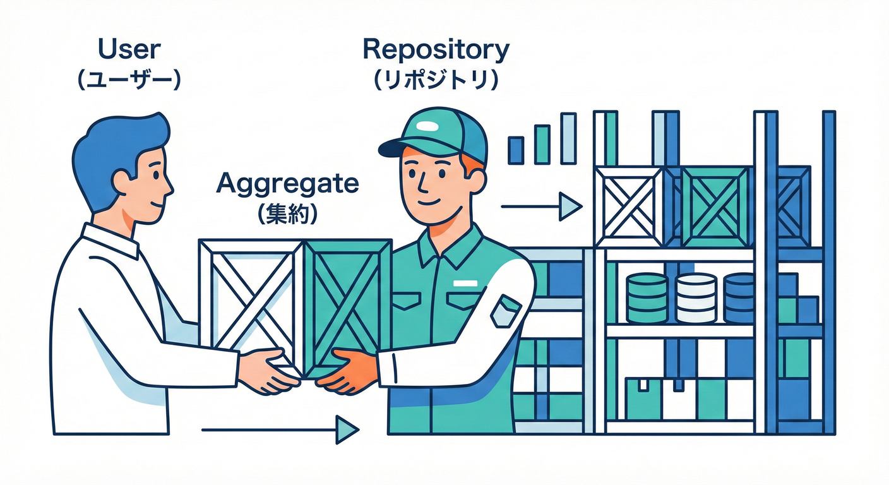

# 第22章：Repositoryは「集約単位」🏪

## この章でできるようになること🎯✨

* Repositoryが「何のためにあるのか」を、ふわっとじゃなく説明できる😳➡️😊
* **“集約ルート単位で取り出す／保存する”** ができるようになる🚪🌳
* やりがちなNG（OrderItemRepository 乱立💥）を避けられる🙅‍♀️

---

## 1. Repositoryってなに？（ひとことで）🧺✨




Repositoryは、**集約（Aggregate）を出し入れするための“入り口”**だよ🏪🚪
DBのテーブルを触る道具というより、**ドメイン（業務）を壊さずに保存するための窓口**って感じ🌸

DDD系のガイドでも、**「集約（または集約ルート）ごとにRepositoryを作る」**のが基本って書かれてるよ📚✨ ([Microsoft Learn][1])

---

## 2. なんで「集約単位」なの？🌳🔒

集約は「整合性を守るまとまり」だったよね？（第11〜17章あたりの話🌸）
だから永続化も、基本はこう👇

* ✅ **取り出す：集約ルート＋中の子たち（必要なら）**
* ✅ **保存する：集約ルートを保存した結果として、中の子も一緒に保存される**

これを守ると何が嬉しいかというと…

### 嬉しいこと①：不変条件が壊れにくい🛡️✨

集約ルートが「入口」だから、勝手に子だけ更新されにくい🚫
（＝ルール破りを防げる！）

### 嬉しいこと②：トランザクション境界と相性がいい🔒

あとで第25〜26章でやるけど、1ユースケースの最後に `SaveChanges` を1回呼ぶと、**その呼び出しは（多くのDBで）トランザクションになって “全部成功 or 全部失敗”** ができるよ💾✅ ([Microsoft Learn][2])

---

## 3. 典型NG：OrderItemRepository を作っちゃう💥🙅‍♀️

たとえばカフェ注文で…

* `OrderRepository` ✅
* `OrderItemRepository` ❌（基本NG）

### 何が困るの？😵

OrderItemだけ更新できちゃうと、こんな事故が起きやすい👇

* 「注文確定後は明細を追加できない」🧾🚫
  なのに `OrderItemRepository.Add()` で追加できちゃう💥
* 「合計金額を再計算する」💰
  なのに明細だけ増えて合計が更新されない💥

つまり、**第17章の“不変条件”が守れなくなる**のが最大の問題😱

---

## 4. 正しい方向：Repositoryは集約ルートのために作る👑🚪

この教材のカフェ注文なら、集約ルートは `Order`（注文）にするのが自然だよね☕️📦
なのでRepositoryもこうなる👇

* ✅ `IOrderRepository`（Order集約を出し入れする）
* ❌ `IOrderItemRepository`（基本作らない）

---

## 5. 実装例：Order集約（超ミニ）☕️🧩

### 5-1. ドメイン側（集約ルート＋子）🌳

ポイントはこれ👇

* 外からは `Order` のメソッド経由でしか変えない✋
* `Items` は読み取り専用っぽく見せる👀

```csharp
public sealed class Order
{
    private readonly List<OrderItem> _items = new();

    public Guid Id { get; }
    public OrderStatus Status { get; private set; } = OrderStatus.Draft;

    public IReadOnlyList<OrderItem> Items => _items;

    public Order(Guid id)
    {
        Id = id;
    }

    public void AddItem(Guid menuItemId, int qty)
    {
        if (Status != OrderStatus.Draft)
            throw new InvalidOperationException("確定後は明細を追加できません");

        if (qty <= 0)
            throw new ArgumentOutOfRangeException(nameof(qty));

        _items.Add(new OrderItem(Guid.NewGuid(), menuItemId, qty));
    }

    public void Confirm()
    {
        if (_items.Count == 0)
            throw new InvalidOperationException("明細ゼロでは確定できません");

        Status = OrderStatus.Confirmed;
    }
}

public sealed class OrderItem
{
    public Guid Id { get; }
    public Guid MenuItemId { get; }
    public int Quantity { get; private set; }

    internal OrderItem(Guid id, Guid menuItemId, int quantity)
    {
        Id = id;
        MenuItemId = menuItemId;
        Quantity = quantity;
    }
}

public enum OrderStatus
{
    Draft,
    Confirmed
}
```

> 子（OrderItem）のコンストラクタを `internal` にして、外から勝手に作られにくくするのもコツだよ🔐✨

---

## 6. Repositoryのインターフェイス設計（シンプル版）🏪✨

Repositoryは **“集約を出し入れ”** だけに寄せると、迷子になりにくいよ🧭🌸

```csharp
public interface IOrderRepository
{
    Task<Order?> FindAsync(Guid id, CancellationToken ct = default);
    Task AddAsync(Order order, CancellationToken ct = default);
}
```

### 「Updateメソッド」いらないの？🤔

EF Coreみたいに変更追跡（トラッキング）するORMだと、
**取ってきた集約をメソッドで変更→最後にSaveChanges** でOKになりやすいよ💡 ([Microsoft Learn][3])

---

## 7. EF CoreでのRepository実装（最小）🧪💾

### 7-1. DbContext（Orders と Items）📦

```csharp
using Microsoft.EntityFrameworkCore;

public sealed class CafeDbContext : DbContext
{
    public DbSet<Order> Orders => Set<Order>();

    public CafeDbContext(DbContextOptions<CafeDbContext> options) : base(options) { }

    protected override void OnModelCreating(ModelBuilder modelBuilder)
    {
        modelBuilder.Entity<Order>(b =>
        {
            b.HasKey(x => x.Id);

            // Order -> OrderItem（子は集約の中）
            b.HasMany<OrderItem>("_items")
             .WithOne()
             .HasForeignKey("OrderId");

            b.Navigation("_items").UsePropertyAccessMode(PropertyAccessMode.Field);
        });

        modelBuilder.Entity<OrderItem>(b =>
        {
            b.HasKey(x => x.Id);
        });
    }
}
```

### 7-2. Repository実装（EF版）🏪

```csharp
using Microsoft.EntityFrameworkCore;

public sealed class EfOrderRepository : IOrderRepository
{
    private readonly CafeDbContext _db;

    public EfOrderRepository(CafeDbContext db) => _db = db;

    public Task<Order?> FindAsync(Guid id, CancellationToken ct = default)
        => _db.Orders
              .Include(o => o.Items) // 集約の中（子）も一緒に読みたいとき
              .FirstOrDefaultAsync(o => o.Id == id, ct);

    public Task AddAsync(Order order, CancellationToken ct = default)
        => _db.Orders.AddAsync(order, ct).AsTask();
}
```

> `Include` は “集約の中の子” を取るために使うイメージだよ📦✨
> 「他集約」は基本 `Include` しない（ID参照の話、第14章ね🆔）🌸

---

## 8. 保存（コミット）はどこでやる？🔒🎬

ここがめちゃ大事！
Repositoryの中で毎回 `SaveChanges()` しちゃうと、境界がグチャッとなりやすい😵‍💫

基本はこう👇

* Repository：集約を出し入れする🏪
* ユースケース（Application Service）：最後にまとめて確定する🎬✅

そして `SaveChanges` は（DBが対応していれば）**その呼び出し単位でトランザクションになってくれる**のが基本だよ💾🔒 ([Microsoft Learn][2])

---

## 9. VO（Value Object）を“集約の一部”として保存する考え方🧩💗

VOをDBに持ちたいとき、EF Coreだと **Owned Entity Types** を使って「所有される値」を表現できるよ📦✨
Owned は「オーナー（持ち主）の一部」って扱いで、**概念的に集約と相性がいい**って説明されてる🌸 ([Microsoft Learn][4])

（VOの保存は第24章で本格的に触れるけど、「集約の中＝一緒に保存」の感覚がここで繋がるよ😊）

---

## 10. よくある設計ミス集（先に潰す）🧯😅

### ミス①：Repositoryが“なんでも屋”になる🧹

* ❌ 画面用の複雑検索（DTO投影）まで全部Repositoryに入れる
* ✅ 更新系（集約の保存）に寄せる
  画面用は Query 側に逃がす（第14章の「更新と参照は別」感覚）🔎✨

### ミス②：Repositoryが `IQueryable` を返す🐍

* ❌ `IQueryable<Order>` を外に出して、どこでも好きにクエリできる
* ✅ “意図があるメソッド” で返す（例：FindById）
  （初心者ほど、自由度が高いと設計が崩れやすいよ😵）

### ミス③：子だけ更新していい道を作る🧾🚫

* ❌ `OrderItemRepository.UpdateQuantity()`
* ✅ `Order.ChangeItemQuantity()`（集約ルートのメソッドにする）👑

---

## 11. AI活用ミニコーナー🤖✨（Repository編）

AIは便利だけど、Repository周りは**設計の意図が命**だから、質問の仕方が大事だよ🧠💗

### 使いやすい指示の型🪄

* 「**集約ルート以外を更新できない設計**で」
* 「**Repositoryは集約単位**で」
* 「**SaveChangesはアプリ層で1回**に寄せたい」

### 例プロンプト（コピペOK）📋✨

* 「Order集約（Order＋OrderItem）を、外からOrderItemだけ更新できない形で、EF CoreのマッピングとRepository実装を作って」
* 「IOrderRepositoryを設計して。Find/Addだけに絞って、Updateは不要な形にして」
* 「Orderが確定後にAddItemできない不変条件を、ドメインメソッドで守るコード例を出して」

---

## 12. ミニ演習（手を動かす！）✍️🌸

### 演習1：Repositoryを“集約単位”に直す🔧

次の設計を見て、**どこがダメか**と言葉で説明してみて👇

* `OrderRepository`
* `OrderItemRepository`
* `PaymentRepository`（PaymentがOrderの中の概念だとしたら…？）

「どれが集約ルート？」「どれが子？」で判断するよ🌳✨

### 演習2：Findの戻り値を考える🧠

`FindAsync` が返すのはどっちがよさそう？

* A：`Order`（集約そのもの）
* B：`OrderDto`（画面表示用）

更新するユースケースならどっち？👀✨

### 演習3：不変条件を壊すルートを塞ぐ🛡️

「確定後は明細追加できない」を破れるコードがあるなら、

* どこを `private/internal` にする？
* どこをメソッド化する？
  を整理して、**“入口はOrderだけ”** を実現してみよう👑🚪

---

## まとめ📌✨

* Repositoryは **DB操作の便利クラス**じゃなくて、**集約を安全に出し入れする入り口**🏪🚪
* **Repositoryは集約ルート単位**が基本（OrderRepositoryはOK、OrderItemRepositoryは基本NG）🌳🙅‍♀️ ([Microsoft Learn][1])
* 保存の確定（コミット）は、ユースケースの最後にまとめるのがキレイになりやすい💾🔒
  `SaveChanges` が呼び出し単位でトランザクションになるのも大事ポイント✅ ([Microsoft Learn][2])
* VOや子は「集約の一部として一緒に保存」になりやすく、EF CoreのOwned概念もその発想と相性がいい📦💗 ([Microsoft Learn][4])

---

### 参考（この章の内容を支える“最新”の前提）📚✨

* C# 14 が最新で、.NET 10 でサポートされるよ🧡 ([Microsoft Learn][5])
* EF Core 10 は 2025年11月リリースのLTSで、.NET 10 が必要だよ🧪 ([Microsoft Learn][6])

[1]: https://learn.microsoft.com/en-us/dotnet/architecture/microservices/microservice-ddd-cqrs-patterns/infrastructure-persistence-layer-design?utm_source=chatgpt.com "Designing the infrastructure persistence layer - .NET"
[2]: https://learn.microsoft.com/en-us/ef/core/saving/transactions?utm_source=chatgpt.com "Transactions - EF Core"
[3]: https://learn.microsoft.com/en-us/ef/core/dbcontext-configuration/?utm_source=chatgpt.com "DbContext Lifetime, Configuration, and Initialization"
[4]: https://learn.microsoft.com/en-us/ef/core/modeling/owned-entities?utm_source=chatgpt.com "Owned Entity Types - EF Core"
[5]: https://learn.microsoft.com/en-us/dotnet/csharp/whats-new/csharp-14?utm_source=chatgpt.com "What's new in C# 14"
[6]: https://learn.microsoft.com/en-us/ef/core/what-is-new/ef-core-10.0/whatsnew?utm_source=chatgpt.com "What's New in EF Core 10"
