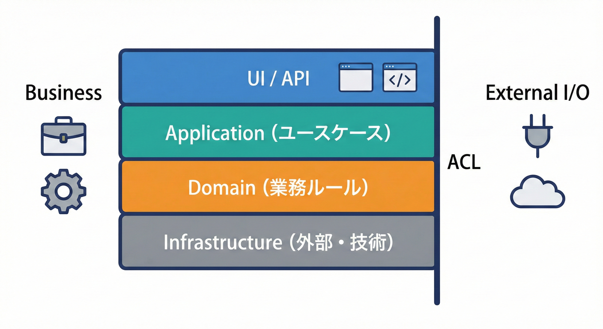
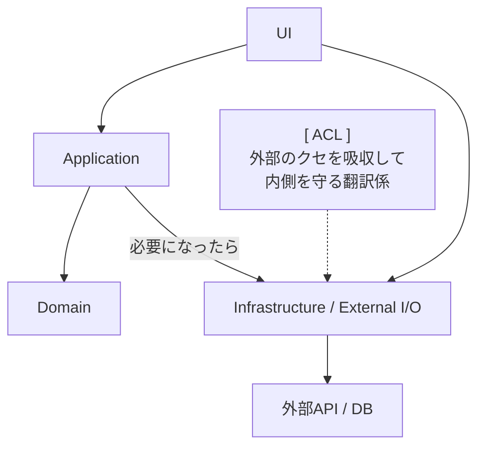

# 第3章：関心の分離（SoC）だけ先に押さえる（ACLの前提）🚪🧠


## この章でできるようになること 🎯✨

* 「混ぜちゃダメ！」な理由を、**自分の言葉で説明**できる 🗣️
* コードを **UI / アプリ / ドメイン / 外部I/O** に分けて考えられる 🧩
* ACL（腐敗防止層）が **どの“境界”に立つのか**イメージできる 🧱🌊

---

## 3-1. SoC（関心の分離）ってなに？🧼

SoC（Separation of Concerns）は一言でいうと…

> **「役割の違うものを、同じ場所に混ぜない」**ルールです ✋🧩

たとえば、料理でいうと…

* まな板で切る（下ごしらえ）🔪
* フライパンで焼く（調理）🍳
* お皿に盛る（盛り付け）🍽️

これを全部「まな板の上でやる」と、カオスですよね😇
コードも同じで、役割が混ざると壊れやすくなります。([ウィキペディア][1])

---

## 3-2. 「混ぜる」と何が起きるの？😵‍💫⚡（最短で体感）

### よくある“混ぜ混ぜ地獄”の例 🔥

「注文を作る処理」の中に、こんなのが全部入ってると…👇

* 画面入力のチェック（UIの都合）🖥️
* 決済API呼び出し（外部I/O）🌐
* JSONの解析（外部形式）📦
* DB保存（外部I/O）🗄️
* 「注文とは何か」のルール（ドメイン）📘

この状態だと…

* 決済APIが仕様変更 → **注文ロジックまで巻き添え**💥
* UIの項目が増えた → **ビジネス処理まで改修**🌀
* テストしたい → **ネットワークやDBが邪魔**😇

つまり、「外側の都合」で内側（大事なルール）が腐っていきます🧟‍♀️🧼

---

## 3-3. 4つの“部屋”で考える🏠🧠（UI / アプリ / ドメイン / 外部I/O）



この教材では、まずこの4部屋で考えます✨

| 部屋（層）                   | 役割             | 具体例                                   |
| ----------------------- | -------------- | ------------------------------------- |
| UI（Presentation）🖥️     | 入力を受け取り、結果を返す  | Controller / API Endpoint / ViewModel |
| アプリ（Application）🧭      | 手順を進める（ユースケース） | `PlaceOrder`（注文する手順）                  |
| ドメイン（Domain）💎          | ルールの中心（意味）     | 注文の状態、合計金額の扱い、制約                      |
| 外部I/O（Infrastructure）🌐 | 外の世界と話す        | DB、HTTP、ファイル、時計、外部API                 |

ポイントはこれ👇

* **ドメインは最強に大事**💎
* **外部I/Oは気まぐれ**（仕様変更・不安定・遅い）🌪️
* だから **混ぜない**！🧱✨

---

## 3-4. ACLはどこに立つの？🧱🌊（SoCとの関係）

ACL（Anti-Corruption Layer / 腐敗防止層）は、ざっくり言うと

> **「外部の言葉・クセ」を「自分たちの言葉」に翻訳して、内側を守る壁**🧱✨

外部と内側の間に立って、翻訳・変換・吸収をする層です。([Microsoft Learn][2])

---

## 3-5. まずは“線引き図”を作ろう✍️🗺️（ハンズオン）

### 3-5-1. いったん、これを紙に書く（超おすすめ）📝✨

紙でもメモアプリでもOK！まずは図で理解しちゃおう🥰


```mermaid
flowchart TD
    UI[UI] --> App[Application]
    App --> Domain[Domain]
    UI --> Infra["Infrastructure / External I/O"]
    App -->|必要になったら| Infra
    Infra --> External["外部API / DB"]
    ACL["[ ACL ]<br/>外部のクセを吸収して<br/>内側を守る翻訳係"] -.-> Infra
```

### 図の読み方（ここ大事）👀

* **UI**：入力受付と表示担当（人間と話す）🖥️
* **Application**：手順担当（注文→決済→保存、みたいな流れ）🧭
* **Domain**：意味担当（注文のルール、状態の変化）💎
* **Infrastructure**：外部と話す担当（DB/HTTPなど）🌐
* **ACL**：外部のクセを吸収して、内側を守る翻訳係🧱

---

## 3-6. “仕分けゲーム”👀🧾（内側に入れていい？ダメ？）

次の要素を、どの部屋に置くべきか仕分けしてみてね👇✨

### 仕分けリスト（例）🎒

* `HttpClient` 🌐
* `JsonSerializer` 📦
* `Order`（注文）🛒
* 「注文は合計0円にできない」🚫
* DBの接続文字列 🔑
* 「決済が成功したら注文をPaidにする」✅
* APIの入力DTO（リクエスト用）📥
* 例外ログ出力 🧾

### 目安（答えの方向性）🧭

* **外部I/O寄り**：`HttpClient` / JSON / DB / 設定 / ログ
* **ドメイン寄り**：`Order` / ルール（〜してはいけない）
* **アプリ寄り**：成功したらPaidにする…みたいな「手順」
* **UI寄り**：入力DTO、画面都合のバリデーション

---

## 3-7. “混ぜ混ぜコード”を見て、分割する（ミニ演習）🧪🧩

### 3-7-1. まずは悪い例（わざと混ぜる）😈

> 「こうなりがち」っていう例だよ！見て“混ざってる箇所”を探してね👀

```csharp
public sealed class OrderService
{
    public async Task<string> PlaceOrderAsync(string memberId, decimal amount)
    {
        // UI都合のチェックっぽいもの（本当はUI寄り）
        if (string.IsNullOrWhiteSpace(memberId)) return "memberId is required";

        // 外部I/O（HTTP）
        using var http = new HttpClient();
        var json = await http.GetStringAsync($"https://legacy-pay.example/pay?m={memberId}&a={amount}");

        // 外部形式（JSON）に依存
        if (json.Contains("\"status\":\"ok\""))
        {
            // ドメインっぽい状態変更（でもドメイン型が無い）
            // DB保存（外部I/O）もここに入ってきがち…
            return "Paid";
        }

        return "Failed";
    }
}
```

### どこが“混ざってる”？（チェック）✅

* `HttpClient` がいる → 外部I/O混入🌐
* JSON文字列を直に触ってる → 外部仕様が直撃📦
* 「Paid」など状態が文字列 → ドメインの意味が弱い💦
* `using var HttpClient()` → テストしづらい＆管理しづらい😇

---

## 3-8. SoCっぽく分ける（ここがゴール）🏁✨

### 3-8-1. まずは“形”だけ分ける（この章ではここまででOK）👌

ここでは「ちゃんとしたACLの実装」はまだ先！
**まずは線引きだけ**やろうね🧱✨

#### ✅ ドメイン（意味）側：注文の状態を型で持つ💎

```csharp
public enum PaymentStatus
{
    Pending,
    Paid,
    Failed
}

public sealed class Order
{
    public string MemberId { get; }
    public decimal Amount { get; }
    public PaymentStatus Status { get; private set; } = PaymentStatus.Pending;

    public Order(string memberId, decimal amount)
    {
        if (string.IsNullOrWhiteSpace(memberId)) throw new ArgumentException("memberId is required");
        if (amount <= 0) throw new ArgumentException("amount must be positive");

        MemberId = memberId;
        Amount = amount;
    }

    public void MarkPaid() => Status = PaymentStatus.Paid;
    public void MarkFailed() => Status = PaymentStatus.Failed;
}
```

#### ✅ アプリ（手順）側：外部への依存は“抽象”にする🧭

```csharp
public interface IPaymentGateway
{
    Task<bool> PayAsync(string memberId, decimal amount);
}

public sealed class PlaceOrderUseCase
{
    private readonly IPaymentGateway _paymentGateway;

    public PlaceOrderUseCase(IPaymentGateway paymentGateway)
        => _paymentGateway = paymentGateway;

    public async Task<Order> ExecuteAsync(string memberId, decimal amount)
    {
        var order = new Order(memberId, amount);

        var ok = await _paymentGateway.PayAsync(memberId, amount);
        if (ok) order.MarkPaid();
        else order.MarkFailed();

        return order;
    }
}
```

#### ✅ 外部I/O側：ここにHTTPやJSONが住む🌐

（この章では“雰囲気だけ”でOK！）

```csharp
public sealed class LegacyPaymentGateway : IPaymentGateway
{
    private readonly HttpClient _http;

    public LegacyPaymentGateway(HttpClient http) => _http = http;

    public async Task<bool> PayAsync(string memberId, decimal amount)
    {
        var json = await _http.GetStringAsync($"https://legacy-pay.example/pay?m={memberId}&a={amount}");
        return json.Contains("\"status\":\"ok\"");
    }
}
```

ここまでで、最低限これが達成できてます🎉

* **ドメインに HttpClient が入ってない**💎✨
* 外部の変更があっても、まず外側を直せばいい🌐
* テストは `IPaymentGateway` を差し替えればできる🔁

※ `HttpClient` の管理は `IHttpClientFactory` が定番だよ（後の章で扱いやすくなるやつ）🧰([Microsoft Learn][3])

---

## 3-9. 「内側に入れていいもの / ダメなもの」早見表🧾🚫

### ✅ 内側（Domain / Application）に入れていいもの

* 業務の言葉：Order / PaymentStatus など🛒
* ルール：0円禁止、状態遷移の制約など🚫
* 手順：注文→決済→状態更新（ただし外部詳細は知らない）🧭
* 抽象（インターフェース）：`IPaymentGateway` みたいな“口”👄

### ❌ 内側に入れちゃダメなもの（腐敗の種）🌱🧟‍♀️

* `HttpClient` / URL / ヘッダー / 認証方式🌐
* 外部JSONの形式・フィールド名📦
* DBテーブル名・SQL・接続文字列🗄️
* 外部のエラーコードや例外型（そのまま）💥

---

## 3-10. AI活用（この章のおすすめ）🤖✨

### 図の説明文をAIに作らせる📝

コピペして使える例👇

* 「この図（UI→Application→Domain→Infrastructure）の説明文を、初心者向けに200字で」
* 「この仕分けリストを UI/Application/Domain/Infrastructure に分類して、理由も一言ずつ」
* 「混ぜ混ぜコードの問題点を“テストしづらさ/変更に弱い/責務が曖昧”の観点で箇条書きにして」

コツはこれ💡

* **AIは叩き台作り**が得意
* **最終判断（どこに置くか）は人間が決める**🧠✨

---

## 3-11. ミニ課題📝🌸

### 課題A：仕分け表を作る（3分）⏱️

自分のプロジェクトの中で、次を10個探して分類してね👇

* UIっぽいもの 3つ🖥️
* 外部I/Oっぽいもの 3つ🌐
* ドメインのルールっぽいもの 2つ💎
* アプリの手順っぽいもの 2つ🧭

### 課題B：一文で言う（30秒）🗣️

* 「SoCとは＿＿＿＿」
* 「ACLは＿＿＿＿を守るために、＿＿＿＿する層」

---

## 3-12. 章末チェック（○×）✅🎯

1. ドメイン層に `HttpClient` があっても、動くならOK → ○ or ×
2. 「注文は0円にできない」はUIの関心 → ○ or ×
3. 外部APIのJSON形式は変わりうるので、内側に直結させると危ない → ○ or ×
4. ACLは外部モデルを内側モデルへ翻訳する役になりやすい → ○ or ×

---

### 次章への“つながり”🔗

SoCで「混ぜない線」が引けたら、次は **内側の言葉（ドメインの用語）**を整えていきます🗣️📘
（C# 14 は .NET 10 / Visual Studio 2026 で試せるよ〜！）([Microsoft Learn][4])

[1]: https://en.wikipedia.org/wiki/Separation_of_concerns?utm_source=chatgpt.com "Separation of concerns"
[2]: https://learn.microsoft.com/en-us/azure/architecture/patterns/anti-corruption-layer?utm_source=chatgpt.com "Anti-corruption Layer pattern - Azure Architecture Center"
[3]: https://learn.microsoft.com/en-us/dotnet/core/extensions/httpclient-factory?utm_source=chatgpt.com "Use the IHttpClientFactory - .NET"
[4]: https://learn.microsoft.com/ja-jp/dotnet/csharp/whats-new/csharp-14?utm_source=chatgpt.com "C# 14 の新機能"
