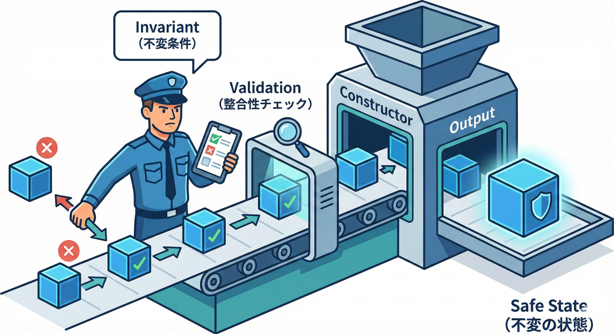
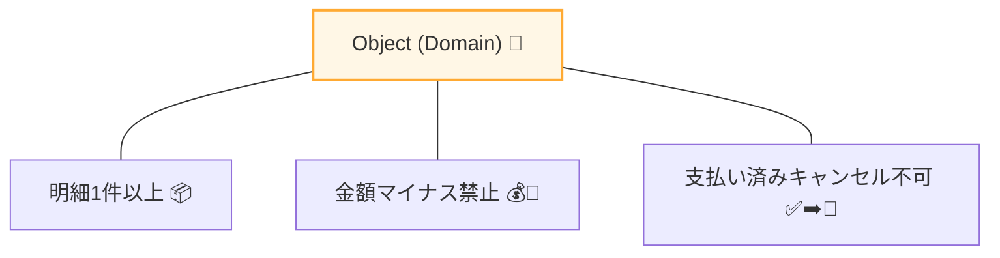
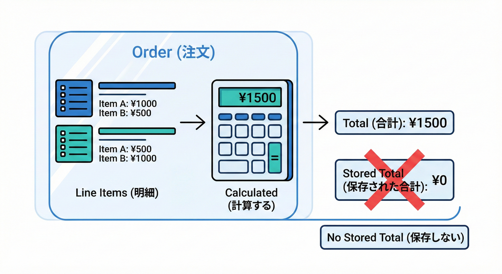
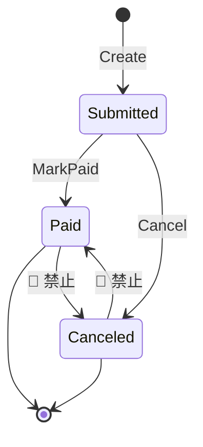
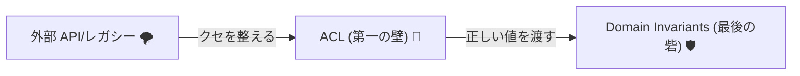

# 第6章：不変条件（Invariants）と "無効状態を作らない" ルール👮‍♀️🧯


## 6-1. まず「不変条件」ってなに？🧠✨


7: 

```mermaid
flowchart TD
    Object["Object (Domain) 🧱"]
    Rule1["明細1件以上 📦"]
    Rule2["金額マイナス禁止 💰🚫"]
    Rule3["支払い済みキャンセル不可 ✅➡️🚫"]
    
    Object --- Rule1
    Object --- Rule2
    Object --- Rule3
    
    style Object fill:#FFF7E6,stroke:#FFAA33,stroke-width:2px
```

**不変条件（Invariant）**は、ざっくり言うと👇
「このオブジェクト（ドメイン）が生きている間、ずーっと守られていてほしいルール」だよ🧱🔒

たとえばミニECならこんな感じ💡🛒

* 注文（Order）は **明細（Line）が1件以上**ないと成立しない🙅‍♀️📦
* 金額（Money）は **マイナス禁止**💰🚫
* 支払い済み（Paid）の注文は **キャンセル禁止**✅➡️🚫
* 数量（Quantity）は **1以上**📦➕

ここで大事なのはこれ👇✨
**「無効状態を “作れない” ようにしておく」**（作れてしまうと、あとで必ず誰かが踏む😇💥）

---

### 6-2. “無効状態” が怖い理由😱🧨

外部APIや古いDB、レガシー仕様って、平気で変な値を投げてくることがあるよね😇📨

* null が来る
* 空文字が来る
* 数がマイナス
* enum に知らない値
* 桁が足りない / 多すぎる

ACL（腐敗防止層）は「外→内を翻訳して整える壁」なんだけど🧱🔁、
**最後の砦**として「内側のドメインが絶対壊れない」ようにするのが **不変条件**だよ👮‍♀️🛡️

---

### 6-3. どこでチェックするのが正解？📍🧭

不変条件は基本、次のタイミングで守るよ👇✨

1. **生成時**（コンストラクタ / Factory）🍼✅
2. **更新時**（状態遷移メソッド）🔁✅

逆に、やりがちで危険なのがこれ🙅‍♀️⚠️

* public setter で外から自由に書き換えられる
* “とりあえず作って後で整える” 方式

こうなると「途中で無効状態のまま放置」が起きやすいよ😵‍💫🌀

---

### 6-4. 実装パターン：コンストラクタ封印＋Factoryで守る🧱🔐

おすすめの形はこれ👇

* コンストラクタは `private`（外から勝手に作れない）🔒
* `Create(...)` みたいな **Factory** で検証してから作る✅
* 更新は `MarkPaid()` / `Cancel()` みたいな **メソッド**経由でだけ変更🔁

> DDDの文脈でも「Factoryは常に有効な状態で返すべき」みたいに語られるよ📘✨ ([Microsoft Learn][1])
> さらに一般的にも「コンストラクタより static factory を検討してね」って設計ガイドがあるよ🧰 ([Microsoft Learn][2])

---

### 6-5. ハンズオン①：`Money`（マイナス禁止）💰🚫

まずは超ミニからいこう💪✨
「金額は0以上」「通貨が違うものは足せない」を守るよ🪙🧱

```csharp
using System;

public sealed class DomainException : Exception
{
    public DomainException(string message) : base(message) { }
}

public readonly record struct Money
{
    public decimal Amount { get; }
    public string Currency { get; }

    private Money(decimal amount, string currency)
    {
        Amount = amount;
        Currency = currency;
    }

    public static Money Jpy(decimal amount)
    {
        if (amount < 0)
            throw new DomainException($"金額は0以上だよ: {amount}");

        return new Money(amount, "JPY");
    }

    public Money Add(Money other)
    {
        if (Currency != other.Currency)
            throw new DomainException($"通貨が違うよ: {Currency} と {other.Currency}");

        return new Money(Amount + other.Amount, Currency);
    }
}
```

ここがポイントだよ👇🧠✨

* **外から `new Money(...)` できない** → 無効Moneyが生まれない🔒
* ルールは **Money自身が持つ** → “金額の正しさ” が散らからない🧹

---

### 6-6. ハンズオン②：`OrderLine`（数量・単価ルール）📦🧾

次は注文の明細だよ🛒✨

* 商品IDは空禁止🆔🚫
* 数量は 1〜999（例）📦
* 単価は 0より大きい💰

```csharp
using System;

public sealed class OrderLine
{
    public string ProductId { get; }
    public int Quantity { get; }
    public Money UnitPrice { get; }

    private OrderLine(string productId, int quantity, Money unitPrice)
    {
        ProductId = productId;
        Quantity = quantity;
        UnitPrice = unitPrice;
    }

    public Money LineTotal => Money.Jpy(UnitPrice.Amount * Quantity);

    public static OrderLine Create(string productId, int quantity, Money unitPrice)
    {
        if (string.IsNullOrWhiteSpace(productId))
            throw new DomainException("商品IDは必須だよ");

        if (quantity is < 1 or > 999)
            throw new DomainException($"数量は1〜999だよ: {quantity}");

        if (unitPrice.Amount <= 0)
            throw new DomainException($"単価は0より大きくしてね: {unitPrice.Amount}");

        return new OrderLine(productId, quantity, unitPrice);
    }
}
```

✅ これで **変な明細が作れない** よ🎉🧱

---

### 6-7. ハンズオン③：`Order`（最低1明細＆状態遷移ルール）🧾👑


165: 

```mermaid
stateDiagram-v2
    [*] --> Submitted: Create
    Submitted --> Paid: MarkPaid
    Submitted --> Canceled: Cancel
    Paid --> [*]
    Canceled --> [*]
    
    Paid --> Canceled: 🚫 禁止
    Canceled --> Paid: 🚫 禁止
```

最後に注文本体🎯✨

* 明細が1件以上ないと注文じゃない🙅‍♀️
* 支払い済みはキャンセル不可✅➡️🚫
* キャンセル済みは支払い不可🚫➡️✅（ダメ）

```csharp
using System;
using System.Collections.Generic;
using System.Linq;

public enum OrderStatus
{
    Submitted,
    Paid,
    Canceled
}

public sealed class Order
{
    private readonly List<OrderLine> _lines = new();

    public Guid Id { get; }
    public string MemberId { get; }
    public IReadOnlyList<OrderLine> Lines => _lines;
    public OrderStatus Status { get; private set; }

    private Order(Guid id, string memberId, List<OrderLine> lines)
    {
        Id = id;
        MemberId = memberId;
        _lines.AddRange(lines);
        Status = OrderStatus.Submitted;
    }

    public Money Total =>
        _lines.Select(x => x.LineTotal)
              .Aggregate(Money.Jpy(0), (acc, x) => acc.Add(x));

    public static Order Create(string memberId, IEnumerable<OrderLine> lines)
    {
        if (string.IsNullOrWhiteSpace(memberId))
            throw new DomainException("会員IDは必須だよ");

        if (lines is null)
            throw new DomainException("明細がnullはダメだよ");

        var list = lines.ToList();
        if (list.Count == 0)
            throw new DomainException("明細は1件以上必要だよ");

        return new Order(Guid.NewGuid(), memberId, list);
    }

    public void MarkPaid()
    {
        if (Status == OrderStatus.Canceled)
            throw new DomainException("キャンセル済みは支払いできないよ");

        if (Status == OrderStatus.Paid)
            return; // 二重実行されても壊れない（軽い防御）🛡️

        Status = OrderStatus.Paid;
    }

    public void Cancel()
    {
        if (Status == OrderStatus.Paid)
            throw new DomainException("支払い済みはキャンセルできないよ");

        if (Status == OrderStatus.Canceled)
            return;

        Status = OrderStatus.Canceled;
    }
}
```

ここ、地味に超大事👇💡

* `Total` を「保存」じゃなく「計算」にしてるのは、**ズレる可能性を消す**ためだよ🧠✨
  （保存しちゃうと “明細は変わったのにTotal更新忘れた” 事件が起きやすい😇🔥）

---

### 6-8. よくある質問：例外で止めていいの？😳💥

この章ではわかりやすく **例外**で止めたよ🙆‍♀️✨
ドメインのルール違反って「そこで生成/更新を失敗させたい」ことが多いからね🛑

ただし、外部入力を受ける場面（ACL側）では👇もよく使うよ🧱📨

* `Result<T>`（成功/失敗を戻り値にする）
* エラーの種類を分類してUIに見せる（これは後半章でやるやつ🧯）

---

### 6-9. テストで“不変条件が守られてる”を固定する✅🧪

不変条件は **テストと相性が最高**だよ💘
「作れないはずのものが作れない」をテストで釘打ちする🔨✨

いまのテスト環境だと、xUnit.net v3（`xunit.v3`）が .NET 8+ をサポートしてるよ🧪✨ ([xUnit.net][3])
（`xunit.runner.visualstudio` は Visual Studio のテストエクスプローラー用アダプターだよ🔎）([NuGet][4])
xUnit v3のリリース一覧も公式にまとまってるよ📌 ([xUnit.net][5])

#### テスト例：Moneyはマイナスを拒否する💰🚫

```csharp
using Xunit;

public class MoneyTests
{
    [Fact]
    public void Jpy_マイナスは作れない()
    {
        Assert.Throws<DomainException>(() => Money.Jpy(-1));
    }

    [Fact]
    public void Jpy_0はOK()
    {
        var m = Money.Jpy(0);
        Assert.Equal(0, m.Amount);
        Assert.Equal("JPY", m.Currency);
    }
}
```

#### テスト例：Orderは明細0件を拒否する🧾🚫

```csharp
using System.Collections.Generic;
using Xunit;

public class OrderTests
{
    [Fact]
    public void Create_明細0件は作れない()
    {
        var ex = Assert.Throws<DomainException>(() => Order.Create("member-1", new List<OrderLine>()));
        Assert.Contains("1件以上", ex.Message);
    }
}
```

（※ テスト実行基盤として Microsoft Testing Platform を使う選択肢も増えてるよ🧪🚀。xUnit v3 でも対応が説明されてる📌） ([Microsoft Learn][6])

---

### 6-10. ミニ課題📝✨（2つだけでOK！）

#### 課題A：不変条件を2つ書こう✍️👮‍♀️

次のどれかを選んで「絶対守りたいルール」を2つ書いてね🧠✨

* Payment（支払い）💳
* Member（会員）👤
* Order（注文）🧾

例：

* 「支払い金額は注文合計と一致」💰✅
* 「メールアドレスは空NG」📧🚫

#### 課題B：そのルールは“生成時”か“更新時”か仕分けしよう🧺🔁

* 生成時で守る？（Factory/コンストラクタ）🍼
* 更新時で守る？（メソッド）🔁

---

### 6-11. AI活用🤖✨（Copilot / Codex で時短！）

AIは「案出し」と「網羅」に強いよ💪🧠（最終判断はあなたがやるのが大事👀✨）

#### そのまま使えるお願い文（コピペOK）📋💖

* 「`Money` の不変条件テストケースを境界値も含めて列挙して」✅🧪
* 「`Order` の状態遷移（Submitted/Paid/Canceled）で起きうる不正パターンを一覧にして」🔁🚫
* 「この `Create` メソッドのガード節を読みやすくリファクタして（例外メッセージも整理して）」🧹✨
* 「xUnit の Theory（複数ケース）で書き直して」🧪📚

---

### 6-12. まとめ🎁✨（この章で得た武器）

* 不変条件＝「一生守りたいルール」👮‍♀️🧱
* **無効状態を作れない形**（private ctor + Factory + 更新メソッド）で守る🔒✅
* テストで “守れてる” を固定すると、後から変更が入っても壊れにくい🧪🛡️
* ACLが外を整え、不変条件が内を守る。二段構えが強い💪🧱✨


```mermaid
flowchart LR
    External["外部 API/レガシー 🌪️"]
    Boundary["ACL (第一の壁) 🧱"]
    Domain["Domain Invariants (最後の砦) 🛡️"]
    
    External -->|クセを整える| Boundary
    Boundary -->|正しい値を渡す| Domain
```

（おまけ：C#は .NET 10 と一緒に C# 14 の新要素が案内されてるよ📌。新しい書き味も増えてるから、必要になったら少しずつ取り入れていけばOKだよ😊✨） ([Microsoft Learn][7])

[1]: https://learn.microsoft.com/en-us/archive/msdn-magazine/2011/june/msdn-magazine-cutting-edge-invariants-and-inheritance-in-code-contracts?utm_source=chatgpt.com "Cutting Edge - Invariants and Inheritance in Code Contracts"
[2]: https://learn.microsoft.com/en-us/dotnet/standard/design-guidelines/constructor?utm_source=chatgpt.com "Constructor Design - Framework Design Guidelines"
[3]: https://xunit.net/?utm_source=chatgpt.com "xUnit.net: Home"
[4]: https://www.nuget.org/packages/xunit.runner.visualstudio?utm_source=chatgpt.com "xunit.runner.visualstudio 3.1.5"
[5]: https://xunit.net/releases/?utm_source=chatgpt.com "Release Notes"
[6]: https://learn.microsoft.com/ja-jp/dotnet/core/testing/migrating-vstest-microsoft-testing-platform?utm_source=chatgpt.com "VSTest から Microsoft.Testing.Platform への移行ガイド - .NET"
[7]: https://learn.microsoft.com/ja-jp/dotnet/csharp/whats-new/csharp-14?utm_source=chatgpt.com "C# 14 の新機能"
