# 第9章：DIP/DI入門（外部サービスを差し替え可能に）🔌🔁


## この章のゴール🎯✨

この章が終わるころには、こんな状態になってます👇😊

* 外部サービス（決済APIとか）を **「差し替え可能」** にできる🔁
* **テストで外部通信しない** で動作確認できる✅
* ACL（翻訳＆防波堤🧱）を **“設計として”** ちゃんと置けるようになる🛡️

---

## 1) まず用語を整理しよ〜🧠📌（DIPとDI、似てて混乱しがち！）

```mermaid
flowchart TD
    subgraph Inner ["内側 (Domain/Application) 🛡️"]
        Rule["業務ルール"]
        IF["抽象 (Interface) 🤝"]
    end
    
    subgraph Outer ["外側 (Infrastructure) 🌪️"]
        Impl["具体実装 (Implementation) ⚙️"]
    end
    
    Rule --> IF
    Impl -->|implements| IF
```




### DIPってなに？🧩

**DIP（依存性逆転の原則）**は、超ざっくり言うと👇

* 「大事なルールを持つ側（内側）」が
* 「外部の都合（外側）」に振り回されないようにする
  ための原則だよ🧱✨

ポイントはこれ👇
✅ **内側（ドメイン/アプリ）が外側（外部API/DB）に直接依存しない**
✅ 代わりに **抽象（インターフェース）** に依存する

---

### DIってなに？🧰

**DI（依存性注入）**は、DIPを実現するための代表的なやり方の1つだよ🔧✨

* クラスの中で `new` しないで
* 外から必要なものを “渡してもらう” 📨

例：

* ❌ `new PaymentGateway()`（自分で作る）
* ✅ `IPaymentGateway` をコンストラクタでもらう（外から注入）

---

### ちなみに：今の .NET はDIが標準装備だよ💡

.NET には **組み込みのDIコンテナ** があって、`IServiceCollection` に登録して使うのが基本だよ🧺✨ ([Microsoft Learn][1])
（最近の .NET 10 / C# 14 でもこの流れが中心だよ〜） ([Microsoft for Developers][2])

---

## 2) ACLとDIP/DIの関係🧼🧱✨（ここ超大事！）

外部APIって、こんな“クセ”あるよね😇

* 命名が変（`user_nm` とか）
* 単位が違う（cents / USD固定 とか）
* enumが増える、仕様がブレる
* エラー形式が独特

これを内側に直通させると…
🧟‍♀️ **ドメインが外部仕様に侵食されて腐敗する**

だからACLではこうする👇

* **内側は “自分の言葉” と “自分の型”** を守る🛡️
* 外部のクセは **ACL側で吸収（翻訳）** 🧑‍🏫
* そのために **「抽象（インターフェース）」** が必要
* そして差し替えるために **DIで注入** する🔌✨

---

## 3) 完成イメージ図（これが気持ちいい形😌🧱）

```mermaid
flowchart TD
    subgraph App_Domain ["Application / Domain"]
        UseCase["PlaceOrderUseCase"]
        IPG["IPaymentGateway 🤝<br/>(契約/抽象)"]
    end
    
    subgraph Infra_ACL ["Infrastructure / ACL 🧱"]
        WP_PG["WeirdPayPaymentGateway"]
        WP_Client["WeirdPayClient 🛰️"]
        WP_Trans["WeirdPayTranslator 🧑‍🏫"]
    end
    
    UseCase --> IPG
    WP_PG -- implements --> IPG
    WP_PG --> WP_Client
    WP_PG --> WP_Trans
```



✅ 内側は **IPaymentGateway** だけ知ってればOK
✅ 外側は好きに変えてOK（差し替え可能🔁）

---

## 4) ハンズオン：決済を差し替え可能にする🛒💳✨

ここから手を動かすよ〜✋😊
題材：**決済API（クセあり）を ACL で包んで、内側からは差し替え可能にする** 🔌🔁

---

### 4-1) プロジェクト構成（最小セット）📦

* `Shop.Domain`（ドメイン：型・ルール・インターフェース）
* `Shop.Application`（ユースケース）
* `Shop.Infrastructure`（外部統合：ACL実装）
* `Shop.WebApi`（入口：HTTP API）

参照関係はこう👇

* Application → Domain
* Infrastructure → Domain
* WebApi → Application, Infrastructure

---

### 4-2) Domain：抽象（インターフェース）を置く🧱✨

**IPaymentGateway** を Domain に置こう💡
「外部決済ってこういう機能が欲しいよね」っていう **内側の都合** を契約にする🤝

```csharp
namespace Shop.Domain.Payments;

public readonly record struct Money(decimal Amount, string Currency)
{
    public static Money Jpy(decimal amount) => new(amount, "JPY");
}

public sealed record PaymentRequest(string OrderId, Money Amount);

public enum PaymentFailureReason
{
    Rejected,
    TemporaryUnavailable,
    InvalidRequest,
    Unknown,
}

public sealed record PaymentResult(
    bool IsSuccess,
    string? ExternalPaymentId,
    PaymentFailureReason? FailureReason,
    string? Message)
{
    public static PaymentResult Success(string externalPaymentId)
        => new(true, externalPaymentId, null, null);

    public static PaymentResult Fail(PaymentFailureReason reason, string message)
        => new(false, null, reason, message);
}

public interface IPaymentGateway
{
    Task<PaymentResult> ChargeAsync(PaymentRequest request, CancellationToken ct = default);
}
```

ポイント💡

* 内側は **外部DTOも外部例外も知らない** 🙅‍♀️
* 返り値は内側の形（`PaymentResult`）で統一🧱✨

---

### 4-3) Application：ユースケースは “抽象だけ” を使う🧠✨

ユースケース（注文→決済）は **IPaymentGateway にだけ依存** するよ🔁

```csharp
namespace Shop.Application.Orders;

using Shop.Domain.Payments;

public sealed class PlaceOrderUseCase
{
    private readonly IPaymentGateway _paymentGateway;

    public PlaceOrderUseCase(IPaymentGateway paymentGateway)
        => _paymentGateway = paymentGateway;

    public async Task<PlaceOrderResult> ExecuteAsync(
        string orderId,
        Money amount,
        CancellationToken ct = default)
    {
        var payment = await _paymentGateway.ChargeAsync(new PaymentRequest(orderId, amount), ct);

        if (!payment.IsSuccess)
        {
            return PlaceOrderResult.Fail(
                payment.FailureReason ?? PaymentFailureReason.Unknown,
                payment.Message ?? "Payment failed.");
        }

        return PlaceOrderResult.Ok(payment.ExternalPaymentId!);
    }
}

public sealed record PlaceOrderResult(
    bool IsSuccess,
    string? ExternalPaymentId,
    PaymentFailureReason? FailureReason,
    string? Message)
{
    public static PlaceOrderResult Ok(string externalPaymentId)
        => new(true, externalPaymentId, null, null);

    public static PlaceOrderResult Fail(PaymentFailureReason reason, string message)
        => new(false, null, reason, message);
}
```

ここがDIPの気持ちよさ😆✨
✅ Applicationは外部APIを知らない
✅ なのに動く（外側が差すから）

---

### 4-4) Infrastructure（ACL実装）：外部APIを包んで翻訳する🧼🧱

ここが **腐敗防止層の本体** だよ〜🔥

* 外部の形式 → 内部の形式へ翻訳🧑‍🏫
* 通信失敗などは “内側の失敗理由” に寄せる🧯

例として「WeirdPay」というクセ強決済を想定して書くね😇

```csharp
namespace Shop.Infrastructure.WeirdPay;

using System.Net.Http.Json;

public sealed record WeirdPayChargeRequest(string order_id, long amount_cents, string currency);
public sealed record WeirdPayChargeResponse(string payment_id, string status, string? message);

public sealed class WeirdPayClient
{
    private readonly HttpClient _http;

    public WeirdPayClient(HttpClient http) => _http = http;

    public async Task<WeirdPayChargeResponse> ChargeAsync(WeirdPayChargeRequest request, CancellationToken ct)
    {
        var res = await _http.PostAsJsonAsync("/charge", request, ct);
        res.EnsureSuccessStatusCode();

        return (await res.Content.ReadFromJsonAsync<WeirdPayChargeResponse>(cancellationToken: ct))
               ?? throw new InvalidOperationException("Response body was empty.");
    }
}
```

Translator（翻訳係）も作るよ🧑‍🏫✨

```csharp
namespace Shop.Infrastructure.WeirdPay;

using Shop.Domain.Payments;

public sealed class WeirdPayTranslator
{
    public WeirdPayChargeRequest ToExternal(PaymentRequest req)
        => new(order_id: req.OrderId, amount_cents: ToCents(req.Amount), currency: req.Amount.Currency);

    public PaymentResult ToInternal(WeirdPayChargeResponse res)
        => res.status switch
        {
            "paid" => PaymentResult.Success(res.payment_id),
            "rejected" => PaymentResult.Fail(PaymentFailureReason.Rejected, res.message ?? "Rejected"),
            "temporarily_unavailable" => PaymentResult.Fail(PaymentFailureReason.TemporaryUnavailable, res.message ?? "Try later"),
            _ => PaymentResult.Fail(PaymentFailureReason.Unknown, res.message ?? "Unknown status"),
        };

    private static long ToCents(Money money)
        => checked((long)(money.Amount * 100m));
}
```

最後に、Domainの `IPaymentGateway` を実装する“Facade役”🏗️

```csharp
namespace Shop.Infrastructure.WeirdPay;

using Shop.Domain.Payments;

public sealed class WeirdPayPaymentGateway : IPaymentGateway
{
    private readonly WeirdPayClient _client;
    private readonly WeirdPayTranslator _translator;

    public WeirdPayPaymentGateway(WeirdPayClient client, WeirdPayTranslator translator)
    {
        _client = client;
        _translator = translator;
    }

    public async Task<PaymentResult> ChargeAsync(PaymentRequest request, CancellationToken ct = default)
    {
        try
        {
            var externalReq = _translator.ToExternal(request);
            var externalRes = await _client.ChargeAsync(externalReq, ct);
            return _translator.ToInternal(externalRes);
        }
        catch (HttpRequestException ex)
        {
            // 外部障害は「一時的」扱いに寄せる🧯
            return PaymentResult.Fail(PaymentFailureReason.TemporaryUnavailable, $"Network error: {ex.Message}");
        }
    }
}
```

---

### 4-5) DI登録：差し替えスイッチを作る🔌✨

DIの登録は「配線」だよ🔧
内側（UseCase）に、どの実装（WeirdPay）を繋ぐか決めるだけ🎛️

まず Infrastructure 側に「登録まとめ」を作るとスッキリするよ🧼✨

```csharp
namespace Shop.Infrastructure;

using Microsoft.Extensions.Configuration;
using Microsoft.Extensions.DependencyInjection;
using Shop.Domain.Payments;
using Shop.Infrastructure.WeirdPay;

public static class DependencyInjection
{
    public static IServiceCollection AddWeirdPayGateway(this IServiceCollection services, IConfiguration config)
    {
        // HttpClient は factory 経由が推奨だよ（ソケット枯渇など回避）📌:contentReference[oaicite:2]{index=2}
        services.AddHttpClient<WeirdPayClient>(http =>
        {
            http.BaseAddress = new Uri(config["WeirdPay:BaseUrl"]!);
        });

        services.AddSingleton<WeirdPayTranslator>();         // 状態を持たないならSingletonでもOK👌
        services.AddScoped<IPaymentGateway, WeirdPayPaymentGateway>(); // 1リクエスト単位にしたいならScoped✨

        return services;
    }
}
```

WebApi の `Program.cs` で呼ぶよ📞

```csharp
using Shop.Application.Orders;
using Shop.Infrastructure;

var builder = WebApplication.CreateBuilder(args);

builder.Services.AddControllers();

builder.Services.AddScoped<PlaceOrderUseCase>();
builder.Services.AddWeirdPayGateway(builder.Configuration);

var app = builder.Build();
app.MapControllers();
app.Run();
```

この形ができると…
🎉 **外部決済を別会社に変えても、内側はIPaymentGatewayのまま**
→ 実装を変えて DI の登録だけ差し替えればOK🔁✨

---

## 5) テストが一気にラクになる（外部通信ゼロ）🧪💖

DIP/DIの最大のご褒美はこれ😍
「外部APIに繋がずにテストできる」

Fake（ニセ実装）を作るよ🪄

```csharp
namespace Shop.Tests.Fakes;

using Shop.Domain.Payments;

public sealed class FakePaymentGateway : IPaymentGateway
{
    public List<PaymentRequest> Requests { get; } = new();

    public Task<PaymentResult> ChargeAsync(PaymentRequest request, CancellationToken ct = default)
    {
        Requests.Add(request);
        return Task.FromResult(PaymentResult.Success("FAKE-123"));
    }
}
```

ユースケースのテスト（xUnit例）✅

```csharp
using Shop.Application.Orders;
using Shop.Domain.Payments;
using Shop.Tests.Fakes;
using Xunit;

public class PlaceOrderUseCaseTests
{
    [Fact]
    public async Task ExecuteAsync_success_returns_payment_id()
    {
        var fake = new FakePaymentGateway();
        var useCase = new PlaceOrderUseCase(fake);

        var result = await useCase.ExecuteAsync("ORD-1", Money.Jpy(1000));

        Assert.True(result.IsSuccess);
        Assert.Equal("FAKE-123", result.ExternalPaymentId);
        Assert.Single(fake.Requests);
    }
}
```

これができると、開発が安定するよ〜🥹✨

* 外部APIが落ちててもテストは通る✅
* 仕様変更にも強い🔁
* ACLの変換ロジックに集中できる🧠

---

## 6) DIの「寿命（Lifetime）」超入門🕰️✨

```mermaid
timeline
    title DI Lifetimes (生存期間) ⏳
    Transient : 毎回生成 : 使い捨て・軽量
    Scoped : リクエストごとに生成 : Webリクエスト・DBコンテキスト
    Singleton : アプリ中ずっと保持 : 設定・キャッシュ・状態なし部品
```




DI登録にはだいたいこの3つがあるよ👇

* **Transient**：毎回new（軽いもの向け）
* **Scoped**：1リクエスト（Webだとこれが基本になりがち）
* **Singleton**：アプリ起動中ずっと同じ（状態管理は慎重に）

公式でもこの3つが基本として説明されてるよ📚 ([Microsoft Learn][3])

💡ざっくり目安（迷ったらこれ）

* Translatorみたいな「状態なし」→ SingletonでもOK👌
* Gatewayみたいに「リクエスト文脈が絡む」→ Scopedが安心😌
* なんでもSingletonにするのは危ないことがあるよ⚠️（依存関係の捕獲など） ([Microsoft Learn][4])

---

## 7) よくあるミス集（ここ踏むとツラい😇）🚧

### ❌ ユースケース内で `new WeirdPayClient()` しちゃう

→ その瞬間、差し替え不能😵‍💫
✅ **ユースケースはインターフェースだけ** 見る！

### ❌ 外部DTOを内側に持ち込む

→ ドメインが外部の形に汚染🧟‍♀️
✅ 外部DTOはACL側で止める🧱

### ❌ `HttpClient` を毎回 `new` する

→ 負荷が上がると詰むことがある（接続枯渇など）😱
✅ `IHttpClientFactory` / `AddHttpClient` が推奨だよ📌 ([Microsoft Learn][5])

### ❌ 注入が10個以上とかになってくる

→ そのクラス、仕事しすぎかも…！😵
✅ 責務を分ける（SRP）チャンス✨（ACLは Translator/Client/Fascade に割るとスッキリ）

---

## 8) ミニ課題📝💪

### 課題1：差し替えたい依存を2つ挙げよう🔁

例：

* 決済（IPaymentGateway）
* 会員（IMemberService）

それぞれ「内側が欲しい機能」を1行で書いてね✍️✨

### 課題2：Fakeを作ってユースケースをテスト✅

* 成功ケース
* 失敗ケース（Rejected）
  の2本を作れたら満点💯🎉

---

## 9) AI活用コーナー🤖⚡（速くするけど、決めるのは自分🧠✨）

### 使いどころ①：インターフェース設計のたたき台🧩

プロンプト例👇

* 「決済ゲートウェイのインターフェース案を3つ。メソッド名と戻り値も含めて。ドメインを汚さない方針で」

→ 出てきた案をそのまま採用じゃなくて、**“内側の言葉”** に合うものを選ぶのがコツ🥰

### 使いどころ②：DI登録コードの下書き🔌

プロンプト例👇

* 「.NETのDIで、HttpClientのtyped clientと、IPaymentGateway実装を登録するコード例を出して」

### 使いどころ③：テストケース増量🧪

プロンプト例👇

* 「PlaceOrderUseCaseのテストケースを失敗パターン含めて10個列挙して。境界値も入れて」

---

## まとめ✅🎁（この章で手に入れた武器🗡️✨）

* **DIP**：内側は外側に依存しない（抽象に依存）🧱
* **DI**：抽象に対する実装を外から差す（配線）🔌
* ACLは **翻訳＋防波堤**。DIP/DIと相性が良すぎる🧼🧱
* `AddHttpClient` で外部通信も安全に扱いやすい📌 ([Microsoft Learn][5])
* この形だと **テストが一気にラク** 🧪💖

次章（DTO直通禁止🙅‍♀️📦）で、さらに「腐敗の入口」を閉じていくよ〜🚪✨

[1]: https://learn.microsoft.com/en-us/dotnet/core/extensions/dependency-injection/overview?utm_source=chatgpt.com "Dependency injection - .NET"
[2]: https://devblogs.microsoft.com/dotnet/announcing-dotnet-10/?utm_source=chatgpt.com "Announcing .NET 10"
[3]: https://learn.microsoft.com/en-sg/dotnet/core/extensions/dependency-injection/service-lifetimes?utm_source=chatgpt.com "Service lifetimes (dependency injection) - .NET"
[4]: https://learn.microsoft.com/en-us/aspnet/core/fundamentals/dependency-injection?view=aspnetcore-10.0&utm_source=chatgpt.com "Dependency injection in ASP.NET Core"
[5]: https://learn.microsoft.com/en-us/dotnet/core/extensions/httpclient-factory?utm_source=chatgpt.com "Use the IHttpClientFactory - .NET"
