# 第11章：変換① "形の変換"（命名・構造・ネスト）🧩🔁


## この章でやること（ゴール）🎯✨

* 外部APIの **DTO（外側の形）** を、内側（自分たちのモデル）に **「形だけ」** 変換できるようになる🙆‍♀️
* 具体的には👇

  * snake_case ↔ PascalCase（命名の形）🐍➡️🏛️
  * ネスト（入れ子）構造の読み替え（構造の形）🪆
  * 配列・オブジェクトの並びを「内側に都合の良い形」に揃える📦➡️📦

> ⚠️この章は「形だけ」！
> **単位・通貨・時刻の変換（意味の変換）** は次章（第12章）でやるよ💰⏰✨
> **欠損/null/不正値の厳密対応** は第14〜15章でまとめて強化するよ🧯

---

## 1) “形の変換”ってなに？🧩

```mermaid
flowchart LR
    subgraph DTO ["外部 DTO 📦"]
        D1["snake_case (order_id)"]
        D2["深いネスト 🪆"]
        D3["バラバラな構造"]
    end
    
    subgraph Trans ["Translator 🧑‍🏫"]
        T1["命名変換"]
        T2["構造の平坦化"]
        T3["集約"]
    end
    
    subgraph Model ["内部モデル 💎"]
        M1["PascalCase (OrderId)"]
        M2["シンプルな構造"]
        M3["整った配列"]
    end
    
    DTO --> Trans --> Model
```




外部APIは、だいたいこんなクセがあるよね…😇

* **命名が違う**：`order_id` / `user_name` みたいな snake_case 🐍
* **入れ子が深い**：`buyer.profile.name` みたいにネストが多い🪆
* **配列や構造がズレる**：内側は `Order` にまとめたいのに外側はバラバラ📦

ここでACL（腐敗防止層）の出番！🧱✨
外側のDTOを **Translator** で「内側の形」に整えてから、ドメインへ渡すよ✅

---

## 2) 例題：外部の注文JSON（snake_case＆ネスト）🌐📩

外部APIからこんなのが返ってくる想定にするね👇

```json
{
  "order_id": "ORD-1001",
  "buyer": {
    "user_id": "U-9",
    "user_name": "Alice"
  },
  "items": [
    { "sku": "SKU-AAA", "qty": 2 },
    { "sku": "SKU-BBB", "qty": 1 }
  ],
  "shipping_address": {
    "postal_code": "1000001",
    "line1": "Tokyo",
    "line2": "Chiyoda"
  }
}
```

---

## 3) 外側：External DTO（JSONの形そのまま）📦

### 3-1) DTOは「外側のフォルダ」に隔離しよう🚧

DTOは **外部専用**。内側（ドメイン）が参照しないように分離するのがポイント🙅‍♀️

### 3-2) snake_case対応：`JsonPropertyName` で固定する✍️

```mermaid
flowchart LR
    JSON["JSON: 'order_id' 🐍"]
    Attr["[JsonPropertyName('order_id')] 📌"]
    Prop["Property: OrderId 🏛️"]
    
    JSON --- Attr --- Prop
```




`System.Text.Json` の `JsonPropertyNameAttribute` で、JSONキー名を指定できるよ📌 ([Microsoft Learn][1])

```csharp
using System.Text.Json.Serialization;

public sealed class PaymentOrderDto
{
    [JsonPropertyName("order_id")]
    public string? OrderId { get; set; }

    [JsonPropertyName("buyer")]
    public BuyerDto? Buyer { get; set; }

    [JsonPropertyName("items")]
    public List<ItemDto>? Items { get; set; }

    [JsonPropertyName("shipping_address")]
    public ShippingAddressDto? ShippingAddress { get; set; }
}

public sealed class BuyerDto
{
    [JsonPropertyName("user_id")]
    public string? UserId { get; set; }

    [JsonPropertyName("user_name")]
    public string? UserName { get; set; }
}

public sealed class ItemDto
{
    [JsonPropertyName("sku")]
    public string? Sku { get; set; }

    [JsonPropertyName("qty")]
    public int? Qty { get; set; }
}

public sealed class ShippingAddressDto
{
    [JsonPropertyName("postal_code")]
    public string? PostalCode { get; set; }

    [JsonPropertyName("line1")]
    public string? Line1 { get; set; }

    [JsonPropertyName("line2")]
    public string? Line2 { get; set; }
}
```

> ✅このやり方の良いところ：
>
> * JSONのキー名が変わらない限り、DTOの読み取りが安定する✨
> * Translatorは「DTO→内側モデル」だけに集中できる🎯

---

## 4) 内側：Internal Model（自分たちの形）🏠✨

内側（アプリ/ドメイン寄り）は、**PascalCase**＆意味が伝わる構造にしよう💡

```csharp
public sealed record OrderSnapshot(
    string OrderId,
    BuyerSnapshot Buyer,
    IReadOnlyList<OrderItemSnapshot> Items,
    ShippingAddressSnapshot ShippingAddress
);

public sealed record BuyerSnapshot(
    string BuyerId,
    string BuyerName
);

public sealed record OrderItemSnapshot(
    string Sku,
    int Quantity
);

public sealed record ShippingAddressSnapshot(
    string PostalCode,
    string Line1,
    string Line2
);
```

> 🔥ポイント
>
> * この章ではまだ「型で守る/検証する」より、まず **形を揃える** のが目的🧩
> * `string?` を `string` にするか、nullをどうするかは第14〜15章で強化🧯

---

## 5) まず作る：マッピング対応表（超重要）🧾👀

```mermaid
graph TD
    subgraph External ["外部 DTO (Input) 📦"]
        order_id
        buyer_user_id["buyer.user_id"]
        items_sku["items[].sku"]
    end
    
    subgraph Internal ["内部モデル (Output) 💎"]
        OrderId
        BuyerId
        Sku
    end
    
    order_id -->|Translate| OrderId
    buyer_user_id -->|Translate| BuyerId
    items_sku -->|Translate| Sku
```



Translator実装の前に、**対応表**を作ると迷子にならないよ🧠✨

| 外部JSONパス                       | 外側DTO                           | 内側モデル                                | 備考               |
| ------------------------------ | ------------------------------- | ------------------------------------ | ---------------- |
| `order_id`                     | `PaymentOrderDto.OrderId`       | `OrderSnapshot.OrderId`              | 命名だけ違う           |
| `buyer.user_id`                | `BuyerDto.UserId`               | `BuyerSnapshot.BuyerId`              | `BuyerId` に読み替え  |
| `buyer.user_name`              | `BuyerDto.UserName`             | `BuyerSnapshot.BuyerName`            | 命名の整形            |
| `items[].sku`                  | `ItemDto.Sku`                   | `OrderItemSnapshot.Sku`              | 配列の各要素           |
| `items[].qty`                  | `ItemDto.Qty`                   | `OrderItemSnapshot.Quantity`         | `Qty`→`Quantity` |
| `shipping_address.postal_code` | `ShippingAddressDto.PostalCode` | `ShippingAddressSnapshot.PostalCode` | 命名だけ             |
| `shipping_address.line1`       | `ShippingAddressDto.Line1`      | `ShippingAddressSnapshot.Line1`      |                  |
| `shipping_address.line2`       | `ShippingAddressDto.Line2`      | `ShippingAddressSnapshot.Line2`      |                  |

### ミニ課題📝✨

自分のプロジェクト題材でも、同じ対応表を **5行だけ** 作ってみてね🙂👍

---

## 6) ハンズオン：Translatorで“形だけ”変換する🛠️🔁

ここからが本番！ACLのTranslatorはだいたいこういう形でOK🙆‍♀️

```csharp
public interface IOrderSnapshotTranslator
{
    OrderSnapshot Translate(PaymentOrderDto dto);
}

public sealed class OrderSnapshotTranslator : IOrderSnapshotTranslator
{
    public OrderSnapshot Translate(PaymentOrderDto dto)
    {
        // ここは「形の変換」なので、基本はマッピングだけに集中する🎯
        // null/欠損の厳密対応は第14〜15章でガッチリやる🧯

        var buyer = dto.Buyer ?? new BuyerDto();

        var items = (dto.Items ?? new List<ItemDto>())
            .Select(x => new OrderItemSnapshot(
                Sku: x.Sku ?? "",
                Quantity: x.Qty ?? 0
            ))
            .ToList();

        var ship = dto.ShippingAddress ?? new ShippingAddressDto();

        return new OrderSnapshot(
            OrderId: dto.OrderId ?? "",
            Buyer: new BuyerSnapshot(
                BuyerId: buyer.UserId ?? "",
                BuyerName: buyer.UserName ?? ""
            ),
            Items: items,
            ShippingAddress: new ShippingAddressSnapshot(
                PostalCode: ship.PostalCode ?? "",
                Line1: ship.Line1 ?? "",
                Line2: ship.Line2 ?? ""
            )
        );
    }
}
```

### ここでのコツ💡✨

* Translatorは **「変換だけ」** をする（HTTP呼び出ししない）🚫🌐
* ControllerやUseCaseにマッピングが散ると一気に腐る😵‍💫
* 変換は「対応表」に忠実にやる🧾✅

---

## 7) 命名（snake_case）の扱い：2つの作戦🐍🆚🏛️

### 作戦A：`JsonPropertyName` で「DTOに貼る」📌（おすすめ）

もうやった方法だね！
`JsonPropertyNameAttribute` は、シリアライズ/デシリアライズ時のJSON名を指定できるよ。 ([Microsoft Learn][1])

* ✅良い：DTOに外部都合を閉じ込められる
* ✅良い：Translatorは構造変換に集中できる
* ⚠️注意：DTOが内側へ漏れると、外部都合が伝染する（絶対隔離）🧟‍♀️

### 作戦B：命名ポリシー（snake_case）をSerializerOptionsで使う🧰

最近の `System.Text.Json` には snake_case の命名ポリシーが用意されてるよ（例：`JsonNamingPolicy.SnakeCaseLower`）🐍 ([Microsoft Learn][2])
プロパティ名のカスタマイズは公式にもまとまってるよ📚 ([Microsoft Learn][3])

```csharp
using System.Net.Http.Json;
using System.Text.Json;

var options = new JsonSerializerOptions
{
    PropertyNamingPolicy = JsonNamingPolicy.SnakeCaseLower
};

var dto = await httpClient.GetFromJsonAsync<PaymentOrderDto>(
    requestUri: "/orders/ORD-1001",
    options: options
);
```

* ✅良い：属性ベタ貼りを減らせることがある
* ⚠️注意：プロジェクト全体で設定すると、別のAPIとの整合が崩れることがある（局所適用が安全）🙂

> どっちを選ぶ？🤔
>
> * **外部APIが複数ある/混在する** → 作戦Aが分かりやすい📌
> * **同じ規約のAPIを大量に扱う** → 作戦Bもアリ🧰

---

## 8) Translatorはテストしよう（コスパ最強）💪✅

Translatorは **外部変更の影響が直撃する場所** だから、単体テストがめちゃ効くよ🔥

```csharp
using Xunit;

public sealed class OrderSnapshotTranslatorTests
{
    [Fact]
    public void Translate_maps_shape_correctly()
    {
        var dto = new PaymentOrderDto
        {
            OrderId = "ORD-1001",
            Buyer = new BuyerDto { UserId = "U-9", UserName = "Alice" },
            Items = new List<ItemDto>
            {
                new() { Sku = "SKU-AAA", Qty = 2 },
                new() { Sku = "SKU-BBB", Qty = 1 }
            },
            ShippingAddress = new ShippingAddressDto
            {
                PostalCode = "1000001",
                Line1 = "Tokyo",
                Line2 = "Chiyoda"
            }
        };

        var translator = new OrderSnapshotTranslator();

        var snapshot = translator.Translate(dto);

        Assert.Equal("ORD-1001", snapshot.OrderId);
        Assert.Equal("U-9", snapshot.Buyer.BuyerId);
        Assert.Equal("Alice", snapshot.Buyer.BuyerName);

        Assert.Equal(2, snapshot.Items.Count);
        Assert.Equal("SKU-AAA", snapshot.Items[0].Sku);
        Assert.Equal(2, snapshot.Items[0].Quantity);

        Assert.Equal("1000001", snapshot.ShippingAddress.PostalCode);
        Assert.Equal("Tokyo", snapshot.ShippingAddress.Line1);
        Assert.Equal("Chiyoda", snapshot.ShippingAddress.Line2);
    }
}
```

### テストの狙い🎯

* 「変換表どおりに移せてる？」を保証する🧾✅
* 外部APIの変更が入ったとき、まずここが落ちて気づける👀💥

---

## 9) AI活用：マッピング表＆変換コードを爆速で作る🤖⚡

### 9-1) マッピング表の叩き台を作らせる🧾🤖

AIにこう頼むと早いよ👇

* 「このJSONと、この内側モデルのプロパティを対応付けて表にして」
* 「ネストをほどいて、外部パス→内部プロパティの一覧にして」

✅ 出てきた表は、**自分の目で必ずチェック** 👀✨
（命名は“それっぽく嘘”を混ぜられやすい😇）

### 9-2) Translatorの雛形を作らせる🛠️🤖

* 「この対応表どおりに C# のTranslatorクラスを書いて」
* 「nullは仮で `""` や `0` にしていい（次章で直す）」
* 「副作用なしの純粋関数っぽくして」

### 9-3) テストも作らせる✅🤖

* 「このDTO入力で、期待する内部モデルを Assert するxUnitテストを書いて」
* 「itemsが空/1件/複数のパターンも増やして」

---

## 10) よくある事故ポイント（先に踏み抜き回避）🧯😵‍💫

### 事故① DTOを内側に直通させる🙅‍♀️📦➡️🏠

「ちょっとだけ…」が一番危険⚠️
DTOが内側に入った瞬間、外部の都合が内側の言葉を侵食するよ🧟‍♀️

### 事故② 変換がControllerやUseCaseに散る🌀

* どこで何が変換されてるか分からなくなる
* 修正漏れが増える
  → Translatorに集約！🧱✨

### 事故③ “形” と “意味” を一緒にやり始める🤹‍♀️

この章では **形だけ** にするのが勝ち🏆
意味変換（単位/通貨/時刻）は次章でちゃんとやるとスッキリするよ💰⏰✨

---

## 11) ミニ課題（手を動かすと一気に定着）📝🔥

### 課題A：対応表を作る🧾

次の3つを追加して、対応表を増やしてみてね👇

* `buyer.user_name` を `CustomerDisplayName` にしたい
* `shipping_address` を内側では `Address` にまとめたい
* `items[].qty` を内側では `Count` にしたい

### 課題B：Translatorを修正する🛠️

* 対応表どおりにプロパティ名を変換
* ネスト（buyer/shipping_address/items）も崩さず変換

### 課題C：テストを1本追加✅

* itemsが空のときも落ちないテスト
* buyerがnullのときも落ちないテスト
  （nullの扱い自体は仮でOK！次で強化するよ🧯）

---

## まとめ🧩✨

* ACLのTranslatorで、外部DTOを **内側の形に揃える** 🧱🔁
* 最初に **対応表** を作ると、実装もテストも速い🧾⚡
* `System.Text.Json` では `JsonPropertyName` でキー名指定ができるし、snake_caseの命名ポリシーも使えるよ🐍📌 ([Microsoft Learn][1])
* Translatorは **単体テストがコスパ最強** 💪✅

[1]: https://learn.microsoft.com/ja-jp/dotnet/api/system.text.json.serialization.jsonpropertynameattribute?view=net-8.0&utm_source=chatgpt.com "JsonPropertyNameAttribute クラス (System.Text.Json. ..."
[2]: https://learn.microsoft.com/ja-jp/dotnet/api/system.text.json.jsonnamingpolicy.snakecaselower?view=net-10.0&utm_source=chatgpt.com "JsonNamingPolicy.SnakeCaseLower プロパティ"
[3]: https://learn.microsoft.com/ja-jp/dotnet/standard/serialization/system-text-json/customize-properties?utm_source=chatgpt.com "System.Text.Json でプロパティの名前と値をカスタマイズする ..."
