# 第12章：変換② "意味の変換"（単位・通貨・時刻）💰⏰🔁


## この章でできるようになること 🎯✨

* 外部データの「数値・日時」を、そのまま使わずに **内側の意味（ルール）で正規化**できるようになる 🙆‍♀️
* **cents→円/ドル**、**UTC文字列→DateTimeOffset**、**秒→TimeSpan** みたいな「意味の変換」をACLで安全に書けるようになる 🧱
* 境界値テスト（0/最大/負数/丸め/タイムゾーン罠）を **機械的に増やせる**ようになる 🤖✅

---

## 12.1 「形の変換」と「意味の変換」は別モノだよ 🧩➡️🧠

```mermaid
flowchart LR
    subgraph Raw ["外部データ (Raw) 🌪️"]
        R1["amount_cents: 1200"]
        R2["created_at: '2026-01-28Z'"]
        R3["expires_in: 3600"]
    end
    
    subgraph Norm ["正規化 (Normalize) 🧑‍🏫"]
        N1["cents ➡ Money (USD 12.00)"]
        N2["string ➡ UtcInstant"]
        N3["seconds ➡ TimeSpan"]
    end
    
    subgraph Domain ["内側 (Domain) 🛡️"]
        M1["Money"]
        M2["UtcInstant"]
        M3["TimeSpan"]
    end
    
    Raw --> Norm --> Domain
```




前章（形の変換）では、

* snake_case → PascalCase
* ネスト構造の組み替え
  みたいに **“見た目の形”** を揃えたよね 👀✨

この章（意味の変換）はここから👇

* `amount_cents: 1200`（= 12.00 USD？ 1200 JPY？）💸
* `timestamp: "2026-01-28T10:00:00Z"`（Zって何？ローカル時間？UTC？）🕰️
* `expires_in: 3600`（秒？ミリ秒？分？）⏳

つまり **同じ形でも「意味」がズレると事故る**んだよ〜😇💥

---

## 12.2 まずは“意味ズレ”あるある3兄弟を覚える 👪⚠️

### ① 単位（Unit）ズレ 📏🔁

* 秒 ↔ ミリ秒 ↔ 分
* cm ↔ m ↔ mm
* kg ↔ g
  ➡️ 内側は「基準単位」に統一するのが楽✨（例：時間は `TimeSpan`、距離はメートル、など）

### ② お金（Money）ズレ 💰🔁

* cents（最小単位）で来る
* 通貨コードが来る（USD/JPY…）
* 丸めルールが暗黙だったりする
  ➡️ 金額は **decimal** を基本にして、通貨もセットで扱うのが安全🛡️（金融計算にdecimalが向いてる説明が明確にあるよ） ([Microsoft Learn][1])

### ③ 時刻（Time）ズレ ⏰🔁

* UTC（Z）で来る
* offset付きで来る（`+09:00`とか）
* “現地時刻っぽい文字列” で来る（しかもタイムゾーン不明）
  ➡️ ACLではまず **UTC基準に正規化**して、表示（日本時間など）はUI側に寄せるのが事故りにくい💡
  （.NETのタイムゾーン変換の基本もここにまとまってるよ） ([Microsoft Learn][2])

---

## 12.3 この章のゴール形：ACLで「正規化（Normalize）」する 🧼✨

ACLのTranslatorに、**“正規化関数”** を作るイメージでいこう👇

* `NormalizeMoney(...)` 💰
* `NormalizeTimestamp(...)` ⏰
* `NormalizeDuration(...)` ⏳

これをやると、内側（ドメイン）は **「意味が揃った世界」だけ**を見て生きられる🌸🛡️

---

## 12.4 ハンズオン：決済APIの“意味変換”を実装しよう 💳🧱✨

### お題：外部決済APIがこう返してくる（例）📦

* 金額は **cents**
* 時刻は **UTC文字列**
* 有効期限は **秒**

#### 外部DTO（例）

```csharp
using System.Text.Json.Serialization;

public sealed class PaymentIntentDto
{
    [JsonPropertyName("amount_cents")]
    public long AmountCents { get; init; }

    [JsonPropertyName("currency")]
    public string Currency { get; init; } = "";

    // "2026-01-28T10:00:00Z" みたいなISO 8601想定
    [JsonPropertyName("created_at_utc")]
    public string CreatedAtUtc { get; init; } = "";

    [JsonPropertyName("expires_in_seconds")]
    public int ExpiresInSeconds { get; init; }
}
```

> ちなみに `System.Text.Json` は DateTime/DateTimeOffset を **ISO 8601-1:2019拡張プロファイル**で解析・書き込みする仕様が明記されてるよ。 ([Microsoft Learn][3])
> （だから「ISO 8601で来るなら DateTimeOffset 型で受ける」も全然アリ👌）

---

### 内側モデル：Money と UtcInstant を作る 🧱💰⏰

#### CurrencyCode（雑にstring直置きしない！）🪪

```csharp
public readonly record struct CurrencyCode(string Value)
{
    public static CurrencyCode Of(string code)
    {
        if (string.IsNullOrWhiteSpace(code)) throw new ArgumentException("currency is empty");
        var upper = code.Trim().ToUpperInvariant();
        if (upper.Length != 3) throw new ArgumentException("currency must be 3 letters");
        return new CurrencyCode(upper);
    }

    public override string ToString() => Value;
}
```

#### Money（decimal＋通貨）💰

```csharp
public readonly record struct Money(decimal Amount, CurrencyCode Currency)
{
    public static Money FromMinorUnits(long minorUnits, CurrencyCode currency)
    {
        // 通貨ごとの小数桁（例：USD=2, JPY=0）を“内側ルール”として持つ
        var digits = CurrencyMinorUnitDigits.Get(currency);

        // minorUnits -> decimal へ
        decimal amount = digits switch
        {
            0 => minorUnits,
            2 => minorUnits / 100m,
            3 => minorUnits / 1000m,
            _ => minorUnits / Pow10(digits)
        };

        return new Money(amount, currency);
    }

    private static decimal Pow10(int digits)
    {
        decimal x = 1m;
        for (int i = 0; i < digits; i++) x *= 10m;
        return x;
    }
}

public static class CurrencyMinorUnitDigits
{
    // 最小構成：必要な分だけ増やす（本番は設定ファイルやDBで管理でもOK）
    public static int Get(CurrencyCode c) => c.Value switch
    {
        "JPY" => 0,
        "USD" => 2,
        "EUR" => 2,
        "GBP" => 2,
        _ => 2 // 迷ったら2に倒して、ログ＆監視で拾ってもいい（運用方針次第）
    };
}
```

---

#### UtcInstant（「UTCの瞬間」だけを持つ）⏰🌍

```csharp
using System.Globalization;

public readonly record struct UtcInstant(DateTimeOffset Value)
{
    public static UtcInstant ParseIso8601Utc(string text)
    {
        if (string.IsNullOrWhiteSpace(text)) throw new ArgumentException("timestamp is empty");

        // 文字列が "Z" or offset付きで来る前提で、UTCに寄せる
        if (!DateTimeOffset.TryParse(
                text,
                CultureInfo.InvariantCulture,
                DateTimeStyles.AssumeUniversal | DateTimeStyles.AdjustToUniversal,
                out var dto))
        {
            throw new FormatException($"timestamp is invalid: {text}");
        }

        // 念のため Offset=0 に統一
        dto = dto.ToUniversalTime();
        return new UtcInstant(dto);
    }

    public override string ToString() => Value.ToString("O"); // ISO 8601（ラウンドトリップ）
}
```

---

### Translator：DTO → 内側モデルに「意味変換」する 🧑‍🏫🔁✨

```csharp
public sealed record PaymentIntent(Money Amount, UtcInstant CreatedAt, UtcInstant ExpiresAt);

public sealed class PaymentTranslator
{
    public PaymentIntent Translate(PaymentIntentDto dto)
    {
        var currency = CurrencyCode.Of(dto.Currency);

        // ✅ cents -> Money（意味の変換）
        var money = Money.FromMinorUnits(dto.AmountCents, currency);

        // ✅ UTC文字列 -> UtcInstant（意味の変換）
        var createdAt = UtcInstant.ParseIso8601Utc(dto.CreatedAtUtc);

        // ✅ seconds -> TimeSpan（意味の変換）
        if (dto.ExpiresInSeconds < 0) throw new ArgumentOutOfRangeException(nameof(dto.ExpiresInSeconds));
        var ttl = TimeSpan.FromSeconds(dto.ExpiresInSeconds);

        // ✅ 期限もUTCに統一
        var expiresAt = new UtcInstant(createdAt.Value + ttl);

        return new PaymentIntent(money, createdAt, expiresAt);
    }
}
```

---

## 12.5 「丸め」も“意味”だから、ルールを先に決める 🧮💥

```mermaid
flowchart TD
    Val["12.5 (中間値)"]
    ToEven["ToEven (銀行丸め)"]
    AwayFromZero["AwayFromZero (四捨五入)"]
    
    Val -->|MidpointRounding| ToEven --> R_Even["12"]
    Val -->|MidpointRounding| AwayFromZero --> R_Away["13"]
    
    style Val fill:#f9f,stroke:#333
```




お金の計算は、どこかで丸めが発生することがあるよね（手数料、割引、税など）💸
そのとき重要なのが **Midpoint（ちょうど0.5）をどうするか**。

.NET には `MidpointRounding` があって、

* `ToEven`（一番近い偶数へ）
* `AwayFromZero`（0から遠ざける）
  などがちゃんと定義されてるよ。 ([Microsoft Learn][4])

例：小数第2位までの丸めを固定したい時👇

```csharp
public static class MoneyRounding
{
    public static decimal RoundToCurrencyDigits(decimal amount, int digits)
    {
        // “銀行丸め”寄り（ToEven）にするか、AwayFromZeroにするかは業務ルールで決める！
        return Math.Round(amount, digits, MidpointRounding.ToEven);
    }
}
```

💡ポイント：**「どっちが正しい？」じゃなくて「業務的にどっち？」**
（請求や税は規約が決めてることが多いから、そこに合わせるのが最強📜✨）

---

## 12.6 時刻は “DateTimeOffset + UTC正規化” が安定しやすい ⏰🧊

### よくある事故 😭

* `DateTime` で受けて `Kind=Unspecified` のまま
* ローカル扱いになって、どこかで勝手にズレる
* タイムゾーン境界（夏時間など）で「あれ？」が起きる

`DateTimeOffset` は「UTCからのoffset」を持てる型で、UTCに寄せる操作（`ToUniversalTime`）も用意されてるよ。 ([Microsoft Learn][2])

🧠コツ：

* **保存・計算はUTC**（Translatorで統一）
* **表示だけローカル**（UIで `TimeZoneInfo` 使う）

---

## 12.7 テスト：境界値を“意味”で増やす ✅🧪✨

Translatorはコスパ最強のテスト対象だよ〜💪💖
（外部が変でも内側が壊れないことを保証できる）

### xUnit例：Money変換テスト 💰✅

```csharp
using Xunit;

public class MoneyTests
{
    [Fact]
    public void USD_cents_to_decimal()
    {
        var money = Money.FromMinorUnits(1234, CurrencyCode.Of("USD"));
        Assert.Equal(12.34m, money.Amount);
        Assert.Equal("USD", money.Currency.Value);
    }

    [Fact]
    public void JPY_has_no_minor_units()
    {
        var money = Money.FromMinorUnits(1234, CurrencyCode.Of("JPY"));
        Assert.Equal(1234m, money.Amount);
    }
}
```

### xUnit例：時刻変換テスト ⏰✅

```csharp
using Xunit;

public class TimeTests
{
    [Fact]
    public void Parse_Z_as_UTC()
    {
        var t = UtcInstant.ParseIso8601Utc("2026-01-28T10:00:00Z");
        Assert.Equal(TimeSpan.Zero, t.Value.Offset);
        Assert.Equal(2026, t.Value.Year);
        Assert.Equal(10, t.Value.Hour);
    }
}
```

---

## 12.8 「今の時刻」に依存する処理は TimeProvider でテスト可能にする 🕰️🧪✨

```mermaid
flowchart TD
    subgraph Production ["本番環境"]
        RealTime["Real System Time 🕰️"]
    end
    
    subgraph Testing ["テスト環境"]
        FakeTime["FakeTimeProvider 🧪<br/>(固定・進める)"]
    end
    
    Provider["TimeProvider 🤝<br/>(抽象化)"]
    logic["業務ロジック (期限計算など)"]
    
    RealTime --> Provider
    FakeTime --> Provider
    Provider --> logic
```



期限計算が「createdAt基準」じゃなくて「今から◯分」みたいになると、テストがフラつきやすい😵‍💫
そこで **TimeProvider** が超便利！

* `TimeProvider` は .NET 8 で導入された “時間の抽象化” 🧠 ([Microsoft Learn][5])
* テスト用に **FakeTimeProvider** が用意されてる（NuGetも公式）🧪 ([nuget.org][6])

### 例：Translatorが「今」を使う版（テストしやすい）⏳

```csharp
public sealed class ExpirationTranslator
{
    private readonly TimeProvider _time;

    public ExpirationTranslator(TimeProvider time) => _time = time;

    public UtcInstant ExpiresAtFromNowSeconds(int seconds)
    {
        if (seconds < 0) throw new ArgumentOutOfRangeException(nameof(seconds));
        var now = _time.GetUtcNow(); // DateTimeOffsetで返るのが嬉しい
        return new UtcInstant(now + TimeSpan.FromSeconds(seconds));
    }
}
```

### テスト：FakeTimeProviderで固定する 🧪✨

```csharp
using Microsoft.Extensions.Time.Testing;
using Xunit;

public class ExpirationTranslatorTests
{
    [Fact]
    public void ExpiresAt_is_deterministic()
    {
        var fake = new FakeTimeProvider();
        fake.SetUtcNow(new DateTimeOffset(2026, 1, 28, 0, 0, 0, TimeSpan.Zero));

        var sut = new ExpirationTranslator(fake);

        var expires = sut.ExpiresAtFromNowSeconds(3600);
        Assert.Equal(new DateTimeOffset(2026, 1, 28, 1, 0, 0, TimeSpan.Zero), expires.Value);
    }
}
```

---

## 12.9 AI活用（Copilot/Codex）で爆速にするプロンプト例 🤖⚡💬

### ① 意味変換ポイントを洗い出す 🔎

* 「このDTOからドメインモデルに変換するとき、意味変換が必要な項目を列挙して」

### ② 境界値テストを増やす ✅

* 「cents→decimal変換の境界値テストを20個。負数、最大値、通貨桁数違いも含めて」

### ③ “丸めルール”の候補を出させる 🧮

* 「割引・税計算がある場合の丸め戦略（ToEven / AwayFromZeroなど）の選び方を、判断基準付きで箇条書きにして」

👀大事：AIは増やすのが得意！でも **最終ルール決定は人間がやる**（ここ外すと事故る😇）

---

## 12.10 ミニ課題（やってみよ〜！）📝💕

1. 次のうち「意味変換が必要」な項目を **5つ** 探して、理由も一言書く 🔎

* `amount` / `amount_cents` / `price` / `tax_rate`
* `created_at` / `updated_at` / `expires_in`
* `weight` / `length` / `temperature`
* `currency` / `locale`

2. `USD=2桁`、`JPY=0桁` の2通貨だけでいいから、`Money.FromMinorUnits` のテストを **10個** に増やす ✅

3. タイムスタンプ文字列で「これは弾くべき」ケースを **5個** 作る 😈
   （例：空文字、変なoffset、ありえない日付など）

---

## 12.11 まとめ：意味変換は “内側の世界を守る最後の砦” 🧱💖

* 「形」だけ揃えても、**意味がズレたら腐敗する** 😵‍💫
* Translatorで **単位・通貨・時刻を正規化** して、内側は平和に保つ 🕊️✨
* お金は **decimal + 通貨**、時刻は **DateTimeOffset + UTC正規化** が安定しやすい 🛡️
* 「今」に依存するなら **TimeProvider / FakeTimeProvider** でテストが安定するよ 🧪⏰ ([Microsoft Learn][5])
* 丸めは仕様！`MidpointRounding` を使って **ルールを明文化**しよ🧾✨ ([Microsoft Learn][4])

[1]: https://learn.microsoft.com/en-us/dotnet/visual-basic/language-reference/data-types/decimal-data-type?utm_source=chatgpt.com "Decimal Data Type - Visual Basic"
[2]: https://learn.microsoft.com/ja-jp/dotnet/standard/datetime/converting-between-time-zones?utm_source=chatgpt.com "タイム ゾーン間の時刻の変換 - .NET"
[3]: https://learn.microsoft.com/ja-jp/dotnet/standard/datetime/system-text-json-support?utm_source=chatgpt.com "TimeOffset support in での DateTime と DateTimeOffset の ..."
[4]: https://learn.microsoft.com/ja-jp/dotnet/api/system.midpointrounding?view=net-8.0&utm_source=chatgpt.com "MidpointRounding 列挙型 (System)"
[5]: https://learn.microsoft.com/ja-jp/dotnet/standard/datetime/timeprovider-overview?utm_source=chatgpt.com "TimeProvider クラスとは - .NET"
[6]: https://www.nuget.org/packages/Microsoft.Extensions.TimeProvider.Testing/?utm_source=chatgpt.com "Microsoft.Extensions.TimeProvider.Testing 10.2.0"
