# 第19章：実装ハンズオン② レガシー統合（"意味のズレ"を翻訳する）🧓📼


## 19.0 この章で作るもの（完成イメージ）🏁🧱

```mermaid
flowchart LR
    subgraph Legacy ["外部: レガシー会員 API 🪓"]
        Raw["Raw JSON (蛇腹命名, 単位混在)"]
    end
    
    subgraph ACL ["境界: ACL (腐敗防止層) 🧱"]
        Client["ApiClient"]
        Trans["Translator (翻訳係)"]
        Gateway["Gateway (内側への窓)"]
    end
    
    subgraph Model ["内側: ドメイン設計 💎"]
        Member["Member ドメインモデル"]
    end
    
    Legacy <-->|JSON| Client
    Client -->|DTO| Trans
    Trans -->|Normalized| Gateway
    Gateway -->|Domain Model| Member
    
    style Legacy fill:#F5F5F5,stroke:#9E9E9E
    style ACL fill:#E3F2FD,stroke:#2196F3,stroke-width:2px
    style Model fill:#FFF9C4,stroke:#FBC02D
```




レガシー会員API（外側）から返ってくる **古い命名・古い単位・欠損多め** のデータを、ACLで **いったん受け止めて**、内側の `Member` ドメインモデルに **きれいに翻訳** します🧼✨

* 外側：`LegacyMemberApiClient`（HTTPで叩く）🌐
* 外側：`LegacyMemberDto`（外部JSONの形そのまま）📦
* ACL：`LegacyMemberTranslator`（意味の翻訳担当）🧑‍🏫
* 内側に見せる：`IMemberProfileGateway`（内側が見るのはコレだけ）👀✅

ちなみに今の .NET は **.NET 10（LTS）** が現行で、**2028年11月までサポート**される枠なので、教材例もそこに合わせるのが安心だよ〜🛡️ ([Microsoft for Developers][1])
（言語は **C# 14** が .NET 10 対応の最新だよ🧠✨） ([Microsoft Learn][2])

---

### 19.1 レガシーAPIの「あるある地獄」😇🧨

レガシーがACLの“ボーナスステージ”になる理由はこれ👇

* 命名が古い：`member_no`, `sei`, `mei`, `tel1` みたいな謎ワード🌀
* 型が変：数値なのに文字列 `"001200"`、真偽なのに `"0"/"1"` 🙃
* 欠損が多い：`null`、空文字、`"00000000"` みたいなダミー値🕳️
* 仕様が穴だらけ：成功でもHTTP 200で `result_code` がエラーとか😵‍💫
* 時刻が不明：`"2025/11/11 09:12:33"`（タイムゾーンどこ？）⏰❓

👉 ここで内側が外側の都合を直で食べると、ドメインが“腐る”🧟‍♀️
だから **ACLで翻訳** するのが勝ち✨🧱

---

### 19.2 例：レガシー会員APIのレスポンス（サンプル）📦🧪

こういうのが来る想定にするね👇（わざとクセ強め）

```json
{
  "result_code": "0",
  "member_no": "A-00001234",
  "sei": "ﾔﾏﾀﾞ",
  "mei": "ﾀﾛｳ",
  "email": "taro@example.com ",
  "birth_ymd": "19991231",
  "rank_cd": "2",
  "points": "001200",
  "is_withdrawn": "0",
  "updated_at": "2025/11/11 09:12:33"
}
```

---

### 19.3 まず「内側が欲しい形」を決める（ここ超大事）🧠🧱

内側（ドメイン/アプリ）が欲しいのは、こういう **意味が揃った型** だよね👇

* `MemberId`：`A-00001234` をそのまま通すけど **ルール付き** 🪪
* `PersonName`：`ﾔﾏﾀﾞ` + `ﾀﾛｳ` を **表記正規化**（必要なら）📝
* `Email`：trim必須、形式チェック📧
* `BirthDate`：`YYYYMMDD` を `DateOnly` へ📅
* `MembershipRank`：`"2"` を enum へ🥈
* `Points`：`"001200"` を `int` へ💰
* `UpdatedAt`：ローカル文字列を `DateTimeOffset` へ⏱️

---

### 19.4 ACLの置き場所（構成の型）🧰🧱

この章の“型”はこれ👇（いつもこの形にすると迷子にならない）

```text
MyShop.Domain
  └─ Members
      ├─ Member.cs
      ├─ ValueObjects (MemberId, Email, ...)
      └─ IMemberProfileGateway.cs   ← 内側が見るのはコレだけ👀

MyShop.Infrastructure
  └─ LegacyMembers   ← レガシー専用隔離ゾーン🧟‍♂️🚧
      ├─ LegacyMemberApiClient.cs
      ├─ LegacyMemberDto.cs
      ├─ LegacyMemberTranslator.cs
      └─ LegacyMemberGateway.cs (IMemberProfileGateway を実装)
```

---

### 19.5 ハンズオン①：内側の「窓口インターフェース」を作る🚪✨

内側は外側の詳細を知らない。だからこう👇

```csharp
namespace MyShop.Domain.Members;

public interface IMemberProfileGateway
{
    Task<MemberProfileResult> GetProfileAsync(MemberId memberId, CancellationToken ct);
}

// 失敗も戻せるように「結果型」にしちゃう（例）
public abstract record MemberProfileResult
{
    public sealed record Success(MemberProfile Profile) : MemberProfileResult;
    public sealed record NotFound(MemberId MemberId) : MemberProfileResult;
    public sealed record TemporaryFailure(string Reason) : MemberProfileResult; // リトライ候補🔁
    public sealed record InvalidLegacyData(string Reason) : MemberProfileResult; // 恒久エラー🚫
}

public sealed record MemberProfile(
    MemberId MemberId,
    PersonName Name,
    Email Email,
    DateOnly? BirthDate,
    MembershipRank Rank,
    int Points,
    bool IsWithdrawn,
    DateTimeOffset UpdatedAt
);
```

ポイント👇

* **TemporaryFailure** と **InvalidLegacyData** を分けると、運用がラク😌🧯
* `BirthDate` は欠損多そうだから `DateOnly?` にして “存在しない” を表現できるようにするのもアリ👌

---

### 19.6 ハンズオン②：レガシーDTO（外部JSONの形そのまま）📦

DTOは **内側の都合に合わせない**。外の形を正直に受けるだけ🙆‍♀️

```csharp
using System.Text.Json.Serialization;

namespace MyShop.Infrastructure.LegacyMembers;

public sealed class LegacyMemberDto
{
    [JsonPropertyName("result_code")]
    public string? ResultCode { get; init; }

    [JsonPropertyName("member_no")]
    public string? MemberNo { get; init; }

    [JsonPropertyName("sei")]
    public string? Sei { get; init; }

    [JsonPropertyName("mei")]
    public string? Mei { get; init; }

    [JsonPropertyName("email")]
    public string? Email { get; init; }

    [JsonPropertyName("birth_ymd")]
    public string? BirthYmd { get; init; }

    [JsonPropertyName("rank_cd")]
    public string? RankCd { get; init; }

    [JsonPropertyName("points")]
    public string? Points { get; init; }

    [JsonPropertyName("is_withdrawn")]
    public string? IsWithdrawn { get; init; }

    [JsonPropertyName("updated_at")]
    public string? UpdatedAt { get; init; }
}
```

---

### 19.7 ハンズオン③：HTTPクライアント（typed client）を作る🌐🧰

HTTPは `IHttpClientFactory` を使うのが基本（DI/ログ/設定と相性◎）だよ📌 ([Microsoft Learn][3])

さらに .NET 10 周辺では、HTTPの回復性（リトライ/タイムアウトなど）を足すために **Microsoft.Extensions.Http.Resilience** が用意されていて、`AddStandardResilienceHandler` みたいな“標準セット”もあるよ🛡️ ([Microsoft Learn][4])

**DI登録（Program.cs 例）**👇

```csharp
using MyShop.Domain.Members;
using MyShop.Infrastructure.LegacyMembers;
using System.Net.Http.Headers;

var builder = WebApplication.CreateBuilder(args);

// Legacy API 用 typed client
builder.Services.AddHttpClient<LegacyMemberApiClient>(client =>
{
    client.BaseAddress = new Uri(builder.Configuration["LegacyApi:BaseUrl"]!);
    client.DefaultRequestHeaders.Accept.Add(new MediaTypeWithQualityHeaderValue("application/json"));
    client.Timeout = TimeSpan.FromSeconds(10); // まずは短め⏳
})
.AddStandardResilienceHandler(); // 標準の回復性ハンドラー🛡️ :contentReference[oaicite:4]{index=4}

// 内側へ見せるゲートウェイ
builder.Services.AddScoped<IMemberProfileGateway, LegacyMemberGateway>();

var app = builder.Build();
app.Run();
```

**HTTPクライアント本体**👇

```csharp
using System.Net;
using System.Net.Http.Json;

namespace MyShop.Infrastructure.LegacyMembers;

public sealed class LegacyMemberApiClient(HttpClient http)
{
    public async Task<LegacyMemberDto?> GetMemberAsync(string memberNo, CancellationToken ct)
    {
        // レガシーあるある：/member?id=... みたいな形もあるけど、ここではシンプルに
        using var res = await http.GetAsync($"/members/{Uri.EscapeDataString(memberNo)}", ct);

        if (res.StatusCode == HttpStatusCode.NotFound) return null;

        // 401/500などは例外にせず「呼び出し側」に判断させたいことが多い
        if (!res.IsSuccessStatusCode)
        {
            throw new HttpRequestException($"Legacy API failed: {(int)res.StatusCode} {res.ReasonPhrase}");
        }

        return await res.Content.ReadFromJsonAsync<LegacyMemberDto>(cancellationToken: ct);
    }
}
```

---

### 19.8 ハンズオン④：Translator（ここがACLの主役）🧑‍🏫✨

Translatorはやることが3つだけ👇

1. 形を整える（trim、null→空、パース）🧹
2. 意味を整える（単位、enum、日付、真偽）🔁
3. 壊れてたら “内側のエラー” にする🧯

#### 19.8.1 翻訳ルール（ミニ仕様書）📘📝

まずこれを書いちゃう（実装より先！）✨

* `result_code`

  * `"0"`：成功✅
  * それ以外：恒久エラー（InvalidLegacyData）🚫
* `member_no`

  * null/空：恒久エラー🚫
  * 形式：`A-` から始まる、長さ上限など（例）📏
* `sei/mei`

  * null/空：恒久エラー🚫
  * 前後空白trim🧹
* `email`

  * trimしてから形式チェック📧
* `birth_ymd`

  * null/空/`"00000000"`：`null` として扱う（欠損）🕳️
  * それ以外：`DateOnly` に変換📅
* `rank_cd`

  * `"1"`→Bronze, `"2"`→Silver, `"3"`→Gold
  * 未知値→Unknown（もしくは恒久エラー）🧯
* `points`

  * 数字文字列→int、失敗→恒久エラー🚫
* `is_withdrawn`

  * `"0"`→false, `"1"`→true、それ以外→恒久エラー🚫
* `updated_at`

  * `"yyyy/MM/dd HH:mm:ss"` を `DateTimeOffset` に（タイムゾーンは運用で決める）⏰

#### 19.8.2 Translator実装（例）🧩

```csharp
using MyShop.Domain.Members;
using System.Globalization;

namespace MyShop.Infrastructure.LegacyMembers;

public static class LegacyMemberTranslator
{
    public static MemberProfileResult Translate(LegacyMemberDto dto)
    {
        // 1) result_code
        if (dto.ResultCode is null || dto.ResultCode != "0")
            return new MemberProfileResult.InvalidLegacyData($"result_code={dto.ResultCode ?? "(null)"}");

        // 2) member_no
        var memberNo = (dto.MemberNo ?? "").Trim();
        if (memberNo.Length == 0)
            return new MemberProfileResult.InvalidLegacyData("member_no is empty");

        // 3) 名前
        var sei = (dto.Sei ?? "").Trim();
        var mei = (dto.Mei ?? "").Trim();
        if (sei.Length == 0 || mei.Length == 0)
            return new MemberProfileResult.InvalidLegacyData("sei/mei is empty");

        // 4) Email
        var emailRaw = (dto.Email ?? "").Trim();
        var email = Email.TryCreate(emailRaw);
        if (email is null)
            return new MemberProfileResult.InvalidLegacyData($"invalid email: {emailRaw}");

        // 5) BirthDate
        DateOnly? birth = null;
        var birthRaw = (dto.BirthYmd ?? "").Trim();
        if (birthRaw.Length != 0 && birthRaw != "00000000")
        {
            if (!DateOnly.TryParseExact(birthRaw, "yyyyMMdd", CultureInfo.InvariantCulture,
                    DateTimeStyles.None, out var d))
            {
                return new MemberProfileResult.InvalidLegacyData($"invalid birth_ymd: {birthRaw}");
            }
            birth = d;
        }

        // 6) Rank
        var rank = dto.RankCd?.Trim() switch
        {
            "1" => MembershipRank.Bronze,
            "2" => MembershipRank.Silver,
            "3" => MembershipRank.Gold,
            _ => MembershipRank.Unknown
        };

        // 7) Points
        var pointsRaw = (dto.Points ?? "").Trim();
        if (!int.TryParse(pointsRaw, NumberStyles.None, CultureInfo.InvariantCulture, out var points))
            return new MemberProfileResult.InvalidLegacyData($"invalid points: {pointsRaw}");

        // 8) Withdrawn
        var withdrawn = dto.IsWithdrawn?.Trim() switch
        {
            "0" => false,
            "1" => true,
            _ => (bool?)null
        };
        if (withdrawn is null)
            return new MemberProfileResult.InvalidLegacyData($"invalid is_withdrawn: {dto.IsWithdrawn}");

        // 9) UpdatedAt（例：この文字列はJST扱い、みたいに“運用で決める”）
        var updatedRaw = (dto.UpdatedAt ?? "").Trim();
        if (!DateTime.TryParseExact(updatedRaw, "yyyy/MM/dd HH:mm:ss",
                CultureInfo.InvariantCulture, DateTimeStyles.None, out var local))
        {
            return new MemberProfileResult.InvalidLegacyData($"invalid updated_at: {updatedRaw}");
        }
        var updatedAt = new DateTimeOffset(local, TimeSpan.FromHours(9)); // JST固定例🇯🇵

        // 10) ドメイン型を組み立て
        var profile = new MemberProfile(
            MemberId.From(memberNo),
            new PersonName(sei, mei),
            email,
            birth,
            rank,
            points,
            withdrawn.Value,
            updatedAt
        );

        return new MemberProfileResult.Success(profile);
    }
}
```

> ✅ Translatorのコツ：**「外部の変な値を“内側に持ち込まない”」**
> 迷ったら Translator に寄せるのが正解率高いよ〜🧱✨

---

### 19.9 ハンズオン⑤：Gateway（内側に見せる“窓”）🚪🧼

Gatewayは「呼んで、翻訳して、結果を返す」だけにする🎯

```csharp
using MyShop.Domain.Members;

namespace MyShop.Infrastructure.LegacyMembers;

public sealed class LegacyMemberGateway(
    LegacyMemberApiClient api)
    : IMemberProfileGateway
{
    public async Task<MemberProfileResult> GetProfileAsync(MemberId memberId, CancellationToken ct)
    {
        try
        {
            var dto = await api.GetMemberAsync(memberId.Value, ct);
            if (dto is null) return new MemberProfileResult.NotFound(memberId);

            return LegacyMemberTranslator.Translate(dto);
        }
        catch (OperationCanceledException)
        {
            // タイムアウト/キャンセルは一時エラー扱いにしやすい⏳
            return new MemberProfileResult.TemporaryFailure("request cancelled/timeout");
        }
        catch (HttpRequestException ex)
        {
            return new MemberProfileResult.TemporaryFailure(ex.Message);
        }
    }
}
```

---

### 19.10 デバッグのコツ（Visual Studio）🔍🪲✨

レガシー統合は **「どこで壊れてる？」** が分かりにくいから、ここ意識するとラク👇

* **Translatorにブレークポイント**：`Translate()` の入り口が最強🎯
* **Watch**：`dto` を丸ごと監視して、生データ確認👀
* **例外の“種類”を見る**：HTTP失敗？JSONパース？意味変換？🧠
* **再現データ固定**：DTOのサンプルJSONをファイルに保存してテストで回す🧪📁

---

### 19.11 ミニ課題：翻訳ルール集（ミニ仕様書）を書いてみよう📘✍️💖

次のフォーマットで書くと、超実務っぽくなるよ〜✨

* フィールド名：
* レガシーの意味：
* 内側の意味：
* 変換ルール：
* 欠損時：
* 不正値時：
* 未知値時：
* テスト観点（最低3つ）：

---

### 19.12 追加ミニ課題：意地悪データを3つ作る😈🧪

例👇

* `birth_ymd="19991340"`（ありえない日付）📅💥
* `points="12OO"`（Oが混じる）💰😇
* `rank_cd="9"`（未知値）🧯

Translatorがちゃんと **InvalidLegacyData** や **Unknown** で受け止められたら勝ち🏆✨

---

### 19.13 AI活用（Copilot/Codex）🤖💡

使いどころは「速いけどミスりやすい作業」だけに絞ると強いよ⚡

* DTO生成：サンプルJSON貼って「C# DTO作って `JsonPropertyName` 付きで」📦🤖
* マッピング下書き：「このDTO→このモデルの変換を骨組みで」🔁🤖
* テスト観点増やし：「この翻訳ルールの境界値テスト案を20個」✅🤖

でも最後は必ず👇

* 変換ルール（仕様）の最終決定は人間🧠✨
* “未知値の扱い” だけは運用に直結するから、AI任せにしない🧯📌

---

### 19.14 章末チェックリスト✅🎀

* [ ] 内側は `IMemberProfileGateway` しか見てない？👀
* [ ] DTOは外部の形そのまま？（内側に寄せてない？）📦
* [ ] Translatorで「trim/パース/意味変換/未知値」を吸収してる？🧑‍🏫
* [ ] 一時エラー（リトライ候補）と恒久エラーを分けた？🔁🚫
* [ ] 意地悪データで壊れない？😈🧪

---

### 参考：この章の実装で使った“最新の前提”📌

* .NET 10 は LTS で、2028年11月までサポート枠🛡️ ([Microsoft for Developers][1])
* `IHttpClientFactory` は DI/ログ/構成と相性が良く、HTTP呼び出しを組み立てやすい仕組み🧰 ([Microsoft Learn][3])
* `Microsoft.Extensions.Http.Resilience` と `AddStandardResilienceHandler` で、HttpClientに標準の回復性を足せる🛡️ ([Microsoft Learn][4])

[1]: https://devblogs.microsoft.com/dotnet/announcing-dotnet-10/ "Announcing .NET 10 - .NET Blog"
[2]: https://learn.microsoft.com/en-us/dotnet/core/whats-new/dotnet-10/overview "What's new in .NET 10 | Microsoft Learn"
[3]: https://learn.microsoft.com/en-us/dotnet/core/extensions/httpclient-factory "Use the IHttpClientFactory - .NET | Microsoft Learn"
[4]: https://learn.microsoft.com/ja-jp/dotnet/core/resilience/http-resilience "回復性がある HTTP アプリを構築する: 主要な開発パターン - .NET | Microsoft Learn"
