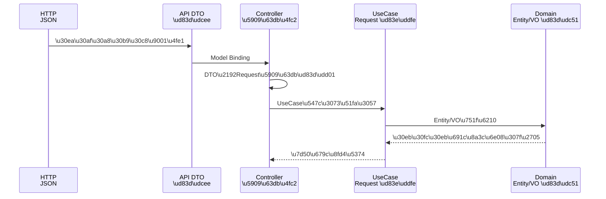

# 第30章：API DTO と UseCase Request を分ける🍱✨

（＝“外の形”で中身を汚さない練習だよ😊）

この章はひとことで言うと…
**「HTTPで来た“入れ物”と、アプリが欲しい“材料”を別物にしようね」**って話です🍱💕

---

## 1) どうして分けるの？🤔💭（超ざっくり結論）


分けないと、こんな事故が起きがちです💥

* APIの都合（JSONの形、命名、バージョン、UIの都合）が、**UseCaseやドメインまで侵食**する😵‍💫
* 「APIのフィールド追加」が「UseCaseの型変更」になって、**変更が連鎖**する🔁
* うっかり Domain Entity をそのまま受け取って、**危険な値更新や情報漏えい**が起きる⚠️
* テストがしにくくなる（HTTPの形が混ざってくる）🧪💦

実際、.NETの実務系のガイドでも「API契約（DTO）はドメインモデルとは分けよう」が繰り返し言われます📌 ([codewithmukesh.com][1])

---

## 2) 今日の主役3人🍙（この3つを分ける！）

ここ、覚えたら勝ちです😊✨

### A. API DTO（外向けの契約）📮

* 例：`CreateMemoDto`
* **HTTPの都合**（JSONの形、命名、必須/任意、バリデーション）を持つ
* 置き場所：**Webプロジェクト（最外周）**

### B. UseCase Request（アプリの入力）🧾

* 例：`CreateMemoRequest`
* ユースケースが必要な情報だけ持つ（過不足なく）
* 置き場所：**UseCases（Application）**

### C. Domain（Entity/ValueObject）👑

* 例：`Memo` / `MemoTitle`
* ルールと不変条件の本丸
* 置き場所：**Core（Domain）**

Microsoftの参照アプリ（eShopOnWeb）も、Clean Architectureの構成でプロジェクト分割する前提を案内してます📚 ([Microsoft Learn][2])

---

## 3) “分けない”とどう壊れる？🥲（NG例）

たとえば、UseCaseがAPI DTOを直接受け取ると…

```csharp
// ❌NG：UseCaseがWebの都合（DTO）に依存しやすい
public sealed class CreateMemoUseCase
{
    public Task ExecuteAsync(CreateMemoDto dto) { /* ... */ }
}
```

これ、次の未来が来ます😇

* DTOのフィールド名が変わる → UseCaseも変更
* API v2 を追加 → UseCaseの入力も増殖
* DTOに `[JsonPropertyName]` とかが増える → “外の都合”が中に侵入

---

## 4) OKの形✅（今日のゴール）

流れはこれだけ💡

**HTTP(JSON) → API DTO →（変換）→ UseCase Request →（UseCase内で）→ Domain**



図にするとこんな感じです🎀

* Web（Adapter）で受ける：DTO
* Web（Adapter）で変換：DTO → Request
* UseCaseは Request だけ見て進む（HTTP知らない）

---

## 5) 実装してみよ🍳（Controller版 / Minimal API版）

題材：メモ作成 ✍️

### 5-1. API DTO（Web側）📮

```csharp
public sealed record CreateMemoDto(
    string Title,
    string? Body,
    string[]? Tags
);
```

### 5-2. UseCase Request（UseCases側）🧾

```csharp
public sealed record CreateMemoRequest(
    string Title,
    string? Body,
    IReadOnlyList<string> Tags
);
```

### 5-3. 変換（Web側に置くのが基本）🔁

DTOとRequest、**両方の型が登場する場所**が変換の家です🏠
（＝Webプロジェクトの Adapter）

```csharp
public static class CreateMemoMapping
{
    public static CreateMemoRequest ToRequest(this CreateMemoDto dto)
        => new(
            Title: dto.Title,
            Body: dto.Body,
            Tags: dto.Tags is null ? Array.Empty<string>() : dto.Tags
        );
}
```

> ポイント：`Tags` の null を **ここで吸収**して、UseCase側をラクにする😊✨

---

### 5-4. Controller版（わかりやすい）🚪

ASP.NET Coreは “リクエスト → C#の型” を **Model Binding** で結びます📎 ([Microsoft Learn][3])

```csharp
[ApiController]
[Route("api/memos")]
public sealed class MemosController : ControllerBase
{
    private readonly ICreateMemoUseCase _useCase;

    public MemosController(ICreateMemoUseCase useCase) => _useCase = useCase;

    [HttpPost]
    public async Task<IActionResult> Create([FromBody] CreateMemoDto dto, CancellationToken ct)
    {
        var request = dto.ToRequest();          // ✅変換は外側で
        var result = await _useCase.ExecuteAsync(request, ct);

        return Created($"/api/memos/{result.MemoId}", result);
    }
}
```

---

### 5-5. Minimal API版（スッキリ）🌿

最近のMinimal API系の解説でも、**Request DTOをドメイン/内部モデルと分けるのがベストプラクティス**として紹介されています📌 ([codewithmukesh.com][1])

```csharp
app.MapPost("/api/memos", async (
    CreateMemoDto dto,
    ICreateMemoUseCase useCase,
    CancellationToken ct) =>
{
    var request = dto.ToRequest();              // ✅外側で変換
    var result = await useCase.ExecuteAsync(request, ct);

    return Results.Created($"/api/memos/{result.MemoId}", result);
});
```

---

## 6) バリデーションはどこでやるの？🛑✨（超大事）

ここで迷子になりがちなので、ルールを固定します📌

### ✅ Adapter（Web）で止める：形式チェック

* “空じゃない？” “文字数” “配列サイズ” “メール形式” とか
* **HTTPで来た形のチェック**はここが自然🙆‍♀️

### ✅ Domainで守る：不変条件（壊れた状態を作らせない）👑

* “タイトルは空禁止” “最大長” “タグ重複禁止” みたいな本質ルール
* これは **Domainの責任**（後の章でがっつり）

FluentValidation を ASP.NET Core に統合する公式ドキュメントもあります📚 ([fluentvalidation.net][4])
（※Minimal APIの場合は自動実行の仕組みを自分で用意する流派もあるので、チーム方針でOK😊）

---

## 7) “分けた結果”のうれしさ😍💖

* APIの形が変わっても、UseCaseが安定する🧘‍♀️
* UseCaseのテストが「DTO無し」で書ける🧪✨
* “外側の都合”をAdapterで吸収できる（境界が強くなる）🚪💪
* 将来「UIがWeb→アプリ」みたいに入口が増えても、UseCaseはそのまま使える📦

---

## 8) ミニ課題🎯（手を動かして体に入れる）

### 課題A：変換漏れチェック✅

1. `CreateMemoDto` に `ClientTraceId`（任意）を追加してみて🆔
2. UseCase Request には入れない（不要だから）
3. それでもAPIは動くようにする（＝境界成功🎉）

### 課題B：変換テスト🧪

`Tags=null` のときに空配列になるテストを書こう😊

```csharp
[Fact]
public void ToRequest_WhenTagsNull_ReturnsEmpty()
{
    var dto = new CreateMemoDto("hello", "body", null);

    var req = dto.ToRequest();

    Assert.NotNull(req.Tags);
    Assert.Empty(req.Tags);
}
```

---

## 9) AI（Copilot/Codex）に頼むと強いところ🤖✨

そのままコピペで使えるお願い例だよ🍀

* 「`CreateMemoDto`→`CreateMemoRequest` の変換extension methodを書いて。null安全にして」
* 「DTO→Requestの変換で落とし穴（null/空/既定値/配列）を列挙して」
* 「変換テストケースをGiven-When-Thenで10個出して」

👉 ただし、**採用する前に “UseCaseがWeb型に依存してないか”** を必ず目視チェックね👀🔍

---

## 10) この章のチェックリスト✅✅✅

* [ ] Controller/Endpoint は **DTOを受け取るだけ**
* [ ] DTO→Request 変換は **Web（Adapter）側**にある
* [ ] UseCase は **Request型しか知らない**
* [ ] null吸収（配列や任意項目）は変換でやってUseCaseを楽にした
* [ ] “形式チェック” と “ドメインの不変条件” を分けて考えられた

---

次の第31章は、逆方向（UseCaseの結果を **Presenter/Response DTO** に整形する）をやると、入出力がキレイに対になります🍱➡️📦✨

[1]: https://codewithmukesh.com/blog/minimal-apis-aspnet-core/?utm_source=chatgpt.com "Minimal API Endpoints in ASP.NET Core - Complete Guide ..."
[2]: https://learn.microsoft.com/en-us/dotnet/architecture/modern-web-apps-azure/common-web-application-architectures?utm_source=chatgpt.com "Common web application architectures - .NET"
[3]: https://learn.microsoft.com/en-us/aspnet/core/mvc/models/model-binding?view=aspnetcore-10.0&utm_source=chatgpt.com "Model Binding in ASP.NET Core"
[4]: https://fluentvalidation.net/aspnet?utm_source=chatgpt.com "ASP.NET Core — FluentValidation documentation"
