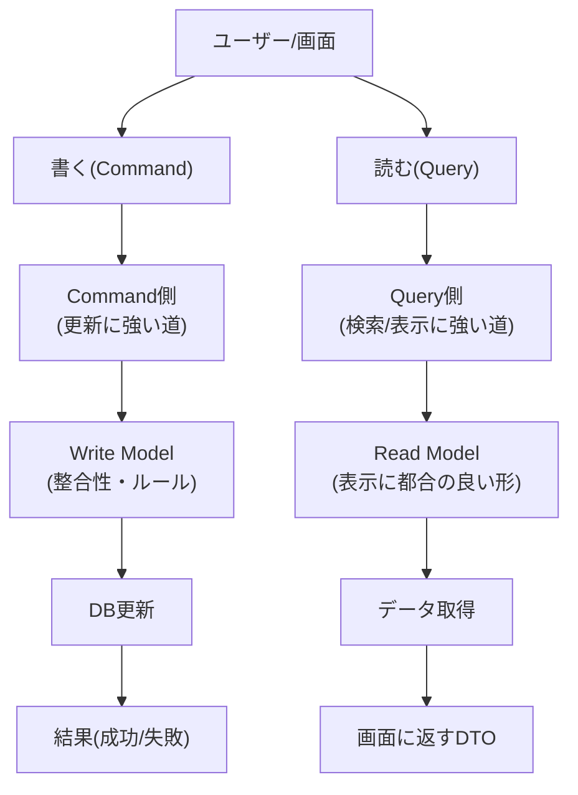

# 第1章　CQRSってなに？まずは“絵”で理解しよ🎨✨

この章のゴールはひとつだけだよ〜！
**CQRS＝「読む（Query）」と「書く（Command）」を分けて考える**って感覚を、頭じゃなくて“絵”で掴むことっ👀✍️
（厳密さより「なるほど！」が大事🥰）

---

## 1) CQRSを“絵”で見るとこう🎨


ポイントは **「道を2本にする」** イメージ！🚗🛣️🛣️



Microsoftの説明だと、CQRSは **読み取りと書き込みを「別々のデータモデル」に分ける設計パターン**だよ〜、って整理されてるよ。([Microsoft Learn][1])
Martin Fowlerも「更新用モデルと参照用モデルを分ける」って言い方で説明してるよ。([martinfowler.com][2])

---

## 2) Command / Query を“超ざっくり”定義しよ🧠✨

### ✅ Command（コマンド）✍️

* **状態を変える**（作る/更新する/消す）
* 例：`ToDoを追加する`、`注文を確定する`、`いいねする` ❤️

### ✅ Query（クエリ）👀

* **状態を“読む”だけ**（取得/検索/一覧/集計）
* 例：`ToDo一覧を見る`、`注文履歴を見る`、`人気順で並べる` 🔍

ここで地味に大事な考え方が「Queryは副作用を持たない（観測可能な状態を変えない）」ってやつ。
これは **Command Query Separation（CQS）** の基本の考え方としてよく説明されるよ。([martinfowler.com][3])
（※ログ取るみたいな“実務上の例外”はあるけど、気持ちとしては「Queryは安全」って覚えるのが最強👍）

---

## 3) CQRSって結局、なにが嬉しいの？🎁✨（超入門版）

第1章では“効果”を細かく覚えなくてOK！でも雰囲気だけ👇

* **書く側**：整合性・業務ルール・トランザクションを守りたい🛡️
* **読む側**：画面表示や検索を速く・作りやすくしたい⚡

この2つって、要求がちがうことが多いから
**道を分けると、それぞれを最適化しやすい**ってわけ〜！([Microsoft Learn][1])

ただし！Fowlerがハッキリ言ってる注意も大事で、
**多くのシステムではCQRSは複雑さ（リスク）を増やす**ことがあるよ、って話もあるのね😇([martinfowler.com][2])
→ だからこの教材では、いきなり重たいCQRSに飛ばずに、**ライトCQRS（小さく分ける）**から入るよ〜🎈

---

## 4) 身近な例で「読む/書く」を分けてみよ🧁📱🛒

### 例A：SNS📱

* **Command（書く）**：投稿する / いいねする / フォローする / コメントする
* **Query（読む）**：タイムラインを見る / 人気順で検索 / プロフィールを見る / 通知一覧を見る

### 例B：ミニEC🛒

* **Command**：カートに入れる / 注文確定 / 配送先変更 / キャンセル
* **Query**：商品検索 / 売れ筋一覧 / 注文履歴 / 在庫表示

### 例C：ToDo✅

* **Command**：追加 / 完了 / 期限変更 / 削除
* **Query**：今日のToDo / 未完了一覧 / 期限切れ一覧 / タグ検索

この分け方ができたら、第1章はほぼ勝ち🏆✨

---

## 5) ミニ演習：あなたの題材で「読む/書く」を仕分けしてみよ📝💕

次のテンプレを埋めてみてね！（題材はSNS/EC/ToDoどれでもOK）

**①機能を10個書く**

* 例：「ToDoを追加」「ToDo一覧を見る」みたいに、なるべく動詞で✨

**②Command / Query に分類する**

* Command：状態が変わる？（DBの中身が変わる？）✍️
* Query：見るだけ？検索だけ？👀

**③“迷うやつ”に印をつける**

* 例：「追加したあと、そのToDoの詳細も返したい」←こういう“欲張り”はめちゃ出る😆

  * ここは後の章で「戻り値を欲張らない」とかで上手に整理するよ🎓✨

---

## 6) C#で見る「それっぽい形」🧩（まだ実装は薄味でOK）

この章では雰囲気だけでOK！「名前の付け方」を先に見せちゃうね👀

```csharp
// Command（書く）
public sealed record CreateTodoCommand(string Title, DateOnly? DueDate);

// Query（読む）
public sealed record GetTodoListQuery(bool OnlyIncomplete);

// 返す用のRead DTO（画面に都合のいい形）
public sealed record TodoListItemDto(Guid Id, string Title, bool IsDone, DateOnly? DueDate);
```

ここでのコツはこれだけ👇✨

* **Command/Queryは “やりたいこと” を1個に絞る**（1ユースケース=1つの型、くらいの気持ち）
* **Queryの戻りは “画面に都合の良いDTO” でOK**（DBのEntityをそのまま返さない方向）

---

## 7) AIに手伝ってもらうプロンプト例🤖✨（コピペOK）

* 「ToDoアプリの機能を20個出して、Command/Queryに分類して」📝🤖
* 「“状態を変える/変えない”で迷いやすい例を10個出して、なぜ迷うかも説明して」😵‍💫🤖
* 「CQRSを“道路が2本”の比喩で、中学生にも伝わる説明文にして」🎨🤖

---

## 8) ちょい最新メモ🆕（安心して進める用）

いまのC#周りは **.NET 10（LTS）+ C# 14** が軸だよ〜（2025年11月リリース）。([Microsoft for Developers][4])
.NET 10 はLTSとしてサポートが続く前提で、サポート方針の表でも追えるよ。([Microsoft][5])
Visual Studio 2026 も .NET 10 世代としてリリースノートが出てるよ。([Microsoft Learn][6])

---

## まとめ🎀✨

* CQRSは **読む（Query）** と **書く（Command）** を分ける考え方だよ👀✍️
* “絵”としては **道を2本にする**イメージがいちばん強い🛣️🛣️
* まずは **身近な例で仕分けできる**のが第1章の合格ライン💯✨

次の章（第2章）では、「CQRSが効く場面／やめとく場面⚖️」を“判断できる人”になるよ〜😺📚

[1]: https://learn.microsoft.com/en-us/azure/architecture/patterns/cqrs?utm_source=chatgpt.com "CQRS Pattern - Azure Architecture Center"
[2]: https://martinfowler.com/bliki/CQRS.html?utm_source=chatgpt.com "CQRS"
[3]: https://martinfowler.com/bliki/CommandQuerySeparation.html?utm_source=chatgpt.com "Command Query Separation"
[4]: https://devblogs.microsoft.com/dotnet/announcing-dotnet-10/?utm_source=chatgpt.com "Announcing .NET 10"
[5]: https://dotnet.microsoft.com/en-us/platform/support/policy/dotnet-core?utm_source=chatgpt.com "NET and .NET Core official support policy"
[6]: https://learn.microsoft.com/ja-jp/visualstudio/releases/2026/release-notes?utm_source=chatgpt.com "Visual Studio 2026 リリース ノート"
