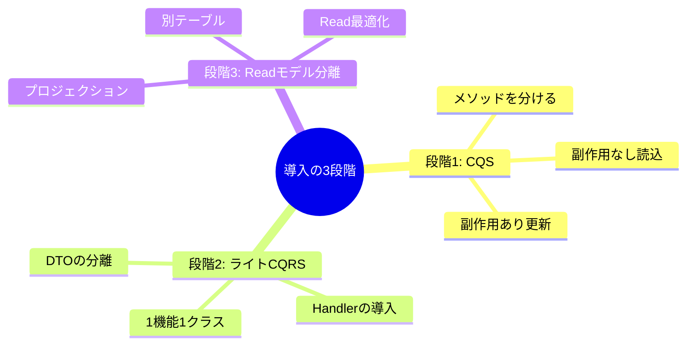

# 第2章　CQRSが効く場面・やめとく場面⚖️✨

（ねらい：**「やらない勇気」**も含めて判断できるようになる🫶）

---

## 0) まず最初に：CQRSは「必殺技」じゃなくて「道具」だよ🧰🙂

CQRSは、**読み取り（Query）**と**書き込み（Command）**を、**別モデルとして分ける設計パターン**だよ〜👀✍️
分けると、読み側と書き側をそれぞれ最適化できて、**性能・拡張性・セキュリティ**を上げられることがあるの✨
ただし、分けるぶん設計の手間も増えるから、**合う場面だけ**使うのが大事！ ([Microsoft Learn][1])

---

## 1) CQRSが「効く」サイン✅（こうなったら検討しよっ😺）

ここからは「痛み」が出てるかどうかで見るよ〜🩹✨

### ✅ サインA：検索が重い・複雑・画面が多い🔍🐢

* 一覧が **JOINだらけ**、条件が多い、並び替え・絞り込み・集計が多い
* 「画面の都合」に合わせたDTOが欲しいのに、書き込みモデルが邪魔😵‍💫
  → **読み専用モデル**に寄せるとスッキリしやすい✨ ([Microsoft Learn][1])

### ✅ サインB：読みが圧倒的に多い📈（アクセスの9割が閲覧とか）

* 商品一覧・タイムライン・検索結果…「読む」ほうが主役
  → 読みだけスケール/最適化したくなる💨 ([Microsoft Learn][1])

### ✅ サインC：書き込み側の整合性・業務ルールが増えてきた🏛️🔒

* 在庫、期限、状態遷移、権限…「守るルール」が増えてくる
  → 書き込み側を **ルールの砦（とりで）** にして、読み側は表示に集中💪

※ここで大事なのは、**「整合性が厳しい＝CQRS必須」ではない**こと！
整合性が厳しいほど、読み側を別にすると（最終的整合性など）注意点も出るから、後述の「やめとくサイン」も必ず見るよ⚠️

### ✅ サインD：読みと書きで求める最適化が違いすぎる⚡🧱

* 書き：トランザクション・整合性・監査ログが大事
* 読み：速度・集計・検索のしやすさが大事
  → **別モデル**にすると「それぞれの得意」に寄せられる✨ ([Microsoft Learn][1])

### ✅ サインE：セキュリティ要件が読み/書きで違う🔐

* 書き込みは厳重、読みは公開寄り
  → 経路やDTOを分けるとミスりにくい✨ ([Microsoft Learn][1])

---

## 2) CQRSを「やめとく」サイン❌（ここ、超だいじ🥺）

### ❌ サイン1：ほぼCRUDで、画面も検索も単純📄

* 追加/編集/削除が中心で、一覧も単純
  → CQRSは“儀式”が増えがち。メリットより手間が勝ちやすい😇 ([martinfowler.com][2])

### ❌ サイン2：小規模チーム・短納期で、保守よりまず納品🏃‍♀️💨

* 分ける設計・命名・規約づくりに時間が必要
  → まず **CQS（副作用なしのQuery/更新のCommand）** だけ導入が良いこと多い✂️✨

### ❌ サイン3：どの画面でも「更新したら即反映」が絶対🥶

* 反映遅延が1秒でも許されない
  → 読みモデルを分離すると「反映ラグ」が課題になりやすい（設計力が必要）⚠️
  ※同一DBで“モデルだけ分ける”ライトCQRSなら回避しやすいこともあるよ🙂

### ❌ サイン4：「CQRSやってる感」が目的になってる🎭

* “流行ってるから” “ライブラリが便利そうだから” だけで採用
  → これ、事故りやすい😭 ([martinfowler.com][2])

### ❌ サイン5：読みと書きを分けるほどの“痛み”がまだ無い🌱

* 今の構成で困ってない/測定してない
  → **計測してから**でOK！📏✨

---

## 3) 迷ったらこれ！「3段階」判断がおすすめ🪜😺




いきなりフルCQRSに飛ばないのがコツだよ〜✨

1. **段階①：CQSだけ**（更新と参照を同じメソッドに混ぜない）✂️
2. **段階②：ライトCQRS**（Command DTO / Query DTO、Handler分離）📦🧑‍🍳
3. **段階③：Readモデル分離**（Projection/別テーブル/別DBなど）🪞

Microsoftの説明でも、CQRSは「読み/書きのモデルを分けて最適化できる」って話なので、**“どこまで分けるか”は段階的でOK**だよ✨ ([Microsoft Learn][1])

---

## 4) 「この機能はCQRS向き？」チェックリスト✅（ミニ演習つき🎯）

### ✅ チェックリスト（Yesに丸つけてね⭕）

**読みの痛み（Query側）**

* [ ] 一覧・検索が重い/複雑（条件、集計、JOIN多め）
* [ ] 読みがアクセスの大半
* [ ] 画面ごとに“欲しい形”がバラバラ（DTOが肥大）
* [ ] 将来キャッシュ/全文検索/集計テーブルを入れそう

**書きの痛み（Command側）**

* [ ] 業務ルールが増えてきて、更新が怖い
* [ ] 監査ログ/承認フロー/状態遷移などがある
* [ ] 同時更新や整合性の事故が怖い

**運用・チーム事情**

* [ ] 規約を作って守れる（命名/フォルダ/テンプレ）
* [ ] 多少の設計コストを払ってでも保守性を上げたい

### 🧮 点数化（おすすめ！）

* Yes 1個 = **10点**（最大90点）
* **0〜20点**：まだ早いかも（CQSで十分）🙂
* **30〜50点**：ライトCQRS検討（DTO/Handler分離）✨
* **60点〜**：CQRS（Read最適化含む）を真剣に検討🔥

---

## 5) ミニ演習📝✨（3つの例で練習しよ！）

### 演習①：ToDoアプリ✅

* 検索：単純（期限・完了のみ）
* ルール：少ない
  → だいたい **0〜20点**になりやすい → **CQSでOK**🙆‍♀️

### 演習②：ミニEC🛒

* 商品一覧：条件多い（価格帯/カテゴリ/在庫/ランキング）
* 注文：在庫・決済・状態遷移がある
  → **30〜70点**になりやすい → ライトCQRS〜Read最適化を検討🙆‍♀️

### 演習③：SNSタイムライン📱

* 読みが超多い、表示が複雑（推薦・フォロー・ミュート等）
  → **60点〜**になりやすい → CQRSが活きやすい🔥

---

## 6) AIで「CQRS必要度」を点数化する🤖📊（コピペOK✨）

下の要件を貼って、AIに“採点役”をさせるよ〜！

```text
あなたはソフトウェア設計のメンターです。
次の機能要件に対して、CQRSの必要度を 0〜100 点で採点してください。

- まず「読む（Query）」の難しさ、「書く（Command）」の難しさを分けて評価
- CQRSを採用する場合のメリット/デメリットを箇条書き
- 「段階①CQSだけ」「段階②ライトCQRS」「段階③Readモデル分離」のどれが妥当か提案
- 最後に、採点の根拠を“チェックリスト形式”で出す

【要件】
（ここに貼る）
```

さらに踏み込むならこれも便利👇🙂

```text
CQRSを採用しない場合の代替案（CQS、DTO投影、キャッシュ、インデックス、クエリ最適化）を優先度つきで提案して。
```

---

## 7) よくある落とし穴😱（ここ踏むとつらい…）

* 最初から **Read/WriteでDB分ける前提**で始める → 運用が一気に難しくなる🌀
* “CQRS=イベントソーシング必須”と思う → そんなことないよ（組み合わせは多いけど別物） ([martinfowler.com][3])
* 「CQRSという名前」を採用して満足 → **痛みが消えるか**で判断しよ🥺 ([martinfowler.com][2])

---

## 8) 2026の最新メモ🗓️✨（学習の足場）

* .NET 10 は **2025-11-11開始のLTS**で、サポートは **2028-11-14**までだよ📌 ([Microsoft Learn][4])
* C# 14 の新機能は Microsoft Learn にまとまってるよ（拡張メンバー構文など）🧩 ([Microsoft Learn][5])
* ちなみに：MediatR/AutoMapper は 2025年に **デュアルライセンス/商用版**の話が出てるので、職場ルール次第では導入判断に影響するかも⚠️ ([Jimmy Bogard][6])

---

## 9) まとめ🎀

* CQRSは「読む/書く」を分けて最適化できるけど、**複雑さも増える**よ🙂 ([Microsoft Learn][1])
* だから、**“痛み”が出てる機能だけ**に、**段階的**に入れるのがいちばん安全✅✨
* 次の第3章では、用語を“辞書化”して迷子を防ぐよ〜🧭😺

---

必要なら、この章のチェックリストをそのまま **1枚のテンプレ（README用）**に整形して渡すね📄✨

[1]: https://learn.microsoft.com/ja-jp/azure/architecture/patterns/cqrs?utm_source=chatgpt.com "CQRS パターン - Azure Architecture Center"
[2]: https://martinfowler.com/bliki/CQRS.html?utm_source=chatgpt.com "CQRS"
[3]: https://martinfowler.com/articles/201701-event-driven.html?utm_source=chatgpt.com "What do you mean by “Event-Driven”?"
[4]: https://learn.microsoft.com/ja-jp/lifecycle/products/microsoft-net-and-net-core?utm_source=chatgpt.com "Microsoft .NET および .NET Core - Microsoft Lifecycle"
[5]: https://learn.microsoft.com/en-us/dotnet/csharp/whats-new/csharp-14?utm_source=chatgpt.com "What's new in C# 14"
[6]: https://www.jimmybogard.com/automapper-and-mediatr-licensing-update/?utm_source=chatgpt.com "AutoMapper and MediatR Licensing Update"
