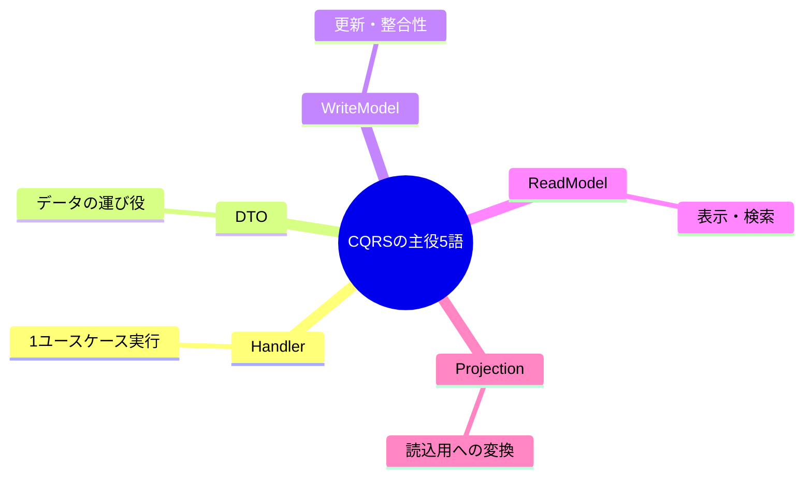

# 第3章　用語を先に“辞書化”して迷子防止🧭🗂️✨

この章は、CQRSの世界で**よく出てくる単語を「自分専用の辞書」にして**、あとで実装に入ったときに「え、ReadModelってDTOと違うの？😵‍💫」ってならないための準備回だよ〜☺️💕

ちなみにCQRS自体は「読む（Query）」と「書く（Command）」を**別々のモデルに分けて最適化しやすくする**考え方だよ👀✍️（性能・スケール・セキュリティの都合で“読み”と“書き”が非対称になるのが背景）([Microsoft Learn][1])

---

## 1) まずは“地図”を1枚だけ🗺️✨（全体像が先！）


ここを頭に貼っておくと、用語がスッと入るよ😊

* **Command（書く）**：状態を変える✍️（追加/更新/削除）

  * → **CommandHandler** が受けて
  * → **WriteModel**（更新しやすい形）で処理して
  * → DBへ保存🧱

* **Query（読む）**：状態を読むだけ👀（副作用なし）

  * → **QueryHandler** が受けて
  * → **ReadModel**（表示しやすい形）で組み立てて
  * → 画面へ返す📤

* **Projection（投影）**：Write側のデータから、Read側の形を作る“変換”🪞✨
  （「必要な列だけにする」「集計する」「一覧用に整形する」みたいなやつ！）

---

## 2) 第3章の主役5語を“辞書化”しよ🗂️💕



ここからは「1行説明＋例＋勘違い」をセットで覚えるのがコツだよ〜🫶

### ✅ Handler（ハンドラ）🧑‍🍳

* **1行**：Command/Query を受け取って、**1ユースケース分だけ**実行する係
* **例**：`CreateOrderCommandHandler`（注文を作るだけ）
* **勘違いあるある**：

  * ❌「Serviceクラスに全部入れた方が楽じゃん」→ 最初は楽、後で地獄😇
  * ❌「Handlerが巨大化」→ **“1機能=1Handler”**で小さく保つ🍱

### ✅ DTO（Data Transfer Object）📦

* **1行**：層と層の間で渡す“ただのデータの箱”
* **例**：`CreateOrderCommand` / `OrderDetailDto`
* **勘違いあるある**：

  * ❌ DTOにロジック盛り盛り → それはもう別物😂
  * ❌ Entityそのまま返す → “便利”だけど後で変更に弱い💥

### ✅ WriteModel（書きモデル）✍️🧱

* **1行**：**更新・整合性**を守りやすい形（ルールを置く場所）
* **例**：`Order` エンティティ、集約、更新用の構造
* **勘違いあるある**：

  * ❌ WriteModelを「画面に最適化」しちゃう → 更新がつらくなる😵‍💫

### ✅ ReadModel（読みモデル）👀📄

* **1行**：**表示・検索**しやすい形（画面都合に寄せてOK）
* **例**：一覧用 `OrderListItemDto`（合計金額、件数、表示用文字列が入っててもOK）
* **勘違いあるある**：

  * ❌ ReadModel = DBのテーブル名だと思う → “形”の話だよ（置き場所は後で選べる）🙂

### ✅ Projection（プロジェクション）🪞✨

* **1行**：Write側のデータを、Read側の形へ“変換して作る”こと
* **例**：注文＋明細＋顧客名をJOINして「一覧用の1行」にする
* **勘違いあるある**：

  * ❌ Projection = イベントソーシング専用用語 → それとも相性いいけど、ここではもっとライトに使ってOK😊

---

## 3) すぐ使える「用語カード」テンプレ🗂️✍️✨

ノートでも `glossary.md` でもOK！これをコピペして埋めるだけで強い💪💕

* 用語：
* 1行説明：
* 自分の例（ToDo/EC/SNSで）：
* 似てる言葉（混乱注意）：
* よくある勘違い：
* “見分ける質問”：

  * 例：「これは更新する？表示する？」
  * 例：「このデータは“整合性重視”？“見た目重視”？😺」

---

## 4) ちいさなC#例で「単語の位置」を固定するよ🔧✨

ポイントは「DTO」「Handler」「Read/Writeの分かれ方」を、**目で見て覚える**こと👀💕

```csharp
// DTO（Command）: 書くための入力データ 📦✍️
public sealed record CreateOrderCommand(
    int CustomerId,
    IReadOnlyList<CreateOrderItemDto> Items
);

public sealed record CreateOrderItemDto(int ProductId, int Quantity);

// DTO（Query）: 読むための入力データ 📦👀
public sealed record GetOrderDetailQuery(int OrderId);

// Read DTO（表示用）: 画面に最適な形でOK 📄✨
public sealed record OrderDetailDto(
    int OrderId,
    string CustomerName,
    int TotalQuantity,
    decimal TotalPrice
);

// Handler（例）: “1ユースケースだけ”やる係 🧑‍🍳
public sealed class CreateOrderCommandHandler
{
    public async Task<int> HandleAsync(CreateOrderCommand command, CancellationToken ct)
    {
        // WriteModelで更新（整合性のルールを守る場所）🧱
        // 例: 在庫チェック、合計計算、注文生成 etc...
        // 最終的にDBへ保存して OrderId を返す、みたいな最小戻り値が定番😊
        await Task.CompletedTask;
        return 123; // new OrderId
    }
}

public sealed class GetOrderDetailQueryHandler
{
    public async Task<OrderDetailDto> HandleAsync(GetOrderDetailQuery query, CancellationToken ct)
    {
        // Projection（投影）🪞
        // Write側のデータ（注文・明細・顧客）を、Read側の形に整形して返すイメージ✨
        await Task.CompletedTask;
        return new OrderDetailDto(
            OrderId: query.OrderId,
            CustomerName: "Sato",
            TotalQuantity: 3,
            TotalPrice: 4980m
        );
    }
}
```

---

## 5) 迷子になりがちな“似てる言葉”セットを整理🧭💡

ここ、超大事！テストに出る（出ない）けど現場で死ぬやつ😇

* **ReadModel vs Read DTO**

  * ReadModel：考え方（表示用の形）
  * Read DTO：その形を表す“データ構造”の1つ（recordとか）

* **Handler vs Service**

  * Handler：**ユースケース単位**（1機能）
  * Service：広い意味で使われがち（肥大化しやすい🍔）

* **Projection vs Mapper**

  * Projection：データを“表示用に作る行為”（JOIN/集計/整形含む）
  * Mapper：型変換の道具（Projectionの一部になりがち）

---

## 6) AIで“辞書”を強化するプロンプト例🤖💞（コピペOK）

**狙い：AIに説明させて、自分の言葉に直して定着！**✍️✨

* 「Handler / DTO / ReadModel / WriteModel / Projection を、それぞれ **25文字以内で**説明して。さらに **混同しやすいペア**も挙げて」
* 「ToDoアプリを例に、各用語が **どのクラス名**になりそうか候補を出して」
* 「次の1行説明、初心者に誤解がないか添削して：『ProjectionはReadModelを作ること』」
* 「この設計案、Handlerが太りそうな点を指摘して、分割案を出して😺」

💡コツ：AIの答えは“正しそう”でも油断しないで、**「更新？表示？」の質問に戻って確認**すると事故りにくいよ✅

---

## 7) ミニ演習：用語カードを5枚作る🗂️✨（10分で終わる）

1. Handler / DTO / ReadModel / WriteModel / Projection の5枚を作る
2. それぞれに「ToDoアプリ例」を1つずつ書く📝
3. 最後に自分でクイズ：

   * 「これは更新？表示？」
   * 「これは整合性重視？画面重視？」
   * 「これは“変換して作る”が入る？」🪞

---

## 8) この章の“落とし穴”だけ先に回避しとこ⚠️😺

* **CQRS = 別DB必須**じゃないよ🙅‍♀️
  まずは“コードの責務”を分けるだけでも効果が出ること多い（CQRSは読み書きのモデル分離が軸）([Microsoft Learn][1])
* **Readは“便利に盛ってOK”だけど、Writeは盛りすぎ注意**🍰
  Writeは整合性を守る場所になりやすいよ🧱
* **用語が人によってブレる**（ここが一番こわい😂）
  だからこそ“自分の辞書”が効く🗂️✨

---

## 9) “本日時点の最新”メモ📌✨（用語の背景として）

* .NET 10 は 2025-11-11 に 10.0.0 が出て、その後 10.0.1 などの更新が出てるよ（SDK 10.0.100 も案内されてる）([Microsoft][2])
* C# 14 は拡張メンバー（拡張プロパティ等）の追加が大きなトピックだよ🧩([Microsoft Learn][3])
* Visual Studio は 2022 系でも更新が続いていて、リリース履歴がまとまってるよ（17.14 など）([Microsoft Learn][4])
* GitHub Copilot は Visual Studio 側で統合体験が進んでる（例：17.10で統合の話）🤖🧰([Microsoft Learn][5])

---

## 次章へのつながり🔜✨

第4章では、いよいよ最小のWeb APIを起動して「この用語たちが実際にどこに置かれるか」を手で触っていくよ〜🧪🚀

（もしこの章だけ先に“用語カードの完成版例”も欲しければ、ToDo題材かミニEC題材のどっちが好きかは、私の方でいい感じに決め打ちして作っちゃうよ😺💕）

[1]: https://learn.microsoft.com/en-us/azure/architecture/patterns/cqrs "CQRS Pattern - Azure Architecture Center | Microsoft Learn"
[2]: https://dotnet.microsoft.com/en-US/download/dotnet/10.0 "Download .NET 10.0 (Linux, macOS, and Windows) | .NET"
[3]: https://learn.microsoft.com/en-us/dotnet/csharp/whats-new/csharp-14 "What's new in C# 14 | Microsoft Learn"
[4]: https://learn.microsoft.com/ja-jp/visualstudio/releases/2022/release-history "Visual Studio 2022 リリース履歴 | Microsoft Learn"
[5]: https://learn.microsoft.com/en-us/visualstudio/releases/2022/release-notes-v17.10?utm_source=chatgpt.com "Visual Studio 2022 version 17.10 Release Notes"
