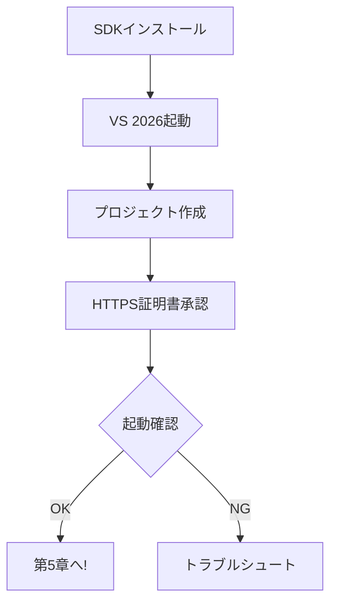

# 第4章　環境準備（Windows + VS 2026）🧰✨

## ねらい 🎯

この章のゴールは超シンプルです👇
**「最小のWeb APIを作って、ローカルで起動して、1回叩ける」**ところまで行きます🚀✨

---

## 学ぶこと 📚

* .NET SDK を入れて、`dotnet` コマンドが動くようにする🧩
* Visual Studio 2026 で Web API プロジェクトを作る🧑‍🍳
* HTTPS（開発用証明書）で詰まらないようにする🔐
* 起動確認して「動いた！」を作る✅



---

## 0) ざっくりチェックリスト ✅✅✅


* Visual Studio 2026（または Build Tools + VS Code）🧠✨ ([Microsoft Learn][1])
* .NET 10 SDK 🧱 ([Microsoft][2])
* Git（のちの章で便利。入ってなければ後でOK）🐙

---

## 1) .NET 10 SDK を入れる（いちばんラクな方法）💿✨

### ✅ winget で入れる（おすすめ）

PowerShell を開いて、これだけ👇 ([Microsoft Learn][3])

```powershell
winget install Microsoft.DotNet.SDK.10
```

> 2026/01/23 時点で、.NET 10 はダウンロードページ上で Preview/RC 系の記載も見えます（つまり「最新」を追うなら preview/rc が混ざることがあるよ、って感じ）🧪✨ ([Microsoft][2])

### ✅ 入ったか確認（超だいじ）🔍

```powershell
dotnet --version
dotnet --info
dotnet --list-sdks
```

ここで **10.x 系**が見えてたらOK👌✨

---

## 2) Visual Studio 2026 を入れる 🧠🧰

### ✅ ダウンロード（公式）

Visual Studio 2026 は Microsoft Learn のリリースノートが出ています📌 ([Microsoft Learn][1])
ダウンロードページから入れられます🧩 ([Visual Studio][4])

### ✅ インストール時に選ぶもの（迷ったらコレ）🎒

インストーラーで「ワークロード」を選ぶ画面が出たら👇

* **ASP.NET と Web 開発** 🌐
* （余裕あれば）**.NET デスクトップ開発** 🖥️（ツール類が揃って安心）

---

## 3) 最小Web APIを作る（Visual Studio編）🛠️✨

### 手順 🧑‍🍳

1. Visual Studio を起動
2. **「新しいプロジェクトの作成」**
3. **「ASP.NET Core Web API」** を選ぶ
4. プロジェクト名は例：`CqrsStarter.Api`（好きでOK）🎀
5. フレームワークは **.NET 10** を選ぶ（選択肢に出るはず）🧱
6. それっぽいオプションがあったら👇

   * OpenAPI/Swagger を有効（あるならON）📜✨
   * HTTPS（だいたい既定でON）🔐

作れたら次へ👉

---

## 4) 最小Web APIを作る（CLI編：コピペでOK）⌨️✨

フォルダを作って、テンプレで生成します👇
（テンプレは `dotnet new` の既定テンプレとして提供されています） ([Microsoft Learn][5])

```powershell
mkdir CqrsStarter
cd CqrsStarter

dotnet new webapi -n CqrsStarter.Api
cd .\CqrsStarter.Api

dotnet run
```

起動したら、ターミナルに `https://localhost:****` みたいなURLが出ます🎉

---

## 5) 起動確認（Swagger / ブラウザ）🧪🌈

### ✅ Swagger UI がある場合

ブラウザでこれ👇
`https://localhost:****/swagger`

もし「Minimal API で OpenAPI は作れるけど、UI表示は別パッケージが必要」みたいな構成に当たったら、それは仕様として普通です🙂✨ ([Microsoft Learn][6])

### ✅ Swagger が無い場合（ぜんぜんOK）

ブラウザで `https://localhost:****` にアクセスして、何か返ればOK🙆‍♀️
または PowerShell で👇

```powershell
curl https://localhost:****/weatherforecast
```

---

## 6) ここで詰まりがちな「HTTPS証明書」🔐😵‍💫

初回だけ「HTTPSが信用されてないよ〜」って怒られることがあります⚡
そのときはこれ👇（Windows はこれでOK） ([Microsoft Learn][7])

```powershell
dotnet dev-certs https --trust
```

---

## ミニ演習 🎯（5〜10分）✨

### ✅ お題：動作確認エンドポイントを1個だけ増やす🍬

`Program.cs` に、1行足してみよ👇（例）

```csharp
app.MapGet("/ping", () => "pong 🏓");
```

起動して、ブラウザで👇
`https://localhost:****/ping`
**「pong 🏓」が出たら勝ち〜！🎉**

---

## AIプロンプト例 🤖📄（READMEを書かせる）

「自分で書くと地味にだるい」やつ、AIに投げちゃいましょ😆✨

* 「このプロジェクトのセットアップ手順を README.md に書いて。Windows / Visual Studio 2026 / .NET 10。`dotnet --version` の確認と、起動確認（/swagger or /ping）まで入れて」📝🤖

👉 出てきた文章は、**コピペして終わりじゃなくて**「自分の環境に合ってる？」だけ最後に目でチェックしてね👀✨

---

## 最後のチェック ✅🎀

ここまでできたら、第4章クリアです🎉

* `dotnet --version` が動く✅
* Web API が起動できる✅
* `/ping`（または `/weatherforecast`）を叩ける✅
* HTTPS で詰まっても直せる✅ ([Microsoft Learn][7])

次の章では、題材（ミニEC / ToDo）を決めて、CQRSが“効く要件”を作っていきますよ〜🛒✅✨

[1]: https://learn.microsoft.com/en-us/visualstudio/releases/2026/release-notes "Visual Studio 2026 Release Notes | Microsoft Learn"
[2]: https://dotnet.microsoft.com/ja-JP/download/dotnet/10.0 ".NET 10.0 (Linux、macOS、Windows) のダウンロード | .NET"
[3]: https://learn.microsoft.com/ja-jp/dotnet/core/install/windows?utm_source=chatgpt.com "Windows に .NET をインストールする"
[4]: https://visualstudio.microsoft.com/downloads/?utm_source=chatgpt.com "Visual Studio & VS Code Downloads for Windows, Mac, Linux"
[5]: https://learn.microsoft.com/ja-jp/dotnet/core/tools/dotnet-new-sdk-templates?utm_source=chatgpt.com "'dotnet new' の .NET の既定のテンプレート - .NET CLI"
[6]: https://learn.microsoft.com/ja-jp/aspnet/core/fundamentals/openapi/aspnetcore-openapi?view=aspnetcore-10.0&utm_source=chatgpt.com "OpenAPI ドキュメントを生成する - ASP.NET Core"
[7]: https://learn.microsoft.com/en-us/dotnet/core/tools/dotnet-dev-certs?utm_source=chatgpt.com "dotnet dev-certs command - .NET CLI"
