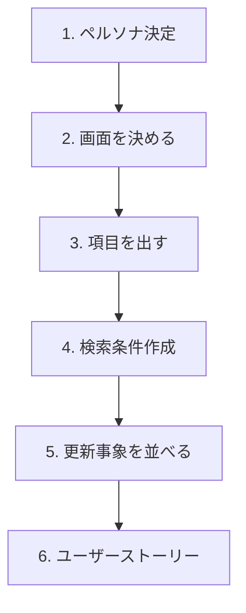

# 第5章　題材決め（ミニEC / ToDo）と “要件の作り方” 🛒✅📝✨

この章はね、**「CQRSが映える（＝読むが重い/多い）」要件**を、ちゃんと自分で作れるようになるのがゴールだよ〜！😺💕

ちなみに今の最新世代だと **.NET 10（LTS） + C# 14** が軸で、C# 14 は拡張メンバー（extension members）などが目玉だよ〜🧩✨ ([Microsoft][1])
（IDEも Visual Studio 2026 系が出てるよ〜🧰✨ ([Microsoft Learn][2])）

---

## 5.1 まず “題材” を決めよ〜！おすすめ2つ🎯😺

### A案：ミニEC（小さなネットショップ）🛒✨（超おすすめ）

CQRSの「読む側」が楽しくなる要素を入れやすいのがコレ！

* 商品が増える📦
* 注文が増える🧾
* 一覧検索が欲しくなる🔍
* 集計したくなる📊

### B案：ToDo（ちょい賢いタスク管理）📝✨

こっちも良いよ〜！ただし **“検索をちゃんと重くする工夫”** が必要😉

* タグ/期限/状態/担当/重要度でフィルタ🧷
* キーワード検索🔎
* 並び替え＆ページング📄
* 週間達成率などの集計📈

この教材では、以降の説明がつながりやすいので **A案：ミニEC** を主題にして進めるね！🛒💕

---

## 5.2 CQRSが“効く題材”のチェックリスト✅✨

次のどれかが入ってたら、CQRSの練習として最高だよ〜！😻

### ✅「読む」が強いサイン👀

* 一覧がある（しかも条件で絞る）📄🔍
* ソートがある（新しい順、金額順…）↕️
* ページングがある（10件ずつ、みたいな）📄
* 集計がある（件数、合計、ランキング）📊
* 画面が増えるほど表示項目が増える（JOIN地獄の香り）🔥😵‍💫

### ✅「書く」が強いサイン✍️

* 業務ルールがある（例：在庫不足なら注文不可）🚫📦
* 同時更新が起きうる（在庫・ステータス）💥
* 「1回の更新で守りたい整合性」がある🔒

---

## 5.3 要件づくりの“型” 🧩（この順で作ると迷子にならない🧭✨）

### ステップ1：登場人物（ペルソナ）を1つだけ決める👤

例（ミニEC）：

* 店員さん（管理画面で商品登録・注文処理する人）🧑‍💼
* お客さん（商品を探して注文する人）🧑‍🦰

👉 最初は **店員さん視点（管理画面）** から作ると、要件がまとまりやすいよ😺

### ステップ2：画面（=読む）を先に1枚決める🖼️👀

CQRSは “読む” が主役になりがちだから、先に決めちゃうのがコツ！✨
おすすめ：**「注文一覧（検索つき）」** 🧾🔍

### ステップ3：その画面に必要な “データ項目” を書き出す🧾📝

注文一覧なら例：

* 注文番号 / 注文日時 / 購入者名
* 合計金額 / 注文ステータス（未発送/発送済/キャンセル）
* 明細数、商品名の一部（表示用）など

### ステップ4：検索の “条件” を3〜6個に絞って入れる🔍✨（ここがCQRSの花💐）

入れすぎ注意だけど、**少なすぎるとCQRSの旨味が出ない**😇
おすすめ構成（ちょうど良い）：

* 期間（From/To）📅
* ステータス（複数）🏷️
* キーワード（注文番号/購入者/商品名の一部）🔎
* 金額範囲（min/max）💰
* 並び順（新しい順/高い順）↕️
* ページング（page/size）📄

### ステップ5：その検索を支える “書く側の出来事” を並べる✍️🧱

注文一覧が欲しいなら、書く側には最低これがいるよね：

* 注文作成
* 注文ステータス変更（発送/キャンセル）
* 商品登録
* 在庫更新

### ステップ6：User Story（ユーザーストーリー）に落とす📝✨

1行テンプレ：

* 「〜として、〜したい。なぜなら〜だから。」😺

---

## 5.4 ミニEC：ユーザーストーリー5本セット（教材用）🛒📝✨

ここからコピペして使ってOKだよ〜！😻

1. **商品登録**📦

* 店員として、新しい商品を登録したい。なぜなら販売を開始したいから。

2. **在庫補充**📦➕

* 店員として、商品在庫を補充したい。なぜなら売り切れを防ぎたいから。

3. **注文作成**🧾

* お客として、商品をカートに入れて注文したい。なぜなら購入したいから。

4. **注文ステータス更新（発送/キャンセル）**🚚🚫

* 店員として、注文を発送済みにしたい。なぜなら対応状況を管理したいから。

5. **注文一覧の検索**🔍📄

* 店員として、注文一覧を条件で検索したい。なぜなら問い合わせ対応や発送作業を速くしたいから。

---

## 5.5 ここが本題！「検索要件」を“CQRS向き”にするコツ🔍⚡

### コツ①：一覧は “表示に都合の良い形” にしていい👀✨

CQRSのRead側は **画面に最適化してOK**🙆‍♀️

* 例：合計金額は明細から計算済みで持ってきたい
* 例：明細数も一緒に出したい
* 例：購入者名・住所の一部も一緒に見たい

👉 こういうの、Writeモデルをそのまま返そうとすると苦しくなるの😵‍💫
だから分ける価値が出る！

### コツ②：検索条件は “現場っぽさ” を混ぜるとリアルになる📞✨

* 「昨日の注文だけ」📅
* 「キャンセル除外」🚫
* 「○○さんの注文」🔎
* 「1万円以上」💰
* 「未発送だけ」📦⏳

### コツ③：集計を1つだけ入れるとCQRSが一気に楽しくなる📊🎉

注文一覧ページの上に、こんな小さな集計を付けるとか：

* 「未発送：12件」📦
* 「今日の売上合計：¥123,456」💴
* 「平均注文単価」📈

EF Core 10 も “LINQ/クエリ表現の改善” が入ってたりするので、読む側の工夫が効きやすいよ〜🧪✨ ([Microsoft Learn][3])

---

## 5.6 ここまでで “Command / Query” の原型ができるよ🧩📮

### Command（書く）✍️

* CreateProduct
* RestockInventory
* CreateOrder
* ChangeOrderStatus（Ship / Cancel）

### Query（読む）👀

* GetOrderList（検索・ページング・ソート）
* GetOrderDetail（注文詳細）
* GetDashboardSummary（未発送数、今日売上など）

---

## 5.7 ミニ演習（この章の宿題）🎒✨

### 演習A：ユーザーストーリーを “自分の言葉” に直す📝😺

上の5本を、口調だけ変えてOK！
（自分が腹落ちしてれば勝ち✨）

### 演習B：注文一覧の検索仕様を “1枚だけ” ガチで書く🔍📄

最低これを書けたら合格💯

* 条件（期間/ステータス/キーワード/金額）
* 並び順
* ページング
* 表示列（何を表示するか）

### 演習C：受け入れ条件を3つ作る✅✨

例：

* 期間を指定したら、その範囲の注文だけ出る📅
* “未発送” を選んだら未発送だけ出る📦
* 2ページ目を要求したら、次の10件が出る📄

---

## 5.8 AI（Copilot/Codex等）を“要件づくり”に使うプロンプト例🤖💡✨

### ① ユーザーストーリー量産（良いのだけ採用）🧠✨

* 「ミニECの管理画面を作る。注文一覧（検索あり）を中心に、ユーザーストーリーを15個。各ストーリーは1行で、検索・集計が入るようにして」

### ② 受け入れ条件（Given-When-Then風）✅

* 「このユーザーストーリーの受け入れ条件を5個。境界値（0件/最大件数/不正入力）も混ぜて」

### ③ 検索条件の過不足チェック🔍

* 「注文一覧検索の条件が多すぎないかレビューして。学習用にちょうど良い“3〜6条件”に整理して」

### ④ CQRS観点の切り分け提案✂️

* 「この要件をCommandとQueryに分類して、必要なDTO名案も出して（CreateXxxCommand / GetXxxQuery形式）」

---

## 5.9 よくある事故ポイント（先に潰そ😇💥）

* ❌ **検索条件を盛りすぎ** → 作る前に飽きる
  → ✅ 最初は **最大6条件** まででOK！

* ❌ **一覧に表示する列が曖昧** → 後でRead側が迷子
  → ✅ 「この画面で見たい列」を先に固定！📌

* ❌ **Write（更新）要件が薄すぎ** → ルールが育たない
  → ✅ 在庫・ステータス変更は入れよう！📦🚚

---

## 5.10 この章の成果物（次章に持っていくもの）🎁✨

この4つが揃ってたら、第6章で「混ぜた実装」を作って苦しめるよ😇（そして学べる！）

* ✅ 題材（ミニEC or ToDo）
* ✅ ユーザーストーリー5本
* ✅ “検索つき一覧” の仕様1枚
* ✅ Command/Queryの原型リスト

---

必要なら、この第5章の成果物をそのまま **テンプレのMarkdown（埋めるだけ）** に整形して渡すよ〜📄✨（「ミニECでやる！」だけでOK😺）

[1]: https://dotnet.microsoft.com/en-us/platform/support/policy/dotnet-core?utm_source=chatgpt.com "NET and .NET Core official support policy"
[2]: https://learn.microsoft.com/ja-jp/visualstudio/releases/2026/release-notes?utm_source=chatgpt.com "Visual Studio 2026 リリース ノート"
[3]: https://learn.microsoft.com/ja-jp/ef/core/what-is-new/ef-core-10.0/whatsnew?utm_source=chatgpt.com "EF Core 10 の新機能"
