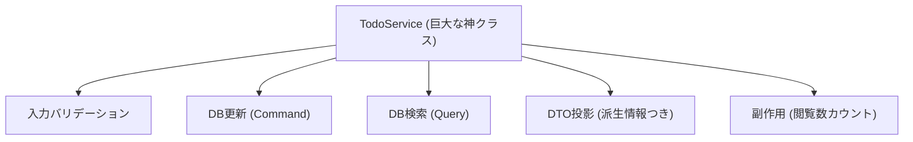

# 第6章　あえて“混ぜた実装”を作ってツラさ体験😵‍💫

この章はね、「CQRSって本当に必要？」を**身体で理解する**ための回だよ〜！
わざと“最悪に近い”作り方をして、あとで「分けたくなる気持ち」を引き出す作戦です😇💥

ちなみに今どきのC#/.NETは **.NET 10（LTS）** が軸で、C#は **C# 14** が最新だよ（どちらも 2025年11月リリース）。([Microsoft][1])
Visual Studio も **Visual Studio 2026** の更新が続いてる（例：18.2.1 が 2026/1/20）。([Microsoft Learn][2])
DBは EF Core 10 がセットで扱いやすい👍([Microsoft Learn][3])

---

## 1 この章のゴール🎯✨

最後にこうなれば勝ち！

* ✅ 「読み取り」と「更新」を1つのサービスに突っ込むと、何が起きるか体験した
* ✅ 追加要件でサービスがムキムキ肥大化するのを見た💪🍔
* ✅ 「次章のCQS（混ぜないルール）」が必要な理由を言語化できた🧠💡

---

## 2 お題はミニToDoアプリにするよ📝🐣

最小で“地獄”が出るように、要件はこれ👇

* ToDoを追加（タイトル、期限、優先度）
* 完了にする
* 一覧で検索（キーワード）＋並び替え（期限/作成日）＋ページング
* 一覧に「期限切れ」「残り日数」みたいな**表示用の派生情報**も出す

ここからが罠😈
**読み取りの都合**（派生情報・検索・集計）と、**更新の都合**（整合性・検証・トランザクション）を、同じ場所に混ぜるよ！

---

## 3) わざと混ぜる“悪い設計図”🧟‍♂️🧩




今回の悪役はこれ👇

* `TodoService` が全部やる

  * 入力チェック
  * DB更新
  * 一覧検索
  * 表示用DTO作り
  * ついでに「閲覧回数」更新（←読み取りなのに副作用😇）

そして最大のやらかし👇

* **Create用DTOとRead用DTOを同じにする**（欲張りDTO）📦💥
  → プロパティが増えるほど全員が不幸になるやつ！

---

## 4 ハンズオン：混ぜこぜ実装を作る🛠️😇

### 4.1 まずはプロジェクト作成🚀

CLI派ならこれでOK（VSでも同じ結果になるよ）👇

```csharp
dotnet new webapi -n TodoMixed
cd TodoMixed
dotnet add package Microsoft.EntityFrameworkCore.Sqlite
dotnet add package Microsoft.EntityFrameworkCore.Design
```

---

### 4.2 Entity と DbContext を作る🧱

`TodoItem.cs`

```csharp
namespace TodoMixed;

public class TodoItem
{
    public int Id { get; set; }
    public string Title { get; set; } = "";
    public DateOnly? DueDate { get; set; }
    public int Priority { get; set; } = 3;

    public bool IsDone { get; set; }
    public DateTime CreatedAtUtc { get; set; } = DateTime.UtcNow;
    public DateTime? CompletedAtUtc { get; set; }

    // 👿 読み取りが副作用を持つようにするための罠
    public int ViewCount { get; set; }
    public DateTime? LastViewedAtUtc { get; set; }
}
```

`AppDbContext.cs`

```csharp
using Microsoft.EntityFrameworkCore;

namespace TodoMixed;

public class AppDbContext : DbContext
{
    public AppDbContext(DbContextOptions<AppDbContext> options) : base(options) { }
    public DbSet<TodoItem> Todos => Set<TodoItem>();
}
```

---

### 4.3 欲張りDTOを作る😈📦

`TodoDto.cs`

```csharp
namespace TodoMixed;

// 👿 CreateにもListにもDetailにも使おうとする「欲張りDTO」
public record TodoDto(
    int? Id,
    string? Title,
    DateOnly? DueDate,
    int? Priority,

    // 読み取り用っぽいのも混ぜる
    bool? IsDone,
    bool? IsOverdue,
    int? DaysLeft,
    int? ViewCount,
    DateTime? LastViewedAtUtc
);
```

---

### 4.4 すべてを背負う TodoService を作る👑💦

`TodoService.cs`

```csharp
using Microsoft.EntityFrameworkCore;

namespace TodoMixed;

public class TodoService
{
    private readonly AppDbContext _db;
    public TodoService(AppDbContext db) => _db = db;

    // 👿 CommandもQueryも同居
    public async Task<TodoDto> CreateAsync(TodoDto dto)
    {
        // UI検証も業務検証もDB都合もぜんぶここ
        var title = (dto.Title ?? "").Trim();
        if (title.Length == 0) throw new ArgumentException("タイトル必須だよ🥺");
        if (title.Length > 100) throw new ArgumentException("タイトル長すぎだよ🥺");

        var priority = dto.Priority ?? 3;
        if (priority is < 1 or > 5) throw new ArgumentException("優先度は1〜5だよ🥺");

        var entity = new TodoItem
        {
            Title = title,
            DueDate = dto.DueDate,
            Priority = priority
        };

        _db.Todos.Add(entity);
        await _db.SaveChangesAsync();

        // 👿 作成なのに「詳細表示用DTO」を返したくなる欲
        return await GetDetailAsync(entity.Id);
    }

    public async Task CompleteAsync(int id)
    {
        var entity = await _db.Todos.FirstOrDefaultAsync(x => x.Id == id);
        if (entity is null) throw new KeyNotFoundException("見つからないよ🥺");

        if (!entity.IsDone)
        {
            entity.IsDone = true;
            entity.CompletedAtUtc = DateTime.UtcNow;
            await _db.SaveChangesAsync();
        }
    }

    // 👿 Queryのくせに副作用（閲覧回数＋最終閲覧時刻）
    public async Task<TodoDto> GetDetailAsync(int id)
    {
        var entity = await _db.Todos.FirstOrDefaultAsync(x => x.Id == id);
        if (entity is null) throw new KeyNotFoundException("見つからないよ🥺");

        entity.ViewCount++;
        entity.LastViewedAtUtc = DateTime.UtcNow;
        await _db.SaveChangesAsync();

        return ToDto(entity);
    }

    // 👿 一覧検索もここ。しかも色々やり始める
    public async Task<List<TodoDto>> GetListAsync(string? q, string? sort)
    {
        IQueryable<TodoItem> query = _db.Todos;

        if (!string.IsNullOrWhiteSpace(q))
        {
            query = query.Where(x => x.Title.Contains(q));
        }

        // 👿 sortの種類が増えるほど地獄
        query = sort switch
        {
            "due" => query.OrderBy(x => x.DueDate).ThenByDescending(x => x.CreatedAtUtc),
            "created" => query.OrderByDescending(x => x.CreatedAtUtc),
            _ => query.OrderByDescending(x => x.CreatedAtUtc)
        };

        var list = await query.ToListAsync();

        // 👿 一覧見ただけで「見た回数」も上げたくなる欲
        foreach (var item in list)
        {
            item.ViewCount++;
            item.LastViewedAtUtc = DateTime.UtcNow;
        }
        await _db.SaveChangesAsync();

        return list.Select(ToDto).ToList();
    }

    private static TodoDto ToDto(TodoItem x)
    {
        var today = DateOnly.FromDateTime(DateTime.Today);
        bool isOverdue = x.DueDate is not null && x.DueDate < today && !x.IsDone;
        int? daysLeft = x.DueDate is null ? null : x.DueDate.Value.DayNumber - today.DayNumber;

        return new TodoDto(
            x.Id,
            x.Title,
            x.DueDate,
            x.Priority,
            x.IsDone,
            isOverdue,
            daysLeft,
            x.ViewCount,
            x.LastViewedAtUtc
        );
    }
}
```

---

### 4.5 API を生やす🍀

`Program.cs` を最小APIで（読みやすいからね）👇

```csharp
using Microsoft.EntityFrameworkCore;
using TodoMixed;

var builder = WebApplication.CreateBuilder(args);

builder.Services.AddDbContext<AppDbContext>(o =>
    o.UseSqlite("Data Source=todo.db"));

builder.Services.AddScoped<TodoService>();
builder.Services.AddEndpointsApiExplorer();
builder.Services.AddSwaggerGen();

var app = builder.Build();

app.UseSwagger();
app.UseSwaggerUI();

app.MapPost("/todos", async (TodoDto dto, TodoService svc) =>
{
    var created = await svc.CreateAsync(dto);
    return Results.Created($"/todos/{created.Id}", created);
});

app.MapPost("/todos/{id:int}/complete", async (int id, TodoService svc) =>
{
    await svc.CompleteAsync(id);
    return Results.NoContent();
});

app.MapGet("/todos/{id:int}", async (int id, TodoService svc) =>
{
    var detail = await svc.GetDetailAsync(id);
    return Results.Ok(detail);
});

app.MapGet("/todos", async (string? q, string? sort, TodoService svc) =>
{
    var list = await svc.GetListAsync(q, sort);
    return Results.Ok(list);
});

app.Run();
```

動いたら Swagger で触ってみてね😊✨
ポイントはここ👇

* `/todos/{id}` を開くだけで `ViewCount` が増える
* `/todos` 一覧を見るだけでも `ViewCount` が増える
* DTOが「何用？」って気持ちになってくる😵‍💫

---

## 5 追加要件で“混ぜこぜ地獄”を味わう😇🔥


ここでプロダクト担当がこう言うよ👇

> 「一覧の上に **完了率（%）** を表示して〜！
> それと **未完了だけ** に絞れるチェックもお願い！
> ついでにページングもお願い！」

さあ、どうする？😇

今の `GetListAsync` の戻り値は `List<TodoDto>`。
完了率を返すには…

* 返り値を `List` から `List + Summary` みたいな形に変える？
  → すると **Controller/呼び出し側が全部壊れる**💥
* じゃあ `TodoDto` に `CompletionRate` を追加？
  → **1行1ToDoなのに全体の完了率を各行に入れる**意味不明が起こる🤯
* もしくは「ヘッダ用エンドポイント」を足す？
  → そうすると **一覧とヘッダが二重取得**になってズレる可能性も😇

この「どれを選んでも気持ち悪い」が、混ぜこぜの痛みだよ🥺🌀

---

## 6 痛みポイントまとめ😵‍💫📝

混ぜこぜ実装のツラさ、代表例を列挙するね👇

1. **DTOが肥大化**して、どの項目が必須か不明になる📦💥
2. **Queryに副作用**が入ると、キャッシュ・リトライ・テストが壊れる🔁💣
3. 表示要件が増えるたびに **更新ロジックの近く**が汚れる🧹💦
4. `GetListAsync` が、検索・並び替え・派生列・集計…で太る🍔
5. 変更が入るたびに **メソッド引数が増える**（q, sort, page, filter…）🧵
6. テストするとき「DBがないと無理」になりがち🧪😵
7. 一覧を開くだけで更新が走るので、**負荷・競合・監査**がややこしくなる⚡💥
8. 例外の種類が混ざり、APIが「何を返すのが正しい？」になってくる🧯
9. “読むための最適化”と“更新の整合性”の要求がぶつかる⚔️
10. 「直すべき場所」が毎回変わって、迷子になる🧭😭

---

## 7 AIにレビューさせるとめちゃ効く🤖🩷

Copilot / Codex みたいなAIを使って、**設計の痛みを言語化**しよう✨
おすすめプロンプト👇

* 「この `TodoService` の責務を箇条書きして、過剰な点を指摘して」🤖
* 「Queryに副作用が入ってる箇所を全部見つけて、危険な理由を説明して」⚠️
* 「このコードを“CQS”に寄せるなら、最初の一手は何？」✂️
* 「DTOを分けるなら、Create用/一覧用/詳細用で必要フィールドを提案して」📦

コツはこれ👇
AIの案をそのまま採用じゃなくて、**“痛みの言語化メモ”**として使うのが最強だよ📝✨

---

## 8 ミニ演習✅🎒

### 演習A：あえて悪化させる😈

* `GetListAsync` に `onlyOpen=true` を追加して未完了だけに絞ってみて
* sortも `"priority"` を足してみて
* DTOに項目が増えてく感覚を味わってね🥺

### 演習B：読み取りなのに更新してる問題を観察👀

* `/todos` を連打して `ViewCount` が伸びるのを確認
* 「これ、いつ誰が更新した扱い？」って考えてみて🧠

### 演習C：ふりかえりメモ📝

次の3つを1〜2行で書けたらOK！

* 「今回つらかったのはどこ？」😵‍💫
* 「変更が怖いのはなぜ？」😨
* 「次章で直したいのは何？」✂️✨

---

## 9 次章への予告📣💖

次の第7章は **CQS** だよ✂️
ここで今日の地獄を救うルールが来る👇

* Queryは副作用なし👀
* Commandは更新だけ✍️
* “混ぜない”だけで、一気に見通しが良くなる🌈

---

必要なら、この章のコードを「わざと悪い版」→「CQSで分けた版」へ、段階的にリファクタしていく流れも一緒に作れるよ😊🛠️

[1]: https://dotnet.microsoft.com/en-us/platform/support/policy/dotnet-core?utm_source=chatgpt.com "NET and .NET Core official support policy"
[2]: https://learn.microsoft.com/en-us/visualstudio/releases/2026/release-notes?utm_source=chatgpt.com "Visual Studio 2026 Release Notes"
[3]: https://learn.microsoft.com/en-us/ef/core/what-is-new/?utm_source=chatgpt.com "EF Core releases and planning"
