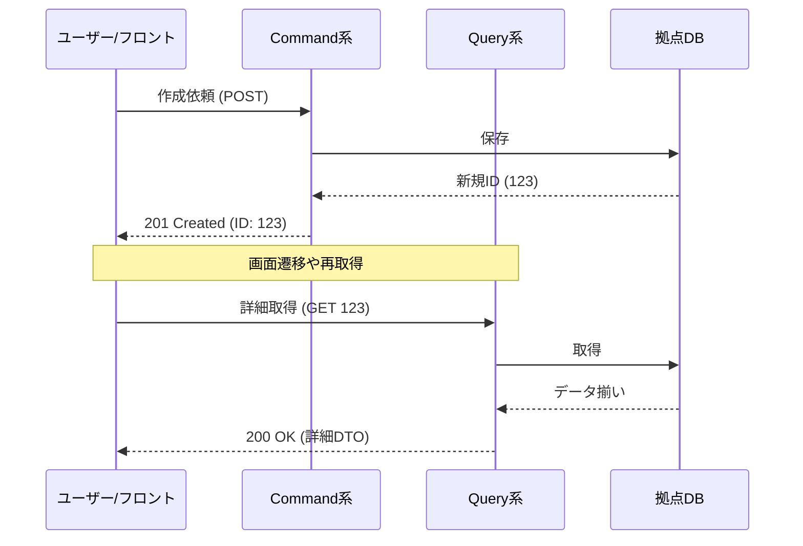

# 第7章　前段のCQS（更新と参照を同じ関数に混ぜない）✂️

〜CQRSの“前段”として、まずはメソッドの中をキレイに分けよう〜😊📚

この章はひとことで言うと、

* **Query（問い合わせ）＝読むだけ👀（副作用なし）**
* **Command（命令）＝状態を変える✍️（基本、値を返さない）**

…を**1つのメソッドで混ぜない**って話だよ〜！🫶✨
（これができると、後のCQRSがめちゃ楽になるよ！）

---

## 1) まず“超大事な定義”を1枚で🧠✨


Martin Fowlerの説明がいちばんスッキリしてるので、それを軸にいくね😊

* **Query**：結果を返すけど、システムの観測できる状態を変えない（副作用なし）
* **Command**：状態を変えるけど、値を返さない（か、最小限） ([martinfowler.com][1])

そしてCQRSは、この考え（CQS）をさらに広げて、**読みモデル／書きモデルを分ける**パターンだよ〜って位置づけだよ📦✨ ([martinfowler.com][2])

---

## 2) “混ぜると何が困るの？”あるある3連発😵‍💫💥

## あるある①：テストがしんどい🧪💦

「読むだけのはず」なのにDB更新したりすると、テストで

* 期待値がズレる
* 実行順で結果が変わる
* 何が原因か分からない
  になりがち😭

## あるある②：バグが隠れる🕵️‍♀️💥

「一覧表示しただけで、閲覧数が増える」みたいな副作用が混ざると、
**“表示しただけなのにデータが変わってる”** が起きる😇

## あるある③：性能チューニングがムズい⚡🐢

Queryが“読むだけ”なら、

* AsNoTracking
* キャッシュ
* Read専用最適化
  みたいな作戦が立てやすいのに、更新が混ざると怖くてできない😵‍💫

---

## 3) いちばん多い落とし穴：「更新しつつ、色々返したい問題」😅🍱

例：
「注文を作成して、そのまま画面に必要な情報（明細・合計・表示用の形）も返したい！」

気持ちは分かる！！！🥹✨
でも、**CommandがQueryの役割まで背負う**と、だんだん地獄化するよ〜😇

---

## 4) まずは“ダメな例”を見てみよ😇（混ぜ混ぜメソッド）

```csharp
public async Task<OrderDetailDto> CreateOrderAndReturnDetailAsync(CreateOrderRequest req)
{
    // ① 更新（Command）
    var order = new Order { CustomerId = req.CustomerId };
    _db.Orders.Add(order);

    foreach (var item in req.Items)
    {
        order.Lines.Add(new OrderLine { ProductId = item.ProductId, Qty = item.Qty });
    }

    await _db.SaveChangesAsync();

    // ② 参照（Query）← ここで表示用DTOまで組み立てちゃう
    var detail = await _db.Orders
        .Where(o => o.Id == order.Id)
        .Select(o => new OrderDetailDto(
            o.Id,
            o.CustomerId,
            o.Lines.Select(l => new OrderLineDto(l.ProductId, l.Qty)).ToList()
        ))
        .SingleAsync();

    // ③ さらに副作用…（ログ以外の更新が入ると特に危険）
    order.LastViewedAt = DateTimeOffset.UtcNow;
    await _db.SaveChangesAsync();

    return detail;
}
```

これ、ぱっと見便利なんだけど…

* 更新と参照が混ざってる
* “ついで副作用”が入りやすい
* テストがめんどい
* 後でCQRS化しづらい
  になりがち🥺💦

---

## 5) 正しい分け方①：Commandは“IDだけ返す”のが最強に安定💎✨

## ✅ Command：作る（状態を変える）

```csharp
public async Task<int> CreateOrderAsync(CreateOrderCommand cmd)
{
    var order = new Order { CustomerId = cmd.CustomerId };

    foreach (var item in cmd.Items)
        order.Lines.Add(new OrderLine { ProductId = item.ProductId, Qty = item.Qty });

    _db.Orders.Add(order);
    await _db.SaveChangesAsync();

    return order.Id; // 返すのはIDくらいにするのが安定😊
}
```

## ✅ Query：読む（副作用なし）

```csharp
public async Task<OrderDetailDto> GetOrderDetailAsync(int orderId)
{
    return await _db.Orders
        .Where(o => o.Id == orderId)
        .Select(o => new OrderDetailDto(
            o.Id,
            o.CustomerId,
            o.Lines.Select(l => new OrderLineDto(l.ProductId, l.Qty)).ToList()
        ))
        .SingleAsync();
}
```

この分離のいいところは、

* 「作る」は作るだけ✍️
* 「読む」は読むだけ👀
  で、**どっちも責務が明確**になることだよ〜！😍✨

---

## 6) 正しい分け方②：「でも“作成直後の画面表示”どうするの？」🎀

王道はこの2ステップだよ😊✨

1. **Create（Command）でIDをもらう**
2. **Detail（Query）で表示用DTOを取る**

たとえばAPIだとこんな流れ👇

```csharp
app.MapPost("/orders", async (CreateOrderRequest req, OrderService service) =>
{
    var id = await service.CreateOrderAsync(new CreateOrderCommand(req.CustomerId, req.Items));
    return Results.Created($"/orders/{id}", new { id });
});

app.MapGet("/orders/{id:int}", async (int id, OrderService service) =>
{
    var dto = await service.GetOrderDetailAsync(id);
    return Results.Ok(dto);
});
```

「1回余計に通信あるのイヤ〜😭」ってなりがちだけど、

* 後からキャッシュしやすい🧊
* 表示要件が増えてもCommandが太らない🍔💦
* CQRSに移行しやすい🚀
  で、長期的に勝ちやすいよ😊✨



---

## 7) “副作用ってどこまでダメ？”の目安🔍🧠

CQSで言う「副作用なし」は、**観測できる状態を変えない**が軸だよ ([martinfowler.com][1])

初心者向けの現場目安としては👇が安全😊

* ✅ QueryでOK：ログ出力🧾、メトリクス⏱️（※業務データを変えない）
* ❌ QueryでNG：在庫を減らす📉、最終ログイン更新、閲覧数カウント、検索履歴保存（業務データを変える系）

「見ただけでDBの業務データが変わる」は、基本アウト〜！🙅‍♀️💥

---

## 8) ミニ演習①：メソッドをCommand/Queryに分類しよ🔍✅

次のメソッド名を見て、どっちか当ててみてね😊✨
（※“何が起きるか”を想像するのがコツ！）

* GetUserProfileAsync
* CreateUserAsync
* SearchOrdersAsync
* UpdateEmailAsync
* LoginAndReturnUserAsync（←これ怪しい😈）

👑 解き方のルール：

* **戻り値が欲しい＝Queryっぽい**
* **状態変更が起きる＝Commandっぽい**
* **両方ある＝分割チャンス！**✂️✨

---

## 9) ミニ演習②：混ぜ混ぜを“2つに割る”練習✂️🧩

課題：
「LoginAndReturnUserAsync」みたいな混ぜ混ぜを、次の2つに分けてみよう😊

* Command：LoginAsync（ログイン処理。状態変更があるならここ）
* Query：GetCurrentUserAsync（画面表示用にユーザー情報を取る）

“割る”だけで、コードが一気に読みやすくなるよ😍✨

---

## 10) つまずきポイント救急箱🧰💗

## Q1. Commandって“絶対にvoid”じゃなきゃダメ？🥺

理想は「返さない」だけど、現実では

* ID
* 成否（Result型）
* エラーコード
  くらいは返すことが多いよ😊✨
  要は **「表示用データを盛り盛り返し始めない」** が大事！

## Q2. 「更新成功したら、最新状態を返したい」

そこで我慢して、**Queryを呼ぶ**のがコツ👀✨
（あとで最適化の武器が増えるよ〜！）

---

## 11) AI（Copilot / Codex等）活用プロンプト例🤖✨

そのまま貼って使えるやつ置いとくね🫶💕

* 「このメソッドがCommandとQueryを混ぜていないかレビューして。混ざってたら分割案を提案して」🤖🔍
* 「この処理をCQSに従って、CommandとQueryに分けたコードにリファクタして」✂️🤖
* 「Query側に副作用が入ってないか（DB更新・状態変更）観点でチェックして」🚨🤖

---

## 12) まとめ🌸✨（この章で“できるようになること”）

* CQSは **「読む👀」と「変える✍️」** を同じ関数に混ぜないルール ✂️ ([martinfowler.com][1])
* まずメソッドレベルで分けると、後のCQRS（モデル分離）にスッと入れる 📦✨ ([martinfowler.com][2])
* いちばん強い実装は **CommandはIDだけ返す → Queryで表示用DTOを取る** の2段構え💎😊

---

次の第8章「DTOを分ける📦」に進むと、ここで分けたCommand/Queryが **“型”でもっと綺麗に分かれて**、迷子になりにくくなるよ〜！😺✨

[1]: https://martinfowler.com/bliki/CommandQuerySeparation.html?utm_source=chatgpt.com "Command Query Separation"
[2]: https://martinfowler.com/bliki/CQRS.html?utm_source=chatgpt.com "CQRS"
