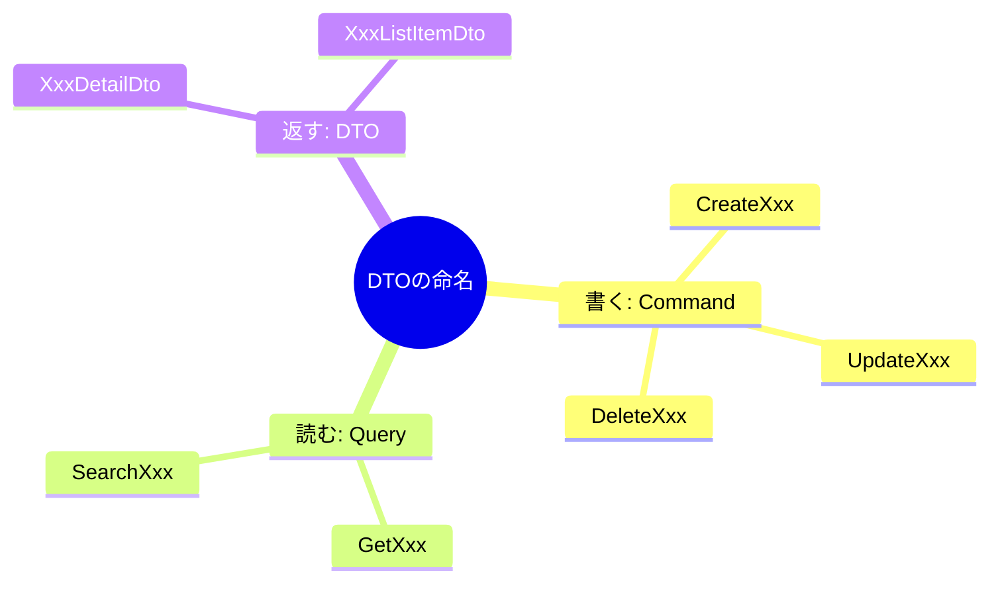

# 第8章　ライトCQRSの最小形① DTOを分ける📦✨

この章は「**CQRSをいきなりガチ構成にしないで**、まずは最小の一歩を踏む」回だよ〜！🫶
結論からいうと、**“読む用”と“書く用”でDTO（データの箱）を分ける**だけでも、設計が一気にスッキリするの🥳

---

## 8-1. そもそもDTOってなに？📦🙂

DTOはざっくり言うと、

* **APIが受け取る形（入力）**
* **APIが返す形（出力）**

この“受け渡し専用のデータの箱”のことだよ〜📮✨
そして大事なのは、

* **DBのEntity（EFのモデル）**とは別物にしやすい
* **画面に都合のいい形**にしてOK
* **仕様変更の衝撃**を小さくできる

ってところ！😺

> DTOは「運ぶ箱」📦
> Entityは「保存する形」🧱
> Domainは「ルールの中心」🏛️
> …みたいに分けて考えると迷いにくいよ〜！

---

## 8-2. 「読むDTO」と「書くDTO」を分けると何が嬉しいの？🎁✨

### ✅メリット1：事故が減る（勝手に更新されない）🧯

たとえば「ToDoを作る(Create)」の入力に `IsDone` が入ってたら…
ユーザーが勝手に「完了済み」で作れちゃうかも😱

👉 **作成入力に“作成に必要なものだけ”を置く**と、自然に安全になるよ！

### ✅メリット2：APIが読みやすくなる（意図が見える）👀✨

`CreateTodoCommand` って名前なら
「これは作成の意図だな✍️」って一瞬でわかる！

### ✅メリット3：将来のCQRS分離がラクになる🚀

この章ではまだ「Handler分離」しないけど、
DTOが分かれてるだけで次章（Handler分離）が超ラクになるよ〜！🥹✨

---

## 8-3. 最小の“型”を決めよう（命名テンプレ）🏷️✨


まずはこれだけでOK！💕

* **書く（Command）**：`CreateXxxCommand` / `UpdateXxxCommand` / `DeleteXxxCommand`
* **読む（Query）**：`GetXxxQuery` / `SearchXxxQuery`
* **返す（Read DTO）**：`XxxDto` / `XxxDetailDto` / `XxxListItemDto`

「Commandは動詞っぽく」「Queryは取得っぽく」
これだけでも迷子になりにくいよ🧭😺



---

## 8-4. ハンズオン：ToDoで“DTO分離”だけやってみよ🧩✨

ここでは **“DTOを分けるだけ”** をやるよ！
（Handler分離は次章でやるから、今はController直呼びでもOK😌）

### ① DTO（Command / Query / Read DTO）を作る📦

```csharp
namespace TodoApp.Features.Todos;

// 書く：作成（Command）
public sealed record CreateTodoCommand(
    string Title,
    DateOnly? DueDate
);

// 書く：更新（Command）
public sealed record UpdateTodoCommand(
    Guid Id,
    string Title,
    DateOnly? DueDate
);

// 書く：完了（Command）
public sealed record CompleteTodoCommand(
    Guid Id
);

// 読む：1件取得（Query）
public sealed record GetTodoQuery(
    Guid Id
);

// 読む：一覧取得（Query） ※最小形
public sealed record GetTodoListQuery(
    bool? IsDone
);

// 返す：詳細表示用（Read DTO）
public sealed record TodoDetailDto(
    Guid Id,
    string Title,
    bool IsDone,
    DateOnly? DueDate
);

// 返す：一覧表示用（Read DTO）
public sealed record TodoListItemDto(
    Guid Id,
    string Title,
    bool IsDone
);

// 書いた結果：作成時の最小レスポンス（IDだけ返すのがライトCQRSの基本）
public sealed record CreateTodoResult(
    Guid Id
);
```

ポイントだよ〜👇😺✨

* **CreateTodoCommandに `Id` や `IsDone` を入れない**（作成時に不要なものは持たせない）🧯
* 一覧用は `TodoListItemDto` みたいに **軽い形**にする⚡
* 詳細用は `TodoDetailDto` みたいに **必要な情報を揃える**📄

> recordはDTOと相性が良いよ（値の比較がしやすい＆ボイラープレートが減る）✨
> ただし **EFのEntityにはrecordは向かない**ことが多いので、Entityは普通のclassにしておくのが無難だよ〜🧱 ([Microsoft Learn][1])

---

### ② Controller（またはMinimal API）で「入力と出力が別」なのを体感する👀✨

#### Controller例（超ざっくり）

「DTOが分かれてると、APIの意図が見える」って体感する用だよ🥳

```csharp
using Microsoft.AspNetCore.Mvc;
using TodoApp.Features.Todos;

namespace TodoApp.Controllers;

[ApiController]
[Route("api/todos")]
public sealed class TodosController : ControllerBase
{
    // ここではまだ雑にRepository/DbContext直でもOK（次章で綺麗にする✨）

    [HttpPost]
    public ActionResult<CreateTodoResult> Create([FromBody] CreateTodoCommand command)
    {
        // 例：保存してID発行した想定
        var id = Guid.NewGuid();
        return CreatedAtAction(nameof(Get), new { id }, new CreateTodoResult(id));
    }

    [HttpGet("{id:guid}")]
    public ActionResult<TodoDetailDto> Get(Guid id)
    {
        // 例：取得した想定（本当はDBから取る）
        return Ok(new TodoDetailDto(id, "買い物", false, null));
    }

    [HttpGet]
    public ActionResult<IReadOnlyList<TodoListItemDto>> List([FromQuery] bool? isDone)
    {
        var items = new List<TodoListItemDto>
        {
            new(Guid.NewGuid(), "洗濯", false),
            new(Guid.NewGuid(), "課題", true),
        };

        if (isDone is not null)
            items = items.Where(x => x.IsDone == isDone).ToList();

        return Ok(items);
    }
}
```

ここでの“狙い”はこれ👇💡

* **POSTはCreateTodoCommandを受け取る（書く）**✍️
* **GETはTodoDetailDto/TodoListItemDtoを返す（読む）**👀
* つまり **APIの入口と出口がちゃんと違う**って体感できる！

---

## 8-5. recordの2つの書き方：どっちがいい？🤔✨

DTOにはだいたいこの2パターンがあるよ👇

### A) 位置引数record（さっきの例）🧩

* 短く書けてラク✨
* ただしコメントや属性を細かく付けたい時に長くなりがち😅

### B) requiredプロパティ型record（属性つけやすい）🏷️

* 「必須」を表現しやすい
* バリデーション（次の章以降）にも繋げやすい✨

```csharp
namespace TodoApp.Features.Todos;

public sealed record CreateTodoCommand
{
    public required string Title { get; init; }
    public DateOnly? DueDate { get; init; }
}
```

`required` は「初期化で必ずセットしてね」をコンパイル時に促せる機能だよ〜📌 ([Microsoft Learn][2])

---

## 8-6. よくあるミス集（これ避けるだけで強くなる）🧠🛡️

### ❌ミス1：1個のDTOを全APIで使い回す

* CreateにもUpdateにもGetにも同じDTO…
* だんだん「何のためのプロパティ？」って混乱する😵‍💫

✅ **用途ごとにDTO分ける**（この章の結論！）📦✨

---

### ❌ミス2：Writeモデル（Entity）をそのまま返す

* DB都合の項目まで外に出ちゃう
* 将来の変更でAPIが壊れやすい💥

✅ **返すのはRead DTO**にする📄✨

---

### ❌ミス3：CreateにUpdate用の項目が混ざる

例：Createに `Id` / `IsDone` / `CreatedAt` が入ってる…😱

✅ **Createに必要な最小だけ**（Titleとか）✍️✨

---

## 8-7. ミニ演習（15〜30分）⏱️💪

### 🎯お題：ToDoのDTOを「用途ごと」に分けよう📦

次の3つだけ作ればOK！

1. `CreateTodoCommand`（入力）✍️
2. `GetTodoQuery`（入力）👀
3. `TodoDetailDto`（出力）📄

できたら、Swagger（またはAPIテスター）で
**POSTとGETのスキーマが別**になってるのを見てニヤニヤしよ😺✨

---

## 8-8. AI（Copilot / Codex）に頼るときのプロンプト例🤖🪄

### DTO雛形を作らせる（まずは量産）

* 「ToDoアプリの `CreateTodoCommand / UpdateTodoCommand / GetTodoQuery / TodoDetailDto / TodoListItemDto` をC#のrecordで作って。CreateにはIdやIsDoneを含めないで。」

### 命名を整える（読みやすさUP）

* 「CQRSの命名として違和感があるDTO名を指摘して、より良い名前に直して。」

### “混ぜてないか”チェック（事故防止）

* 「このCreateDTOに更新用・表示用の項目が混ざってないかレビューして。」

---

## 8-9. まとめ（この章で一番大事なこと）🎀

* **“書くDTO（Command）”と“読むDTO（Query/Read DTO）”は分ける📦**
* まずは分けるだけで、APIが読みやすくなるし事故も減る🧯
* 次章で、このDTOたちを **Handlerに分離**して「ライトCQRSの形」を完成させるよ〜！🧑‍🍳✨

ちなみに、C# 14 は .NET 10 / Visual Studio 2026あたりで使える機能が増えてるので、今の書き方（record中心）でも気持ちよく書けるよ〜😺✨ ([Microsoft Learn][3])
あと、.NET 10のASP.NET CoreはMinimal APIのバリデーション周りも改善が入ってるから、DTO分離は後々さらに効いてくるよ〜🔍✨ ([Microsoft Learn][4])

[1]: https://learn.microsoft.com/en-us/dotnet/csharp/language-reference/builtin-types/record?utm_source=chatgpt.com "Records - C# reference"
[2]: https://learn.microsoft.com/en-us/dotnet/csharp/language-reference/proposals/csharp-11.0/required-members?utm_source=chatgpt.com "Required members - C# feature specifications"
[3]: https://learn.microsoft.com/ja-jp/dotnet/csharp/whats-new/csharp-14?utm_source=chatgpt.com "C# 14 の新機能"
[4]: https://learn.microsoft.com/en-us/aspnet/core/release-notes/aspnetcore-10.0?view=aspnetcore-10.0&utm_source=chatgpt.com "What's new in ASP.NET Core in .NET 10"
