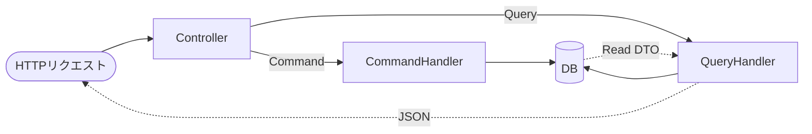

# 第9章　ライトCQRSの最小形② Handlerを分ける🧑‍🍳✨

この章のゴールはこれだよ〜！🎯
**Controller（API）から「処理の本体」を追い出して、Command用 / Query用の Handler に分ける**こと😊
そうすると、読み書き分離（CQRS）の“型”が一気に見えてくるよ〜👀✨

ちなみに今どきは **.NET 10（LTS）+ C# 14** が基準で進めてOKだよ（.NET 10 は LTS で 2028年11月頃までサポート）📌✨ ([Microsoft for Developers][1])
IDEも **Visual Studio 2026** が出てて、AI連携もより深くなってるよ🤖💞 ([Microsoft Learn][2])

---

## 1) まず「Handler」ってなに？🍳


超ざっくり言うと👇

* **Controller**：リクエストを受け取って、必要な Handler を呼ぶだけ📮
* **Handler**：その機能（ユースケース）を“最後までやり切る”担当🔥
* **DB / 外部**：Handler が必要に応じて触る（ただし、触り方は章が進むほど洗練される）🧱

イメージ図（ミニ）🎨

```text
[HTTP] → Controller → (CommandHandler) → DB更新
               └→ (QueryHandler)   → DB参照 → DTO返す
```



CQRS初学者が最速で安定するコツは、まずこれ👇
**「1ユースケース = 1 Handler」** を守ること！🧡
（“注文作成”は1つのHandler、“注文一覧取得”も別Handler、みたいにね）

---

## 2) なぜ分けるの？（分けた瞬間のご褒美🎁）

Handler分離すると、いきなりこうなるよ〜✨

* **Controllerがスッキリ**して読みやすい🫶
* **「この機能の処理はどこ？」が一発で見つかる**🔍
* **テストがめっちゃ書きやすくなる**（後の章で大活躍！）🧪✨
* 「読む処理」と「書く処理」が混ざって地獄…😇 を避けられる

---

## 3) この章で作る“最小形”のルール📏✨

### ✅ ルールA：CommandHandler と QueryHandler は別クラス

* **CommandHandler**：状態を変える（Create/Update/Delete など）✍️
* **QueryHandler**：読むだけ（一覧・詳細・検索など）👀

### ✅ ルールB：Handlerは「入力DTO → 出力DTO（またはID）」で完結

* Commandは欲張らない（戻り値モリモリにしない）🍙
  ※これは次章でもさらに深掘りするよ！

### ✅ ルールC：HandlerにHttpの匂いを入れない🙅‍♀️

* `HttpContext` とか `Request` とか触らない
* “アプリの処理”に集中する🧠✨

---

## 4) 実装してみよ！ミニToDoでいくよ〜📝💗

ここでは「ToDoを作る（Command）」と「ToDo一覧を取る（Query）」を **Handler化**するよ✨

### 4-1) DTO（第8章で作った想定📦）

```csharp
public sealed record CreateTodoCommand(string Title);

public sealed record TodoListItemDto(
    int Id,
    string Title,
    bool IsDone
);
```

---

## 4-2) “Write側”の CommandHandler を作る✍️🔥

まずは最小で、**Commandを受け取って、作って、ID返す**だけ😊

```csharp
public sealed class CreateTodoCommandHandler
{
    private readonly AppDbContext _db;

    public CreateTodoCommandHandler(AppDbContext db)
        => _db = db;

    public async Task<int> HandleAsync(CreateTodoCommand command, CancellationToken ct)
    {
        // ここは章が進むほど「Validation」「業務ルール」などが増えていくよ✨
        var todo = new Todo
        {
            Title = command.Title,
            IsDone = false
        };

        _db.Todos.Add(todo);
        await _db.SaveChangesAsync(ct);

        return todo.Id;
    }
}
```

💡ポイントだよ🧠✨

* **CreateTodo “だけ”** に集中してるのがえらい👏
* “一覧取得”のことを考え始めたら、それは別Handlerの領域👀

---

## 4-3) “Read側”の QueryHandler を作る👀⚡

一覧を返すHandlerを作ろう〜！✨
（ここではまだ最小。高速化は後半章で育てるよ🐣）

```csharp
public sealed class GetTodoListQueryHandler
{
    private readonly AppDbContext _db;

    public GetTodoListQueryHandler(AppDbContext db)
        => _db = db;

    public async Task<IReadOnlyList<TodoListItemDto>> HandleAsync(CancellationToken ct)
    {
        return await _db.Todos
            .OrderByDescending(x => x.Id)
            .Select(x => new TodoListItemDto(
                x.Id,
                x.Title,
                x.IsDone
            ))
            .ToListAsync(ct);
    }
}
```

💡ここでも大事なのは👇

* 「表示に都合のいいDTOに投影して返す」👀✨
* Writeモデル（Todo）をそのまま返して雑に済ませない😅（気持ちはわかる…！）

---

## 4-4) Controllerから呼ぶ（Controllerは“薄く”が正義📮✨）

Controllerは **受け取って投げる**だけにするよ😊

```csharp
[ApiController]
[Route("api/todos")]
public sealed class TodosController : ControllerBase
{
    private readonly CreateTodoCommandHandler _create;
    private readonly GetTodoListQueryHandler _getList;

    public TodosController(
        CreateTodoCommandHandler create,
        GetTodoListQueryHandler getList)
    {
        _create = create;
        _getList = getList;
    }

    [HttpPost]
    public async Task<ActionResult<int>> Create(
        [FromBody] CreateTodoCommand command,
        CancellationToken ct)
    {
        var id = await _create.HandleAsync(command, ct);
        return Ok(id);
    }

    [HttpGet]
    public async Task<ActionResult<IReadOnlyList<TodoListItemDto>>> GetList(CancellationToken ct)
    {
        var list = await _getList.HandleAsync(ct);
        return Ok(list);
    }
}
```

✨この瞬間に「読む」と「書く」が **別の入口**として目に見えるようになるよ〜！🎉

---

## 4-5) DI登録（これだけでOK👌）

```csharp
builder.Services.AddScoped<CreateTodoCommandHandler>();
builder.Services.AddScoped<GetTodoListQueryHandler>();
```

---

## 5) つまずきポイントあるある😵‍💫→回避法💊✨

### つまずき①：Handlerがデカくなる🍔

**症状**：1つのHandlerに「検索」「集計」「通知」「ログ整形」「例外握りつぶし」…全部入りがち😇
**回避**：まずはこの合言葉👇

* ✅ **「1ユースケース=1Handler」**
* ✅ Handlerの中でも「やることが2つに割れた」と感じたら分割検討✂️

---

### つまずき②：CommandでQueryし始める👀✍️💥

**症状**：「作ったから一覧も返すね！」ってやりたくなる
**回避**：Commandは基本こう👇

* ✅ 成功/失敗 + IDくらいで止める（欲張らない）🍙
  表示に必要なら、クライアントが **Queryを別で呼ぶ**（または後で仕組み化）📮

---

### つまずき③：Controllerにifが増殖する👑💦

**症状**：気づくとControllerが“神クラス”に…
**回避**：Controllerは **薄く**！

* ✅ 受け取る
* ✅ Handler呼ぶ
* ✅ 結果返す
  これだけ🥰

---

## 6) ミニ演習（手を動かすと一気に理解できる🧠💗）

### お題🎯

次の2つを追加して、**Handlerを2個** 作ってみてね✨

1. **完了にする**（Command）✅

* `MarkTodoDoneCommand(int Id)`
* `MarkTodoDoneCommandHandler`

2. **完了だけ一覧**（Query）📄

* `GetDoneTodoListQueryHandler`（引数なしでもOK）

💡チェック：

* ちゃんと「完了にするHandler」と「完了一覧Handler」が別になってる？😺
* Controllerは薄いまま？📮✨

---

## 7) AI活用（Copilot / Codex向け）🤖💞

### 使えるプロンプト例✨

* 「このDTOからHandlerの雛形を作って。責務は“ユースケース1つだけ”にして」🧁
* 「このHandler、肥大化してない？分割案を3つ出して」🍰
* 「Controllerが太ってるから、Handlerに押し出すリファクタ案を提案して」🧹✨
* 「CommandとQueryが混ざってないかレビューして。混ざってたら理由も説明して」🔍

AIに生成させたら、最後にここだけ自分で確認すると超安全だよ👇

* ✅ “読む”処理が Command に入ってない？
* ✅ 1Handler = 1ユースケースになってる？
* ✅ 返り値を欲張ってない？🍙

---

## 8) 次章につながる一言📣✨

Handlerを分けられたら、もうCQRSの“骨格”はできたも同然だよ〜！🎉
次は **Commandの戻り値を欲張らない**（でも実用で困らない）っていう、地味だけど超大事な作法に入っていくよ✍️✨

必要なら、この章のコードを「ミニEC（Orders）」版でも同じ型で書き直した例も作るよ〜🛒💗

[1]: https://devblogs.microsoft.com/dotnet/announcing-dotnet-10/ "Announcing .NET 10 - .NET Blog"
[2]: https://learn.microsoft.com/en-us/visualstudio/releases/2026/release-notes "Visual Studio 2026 Release Notes | Microsoft Learn"
