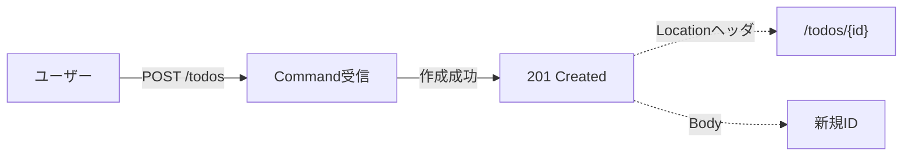
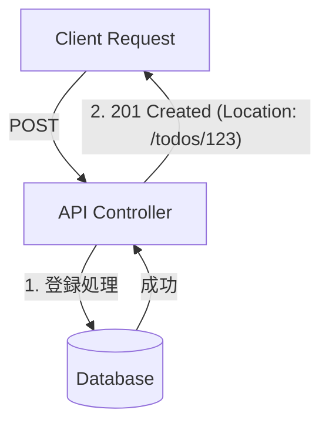

# 第11章　Commandの基本① “戻り値を欲張らない”✍️✨

この章はひとことで言うと、**「Commandは“書いた”ことだけ返して、表示はQueryに任せよ〜！」**って話だよ〜😺🫶
（CQRSの“読み/書き分離”を気持ちよく保つための、超重要ポイント！）

---

## この章のゴール🎯

* Command（更新系）で **返すべき情報が最小でいい理由**がわかる🙆‍♀️
* **Create/Update/Delete の“ちょうどいい返し方”**がわかる📮
* C#（Minimal API想定）で **Createは201 + Location + ID**にできる✅
  ※201とLocationの意味はHTTP仕様にちゃんと書いてあるよ📌 ([greenbytes.de][1])

---

## 1) なんで「全部返す」はダメになりがち？😵‍💫

Commandで「作ったデータ全部返すね！」をやると、地味に事故が増えるの…💥

### よくある事故3点セット🧨

1. **責務が混ざる**
   更新（Command）なのに表示用の形（Query）を作り始めて、いつの間にか“混ぜ実装”に逆戻り😇

2. **戻り値が肥大化して、変更が怖くなる**
   画面都合の項目（集計、JOIN、派生列…）を混ぜた瞬間に、Command側が「UIの都合」に引っ張られる🌀

3. **セキュリティ事故が起きやすい**
   “返してはいけない項目”をうっかり混ぜがち（内部フラグ、管理用情報など）🙈

---

## 2) Commandの戻り値は「成功/失敗 + IDくらい」でOK👌✨

Commandは“状態を変える”のが仕事。
だから戻り値も、基本はこれで十分だよ👇

### Commandが返していい代表例✅

* **Create**：新しいID（Guidなど）
* **Update/Delete**：基本は「成功した」だけ（HTTP的には 204 No Content が相性◎）
* どうしても必要なら：**Version（ETag相当）/更新番号**くらい（後で同時更新対策に使える）📌

### 逆に、Commandが返しがちな「欲張りセット」😅

* 作成直後の“詳細画面用DTO”全部
* 一覧画面用の集計つきDTO
* 関連データ全部入り（子要素やJOIN結果まで）

👉 これらは **Queryで取ろう**👀✨

---

## 3) HTTPとしての「ちょうどいい返し方」📡✨


### ✅ Create（POST）



* **201 Created**
* **Locationヘッダ**に「作ったもののURL」を入れる
  201は「Locationで作ったリソースを示す」って仕様に書いてあるよ📌 ([greenbytes.de][1])
* Bodyは **IDだけ**でも全然OK🙆‍♀️（欲張らない！）

### ✅ Update（PUT/PATCH）

* **204 No Content** が定番（更新できたなら中身いらない）✨

### ✅ Delete（DELETE）

* **204 No Content** が定番✨

---

## 4) 実装してみよう（Minimal API版）🧩🚀

ここでは ToDo を例にするね📝
ポイントは **「HandlerはIDを返す」「APIはCreatedAtRouteでLocationを付ける」** だよ！

> Minimal APIの `CreatedAtRoute` は、Location付きの201を作るための定番メソッドだよ📌 ([Microsoft Learn][2])

### 4-1) DTO / Command / Response（最小）📦

```csharp
public sealed record CreateTodoRequest(string Title);

// Command（更新の依頼）
public sealed record CreateTodoCommand(string Title);

// Commandの結果（IDだけ！）
public sealed record CreateTodoResult(Guid Id);
```

---

### 4-2) Handler（IDを返すだけ）🧑‍🍳✨

（DBはまだ何でもOK。ここでは雰囲気だけ！）

```csharp
public interface ICommandHandler<TCommand, TResult>
{
    Task<TResult> Handle(TCommand command, CancellationToken ct);
}

public sealed class CreateTodoHandler : ICommandHandler<CreateTodoCommand, CreateTodoResult>
{
    // ここにDbContextやRepositoryが入る想定（詳細は後の章でOK）
    public async Task<CreateTodoResult> Handle(CreateTodoCommand command, CancellationToken ct)
    {
        // 例：IDを発行して保存したことにする
        var id = Guid.NewGuid();

        // TODO: 保存処理（後の章でEF Coreなど）
        await Task.CompletedTask;

        return new CreateTodoResult(id);
    }
}
```

---

### 4-3) API（Location付き201 + BodyはIDだけ）📮🎉

```csharp
app.MapGet("/todos/{id:guid}", (Guid id) =>
{
    // ここはQuery側：詳細表示用DTOを返す場所（この章では省略）
    return Results.Ok(new { id, title = "dummy", isDone = false });
})
.WithName("GetTodoById");

## 1) コマンド（更新系）の基本：状態を変えて 201 Created を返す 🏗️


前回は「読み取り (Query)」だったけど、今回は「書き込み (Command)」だよ！
app.MapPost("/todos", async (
    CreateTodoRequest req,
    ICommandHandler<CreateTodoCommand, CreateTodoResult> handler,
    CancellationToken ct) =>
{
    // Command実行（書く！）
    var result = await handler.Handle(new CreateTodoCommand(req.Title), ct);

    // 201 + Location + Bodyは最小（IDだけ）
    return Results.CreatedAtRoute(
        routeName: "GetTodoById",
        routeValues: new { id = result.Id },
        value: new { id = result.Id }
    );
});
```

**これで：**

* レスポンスは **201 Created**
* ヘッダに **Location: /todos/{id}**
* Bodyは `{ id: ... }` だけ✨
  → “欲張らない”完成！😺🎊

---

## 5) 「でも画面が作成直後に詳細を表示したい…」問題😅

あるある！めちゃある！😂

### 解決策は基本この2つ💡

1. **作成後にQueryを1回叩く（おすすめ）**

   * `POST /todos` → IDだけもらう
   * `GET /todos/{id}` → 表示用のDTOを取る
     CQRS的に超きれい✨

2. **どうしても1回で済ませたいなら**
   「画面に必要な最小限のRead DTO」だけ返す（※“全部”はやめる）
   でも、これは例外扱いにして、基本は(1)が安定だよ🫶

---

## 6) エラーの返し方も“欲張らない”🧯

* 失敗時は **ProblemDetails** 形式で返すと、APIがスッキリしやすいよ✨
  ASP.NET Coreのエラー取り扱いはProblemDetails中心で整理されてる📌 ([Microsoft Learn][3])
* しかも .NET 10 では Minimal APIのバリデーション周りも強化されてる（Validation対応の記述があるよ）📌 ([Microsoft Learn][4])

この章では深追いしないでOK！
次の第12章で「Validationの分離（入口で守る）」をしっかりやろうね🔍✨

---

## ミニ演習💪😺

### 演習A：欲張りCommandをダイエット🥗

1. `POST` の戻り値が「詳細DTO全部」になってる想定でOK
2. 戻り値を **IDだけ**に直す
3. 詳細表示は `GET /todos/{id}` で取得する形に変える

### 演習B：SwaggerでLocationを見る👀

* `POST /todos` を叩いて
* レスポンスの **Locationヘッダ** を確認✅
* そのURLを叩いて `GET` が取れるのを確認✅

---

## AIに手伝ってもらうプロンプト例🤖💬

### 設計レビュー（戻り値欲張ってない？）

* 「このPOSTのレスポンス、CQRS的に欲張りすぎかレビューして。最小案も出して」

### 201 + Location をきれいに作る

* 「Minimal APIでCreatedAtRouteを使って、201とLocationヘッダを正しく返す例を作って」

### ついでに命名整える

* 「CreateXxxCommand / CreateXxxResult の命名をC#の慣習で自然に整えて」

---

## まとめ🎀

* Commandは **“書く”に集中**：戻り値は **成功/失敗 + ID（+必要ならVersion）** くらいでOK✍️✨
* 表示用の情報は **Queryが担当**👀
* Createは **201 + Location + ID** で“きれいに分離”できる📮🎉 ([greenbytes.de][1])

次の第12章で、Command入口のValidationを分離してさらに気持ちよくするよ〜🔍💕

[1]: https://www.greenbytes.de/tech/webdav/rfc7231.html "RFC 7231 - Hypertext Transfer Protocol (HTTP/1.1): Semantics and Content"
[2]: https://learn.microsoft.com/en-us/dotnet/api/microsoft.aspnetcore.http.results.createdatroute?view=aspnetcore-10.0&utm_source=chatgpt.com "Results.CreatedAtRoute Method (Microsoft.AspNetCore.Http)"
[3]: https://learn.microsoft.com/en-us/aspnet/core/fundamentals/error-handling-api?view=aspnetcore-10.0&utm_source=chatgpt.com "Handle errors in ASP.NET Core APIs"
[4]: https://learn.microsoft.com/en-us/aspnet/core/fundamentals/minimal-apis/responses?view=aspnetcore-10.0&utm_source=chatgpt.com "Create responses in Minimal API applications"
