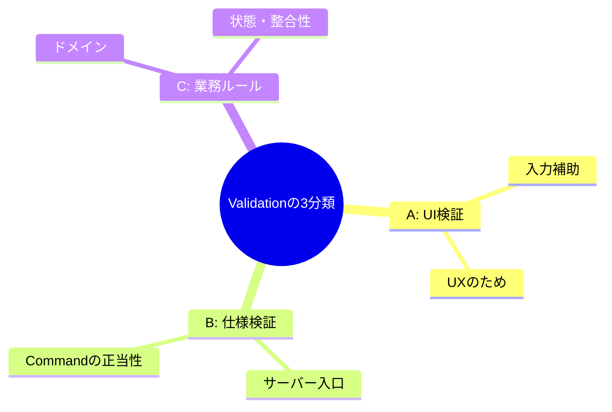

# 第12章　Commandの基本② Validationの分離（入口で守る）🔍🛡️✨

この章は「**Commandを安心して実行できるように、検証（Validation）を“ちゃんと分けて”、入口で止める**」の練習だよ〜！😊✨
（いったん“入口で落とす”ができると、CQRSが一気にキレイになるよ🎉）

---

## 12.0 今日のゴール 🎯💖

* ✅ 「検証」を **UI検証 / 仕様検証 / 業務ルール** の3つに分けて説明できる
* ✅ CommandHandlerの中が **if地獄** にならないように、検証を **別クラス** に逃がせる
* ✅ 失敗したときに **400（Bad Request）** で分かりやすく返せる（API利用者も嬉しい）
  ※Minimal APIは .NET 10 で **組み込みのValidation** が用意されてるのも追い風だよ⚡ ([Microsoft Learn][1])

---

## 12.1 まず結論：Validationは「入口」で止めるのが一番ラク😇🚪

### なぜ分けるの？🤔

CommandHandlerに検証を混ぜると…

* 😵 変更のたびに if が増える（読むのがつらい）
* 🧪 テストがしにくい（DB呼んだり、例外が増えたり）
* 🔁 同じ検証をあちこちで繰り返す（バグの温床）

だから、基本方針はこれ👇

> **「入力の正しさ」は入口で止める**
> **「業務的にやっていいか」は業務ルールで止める**
> **（そして2つは混ぜない）** 🧠✨

---

## 12.2 Validationの3分類：ここが一番大事🌟🗂️



同じ「検証」でも、性質がぜんぜん違うよ〜！

### A. UI検証（フロントの都合）📱💡

* 例：必須チェック、入力補助、フォーマット補助
* **目的**：ユーザー体験（入力ミスを早めに気づかせる）
* **注意**：サーバー側では信用しない（改ざんできるから）😅

### B. 仕様検証（サーバー入口で守る）🧾🛡️

* 例：必須、文字数、範囲、形式、列挙の範囲
* **目的**：「そもそもCommandとして成立してる？」を保証する
* **ここが第12章の主役**👑✨

### C. 業務ルール（ドメイン・ユースケース側）🏛️🔥

* 例：「在庫が足りないと注文できない」「期限切れは購入不可」
* **目的**：「今その操作をしていい？」を判断する
* DB状態が絡むことが多い（在庫、重複、状態遷移など）

> MVCのモデル検証でも「入力変換エラー」と「ルール違反」を分けて考える説明があるよ。([Microsoft Learn][2])

---

## 12.3 CQRSでの“置き場所”マップ 🗺️✨


イメージはこんな感じ👇

* 🚪 API入口（Controller / Minimal API）

  * **仕様検証**（DataAnnotations / Validatorクラス）
  * ここで落ちたら **400** で返す

* 🧑‍🍳 CommandHandler（ユースケース）

  * **業務ルール**（在庫チェックなど）
  * 失敗したら 409/422 など（※ここは後章で整える）

* 🏛️ ドメイン（Entity / ValueObject）

  * “不変条件”として守る（絶対に壊れないルール）

---

## 12.4 実装①：.NET 10 の「組み込みValidation」で入口ガード🚪⚡

.NET 10 の Minimal API は、**DataAnnotations を使った組み込みValidation**を `AddValidation()` で有効化できるよ。
失敗したら **400** を自動で返してくれるのが超便利！ ([Microsoft Learn][1])

### 例：CreateOrder の “入口仕様検証” 🍰🧾

```csharp
using System.ComponentModel.DataAnnotations;

public record CreateOrderRequest(
    [Required, StringLength(50, MinimumLength = 1)]
    string CustomerName,

    [Required, EmailAddress]
    string Email,

    [Range(1, 99)]
    int Quantity
);
```

`Program.cs` 側でValidationをON👇

```csharp
var builder = WebApplication.CreateBuilder(args);

builder.Services.AddValidation(); // ✅ Minimal API built-in validation (.NET 10)

var app = builder.Build();

app.MapPost("/orders", (CreateOrderRequest req) =>
{
    // ここに来た時点で req は “仕様的に成立” してる✨
    // あとは Command に変換して Handler へ
    return Results.Ok(new { message = "accepted" });
});

app.Run();
```

💡ポイント

* ✅ 「必須」「範囲」「形式」みたいな **仕様検証**に強い
* ✅ 仕組みとしては **エンドポイントフィルター**が自動で入って動くよ ([Microsoft Learn][1])
* ✅ 例外や if で汚れないから、Controller/Endpointがスッキリ😍

> ちなみに MVC/API Controller でも DataAnnotations のモデル検証は王道で、Web API は無効なとき自動で 400 を返す流れがあるよ。([Microsoft Learn][2])

---

## 12.5 実装②：Validatorクラスに分けて “設計” をきれいにする🧼✨

DataAnnotationsは強いけど、**条件が増えると読みづらくなる**ことがあるよね😵‍💫
そこで「Validatorクラス」を作って分離するのがCQRS的にキレイ💖

### FluentValidationはどうする？🤖📦

FluentValidationは超人気なんだけど、**ASP.NETの自動検証パイプラインに“魔法みたいに統合する”方式は新規では推奨されない**流れが明確だよ。
（非同期ルールに弱い / MVC限定 / デバッグしづらい、など） ([GitHub][3])

なのでこの教材では、**「手動で呼ぶ」or「自分のDispatcher/Filterで呼ぶ」**をおすすめにするね😊✨

---

### 例：Command用Validator（手動で入口で呼ぶ）🚪🧑‍🍳

まず Command を用意（RequestとCommandは分けるのがコツ！）📦

```csharp
public record CreateOrderCommand(
    string CustomerName,
    string Email,
    int Quantity
);
```

Validator（FluentValidation）を用意👇

```csharp
using FluentValidation;

public class CreateOrderCommandValidator : AbstractValidator<CreateOrderCommand>
{
    public CreateOrderCommandValidator()
    {
        RuleFor(x => x.CustomerName)
            .NotEmpty()
            .MaximumLength(50);

        RuleFor(x => x.Email)
            .NotEmpty()
            .EmailAddress();

        RuleFor(x => x.Quantity)
            .InclusiveBetween(1, 99);
    }
}
```

DI登録（Validatorsをまとめて登録できる）✨ ([FluentValidation][4])

```csharp
using FluentValidation;
using FluentValidation.DependencyInjectionExtensions;

builder.Services.AddValidatorsFromAssemblyContaining<CreateOrderCommandValidator>();
```

入口（Endpoint）で検証して、ダメなら400を返す👇

```csharp
using FluentValidation;

app.MapPost("/orders", async (
    CreateOrderRequest req,
    IValidator<CreateOrderCommand> validator) =>
{
    var cmd = new CreateOrderCommand(req.CustomerName, req.Email, req.Quantity);

    var result = await validator.ValidateAsync(cmd);
    if (!result.IsValid)
    {
        // 400: Validation errors
        var errors = result.Errors
            .GroupBy(e => e.PropertyName)
            .ToDictionary(
                g => g.Key,
                g => g.Select(e => e.ErrorMessage).ToArray()
            );

        return Results.ValidationProblem(errors);
    }

    // OKなら Handler へ（この章では省略）
    return Results.Ok(new { message = "accepted" });
});
```

💖この形の良いところ

* ✅ CommandHandlerが「業務ルール」に集中できる
* ✅ 仕様検証は Validator に集約される
* ✅ テストがしやすい（Validator単体でテストできる🧪）

---

## 12.6 エラーメッセージのコツ（地味に重要）🗣️✨

Validationのメッセージは「人に見せる」前提で書くと嬉しいよ😊

* 😺 NG: `Email is invalid`
* ✅ OK: `メールアドレスの形式が正しくありません`

さらにおすすめ👇

* `CustomerName` みたいな内部名は、必要なら表示名に変換
* 仕様検証は「直せば成功する」メッセージにする（怒らない💞）

---

## 12.7 ミニ演習（この章のメイン練習）🧪🎀

### 演習①：チェックを3分類しよう🗂️✅

「注文」を例に、次を分類してみてね👇

1. CustomerName が空 →（　　　）
2. Quantity が 0 →（　　　）
3. 在庫が足りない →（　　　）
4. その注文はキャンセル済みなので更新できない →（　　　）
5. UIで半角数字以外を弾く →（　　　）

👉答え合わせ目安

* 1,2 = **仕様検証**
* 3,4 = **業務ルール**
* 5 = **UI検証**

---

### 演習②：Validatorを1つだけ作る🍰

* `CreateOrderCommandValidator` を作る
* ルールは **3個だけ**でOK（欲張らない😇）

---

### 演習③：Validator単体テスト（最小でOK）🧪✨

* 正常ケース1本
* 異常ケース2本（空、範囲外）

（テストがあると、安心してルール変えられるよ〜！💖）

---

## 12.8 AI活用プロンプト集 🤖💬✨

コピペで使えるやつ置いとくね！

* 🧠 仕様検証の洗い出し
  「CreateOrder の入力項目（CustomerName/Email/Quantity）について、仕様検証ルールを“必須/形式/範囲/長さ”で列挙して。過剰なルールは作らないで」

* 🧪 テストケース案
  「CreateOrderCommandValidator のテストケースを、正常1・異常2で提案して。境界値を意識して」

* 🧹 メッセージ改善
  「このValidationメッセージを、ユーザー向けに優しく短く直して：『{メッセージ一覧}』」

---

## 12.9 今日のチェックリスト（卒業条件🎓✨）

* ✅ 「UI/仕様/業務ルール」を混ぜずに説明できる
* ✅ 仕様検証は **入口（Endpoint/Controller）で止める**
* ✅ CommandHandlerの中に、入力チェックの if が増えてない
* ✅ バリデーション失敗は **400** で返してる（エラー内容付き）
* ✅ （できたら）Validator単体テストがある🧪💕

---

### おまけ：いまの.NETまわり超短メモ📌✨

* .NET 10 は LTS で、2026年1月の時点だと **10.0.2（2026-01-13）** が最新パッチとして案内されてるよ。([Microsoft][5])
* C# 14 の新機能は Microsoft Learn にまとまってるよ（必要なときにチラ見でOK😊）。([Microsoft Learn][6])

---

次の第13章（業務ルールの置き場所🏛️）に行くと、
「仕様検証で落とせないやつ（在庫とか状態遷移）」を、どうキレイに守るかが見えてくるよ〜！😺✨

[1]: https://learn.microsoft.com/en-us/aspnet/core/fundamentals/minimal-apis?view=aspnetcore-10.0 "Minimal APIs quick reference | Microsoft Learn"
[2]: https://learn.microsoft.com/ja-jp/aspnet/core/mvc/models/validation?view=aspnetcore-10.0 "ASP.NET Core MVC でのモデルの検証 | Microsoft Learn"
[3]: https://github.com/FluentValidation/FluentValidation.AspNetCore "GitHub - FluentValidation/FluentValidation.AspNetCore: ASP.NET Core Integration for FluentValidation"
[4]: https://docs.fluentvalidation.net/en/latest/di.html?utm_source=chatgpt.com "Dependency Injection — FluentValidation documentation"
[5]: https://dotnet.microsoft.com/ja-jp/platform/support/policy/dotnet-core ".NET および .NET Core の公式サポート ポリシー | .NET"
[6]: https://learn.microsoft.com/en-us/dotnet/csharp/whats-new/csharp-14?utm_source=chatgpt.com "What's new in C# 14"
