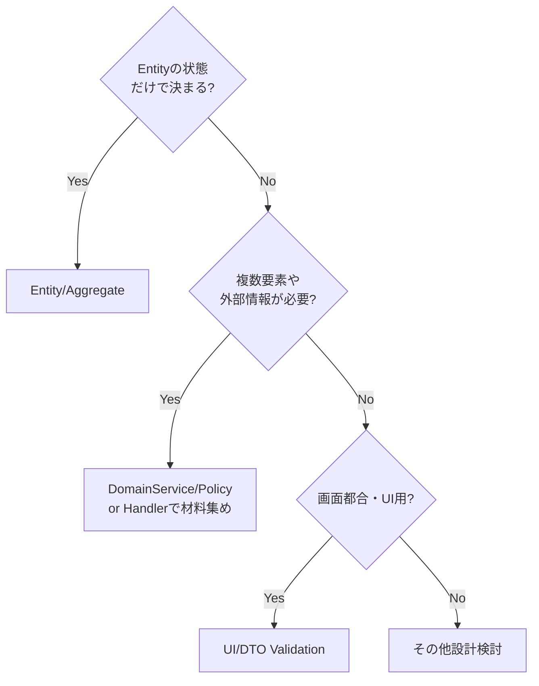

# 第13章　Commandの基本③ 業務ルールの置き場所🏛️✨（＝「どこに書けば迷子にならない？」）

この章はね、CQRSのCommand側で **「業務ルールをどこに置くと、キレイに育つか」** を決める回だよ〜！🥳💡
（ここが曖昧だと、Controllerが神クラス化👑💦して、後から直すのが地獄になるやつ…！）

ちなみにいまどき前提だと、**.NET 10 は 2025-11-11 に LTS としてリリース**されてて、2026-01-13時点の最新パッチは 10.0.2 だよ📦✨ ([Microsoft][1])
**C# 14 は .NET 10 と一緒に出てる**（Microsoft公式）ので、安心してその前提でいこう〜！🧁 ([Microsoft for Developers][2])

---

## 1) まず「業務ルール」って何？（バリデーションとの違い）🔍🧠

同じ `if` でも、種類が違うと置き場所が変わるよ〜！

### ✅ 入口バリデーション（入力の形チェック）📮

例：必須、文字数、範囲、フォーマット

* メールがメールっぽい？📧
* 数量が 1〜999？🔢
* 住所が空じゃない？🏠

➡️ これは **DTO/Validator（章12）** が担当しやすい✨

### ✅ 業務ルール（意味・契約・状態のルール）🏛️

例：業務の世界観で「ダメ」が決まるやつ

* 在庫が足りないから注文できない📦💥
* クーポン期限切れ🎟️⏰
* 出荷済み注文はキャンセル不可🚚❌
* 同じユーザーは1日1回しか応募できない🎯

➡️ これが今回の主役！**Command側に置く**のが基本だよ✍️🔥

### ✅ 技術制約（最後の砦）🧱

例：DBユニーク制約、外部キー、NOT NULL
➡️ “保険”として超大事だけど、**ルールの主戦場ではない**（メッセージも出しづらい）😇

---

## 2) 置き場所はココ！結論：迷わない3点セット🧩✨


業務ルールの置き場所は、だいたいこの3つに落ちるよ〜👇😺

### ① ドメイン（Entity / ValueObject / Aggregate）に置く🏰

**その集約（＝そのオブジェクト）が守るべき掟**は、そこに置く！
例：注文（Order）が「出荷済みならキャンセル不可」を守る🚚❌

✅ 強い理由：

* **守るべき場所が1つになる**（重複しにくい）✨
* どこから呼ばれても破られない（APIでもバッチでも）🛡️
* テストしやすい🧪

### ② ドメインサービス / ポリシーに置く🧙‍♀️

**「1つのEntityだけじゃ判断できない」** とき
例：

* “在庫”は別集約（Product/Inventory）を見る必要がある📦
* “会員ランク”や“与信”を見て判定したい💳

✅ コツ：

* “計算・判定” はサービスへ
* “状態変更の確定” は集約へ戻す（ここ大事！）🔁

### ③ CommandHandlerに置く（オーケストレーション）🎻

Handlerの役目は **段取り**！

* DBから必要なものを取る
* ドメインのメソッドを呼ぶ
* 保存する
* 取引（トランザクション）を張る（章15でやる）🛡️

⚠️ ただし…
Handlerに **業務ルールの `if` を増殖させない** のが正解だよ！🍔💦
（同じルールが別Handlerにもコピーされがち）

---

## 3) 例題：ミニECで「在庫不足」「期限切れ」をCommand側に表現しよ📦🎟️✨

### 🎯 やりたいこと

* 注文を作る（PlaceOrder）🛒
* でも…

  * 在庫が足りなければ失敗
  * クーポン期限切れなら失敗

ここで超ありがち事故👇

> ControllerやHandlerに `if (stock < qty)` が散らばる😇
> 画面が増えるたびにルールがコピーされる😇😇😇

だから、**ルールの中心（ドメイン）に寄せる**よ〜！🧲✨

---

## 4) 実装の型：Resultで「業務エラー」を返すのが扱いやすいよ🧯💬

業務ルール違反は、例外よりも **Result（成功/失敗）** が扱いやすいことが多いよ〜🙆‍♀️
（例外は“想定外”向けになりがち）

```csharp
public readonly record struct Error(string Code, string Message);

public readonly struct Result
{
    public bool IsSuccess { get; }
    public Error? Error { get; }

    private Result(bool success, Error? error)
        => (IsSuccess, Error) = (success, error);

    public static Result Ok() => new(true, null);
    public static Result Fail(string code, string message) => new(false, new Error(code, message));
}

public readonly struct Result<T>
{
    public bool IsSuccess { get; }
    public T? Value { get; }
    public Error? Error { get; }

    private Result(bool success, T? value, Error? error)
        => (IsSuccess, Value, Error) = (success, value, error);

    public static Result<T> Ok(T value) => new(true, value, null);
    public static Result<T> Fail(string code, string message) => new(false, default, new Error(code, message));
}
```

---

## 5) ドメインに「破れない掟」を置く🏰🛡️（在庫・期限の表現）

ここは最小例として、「注文を確定できるか？」をドメイン側で判断する感じにするね✨
（在庫やクーポンを“参照する”のはHandler側、**決定はドメイン**に寄せるのが気持ちいい）

```csharp
public sealed class Order
{
    public Guid Id { get; } = Guid.NewGuid();
    public Guid ProductId { get; private set; }
    public int Quantity { get; private set; }
    public string? CouponCode { get; private set; }
    public DateTime CreatedAtUtc { get; private set; }

    private Order() { } // EF用

    private Order(Guid productId, int quantity, string? couponCode, DateTime createdAtUtc)
    {
        ProductId = productId;
        Quantity = quantity;
        CouponCode = couponCode;
        CreatedAtUtc = createdAtUtc;
    }

    // ★ 業務ルールの中心：ここが「注文という世界」の掟
    public static Result<Order> Create(
        Guid productId,
        int quantity,
        int availableStock,
        bool couponIsValid)
    {
        // 在庫不足📦💥
        if (availableStock < quantity)
            return Result<Order>.Fail("order.stock_insufficient", "在庫が足りないため注文できません🥲");

        // クーポン期限切れ🎟️⏰
        if (!couponIsValid)
            return Result<Order>.Fail("order.coupon_expired", "クーポンの期限が切れています🥲");

        var order = new Order(productId, quantity, couponCode: null, DateTime.UtcNow);
        return Result<Order>.Ok(order);
    }
}
```

ポイントだよ〜👇🥰

* **Orderが守るべきこと**（注文できる条件）をOrderが持ってる🏰
* “在庫数”や“クーポン有効か”みたいな **判断材料は引数で受け取る**

  * つまりOrderはDBを直接見ない（依存が増えない）🧼✨

---

## 6) Handlerは「段取り係」🎻：材料を集めて、ドメインに判定させる🧑‍🍳

```csharp
public sealed record PlaceOrderCommand(Guid ProductId, int Quantity, string? CouponCode);

public sealed class PlaceOrderHandler
{
    private readonly IProductRepository _products;
    private readonly ICouponService _coupons;
    private readonly IOrderRepository _orders;

    public PlaceOrderHandler(IProductRepository products, ICouponService coupons, IOrderRepository orders)
        => (_products, _coupons, _orders) = (products, coupons, orders);

    public async Task<Result<Guid>> Handle(PlaceOrderCommand cmd, CancellationToken ct)
    {
        var product = await _products.FindAsync(cmd.ProductId, ct);
        if (product is null)
            return Result<Guid>.Fail("order.product_not_found", "商品が見つかりませんでした🥲");

        var availableStock = product.AvailableStock;

        var couponIsValid = await _coupons.IsValidAsync(cmd.CouponCode, ct);

        var created = Order.Create(cmd.ProductId, cmd.Quantity, availableStock, couponIsValid);
        if (!created.IsSuccess)
            return Result<Guid>.Fail(created.Error!.Value.Code, created.Error!.Value.Message);

        await _orders.AddAsync(created.Value!, ct);
        return Result<Guid>.Ok(created.Value!.Id);
    }
}
```

✅ ここが気持ちいいCQRSの形だよ〜！😺✨

* Handlerは **“集める→呼ぶ→保存”**
* ルールの本体はドメイン側へ🏰
* これで「同じルールを別画面から呼んでも破れない」🛡️

---

## 7) 置き場所の判断ゲーム🎮💡（迷ったらコレ）

次の質問に **YES** なら、だいたい正解に近づくよ〜！🧁✨

### Q1. そのルールは「そのEntityの状態」だけで決まる？



* YES 👉 **Entity / Aggregateのメソッドへ**🏰
* NO 👉 次へ

### Q2. 複数の集約・外部情報が要る？

* YES 👉 **ドメインサービス/ポリシー or Handlerで材料集め**🧙‍♀️🎻
* NO 👉 たぶんEntityでいける（設計見直し）🔁

### Q3. “画面都合”っぽい？

例：フォームの表示/非表示、入力補助、UIの段階的チェック

* YES 👉 **UI/DTOバリデーション**へ📮（業務ルールに混ぜない！）

---

## 8) よくある事故🥲（女子大生チームを救うチェックリスト✅💖）

* [ ] Controllerに `if` が増えてきたら、**ルール引っ越し**の合図📦
* [ ] 同じ条件分岐が別Handlerにも登場したら、**ドメインへ寄せる**🧲
* [ ] Query側（ReadModel）に「禁止判定」が入ってたら要注意⚠️

  * ReadModelは最適化のために形が変わるから、**正しさの根拠にしない**のが安全だよ🧯
* [ ] DB制約だけに頼って、ユーザーに「なぜダメか」が返せない状態になってない？💬

---

## 9) ミニ演習✍️✨（手を動かすと理解が爆速だよ〜！）

### 演習13-1：分類してみよ🗂️

次を「入口バリデーション」「業務ルール」「技術制約」に分けてみてね😊

1. Quantityは1以上
2. 出荷済みはキャンセル不可
3. Emailはメール形式
4. 注文番号はユニーク

### 演習13-2：引っ越しリファクタ🚚

Controller/Handlerにある `if` を **Orderのメソッド**へ移動して、
“どこから呼んでも同じ結果” になるようにする🛡️✨

### 演習13-3：テスト3本だけ🧪

* 在庫不足で失敗する
* クーポン期限切れで失敗する
* 正常なら注文が作れる

---

## 10) Copilot/Codexに投げると強いプロンプト例🤖✨

* 「“在庫不足”“期限切れ”“出荷済みキャンセル不可” を、Entity/DomainService/Handlerのどこに置くべきか理由つきで整理して」🧠
* 「Order.Create に業務ルール違反を Result で返す実装案を出して。Codeとテスト案も」🧪
* 「Controllerを薄くするための最小テンプレ（Command DTO→Handler→Result→HTTP応答）を書いて」📮

---

## まとめ🎀✨（この章のゴール）

* 業務ルールは **Command側が主戦場**✍️🔥
* 置き場所は基本この3つ：

  * **Entity/Aggregate（掟の中心）**🏰
  * **DomainService/Policy（複数要素の判定）**🧙‍♀️
  * **Handler（段取り係）**🎻
* Controllerにルールを置くと、未来の自分が泣く🥲（マジで）

---

次の章（14章）は、Write側のDBアクセスをEF Coreで通して「更新がちゃんと整合性を守れる」感じにしていくよ🧱✨
続けていこっか？😺📚💖

[1]: https://dotnet.microsoft.com/en-us/platform/support/policy/dotnet-core?utm_source=chatgpt.com "NET and .NET Core official support policy"
[2]: https://devblogs.microsoft.com/dotnet/introducing-csharp-14/?utm_source=chatgpt.com "Introducing C# 14 - .NET Blog"
