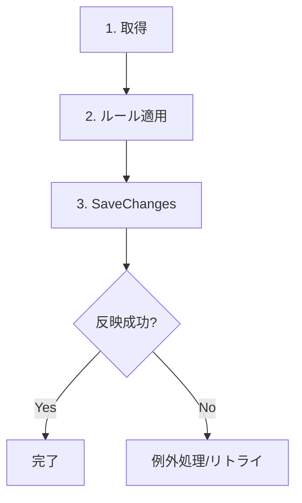

# 第14章　Write側DBアクセス① EF Coreで“更新”を通す🧱✨

この章は「Command（更新）」を **EF CoreでちゃんとDBに反映できる**ようになる回だよ〜！👀✍️
（※2026-01時点の最新LTSである **.NET 10 + EF Core 10** を前提に話すね。EF Core 10は .NET 10 が必須＆LTSだよ📌） ([Microsoft Learn][1])

---

## 14-1. この章のゴール🎯

できるようになることはこの3つ！✨

1. ✅ **Create**：新規追加してID返す（欲張らない🙆‍♀️）
2. ✅ **Update**：DBから取って、値を変えて、SaveChangesで反映
3. ✅ **Delete**：削除（ルールがあるなら“取ってから削除”が基本）

そして最後に、**よくある事故（SaveChanges忘れ・Update乱用・追跡地獄）**も避けられるようにするよ😇

---

## 14-2. Write側で EF Core を使う理由🧠✨（CQRS的に超大事）


Write側（Command側）って、だいたいこういう性格👇

* 🛡️ **整合性が大事**（ルール守る！）
* 🔍 1件のデータを取り出して、状態を変えることが多い
* 🧾 「どこが変わったか」をちゃんと把握したい

EF Coreは **変更追跡（Change Tracking）** が得意で、
「DBから取ってきたエンティティをいじる → SaveChanges」だけで、差分を見て更新SQLを作ってくれるよ✨ ([Microsoft Learn][2])

---

## 14-3. 今日の題材：ToDo（Writeモデル）📌📝

今回は分かりやすく ToDo を使うね😊（ECでも考え方いっしょ！）

* `CreateTodoCommand`：ToDoを作る
* `RenameTodoCommand`：タイトル変更
* `DeleteTodoCommand`：削除

---

## 14-4. まずはEF Coreを入れる📦✨

EF Core 10 系は NuGet で 10.0.2 が出てる（2026-01時点）よ〜📌 ([nuget.org][3])

### SQLiteを使う場合（いちばんラク😺）

```bash
dotnet add package Microsoft.EntityFrameworkCore --version 10.0.2
dotnet add package Microsoft.EntityFrameworkCore.Sqlite --version 10.0.2
dotnet add package Microsoft.EntityFrameworkCore.Design --version 10.0.2
```

SQLiteプロバイダーは `UseSqlite` を使うよ〜って公式にも書いてあるよ📌 ([nuget.org][4])

> SQL Serverでやるなら `Microsoft.EntityFrameworkCore.SqlServer` を入れればOK👌 ([nuget.org][5])

---

## 14-5. Entity（Writeモデル）を作る🧩✨

ポイントはこれ👇

* 🧠 **エンティティ自身にルール（最小でOK）**
* 🚫 setter公開しない（雑に書き換えられるとルール壊れる😵‍💫）

```csharp
public sealed class TodoItem
{
    public Guid Id { get; private set; }
    public string Title { get; private set; } = "";
    public bool IsCompleted { get; private set; }
    public DateTimeOffset CreatedAt { get; private set; }

    private TodoItem() { } // EF用（空コンストラクタ）

    public TodoItem(Guid id, string title, DateTimeOffset createdAt)
    {
        Id = id;
        Rename(title);
        CreatedAt = createdAt;
        IsCompleted = false;
    }

    public void Rename(string title)
    {
        if (string.IsNullOrWhiteSpace(title))
            throw new DomainException("タイトルは必須だよ🥺");

        Title = title.Trim();
    }

    public void Complete()
    {
        IsCompleted = true;
    }
}

public sealed class DomainException : Exception
{
    public DomainException(string message) : base(message) { }
}
```

---

## 14-6. DbContext（Write側）を作る🧱✨

Write側は「更新する」ので、基本は **追跡あり**でOK🙆‍♀️
（EF Coreは “同じDbContextで取得→更新→SaveChanges” が得意だよ📌） ([Microsoft Learn][6])

```csharp
using Microsoft.EntityFrameworkCore;

public sealed class TodoWriteDbContext : DbContext
{
    public DbSet<TodoItem> TodoItems => Set<TodoItem>();

    public TodoWriteDbContext(DbContextOptions<TodoWriteDbContext> options)
        : base(options) { }

    protected override void OnModelCreating(ModelBuilder modelBuilder)
    {
        var e = modelBuilder.Entity<TodoItem>();

        e.ToTable("TodoItems");
        e.HasKey(x => x.Id);

        e.Property(x => x.Title)
            .HasMaxLength(200)
            .IsRequired();

        e.Property(x => x.CreatedAt)
            .IsRequired();

        e.HasIndex(x => x.CreatedAt);
    }
}
```

---

## 14-7. DI登録（Program.cs）🔌✨

SQLiteでいくならこんな感じ👇

```csharp
using Microsoft.EntityFrameworkCore;

var builder = WebApplication.CreateBuilder(args);

builder.Services.AddDbContext<TodoWriteDbContext>(options =>
{
    options.UseSqlite(builder.Configuration.GetConnectionString("WriteDb"));
});

var app = builder.Build();
app.Run();
```

`appsettings.json` はこんなイメージ👇

```json
{
  "ConnectionStrings": {
    "WriteDb": "Data Source=todo-write.db"
  }
}
```

---

## 14-8. マイグレーションでDB作成🧰✨

EF Coreは “マイグレーション” でテーブル作れるよ〜！🛠️
（設計の変更が「履歴」になるのが強い✨）

### CLI派（VS Codeでも同じ）

```bash
dotnet tool install --global dotnet-ef
dotnet ef migrations add InitialWrite
dotnet ef database update
```

---

## 14-9. Command実装：Create / Update / Delete 🍳✨

ここからが本番！😺
「EFで更新を通す」って、基本この形だよ👇

* ① 取得（必要なら）
* ② ルール適用（メソッド呼ぶ）
* ③ SaveChanges



EF CoreのSaveChangesは「追跡してる変更」をDBに反映する仕組みだよ📌 ([Microsoft Learn][7])

### 14-9-1. まずはCommand/Handlerの最小インターフェイス🧩

```csharp
public interface ICommand<TResult> { }

public interface ICommandHandler<TCommand, TResult>
    where TCommand : ICommand<TResult>
{
    Task<TResult> Handle(TCommand command, CancellationToken ct);
}
```

---

### 14-9-2. Create（IDだけ返す😺✨）

```csharp
public sealed record CreateTodoCommand(string Title) : ICommand<Guid>;

public sealed class CreateTodoHandler
    : ICommandHandler<CreateTodoCommand, Guid>
{
    private readonly TodoWriteDbContext _db;

    public CreateTodoHandler(TodoWriteDbContext db)
        => _db = db;

    public async Task<Guid> Handle(CreateTodoCommand command, CancellationToken ct)
    {
        var id = Guid.NewGuid();

        var entity = new TodoItem(
            id: id,
            title: command.Title,
            createdAt: DateTimeOffset.UtcNow
        );

        _db.TodoItems.Add(entity);
        await _db.SaveChangesAsync(ct);

        return id; // 欲張らない✨
    }
}
```

---

### 14-9-3. Update（“取ってから変える”が基本✍️）

```csharp
using Microsoft.EntityFrameworkCore;

public sealed record RenameTodoCommand(Guid TodoId, string NewTitle) : ICommand<bool>;

public sealed class RenameTodoHandler
    : ICommandHandler<RenameTodoCommand, bool>
{
    private readonly TodoWriteDbContext _db;

    public RenameTodoHandler(TodoWriteDbContext db)
        => _db = db;

    public async Task<bool> Handle(RenameTodoCommand command, CancellationToken ct)
    {
        var todo = await _db.TodoItems
            .SingleOrDefaultAsync(x => x.Id == command.TodoId, ct);

        if (todo is null) return false;

        todo.Rename(command.NewTitle);
        await _db.SaveChangesAsync(ct);

        return true;
    }
}
```

---

### 14-9-4. Delete（ルールあるなら“取ってから削除”🗑️）

```csharp
using Microsoft.EntityFrameworkCore;

public sealed record DeleteTodoCommand(Guid TodoId) : ICommand<bool>;

public sealed class DeleteTodoHandler
    : ICommandHandler<DeleteTodoCommand, bool>
{
    private readonly TodoWriteDbContext _db;

    public DeleteTodoHandler(TodoWriteDbContext db)
        => _db = db;

    public async Task<bool> Handle(DeleteTodoCommand command, CancellationToken ct)
    {
        var todo = await _db.TodoItems
            .SingleOrDefaultAsync(x => x.Id == command.TodoId, ct);

        if (todo is null) return false;

        _db.TodoItems.Remove(todo);
        await _db.SaveChangesAsync(ct);

        return true;
    }
}
```

---

## 14-10. “速いけど注意”な更新：ExecuteUpdate / ExecuteDelete ⚡😺

EFには **追跡を使わず直接SQLで更新/削除**する方法もあるよ✨
ただしこれは **Change Trackerが更新されない**ので、混ぜると事故りやすい😵‍💫 ([Microsoft Learn][8])

たとえば「存在確認しないで削除してOK」「ルールも無い」みたいなときはアリ👇

```csharp
using Microsoft.EntityFrameworkCore;

public async Task<int> FastDelete(Guid id, CancellationToken ct)
{
    return await _db.TodoItems
        .Where(x => x.Id == id)
        .ExecuteDeleteAsync(ct);
}
```

---

## 14-11. Write側EFで“ありがちな詰まりポイント”😵‍💫💥（超あるある）

### ① SaveChangesし忘れ😇

* 変更しても **SaveChangesAsyncしないとDBに反映されない**よ！

### ② `Update(entity)` 乱用で全部更新マン👑

* 「DTOをentityに詰めて `Update`」は簡単だけど、
  ✅ **意図しない列まで更新**しやすい＆競合にも弱い💦
* 基本は「DBから取ってきて、必要な変更だけ」がおすすめ✨

### ③ “追跡されてない” entity をいじっても反映されない

* Read側で `AsNoTracking()` したものをそのまま更新に使うと、
  「え、更新されない…😇」が起きるよ
* Write側は原則：**追跡ありで取得→変更→SaveChanges** が安心 ([Microsoft Learn][6])

### ④ 例外を握りつぶして静かに失敗🙈

* `DbUpdateException` とかはログ出さないと地獄🔥（後で泣く）

### ⑤ DbContextを使い回しすぎてカオス🌀

* DbContextは「1リクエスト/1ユースケース」で使う感覚がラク✨
  （追跡が残り続けると意味不明になる😵‍💫）

---

## 14-12. ちょい実戦：例外の最低ライン🧯✨

この章では最小でOK！

* ドメイン違反 → `DomainException`
* DB更新失敗 → `DbUpdateException` など

「握りつぶさず、ユースケースとして失敗を返す」だけでも一気に安全になるよ😊

---

## 14-13. ミニ演習（手を動かすやつ）✅💪✨

### 演習A：CompleteをCommandにして保存🔁

* `CompleteTodoCommand(Guid id)` を作って
* `todo.Complete()` → SaveChangesAsync

### 演習B：タイトルの最大200文字を“ルール”にする✍️

* `Rename` の中で 200超えたら `DomainException`

### 演習C：Deleteを高速化してみる⚡

* ルールが無い前提で `ExecuteDeleteAsync` 版を追加
* その代わり「追跡と混ぜると危険」もメモ📝 ([Microsoft Learn][8])

---

## 14-14. AI活用プロンプト集🤖✨（コピペでOK）

### ① Handlerレビュー（設計の目が育つ👀）

* 「このCommandHandler、CQRS的に“責務が太ってないか”レビューして。太いなら分割案も出して」

### ② EFの落とし穴チェック🕳️

* 「このEF Core更新コード、SaveChanges/追跡/Update乱用/例外処理の観点で危険箇所を指摘して」

### ③ マイグレーション確認🔧

* 「このEntityとOnModelCreatingから作られるテーブル構造を説明して。想定と違う所が出やすい点も教えて」

---

## 14-15. 章末チェックリスト✅😺

* [ ] Commandで **Add/Modify/Remove → SaveChanges** できた
* [ ] Updateは **取ってから変更**の形にできた
* [ ] 戻り値は **IDや成功/失敗くらい**に抑えた
* [ ] `Update(entity)` を雑に使ってない
* [ ] ExecuteDelete/ExecuteUpdateは **使いどころを理解**した ([Microsoft Learn][8])

---

次の第15章では、この更新が「2つ以上のDB操作になるとき」に必要な **トランザクション感覚🛡️** を、怖くない範囲で身につけていくよ〜！😺✨

[1]: https://learn.microsoft.com/ja-jp/ef/core/what-is-new/ef-core-10.0/whatsnew?utm_source=chatgpt.com "EF Core 10 の新機能"
[2]: https://learn.microsoft.com/en-us/ef/core/saving/?utm_source=chatgpt.com "Saving Data - EF Core"
[3]: https://www.nuget.org/packages/microsoft.entityframeworkcore?utm_source=chatgpt.com "Microsoft.EntityFrameworkCore 10.0.2"
[4]: https://www.nuget.org/packages/microsoft.entityframeworkcore.sqlite?utm_source=chatgpt.com "Microsoft.EntityFrameworkCore.Sqlite 10.0.2"
[5]: https://www.nuget.org/packages/Microsoft.EntityFrameworkCore.sqlserver/?utm_source=chatgpt.com "Microsoft.EntityFrameworkCore.SqlServer 10.0.2"
[6]: https://learn.microsoft.com/en-us/ef/core/change-tracking/?utm_source=chatgpt.com "Change Tracking - EF Core"
[7]: https://learn.microsoft.com/en-us/ef/core/saving/basic?utm_source=chatgpt.com "Basic SaveChanges - EF Core"
[8]: https://learn.microsoft.com/en-us/ef/core/saving/execute-insert-update-delete?utm_source=chatgpt.com "ExecuteUpdate and ExecuteDelete - EF Core"
