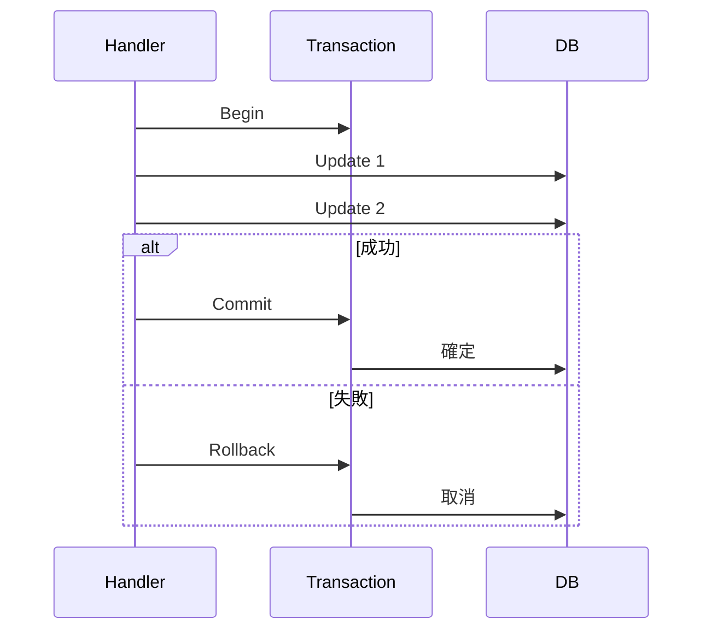

# 第15章　Write側DBアクセス② トランザクション感覚🛡️✨（CQRS・C#）

この章は「**1回の更新で“守る範囲”をちゃんと決める**」がテーマだよ〜😊
CQRSのWrite側は **整合性（ちゃんと壊れないこと）最優先** なので、トランザクション感覚が身につくと一気に強くなる💪💕

---

## 1) トランザクションって何？🤔💡（超ざっくり）

トランザクションは一言でいうと、

* ✅ **全部成功したら確定（Commit）**
* ✅ **途中で失敗したら全部なかったことにする（Rollback）**

っていう **「まとめてセーブ」機能**だよ🧺✨
銀行の振込（Aから引く＋Bに足す）が片方だけ成功したら困るよね？それを防ぐのがトランザクション🏦🔒

---

## 2) CQRSのWrite側での“基本ルール”🧭✨

### ✅ 目安：**「1コマンド（1ユースケース）＝ 1トランザクション」**

CommandHandlerは「状態を変える」係なので、基本は **Handlerの中が“守る範囲”**になるよ📦🛡️

* Handlerの外にトランザクション境界が散らばると
  → どこまでが安全な更新なのか分からなくなる😵‍💫🌀

---

## 3) EF Coreはどこまで自動で守ってくれる？🤖🧱

### ✅ まず知っておくこと：`SaveChanges` は基本トランザクションで動く

EF Coreは、ふつう `SaveChanges()` / `SaveChangesAsync()` を呼ぶと **その呼び出し単位でトランザクションを張ってコミット**してくれる（※プロバイダ等にもよるけど、基本はこの理解でOK）🧠✨

でもね…！

### ⚠️ “2回SaveChangesする処理”は危ないことがある😱

たとえば **同じコマンドの中で** `SaveChanges` を2回呼ぶと、

* 1回目はコミット済み
* 2回目で失敗したら…
  → **片方だけ反映される**可能性がある💥

だから「複数ステップ更新」を“ひとつの成功/失敗”にしたいときは **明示トランザクション**が必要になるよ🛡️
EF Coreの公式ドキュメントでも `BeginTransaction` を使った例が載ってるよ📚✨ ([Microsoft Learn][1])

---

## 4) 具体例：2つ更新が必要なケース🛒📦（在庫と注文）

### シーン🎬

* 注文作成 `Orders`
* 在庫減算 `Stocks`

「注文だけ入って在庫が減らない」も
「在庫だけ減って注文が無い」も
どっちも事故だよね😇💦

---

## 5) まず“事故る版”を書いてみる😈（わざと）

> これは学習用に「危ない形」を見せるね！

```csharp
public sealed class PlaceOrderHandler
{
    private readonly AppDbContext _db;

    public PlaceOrderHandler(AppDbContext db) => _db = db;

    public async Task<Guid> HandleAsync(PlaceOrderCommand cmd, CancellationToken ct)
    {
        // ① 注文を作る
        var order = new Order { Id = Guid.NewGuid(), ProductId = cmd.ProductId, Quantity = cmd.Quantity };
        _db.Orders.Add(order);
        await _db.SaveChangesAsync(ct); // ★ここで確定しちゃう

        // ② 在庫を減らす（ここで失敗したら…？😱）
        var stock = await _db.Stocks.SingleAsync(x => x.ProductId == cmd.ProductId, ct);
        stock.Quantity -= cmd.Quantity;

        // 例：ここで例外が起きたら…注文だけ残る💥
        await _db.SaveChangesAsync(ct);

        return order.Id;
    }
}

public sealed record PlaceOrderCommand(Guid ProductId, int Quantity);
```

---

## 6) 正解：明示トランザクションで“まとめて成功/失敗”にする🛡️✨


EF Coreは `DbContext.Database.BeginTransactionAsync()` が使えるよ👌
公式にも「2回のSaveChangesを1トランザクションで包む」例がある🧷 ([Microsoft Learn][1])

```csharp
public sealed class PlaceOrderHandler
{
    private readonly AppDbContext _db;

    public PlaceOrderHandler(AppDbContext db) => _db = db;

    public async Task<Guid> HandleAsync(PlaceOrderCommand cmd, CancellationToken ct)
    {
        await using var tx = await _db.Database.BeginTransactionAsync(ct);

        try
        {
            // ① 注文
            var order = new Order { Id = Guid.NewGuid(), ProductId = cmd.ProductId, Quantity = cmd.Quantity };
            _db.Orders.Add(order);
            await _db.SaveChangesAsync(ct);

            // ② 在庫
            var stock = await _db.Stocks.SingleAsync(x => x.ProductId == cmd.ProductId, ct);
            if (stock.Quantity < cmd.Quantity)
                throw new InvalidOperationException("在庫不足だよ🥲"); // 本当は業務エラー型にすると更に良い✨

            stock.Quantity -= cmd.Quantity;
            await _db.SaveChangesAsync(ct);

            await tx.CommitAsync(ct); // ✅ ここでまとめて確定🎉
            return order.Id;
        }
        catch
        {
            await tx.RollbackAsync(ct); // ✅ 失敗したら全部なかったことにする🧯
            throw;
        }
    }
}
```




### ここでの感覚👀✨

* `Commit` までは「仮の世界」
* `Commit` した瞬間に「現実に反映」
  って覚えると強いよ〜💪🌸

---

## 7) 欲張り注意！トランザクションは“短く・小さく”⏱️🐇

トランザクションを広げすぎると：

* 🔒 ロックが長くなって、他の人が待たされる
* 🐢 パフォーマンスが落ちる
* 💥 デッドロック等のトラブル率が上がる

### ✅ トランザクション内に入れない方がいいもの🙅‍♀️

* 外部API呼び出し🌐
* ファイル操作📁
* メール送信📩
* 長い計算・待機⏳

「DBの整合性に必要な更新」だけを、ぎゅっと入れるのがコツだよ🧊✨

---

## 8) ちょい上級：リトライ（接続回復）とトランザクションの相性⚡🔁

クラウドDBとかだと一時的に接続が落ちることがあるよね🥲
EF Coreには **Connection Resiliency（自動リトライ）**の仕組みがあるよ ([Microsoft Learn][2])

ただし！
**自分で開始したトランザクション**を使う場合は、**ExecutionStrategyで“トランザクション全体”をひとまとまりにしてリトライ**させるのが王道だよ🛡️🔁（これ大事！）

```csharp
public async Task<Guid> HandleAsync(PlaceOrderCommand cmd, CancellationToken ct)
{
    var strategy = _db.Database.CreateExecutionStrategy();

    return await strategy.ExecuteAsync(async () =>
    {
        await using var tx = await _db.Database.BeginTransactionAsync(ct);

        var order = new Order { Id = Guid.NewGuid(), ProductId = cmd.ProductId, Quantity = cmd.Quantity };
        _db.Orders.Add(order);
        await _db.SaveChangesAsync(ct);

        var stock = await _db.Stocks.SingleAsync(x => x.ProductId == cmd.ProductId, ct);
        if (stock.Quantity < cmd.Quantity)
            throw new InvalidOperationException("在庫不足だよ🥲");

        stock.Quantity -= cmd.Quantity;
        await _db.SaveChangesAsync(ct);

        await tx.CommitAsync(ct);
        return order.Id;
    });
}
```

---

## 9) TransactionScopeってどうなの？🧠🧵（知識として）

`TransactionScope` は「周辺（ambient）のトランザクション」を張る仕組みで、複数コンポーネントにまたがるときに登場しがち。
`async/await` と一緒に使うなら **AsyncFlowOption.Enabled** が必要だよ〜 ([Microsoft Learn][3])

```csharp
using System.Transactions;

using var scope = new TransactionScope(TransactionScopeAsyncFlowOption.Enabled);

// DB更新など…

scope.Complete(); // ✅ これが commit 的な意味
```

ただ、設計入門の段階では **EF Coreの BeginTransaction をまず軸にする**のが分かりやすいよ😊
（分散トランザクション方面は重くなりがちなので、必要になってからでOK🙆‍♀️）

---

## 10) ミニ演習🎯：2更新を“守れる”ようにしよう🔒✨

### お題📝

「ポイント付与」のCommandを作るよ！

* `Users.Points += X`
* `PointHistories` に履歴を追加

### 条件✅

* どっちかが失敗したら **両方取り消し**
* 成功したら **両方確定**

### 手順👣

1. まずはわざと `SaveChanges` を2回で書く😈
2. 途中で例外を投げて、片方だけ反映されるのを確認💥
3. `BeginTransactionAsync` で包んで、反映されないことを確認🎉

---

## 11) AI活用プロンプト例🤖💬（Copilot / Codex向け）

* 「EF CoreでBeginTransactionを使って、2回SaveChangesする処理を安全にするC#コードを書いて。try/catchでRollbackも入れて」🛡️
* 「このCommandHandlerのトランザクション境界は適切？長すぎる処理が入ってないかレビューして」👀
* 「この更新は“1コマンド1トランザクション”の観点で、責務が混ざってない？」🧩
* 「Rollbackされることを確認するテストケース案を3つ出して」🧪✨

---

## 12) この章のまとめ🎀✨

* ✅ トランザクションは「全部成功 or 全部取り消し」🛡️
* ✅ 目安は「1コマンド＝1トランザクション」📦
* ✅ `SaveChanges` を複数回やるなら、明示トランザクションを検討！ ([Microsoft Learn][1])
* ✅ リトライを使うなら ExecutionStrategy + トランザクションで“丸ごと”守る ([Microsoft Learn][2])
* ✅ TransactionScopeは知識として押さえつつ、まずはBeginTransactionでOK ([Microsoft Learn][3])

---

おつかれさま〜！😺🌸
次の第16章（競合＝同時更新💥）に進む前に、「在庫減算＋注文作成」の演習で一回“事故らせて→直す”をやると理解が爆伸びするよ📈✨

[1]: https://learn.microsoft.com/ja-jp/ef/core/saving/transactions?utm_source=chatgpt.com "EF Core - トランザクションの使用"
[2]: https://learn.microsoft.com/en-us/ef/core/miscellaneous/connection-resiliency?utm_source=chatgpt.com "Connection Resiliency - EF Core"
[3]: https://learn.microsoft.com/en-us/dotnet/api/system.transactions.transactionscopeasyncflowoption?view=net-10.0&utm_source=chatgpt.com "TransactionScopeAsyncFlowOption Enum - System ..."
