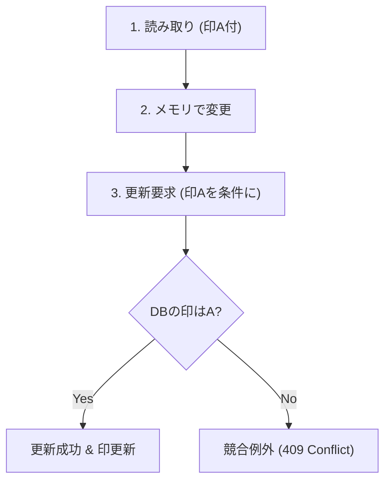

# 第16章　Write側DBアクセス③ 競合（同時更新）と楽しい現実💥

### この章のゴール🎯✨

* 「同時更新で上書き事故が起きる」って感覚をつかむ😵‍💫
* EF Coreで**競合（コンフリクト）を検知**できるようになる🧯
* 競合したときに **APIとしてどう返すか（409とか）** を決められるようになる📮

---

## 1) 同時更新ってどんな事故？🚧💥


たとえば「在庫数」を更新する画面があって…

* Aさん：在庫を **10 → 9** にしたい（-1）
* Bさん：在庫を **10 → 8** にしたい（-2）

2人が**同じ“10”を見たまま**ほぼ同時に保存すると、最後に保存した人の結果だけが残って、片方の変更が消えることがあるよ😭
これがいわゆる「ロストアップデート（上書き事故）」の代表例💣

---

## 2) EF Coreの基本スタンス：楽観的同時実行（Optimistic Concurrency）🙂✨



EF Coreは基本的に「競合はたまにしか起きないよね？」という前提で、**ロックをかけずに**進める方式が中心だよ🙌
代わりに、更新時に **“読み取った時点の印”**（= 同時実行トークン）を使って、

> 「読み取った後に誰かが変えてたら、保存を失敗させる」

という仕組みで守るよ🛡️
実際、EF CoreはUPDATEのWHEREにそのトークン条件を足して、**一致しなかったら0件更新**→例外、って流れになるよ。 ([Microsoft Learn][1])

---

## 3) 競合検知の定番：RowVersion（行バージョン）🧬✨

SQL Serverなら **rowversion**（昔のtimestampの後継）を使うのが王道だよ👍
C#側は `byte[]` で持つのが定番で、`[Timestamp]` を付けると「更新のたびにDB側で自動更新されるトークン」になるよ。 ([Microsoft Learn][2])

> 逆に、適当なプロパティに `[ConcurrencyCheck]` を付ける方法は「おすすめされない」扱いになってるので、基本はRowVersion寄りでOK🙆‍♀️ ([Microsoft Learn][3])

---

## 4) ミニ演習：わざと競合を起こして「検知」を体験しよう😈🧪

### 4-1) エンティティを作る（RowVersion付き）📦

```csharp
using System.ComponentModel.DataAnnotations;

public class StockItem
{
    public Guid Id { get; set; }
    public string Sku { get; set; } = "";
    public int Quantity { get; set; }

    // これが“競合検知用の印”🧷
    [Timestamp]
    public byte[] RowVersion { get; set; } = Array.Empty<byte>();
}
```

---

## 5) ハンズオン：Commandで「競合を検知して409を返す」まで🚀

ここでは CQRSっぽく、**更新（Command）**を1本作るよ✍️✨
ポイントは「クライアントが持ってるRowVersionを、更新時に一緒に送る」こと📦

### 5-1) APIの入出力DTO（RowVersionはBase64文字列でやり取り）🔁

```csharp
public sealed record GetStockResponse(
    Guid Id,
    string Sku,
    int Quantity,
    string RowVersionBase64
);

public sealed record AdjustStockRequest(
    int Delta,
    string RowVersionBase64
);

public sealed record ConcurrencyErrorResponse(
    string Message,
    GetStockResponse Current // “今のDBの正解”を返す
);
```

### 5-2) GET：現在値 + RowVersionを返す（Queryっぽい）👀

```csharp
using Microsoft.EntityFrameworkCore;

app.MapGet("/stocks/{id:guid}", async (Guid id, AppDbContext db) =>
{
    var item = await db.StockItems.AsNoTracking().SingleOrDefaultAsync(x => x.Id == id);
    if (item is null) return Results.NotFound();

    return Results.Ok(new GetStockResponse(
        item.Id,
        item.Sku,
        item.Quantity,
        Convert.ToBase64String(item.RowVersion)
    ));
});
```

### 5-3) PUT：更新（Command）で競合を検知する✍️💥

コツはここ👇

* まず普通に更新を試す
* `DbUpdateConcurrencyException` が出たら **409 Conflict** を返す📮
* ついでに「DBの最新値」も返してあげると親切だよ🥹

```csharp
using Microsoft.EntityFrameworkCore;

app.MapPut("/stocks/{id:guid}/adjust", async (Guid id, AdjustStockRequest req, AppDbContext db) =>
{
    var item = await db.StockItems.SingleOrDefaultAsync(x => x.Id == id);
    if (item is null) return Results.NotFound();

    // クライアントが見ていたRowVersion（更新前の印）をセット🧷
    var clientRowVersion = Convert.FromBase64String(req.RowVersionBase64);
    db.Entry(item).Property(x => x.RowVersion).OriginalValue = clientRowVersion;

    // 業務ルール例：在庫はマイナス禁止🚫
    var next = item.Quantity + req.Delta;
    if (next < 0) return Results.BadRequest(new { message = "在庫が足りないよ〜😭" });

    item.Quantity = next;

    try
    {
        await db.SaveChangesAsync();
        return Results.NoContent();
    }
    catch (DbUpdateConcurrencyException ex)
    {
        // 競合！😵‍💫 いまのDBの値を取りに行く
        var entry = ex.Entries.Single();
        var databaseValues = await entry.GetDatabaseValuesAsync();

        if (databaseValues is null) return Results.Conflict(new { message = "対象データが消えてたよ…🥲" });

        var current = (StockItem)databaseValues.ToObject();

        var body = new ConcurrencyErrorResponse(
            Message: "他の誰かが先に更新してたよ！もう一回読み込みしてね🙏✨",
            Current: new GetStockResponse(
                current.Id,
                current.Sku,
                current.Quantity,
                Convert.ToBase64String(current.RowVersion)
            )
        );

        return Results.Conflict(body); // 409
    }
});
```

> こういう「保存時に失敗させて、アプリ側で判断する」流れがEF Coreの楽観的同時実行の基本だよ。 ([Microsoft Learn][1])

---

## 6) 競合の再現手順（超かんたん）🧨✨

1. ブラウザ（SwaggerでもPostmanでもOK）を**2つ**開く🪟🪟
2. 両方で `GET /stocks/{id}` を叩いて、同じ `RowVersionBase64` を持つ状態にする👀
3. タブAで `PUT`（Delta=-1）して成功✅
4. タブBで “古いRowVersionのまま” `PUT`（Delta=-2）すると…

   * **409 Conflict** が返って、`Current` に最新状態が入ってくるはず💥🎉

---

## 7) 競合したときの「正解」は3種類あるよ🧠✨

ここが設計ポイントだよ〜！😺

### A) まずは王道：弾いてユーザーにやり直してもらう（409）🧯

* 一番シンプルで事故りにくい👍
* UI側は「最新を表示 → もう一回操作してね」でOK🙆‍♀️

### B) 自動リトライ（ただし条件付き）🔁

* 競合が“たまたま”で、処理が安全に再実行できるならアリ
* でも「二重に引き落とし」みたいなのは危険⚠️（冪等性が必要）

### C) マージ（どっちも生かす）🤝

* 例：別々の列を編集してるなら、マージできる場合もある
* EF Coreの考え方としても「DB値と提案値を見比べて決める」やり方が紹介されてるよ。 ([Microsoft Learn][1])

最初は **A（409）で十分**だよ🙌✨（まずは安全にいこ！）

---

## 8) よくあるつまずき集😵‍💫📌

* **RowVersionを返してない/送ってない**
  → 競合検知できないよ🥲
* **InMemoryプロバイダで試して「起きない！」**
  → 本物のDB挙動と違うことがあるよ（SQLite/SQL Serverで試すのが安心）😇
* **競合をcatchして握りつぶす**
  → “静かに上書き事故”になるので、まずは409で返そ🧯
* **ConcurrencyCheckをあちこち付ける**
  → むしろ迷子になりがち。まずRowVersionがラク！ ([Microsoft Learn][3])

---

## 9) AI（Copilot/Codex）活用プロンプト例🤖✨

* 「`DbUpdateConcurrencyException` を409で返す最小実装を作って。RowVersionはBase64で返して」📮
* 「競合時のユーザー向けメッセージ案を5つ、やさしい口調で絵文字多めで」💬💕
* 「在庫更新の競合テストケースを列挙して。正常系/競合/在庫不足/対象なし」🧪✅
* 「“自動リトライしていい条件”と“絶対ダメな条件”を箇条書きで整理して」⚖️

---

## 10) まとめ🎀

* 同時更新は放置すると上書き事故💥
* EF Coreは **RowVersion（[Timestamp]）** で競合を検知して、保存時に失敗させるスタイル🙂✨ ([Microsoft Learn][1])
* まずは **409 Conflict + 最新値返却** がいちばん安全で実務的だよ📮🧯

次章（第17章）で Read DTO に入ると、今度は「表示用に作りやすくなる」ターンだよ〜👀📄✨

[1]: https://learn.microsoft.com/en-us/ef/core/saving/concurrency "Handling Concurrency Conflicts - EF Core | Microsoft Learn"
[2]: https://learn.microsoft.com/en-us/aspnet/core/data/ef-mvc/concurrency?view=aspnetcore-10.0&utm_source=chatgpt.com "Tutorial: Handle concurrency - ASP.NET MVC with EF Core"
[3]: https://learn.microsoft.com/en-us/aspnet/core/data/ef-rp/concurrency?view=aspnetcore-10.0&utm_source=chatgpt.com "Part 8, Razor Pages with EF Core in ASP.NET Core"
