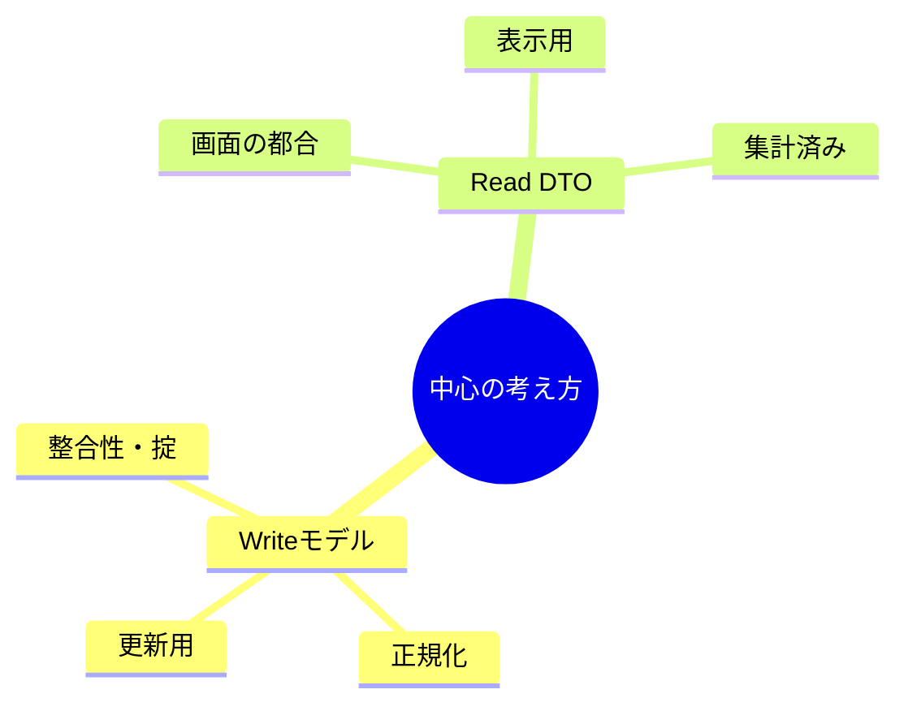

# 第17章　Queryの基本① Read DTO（表示用モデル）を作る👀📦✨

この章でやることはシンプル！
「**画面に出すための形（Read DTO）**」を、**Write側（更新用のモデル）と切り離して**設計できるようになることだよ〜😺💕

ちなみに本日時点だと、.NET 10 は LTS で提供されていて（2025/11/11 リリース）、Visual Studio 2026 もアップデートが出てるよ✨ ([Microsoft for Developers][1])
（EF Core も EF Core 10 が .NET 10 前提で出てる）([Microsoft Learn][2])

---

## 1) Read DTOってなに？（超ざっくり）🐣




* **Writeモデル**：更新の都合がいい形（整合性・ルール・正規化寄り）✍️🧱
* **Read DTO**：表示の都合がいい形（一覧・詳細画面・集計・見せたい形）👀📄

ポイントはこれ👇
✅ **Read DTOは「画面に都合の良い形」でOK**
✅ **Writeモデルをそのまま返さない**（ついやりがち〜😵‍💫）

---

## 2) なんで分けるの？（メリット）🌈

### ✅ ① 画面が変わっても更新側が巻き込まれにくい

「一覧に“合計金額”を足したい」みたいな要求、Read DTOなら自由〜🎉

### ✅ ② 余計な情報を出さなくて済む（セキュリティ）🔐

内部用のカラムや、見せちゃダメ情報を“うっかり返す事故”を防げる🙈💦

### ✅ ③ APIが安定する（変更に強くなる）🧷

Writeモデルは変更されやすいけど、Read DTOは「画面契約」として守りやすい✨
（C# 14 / .NET 10 の世代で開発してても、ここが分離できると保守がラクになるよ〜）([Microsoft Learn][3])

---

## 3) Read DTO設計のコツ（迷子防止の型）🧭✨

### まず「画面」を1枚選ぶ📱

例：注文一覧（Order List）

### 次に「画面に必要な情報」を箇条書き📝

* 注文ID
* 注文日
* 購入者名
* 注文ステータス（表示用文字列）
* 注文合計金額
* アイテム数

### 最後に「DTOにする」📦

* 画面に必要な分だけ入れる
* “画面で便利な形”にする（合計金額・件数・表示文字列とか）
* ネストは最小（一覧は特に！）

---

## 4) 例：注文一覧の Read DTO を作ってみよ〜🛒✨

ここでは **注文一覧用** に「軽くて使いやすいDTO」を作るよ💡
（Write側の Order エンティティをそのまま返すのは禁止〜🙅‍♀️）

### ✅ Read DTO（一覧用）

```csharp
public sealed record OrderListItemDto(
    Guid OrderId,
    DateTimeOffset OrderedAt,
    string CustomerName,
    string StatusLabel,
    int ItemCount,
    decimal TotalAmount
);
```

#### ここが“Readっぽい”ポイント💖

* `StatusLabel`：画面表示向け（例：`"発送待ち"`）
* `ItemCount` / `TotalAmount`：画面で欲しい集計値
* “注文の内部構造（Items全部）”は一覧では持たない（重い＆過剰）🐘💦

---

## 5) Query と Handler の形（CQRSの型）🧩📮

Read DTO を返す Query を作るよ〜！

### ✅ Query（入力：検索条件）

```csharp
public sealed record GetOrderListQuery(
    int Page,
    int PageSize,
    string? Status // nullなら全件、みたいな想定
);
```

### ✅ Handler（出力：Read DTO の一覧）

※ この章は「DTO設計」が主役だから、取得の最適化（投影・AsNoTracking）は次章でガッツリやるよ⚡
ここは“形”が分かればOK！

```csharp
public interface IQueryHandler<in TQuery, TResult>
{
    Task<TResult> Handle(TQuery query, CancellationToken ct);
}

public sealed class GetOrderListHandler
    : IQueryHandler<GetOrderListQuery, IReadOnlyList<OrderListItemDto>>
{
    private readonly AppDbContext _db;

    public GetOrderListHandler(AppDbContext db) => _db = db;

    public async Task<IReadOnlyList<OrderListItemDto>> Handle(GetOrderListQuery query, CancellationToken ct)
    {
        // ここでは「Read DTOを返す」ことだけ意識💖
        // 最適化は次章で✨

        var orders = await _db.Orders
            .OrderByDescending(o => o.OrderedAt)
            .Skip((query.Page - 1) * query.PageSize)
            .Take(query.PageSize)
            .ToListAsync(ct);

        return orders.Select(o => new OrderListItemDto(
            OrderId: o.Id,
            OrderedAt: o.OrderedAt,
            CustomerName: o.CustomerName,
            StatusLabel: o.Status.ToDisplayLabel(),
            ItemCount: o.Items.Count,
            TotalAmount: o.Items.Sum(i => i.UnitPrice * i.Quantity)
        )).ToList();
    }
}
```

### ✅ 表示用ラベル（例）

```csharp
public enum OrderStatus { Pending, Paid, Shipped, Cancelled }

public static class OrderStatusExtensions
{
    public static string ToDisplayLabel(this OrderStatus status) => status switch
    {
        OrderStatus.Pending   => "発送待ち",
        OrderStatus.Paid      => "支払い済み",
        OrderStatus.Shipped   => "発送済み",
        OrderStatus.Cancelled => "キャンセル",
        _ => "不明"
    };
}
```

---

## 6) つまずきポイントあるある😅（そして回避✨）

### ❌ Writeモデル（Entity）をそのまま返しがち

* ナビゲーションプロパティがズルズル付いて重い
* JSONが巨大化しがち
* 後で内部構造を変えたくてもAPIが壊れる💥

✅ 回避：**画面ごとに DTO を作る**（一覧/詳細で分けるの超おすすめ！）

---

### ❌ 「全部入りDTO」を作りがち🍱

「あとで使うかも」で盛りがちなんだけど…
だいたい使わない＆重い＆変更が怖い😇

✅ 回避：DTOは**“その画面のためだけ”**に作る💕

---

### ❌ “一覧なのに詳細”を返しがち🔍➡️📚

一覧で Items 全部返すとか、超あるある〜！

✅ 回避：

* 一覧：軽い（`ListItemDto`）
* 詳細：必要なら別Query（`DetailDto`）

---

## 7) ミニ演習🎯（手を動かすやつ！）

### 演習A：一覧画面のRead DTOを設計しよう📝✨

1. 画面を1つ選ぶ（ToDo一覧でもOK）
2. 画面に必要な項目を7個まで書く（欲張り禁止😆）
3. `XxxListItemDto` を record で作る

### 演習B：「うっかり漏らし」防止チェック🔐✅

DTOに入ってたら危険なものをチェック！

* 内部ID（連番）
* 権限が絡む情報
* 原価・内部メモ
* メールアドレス（一覧で本当に必要？）

---

## 8) AI活用プロンプト例🤖💬✨

### ✅ DTO設計を手伝わせる

「注文一覧画面に出したい項目はこれです：
`注文日/注文ID/購入者名/ステータス/合計/件数`
この画面用の C# の `record` DTO を提案して。型も含めて。」

### ✅ “盛りすぎDTO”をダイエットさせる🥗

「このDTO、一覧用として重すぎる？
“一覧に必要な最小項目”だけに削って理由も説明して。」

### ✅ 表示ラベルの設計

「OrderStatus enum から、日本語表示ラベル設計して。
あと“後で文言変更しやすい”作り方も提案して。」

---

## まとめ🎀

* Read DTOは「**画面のためのモデル**」だよ👀✨
* Writeモデルを返さないだけで、**保守・安全・変更耐性**が一気に上がるよ🧷🔐
* 一覧と詳細は DTO も Query も分けるのが基本だよ〜📄📚

次の第18章では、このRead DTOをもっと“速く・軽く”取るために
**投影（projection）** と **AsNoTracking** を使ってクエリを鍛えるよ⚡🚀

[1]: https://devblogs.microsoft.com/dotnet/announcing-dotnet-10/?utm_source=chatgpt.com "Announcing .NET 10"
[2]: https://learn.microsoft.com/en-us/ef/core/what-is-new/ef-core-10.0/whatsnew?utm_source=chatgpt.com "What's New in EF Core 10"
[3]: https://learn.microsoft.com/en-us/dotnet/csharp/whats-new/csharp-14?utm_source=chatgpt.com "What's new in C# 14"
