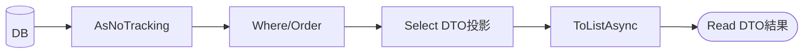

# 第18章　Queryの基本② EFで投影＆AsNoTrackingで軽量化⚡👀

この章は「読み取り（Query）」を**速く・軽く・安全に**する回だよ〜！✨
CQRSのRead側は“表示のためのデータ取得”が主役なので、ここをちゃんと作ると体感が変わる😊🚀

---

## この章でできるようになること 🎯✨

* 「追跡（Tracking）」と「追跡なし（No-Tracking）」の違いがわかる👀
* **AsNoTracking** でReadを軽くできる⚡
* Entityを丸ごと返さず、**DTOへ投影（Projection）**して必要な列だけ取れる📦
* 「ダメなLINQ」と「良いLINQ」を見分けられる😇✅

（EF Coreの追跡/追跡なしや投影まわりの公式挙動をベースに説明するよ）([Microsoft Learn][1])

---

## 1) まず「追跡」ってなに？🧠📝

EF Coreは、通常のクエリだと取得したEntityを**変更トラッカー（Change Tracker）**に登録して、あとで更新できるようにするよ〜。

* ✅ Tracking：あとで更新しやすい（変更検知してSaveChangesできる）
* ✅ No-Tracking：更新しない前提で軽い（登録しない）

Read側って基本「表示して終わり」だから、**No-Trackingが相性よい**のだ😊⚡
公式でも “読み取り専用ならNo-Trackingが便利” という立ち位置だよ。([Microsoft Learn][1])

---

## 2) “ダメ寄り”の例 😵‍💫（重い・危ない・ムダ）

ありがちなやつ👇
「全部取ってから、メモリ上でDTOに変換する」パターン！

```csharp
// 😵 ダメ寄り：Tracking + Include + 全列取得 + メモリで変換
var orders = await db.Orders
    .Include(o => o.Customer)
    .Include(o => o.Items)
    .Where(o => o.CreatedAt >= from && o.CreatedAt < to)
    .OrderByDescending(o => o.CreatedAt)
    .ToListAsync();

var dtos = orders.Select(o => new OrderListItemDto(
    o.Id,
    o.Customer.Name,
    o.Items.Count,
    o.Items.Sum(i => i.UnitPrice * i.Quantity),
    o.Status,
    o.CreatedAt
)).ToList();
```

### これの“困るところ”😇💦

* Trackingの分だけ、**メモリもCPUも余計に使う**（Readなのに）([Microsoft Learn][1])
* Includeで**欲しくない列/行まで引っ張りがち**（通信もDBも重い）
* 変換がメモリ上なので、**DB側で最適化できない**ことがある
* DTOじゃなくEntityを返す流れに繋がりやすく、将来の変更が怖い👻

---

## 3) “良い”例：DTOへ投影＋AsNoTracking ✨⚡




ポイントはこれ👇
**SelectでDTOに投影してから**、最後にToListAsyncする！

```csharp
// ✨ 良い：No-Tracking + 必要列だけ + サーバー側でDTO生成
var dtos = await db.Orders
    .AsNoTracking()
    .Where(o => o.CreatedAt >= from && o.CreatedAt < to)
    .OrderByDescending(o => o.CreatedAt)
    .Select(o => new OrderListItemDto(
        o.Id,
        o.Customer.Name,
        o.Items.Count(),
        o.Items.Sum(i => i.UnitPrice * i.Quantity),
        o.Status,
        o.CreatedAt
    ))
    .ToListAsync();
```

### 何が嬉しいの？🥰

* **追跡しない**から軽い⚡（Read専用の最適化）([Microsoft Learn][1])
* **必要な列だけ**SELECTされやすい（DTO投影の強み）📦
* 集計（Count/Sumなど）が**DBで処理**されやすい📊
* Controller/APIが「表示用DTO」を返すだけになって、設計がキレイ✨

---

## 4) 投影（Projection）のコツ集 🧩✨

### コツA：Where / OrderBy は “ToListAsyncの前” に全部置く✅

途中でToListAsyncしちゃうと、そこでDBから全部引いてメモリ処理になるよ😇💦
**最後までIQueryableのまま**が基本！

---

### コツB：Includeは「DTO投影の時は不要」なことが多い👀

Selectの中で「Customer.Name」みたいに参照できれば、EFがJOIN等にしてくれることが多いよ。
（ただし複雑になると読みづらくなるから、まずは“一覧用DTOは薄く”が正解😊）

---

### コツC：AsNoTrackingの“上位互換”もある（たまに使う）🧠

No-Trackingは基本、同じ行が複数回出ると**別インスタンス**になりうる（＝ID解決しない）よ。([Microsoft Learn][2])
「グラフを組み立てたいけど追跡は要らない」みたいな時は、

* AsNoTrackingWithIdentityResolution：**追跡はしないけどID解決だけする**

という選択肢がある。([Microsoft Learn][1])
ただし、**“一覧API”ではまず不要**だよ〜（欲しくなるのはもうちょい後）😊

---

### コツD：Read側は“追跡なしをデフォルト”にしてもOK🙆‍♀️

Read専用のDbContextを作って、QueryTrackingBehaviorをNoTrackingにする考え方もあるよ。
「Read側は常にNo-Tracking」って決めると事故りにくい✨([Microsoft Learn][1])

---

## 5) つまずきポイントあるある 😅🧯

### つまずき①：SelectのあとにToListAsync…じゃなくて、ToListAsyncのあとにSelectしてた！

* ✅ 正：Where → Select → ToListAsync
* ❌ ダメ：Where → ToListAsync → Select

**“DBで作れる形にしてから取る”**が超大事だよ〜📦🚀

---

### つまずき②：LINQがSQLに変換できなくてエラー😵

例：自作メソッド呼び出し、複雑なC#の処理をSelect内に入れすぎる…など。
基本は「DBでできること（文字列Like、日付比較、集計）」に寄せると安定😊
（このへんは“AIに変換可能かレビューさせる”のが便利！🤖✅）

---

### つまずき③：Read DTOに“盛りすぎ”🍔

一覧DTOに詳細まで詰めると、JOIN/集計が重くなりがち。
一覧は「サムネ」、詳細は「詳細Query」で分けるのが読みやすいよ✨

---

## 6) ミニ演習 🎮📝（15〜30分）

### お題：注文一覧を「軽く」する⚡

1. まず“ダメ寄り版”で一覧を作る（Tracking + Include + ToListAsyncしてからSelect）😇
2. 次に“良い版”へリファクタ（AsNoTracking + Select投影 + 最後にToListAsync）✨
3. ついでに「必要な列だけ」にできたかチェック👀

#### 目標✅

* 一覧のDTOは「Id / 顧客名 / 件数 / 合計 / ステータス / 作成日」だけ
* Entityを返さない
* AsNoTrackingが入ってる

---

## 7) AI活用プロンプト例 🤖✨（そのままコピペOK）

* 「このQueryをDTO投影に直して。ToListAsyncは最後、AsNoTrackingを使って。SQLに変換できない処理が混ざってたら指摘して」
* 「このLINQ、DB側で実行される？クライアント評価になりそうな部分を列挙して」
* 「一覧DTOに必要な項目だけに減らす提案して。過剰なIncludeがあれば削って」

---

## 8) 仕上げチェックリスト ✅💖

* AsNoTrackingが付いてる？（Read専用なら基本Yes）([Microsoft Learn][1])
* SelectでDTOへ投影してる？（Entity丸ごと返してない？）📦
* ToListAsyncが途中にない？（最後になってる？）⚡
* 一覧DTOは軽い？（盛りすぎてない？）🍔
* Count/Sumなど、DBでやるべき計算をDBに寄せてる？📊

---

## ちょい最新メモ🗓️✨

今の世代だと、EF Coreは「追跡/追跡なし」「ID解決」「投影」の基本がかなり整理されてて、公式ドキュメントもこの方針で説明されてるよ。([Microsoft Learn][3])
（プラットフォーム自体も最新のLTS世代へ進んでるので、学んだ型がそのまま効く👍）([Microsoft][4])

---

次の第19章（ページング/ソート/フィルタ）に入ると、この第18章の「投影＋No-Tracking」がさらに威力出るよ〜！📄✨
続きも同じ題材（注文一覧）でつなげて作れるようにしてある😊💞

[1]: https://learn.microsoft.com/ja-jp/ef/core/querying/tracking?utm_source=chatgpt.com "追跡クエリと No-Tracking クエリ - EF Core"
[2]: https://learn.microsoft.com/en-us/ef/core/change-tracking/identity-resolution?utm_source=chatgpt.com "Identity Resolution - EF Core"
[3]: https://learn.microsoft.com/en-us/ef/core/what-is-new/?utm_source=chatgpt.com "EF Core releases and planning"
[4]: https://dotnet.microsoft.com/en-us/platform/support/policy/dotnet-core?utm_source=chatgpt.com "NET and .NET Core official support policy"
