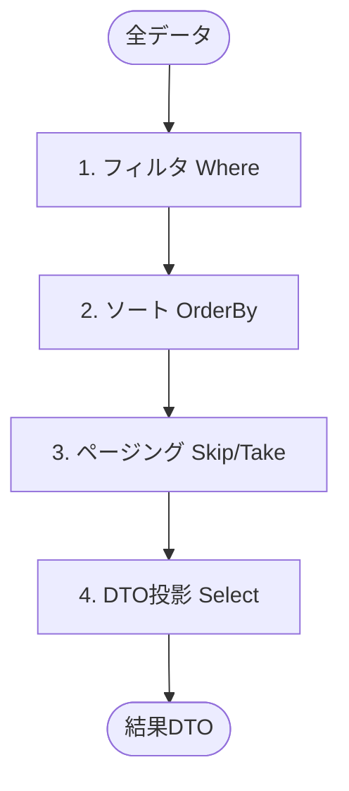

# 第19章　Queryの基本③ ページング / ソート / フィルタの定番セット📄✨

この章は「一覧画面あるある」── **検索して🔍、並べ替えて🔃、ページでめくる📄** を、Query側でキレイに作れるようになる回だよ〜！😊🌸
（CQRSの“読み側”なので、**参照だけ**に集中するよ👀✨）

---

## 0) いまの前提（2026/01/23時点の“最新”メモ）🧠💡

* **EF Core 10** は **2025年11月リリース**の **LTS** で、**2028/11/10**までサポート予定だよ📌 ([Microsoft Learn][1])
* EF Core 10 を使うなら、**.NET 10 が必要**だよ（.NET Frameworkでは動かない）⚠️ ([Microsoft Learn][1])
* .NET 10 では EF Core 10 も含めて色々アップデートされてるよ✨ ([Microsoft Learn][2])

---

## 1) まず結論：Queryはこの順番が鉄板だよ🥇✨




**フィルタ → ソート（安定） → ページング → 投影（DTO化）** の順で組むと事故りにくいよ😊✅

* フィルタ：`Where(...)` 🔍
* ソート：`OrderBy(...)` / `ThenBy(...)` 🔃
* ページング：`Skip(...)` + `Take(...)` 📄
* 投影：`Select(...)` で Read DTO を作る 📦

💥やりがち事故：

* ❌ 全件 `ToList()` してからメモリで絞る（激遅🐢）
* ❌ ソートなしでページング（結果が毎回ブレる😵‍💫）
* ❌ クライアントから任意の `sort=xxx` をそのままSQLに反映（安全面でも設計面でも怖い😇）

---

## 2) “ページ番号方式（offset pagination）”の注意点も知っておこ📌

`Skip/Take` でページングするのは直感的なんだけど、

* DBは **スキップした分も処理**するから、深いページほど重くなりがち😵
* **並行更新**があると、**飛ばしたり二重に出たり**が起きることがあるよ💥 ([Microsoft Learn][3])

だから、まずはページ番号方式を作って、重くなってきたら **次の章の“発展”**で **カーソル方式（keyset）**も検討できるようにするのが◎だよ✨
（EF Core公式も keyset を推してるよ✅） ([Microsoft Learn][3])

---

## 3) 今回つくるもの（GET一覧Query）🧩✨

例：注文一覧（Orders）を想定するよ🛒
こんな感じのURLで取れるようにする！

* `GET /api/orders?page=1&pageSize=20&sort=CreatedAt&dir=Desc&keyword=phone&status=Paid`

欲しい機能はこれ👇

* ✅ ページング：`page`, `pageSize`
* ✅ ソート：`sort`, `dir`
* ✅ フィルタ：`keyword`, `status`（あとで増やせる✨）
* ✅ 戻り値に `totalCount` も入れる（UIが作りやすい📱）

---

## 4) 実装：Query DTO / 結果 DTO / Handler を作るよ🧑‍🍳✨

### 4-1) DTOたち📦

```csharp
using Microsoft.EntityFrameworkCore;

public enum SortDirection { Asc, Desc }

// ✅ “ソート項目は列挙”にして、自由入力を封じるのが安全＆ラク😇
public enum OrderSort
{
    CreatedAt,
    TotalAmount,
    CustomerName
}

public enum OrderStatus
{
    Draft,
    Paid,
    Shipped,
    Cancelled
}

// ✅ Query DTO（読み取り条件）
public sealed record OrderListQuery(
    int Page = 1,
    int PageSize = 20,
    OrderSort Sort = OrderSort.CreatedAt,
    SortDirection Dir = SortDirection.Desc,
    string? Keyword = null,
    OrderStatus? Status = null
)
{
    public OrderListQuery Normalized()
    {
        var page = Page < 1 ? 1 : Page;

        // 🎛️ PageSizeは上限を決めよう（例：最大100）
        var size = PageSize switch
        {
            < 1 => 20,
            > 100 => 100,
            _ => PageSize
        };

        // keywordの空白は null 扱いにしてスッキリ✨
        var kw = string.IsNullOrWhiteSpace(Keyword) ? null : Keyword.Trim();

        return this with { Page = page, PageSize = size, Keyword = kw };
    }
}

// ✅ Read DTO（一覧表示用）
public sealed record OrderListItemDto(
    Guid Id,
    DateTimeOffset CreatedAt,
    string CustomerName,
    decimal TotalAmount,
    OrderStatus Status
);

// ✅ ページング結果の器
public sealed record PagedResult<T>(
    IReadOnlyList<T> Items,
    int Page,
    int PageSize,
    long TotalCount
)
{
    public long TotalPages => (TotalCount + PageSize - 1) / PageSize;
}
```

---

### 4-2) Handler（Query専用ロジック）🍳✨

ポイントはここ👇

* `AsNoTracking()`（読み取り専用で軽く⚡）
* **Where → OrderBy → Skip/Take → Select** の順
* **安定ソート**のために `ThenBy(Id)` を必ず入れる（同点の並びを固定📌）

```csharp
public sealed class OrdersQueryHandler
{
    private readonly AppDbContext _db;

    public OrdersQueryHandler(AppDbContext db) => _db = db;

    public async Task<PagedResult<OrderListItemDto>> Handle(OrderListQuery raw, CancellationToken ct = default)
    {
        var q = raw.Normalized();

        IQueryable<Order> query = _db.Orders.AsNoTracking();

        // 1) フィルタ 🔍
        if (q.Keyword is not null)
        {
            // 例：顧客名に部分一致（必要なら他の列もORで増やせる）
            query = query.Where(o => o.CustomerName.Contains(q.Keyword));
        }

        if (q.Status is not null)
        {
            query = query.Where(o => o.Status == q.Status);
        }

        // 2) 総件数（ページング前に数える）📏
        var totalCount = await query.LongCountAsync(ct);

        // 3) ソート（安定化のThenByが大事！）🔃
        query = ApplyOrdering(query, q.Sort, q.Dir);

        // 4) ページング 📄
        var skip = (q.Page - 1) * q.PageSize;

        // 5) 投影（DTO化）📦
        var items = await query
            .Skip(skip)
            .Take(q.PageSize)
            .Select(o => new OrderListItemDto(
                o.Id,
                o.CreatedAt,
                o.CustomerName,
                o.TotalAmount,
                o.Status
            ))
            .ToListAsync(ct);

        return new PagedResult<OrderListItemDto>(items, q.Page, q.PageSize, totalCount);
    }

    private static IQueryable<Order> ApplyOrdering(IQueryable<Order> query, OrderSort sort, SortDirection dir)
    {
        // ✅ “同値のときの並び”を固定するため、最後に ThenBy(Id) を必ず付けるよ📌
        return (sort, dir) switch
        {
            (OrderSort.CreatedAt, SortDirection.Asc)
                => query.OrderBy(o => o.CreatedAt).ThenBy(o => o.Id),

            (OrderSort.CreatedAt, SortDirection.Desc)
                => query.OrderByDescending(o => o.CreatedAt).ThenByDescending(o => o.Id),

            (OrderSort.TotalAmount, SortDirection.Asc)
                => query.OrderBy(o => o.TotalAmount).ThenBy(o => o.Id),

            (OrderSort.TotalAmount, SortDirection.Desc)
                => query.OrderByDescending(o => o.TotalAmount).ThenByDescending(o => o.Id),

            (OrderSort.CustomerName, SortDirection.Asc)
                => query.OrderBy(o => o.CustomerName).ThenBy(o => o.Id),

            (OrderSort.CustomerName, SortDirection.Desc)
                => query.OrderByDescending(o => o.CustomerName).ThenByDescending(o => o.Id),

            _ => query.OrderByDescending(o => o.CreatedAt).ThenByDescending(o => o.Id)
        };
    }
}
```

🧠補足：
`Skip/Take` の offset 方式は直感的だけど、深いページで重くなったり、更新があるとズレたりすることがあるよ⚠️ ([Microsoft Learn][3])
だからこそ **「必ずソートしてからページング」**＆**安定化の ThenBy** が効くよ😊✨

---

## 5) APIに繋ぐ（Minimal API例）🔌✨

```csharp
app.MapGet("/api/orders", async (
    [AsParameters] OrderListQuery query,
    OrdersQueryHandler handler,
    CancellationToken ct
) =>
{
    var result = await handler.Handle(query, ct);
    return Results.Ok(result);
});
```

* `[AsParameters]` でクエリ文字列を DTO にまとめて受け取れてスッキリするよ〜😊✨

---

## 6) ミニ演習（10〜20分）⏱️💪

### 演習A：フィルタを1個増やす（合計金額の下限）💰

* `decimal? MinTotal` を `OrderListQuery` に追加
* `if (q.MinTotal is not null) query = query.Where(o => o.TotalAmount >= q.MinTotal);`

### 演習B：「2ページ目以降が遅い」を体験→改善のタネにする🐢➡️🚀

* テストデータを増やして `page=200` とか叩く
* 「offset方式は深いページが重くなりがち」を体感しておく✨ ([Microsoft Learn][3])

---

## 7) おまけ：重い一覧なら“カーソル方式（keyset pagination）”も視野👀✨

EF Core公式でも、offsetの弱点を避ける **keyset pagination（seek / cursor）** を推してるよ✅ ([Microsoft Learn][3])

考え方はシンプル👇

* 「何件スキップ」じゃなくて
* 「前回の最後の行より後（or前）を取る」

例えば「作成日時 desc（同点はId desc）」の並びなら、
次ページは `WHERE (CreatedAt < lastCreatedAt) OR (CreatedAt == lastCreatedAt AND Id < lastId)` みたいにするの🥳

ページ番号UIじゃなくてもOK（“もっと見る”）ならこれが強いよ〜💪✨

---

## 8) AI活用プロンプト（Copilot / Codex向け）🤖✨

* 「`OrderListQuery` に `MinTotal` と `From/To` 日付フィルタを追加して、HandlerのWhereも更新して」🧠🛠️
* 「ソート項目を enum で安全に受ける設計にしたい。APIのクエリ文字列と enum を自然に対応させる例を出して」🔃
* 「offset方式が遅くなった時に keyset pagination に移行する手順を、このコードベース前提で提案して」🚀

---

## 9) この章の“合格ライン”✅🎉

* ✅ Query DTO に **Page / PageSize / Sort / Dir / Filters** がある
* ✅ Handler が **Where → OrderBy → Skip/Take → Select** の順
* ✅ **安定ソート（ThenBy Id）** を入れてる
* ✅ 返り値に `TotalCount` があり、UIがページ数を出せる

---

次の章（第20章）で「複雑検索はDapper/生SQLが強いこともある」って話に繋がるから、まずこの章で **“EFでやる定番セット”**を体に入れちゃお〜😊📚✨

[1]: https://learn.microsoft.com/en-us/ef/core/what-is-new/ef-core-10.0/whatsnew "What's New in EF Core 10 | Microsoft Learn"
[2]: https://learn.microsoft.com/en-us/dotnet/core/whats-new/dotnet-10/overview "What's new in .NET 10 | Microsoft Learn"
[3]: https://learn.microsoft.com/en-us/ef/core/querying/pagination "Pagination - EF Core | Microsoft Learn"
