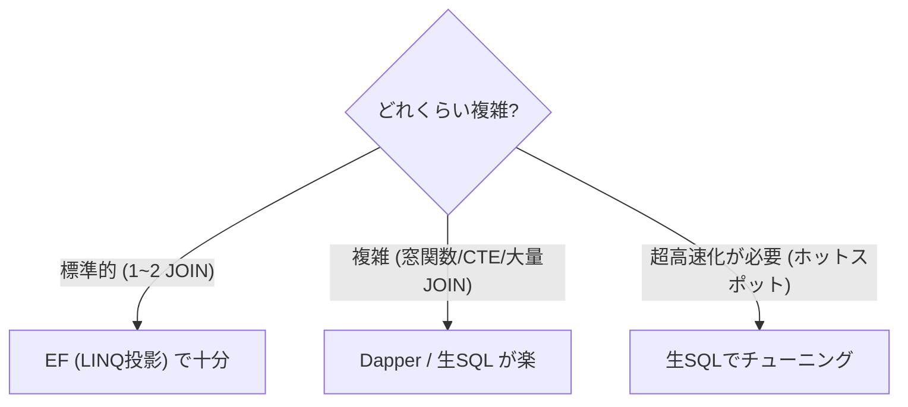

# 第20章　Queryの発展① Dapper/生SQLの入口（必要になったら）🧪🧠✨

この章はね、「**Query（読む側）だけ**、どうしても複雑 or 重くなってきたときに、**Dapper / 生SQL**を“安全に”使えるようになる」回だよ〜😊💕

---

## 0) この章のゴール 🎯✨

* EF（LINQ投影）で十分なところは、ちゃんとEFで書ける👀✨
* **「ここ、SQLのほうが分かりやすい＆速い」**って場面で、Dapperを選べる💪
* **SQLインジェクション**とか、**ORDER BY注入**みたいな事故を避けられる🛡️
* **EF版 / SQL版**で同じ一覧を作って、差を体験できる🔁📄

---

## 1) どんなときに「SQLが強い」ってなるの？🤔🔍




EF（LINQ）は万能寄りだけど、こういう場面で「うっ…」ってなりがち👇

* 画面表示に合わせた **複雑JOIN + 集計 + 派生列** が多い📊
* **CTE / WINDOW関数 / JSON系SQL**などDB機能を使いたい🧙‍♀️✨
* LINQだと式が長すぎて、**読めない・直せない**😵‍💫
* “この画面だけ”めちゃ重い（いわゆるホットスポット）🔥

そんなときに、**Queryだけ**Dapper/生SQLを選べると強いよ〜💞
Dapperは「ADO.NETの面倒を減らしてくれるマイクロORM」って立ち位置で、`DbConnection`に拡張メソッドを生やしてサクッとSQL実行できる感じ🙌 ([NuGet][1])

---

## 2) でも最初から全部Dapperにしないほうがいい理由😇🧯

Dapperは気持ちいいんだけど、最初から全部やるとこうなること多い👇

* SQLがアプリのあちこちに散らばって、**変更に弱い**🧨
* DTOとSQLが増えて、**管理コストが急に上がる**📦💦
* 書き方ルールが無いと、**事故（注入・N+1・全件取得）**が起きる😱

だからこの章の方針はこれ👇✨

✅ **Write（更新）は今まで通りEF中心**（整合性・変更追跡が便利）
✅ **Read（参照）の一部だけ**、必要になったらSQLを使う
✅ SQLは **QueryHandlerの中に閉じ込める**（散らばらせない）📦

---

## 3) “生SQL”っていっても、EFにも安全な道があるよ🛡️

EF Coreには、SQLを直接投げる手段もあるよね。
特に `FromSqlInterpolated` / `FromSql` 系は**パラメータ化される**ので、SQLインジェクションに強いのがポイント✨
逆に `FromSqlRaw` を雑に使うと危ないことがあるので注意だよ〜⚠️ ([Microsoft Learn][2])

つまり選択肢はこう👇

* **LINQ投影で書ける** → まずそれでOK😊
* **EFのSQL（FromSqlInterpolated等）で済む** → それもアリ🧩
* **SQLをガッツリ書きたい＆マッピングも軽くしたい** → Dapperが便利✨ ([NuGet][1])

---

## 4) Dapper導入（Queryプロジェクトにだけ入れるのがオススメ）📦✨

* `Dapper`（本体）
* DBに合わせた ADO.NET Provider（例：SQL Serverなら `Microsoft.Data.SqlClient`）

`Microsoft.Data.SqlClient` は SQL Server/Azure SQL向けのプロバイダで、今後の新機能対応はこちらが中心だよ〜🧠✨ ([Microsoft Learn][3])

> DapperのNuGet最新は 2.1.66（2025-02-06更新）として公開されてるよ📌 ([NuGet][1])

---

## 5) 作る例：注文一覧（ページング＋フィルタ＋ソート）📄🔍✨

ここからはミニECの「注文一覧」を例にするね😊
**同じ機能を EF版 / Dapper版**で作って比べよう〜🔁💕

### 5-1) Read DTO（表示用）📦

```csharp
public sealed record OrderListItemDto(
    Guid OrderId,
    string OrderNo,
    string CustomerName,
    decimal TotalAmount,
    string Status,
    DateTimeOffset OrderedAt
);
```

### 5-2) Query（検索条件DTO）🔍

```csharp
public sealed record GetOrderListQuery(
    string? Keyword,
    string? Status,
    string SortBy = "OrderedAt",
    string SortDir = "desc",
    int Page = 1,
    int PageSize = 20
);

public sealed record PagedResult<T>(
    IReadOnlyList<T> Items,
    int TotalCount,
    int Page,
    int PageSize
);
```

---

## 6) EF版（投影＋AsNoTracking）⚡👀

「まずEFで書くならこう」っていう基準になるやつね✨

```csharp
public async Task<PagedResult<OrderListItemDto>> HandleEfAsync(
    GetOrderListQuery q, CancellationToken ct)
{
    // IQueryableで組み立てる（まだ実行しない）
    var query = _db.Orders
        .AsNoTracking()
        .Select(o => new OrderListItemDto(
            o.Id,
            o.OrderNo,
            o.CustomerName,
            o.TotalAmount,
            o.Status,
            o.OrderedAt
        ));

    if (!string.IsNullOrWhiteSpace(q.Status))
        query = query.Where(x => x.Status == q.Status);

    if (!string.IsNullOrWhiteSpace(q.Keyword))
        query = query.Where(x =>
            x.OrderNo.Contains(q.Keyword) ||
            x.CustomerName.Contains(q.Keyword));

    // ソート（ホワイトリスト方式）
    query = (q.SortBy, q.SortDir.ToLowerInvariant()) switch
    {
        ("OrderNo", "asc") => query.OrderBy(x => x.OrderNo),
        ("OrderNo", "desc") => query.OrderByDescending(x => x.OrderNo),
        ("TotalAmount", "asc") => query.OrderBy(x => x.TotalAmount),
        ("TotalAmount", "desc") => query.OrderByDescending(x => x.TotalAmount),
        (_, "asc") => query.OrderBy(x => x.OrderedAt),
        _ => query.OrderByDescending(x => x.OrderedAt),
    };

    var total = await query.CountAsync(ct);

    var items = await query
        .Skip((q.Page - 1) * q.PageSize)
        .Take(q.PageSize)
        .ToListAsync(ct);

    return new(items, total, q.Page, q.PageSize);
}
```

EFは**投影＋NoTracking**でかなり速くなることが多いよ⚡（第18章の復習だね😊）

---

## 7) Dapper版（SQLで同じ一覧を作る）🧪✨

### 7-1) “危ないポイント”はソート（ORDER BY）⚠️

SQLのパラメータって、`WHERE`の値は守れるんだけど、
**列名（ORDER BYの対象）**はパラメータ化できないことが多いの。

なので👇を徹底するよ🛡️✨

✅ **ソート対象はホワイトリストで固定**
✅ ユーザー入力をそのまま SQL 文字列に入れない

---

### 7-2) 接続を作る（Factoryで隠す）🔌

```csharp
using System.Data;
using Microsoft.Data.SqlClient;

public interface IDbConnectionFactory
{
    Task<IDbConnection> CreateOpenConnectionAsync(CancellationToken ct);
}

public sealed class SqlConnectionFactory : IDbConnectionFactory
{
    private readonly string _connectionString;

    public SqlConnectionFactory(string connectionString)
        => _connectionString = connectionString;

    public async Task<IDbConnection> CreateOpenConnectionAsync(CancellationToken ct)
    {
        var conn = new SqlConnection(_connectionString);
        await conn.OpenAsync(ct);
        return conn;
    }
}
```

---

### 7-3) Dapper QueryHandler（QueryMultipleで“一覧＋件数”を1往復）🚀

```csharp
using Dapper;
using System.Text;

public sealed class GetOrderListDapperHandler
{
    private readonly IDbConnectionFactory _factory;

    public GetOrderListDapperHandler(IDbConnectionFactory factory)
        => _factory = factory;

    public async Task<PagedResult<OrderListItemDto>> HandleAsync(
        GetOrderListQuery q, CancellationToken ct)
    {
        // 1) ORDER BYはホワイトリストで固定！
        var sortColumn = q.SortBy switch
        {
            "OrderNo" => "o.OrderNo",
            "TotalAmount" => "o.TotalAmount",
            _ => "o.OrderedAt",
        };

        var sortDir = q.SortDir.Equals("asc", StringComparison.OrdinalIgnoreCase)
            ? "ASC"
            : "DESC";

        // 2) WHEREは動的に組む（値は必ずパラメータ）
        var where = new StringBuilder("WHERE 1 = 1 ");
        var param = new DynamicParameters();

        if (!string.IsNullOrWhiteSpace(q.Status))
        {
            where.Append(" AND o.Status = @Status ");
            param.Add("Status", q.Status);
        }

        if (!string.IsNullOrWhiteSpace(q.Keyword))
        {
            where.Append(" AND (o.OrderNo LIKE @Kw OR o.CustomerName LIKE @Kw) ");
            param.Add("Kw", $"%{q.Keyword}%");
        }

        var offset = (q.Page - 1) * q.PageSize;
        param.Add("Offset", offset);
        param.Add("PageSize", q.PageSize);

        // 3) SQL（一覧 + 件数）
        var sql = $@"
SELECT
    o.Id            AS OrderId,
    o.OrderNo       AS OrderNo,
    o.CustomerName  AS CustomerName,
    o.TotalAmount   AS TotalAmount,
    o.Status        AS Status,
    o.OrderedAt     AS OrderedAt
FROM Orders o
{where}
ORDER BY {sortColumn} {sortDir}
OFFSET @Offset ROWS FETCH NEXT @PageSize ROWS ONLY;

SELECT COUNT(1)
FROM Orders o
{where};
";

        using var conn = await _factory.CreateOpenConnectionAsync(ct);

        // 4) 1回の往復で2結果セットを読む✨
        using var multi = await conn.QueryMultipleAsync(
            new CommandDefinition(sql, param, cancellationToken: ct));

        var items = (await multi.ReadAsync<OrderListItemDto>()).AsList();
        var total = await multi.ReadSingleAsync<int>();

        return new(items, total, q.Page, q.PageSize);
    }
}
```

ここ、超だいじなポイントはこれだよ👇💗

* `LIKE` の中身も **パラメータ**にする（文字列連結しない）🛡️
* `ORDER BY` だけは例外なので **ホワイトリスト**で安全に固定🔒
* `QueryMultiple` で **一覧＋件数**をまとめて取ると、地味に効く🚀

---

## 8) EF版 vs Dapper版：どう比べたらいい？🔁👀✨

比較の観点はこの3つが分かりやすいよ〜😊

### (1) 読みやすさ📖

* 条件が少ない：EFが読みやすいこと多い✨
* 条件が複雑：SQLが読みやすいこと増える✨

### (2) 性能（体感じゃなく計測）⏱️📊

* EFでも **投影＋NoTracking**で十分速いことが多い
* SQLのほうが **“狙い撃ち”**しやすい（必要な列、必要なJOINだけ）
* ただし、**SQLが速いかどうかは書き方次第**😇

> 速度最適化は第31〜33章で本格的にやるけど、ここでは「同じ結果を2通りで出す」体験が目的だよ✨

### (3) 安全性🛡️

* EFは基本的にパラメータ化されやすい
* SQLは**自分で事故を防ぐ設計**が必要
* EFの生SQLでも、安全なAPI（FromSqlInterpolated等）がある ([Microsoft Learn][2])

---

## 9) よくある事故パターン集（これだけ避けて！）😱🧯

### ❌ 事故1：WHEREの値を文字列連結

```csharp
// ダメ！危ない！
var sql = "SELECT ... WHERE UserName = '" + userInput + "'";
```

✅ **必ずパラメータ**にする
（DapperもEFも、パラメータ化が基本の安全ルートだよ） ([Microsoft Learn][2])

---

### ❌ 事故2：ORDER BYにユーザー入力を直で入れる

```csharp
// ダメ！列名注入が起こる！
var sql = $"... ORDER BY {q.SortBy}";
```

✅ **ホワイトリスト**で固定する（この章の実装みたいにね🔒）

---

### ❌ 事故3：SQLが散らばる

✅ **QueryHandlerに閉じ込める**
✅ SQL文字列は「画面単位」でまとめる（一覧なら一覧に集中）📦✨

---

## 10) ミニ演習（この章の“勝ち筋”）🏆🧪

### 演習A：同じ一覧を EF版 / Dapper版 で作って結果一致させる🔁

* 条件：`Keyword` と `Status` と `Paging` は必須
* 並び順：`OrderedAt desc` をデフォにする

✅ チェック：

* 同じ検索条件で、**件数**と**先頭5件**が一致する？👀✨

---

### 演習B：ソート列を1個増やす🧩

* `CustomerName` をソート可能にしてね😊
* ✅必ずホワイトリストに追加すること！

---

## 11) Copilot / Codex に頼むときのプロンプト例🤖💬✨

* 「このDTOに合わせて、Ordersテーブルからページング一覧を返すSQLを書いて。WHEREはStatusとKeyword。ORDER BYはホワイトリストで安全に。」
* 「DapperでQueryMultipleを使って、一覧＋総件数を1回の往復で取るC#コードを書いて。CancellationToken対応で。」
* 「ORDER BY注入を避ける実装例を出して。switchで列名を固定する方式で。」

※ AIはたまに**ORDER BYに入力を直で入れる**コードを出しがちだから、そこだけ目を光らせてね👀⚠️💕

---

## まとめ：この章で覚えたら勝ち✨🎉

* まずEF（投影＋NoTracking）で書くのが基本😊
* “どうしても複雑・重い”ところだけ、Dapper/SQLを使う🧪
* SQLの安全は **パラメータ化＋ORDER BYホワイトリスト**が命🛡️
* EF版とSQL版を作って比べると、「使い分けの感覚」が一気に身につくよ〜🔁💗

---

次の第21章は、ここで書いたSQLをさらに「読みモデルとして気持ちよく設計する（JOIN/集計/派生列）」に進むよ📊✨

[1]: https://www.nuget.org/packages/dapper/?utm_source=chatgpt.com "Dapper 2.1.66"
[2]: https://learn.microsoft.com/en-us/ef/core/querying/sql-queries?utm_source=chatgpt.com "SQL Queries - EF Core"
[3]: https://learn.microsoft.com/en-us/sql/connect/ado-net/download-microsoft-sqlclient-data-provider?view=sql-server-ver17&utm_source=chatgpt.com "Download Microsoft SqlClient Data Provider for SQL Server"
