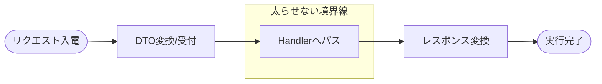

# 第22章　API層は薄く① Controller / Minimal APIの作法🔌✨

この章はひとことで言うと――
**「APIは“受付”だけやる」**を体にしみこませる回だよ😺📮

---

## 0. 今日のゴール🎯

* Controller / Minimal API が **太らない**（神クラス化しない）👑💦
* 「受け取る → Handlerに渡す → 返す」だけを **型として固定**できる✨
* 例外・ログ・バリデーションの置き場を、**API層の外**に寄せられる🧼

---

## 1. なぜAPI層を薄くするの？🤔💡

CQRSで一番やりたいのは、結局これ👇

* **書く（Command）**：業務ルール・整合性を守る💪
* **読む（Query）**：表示・検索を速く、都合よく👀⚡
 
 

なのに、API層が太ると…

* 「どこに業務ルール書いたっけ？」で迷子🧭💦
* テストしにくい（HTTP絡むと重い）🧪😵
* 仕様変更のたびにControllerが爆発🔥

だからAPIは **受付係**でOK🙆‍♀️✨

---

## 2. “薄いAPI”の7ルール📏✨



### ✅ APIがやっていいこと（受付の仕事）

1. **入力を受け取る**（Body / Route / Query）📥
2. **DTOをCommand/Queryに変換**（必要最小限）🔁
3. **Handlerを呼ぶ**📮
4. **HTTPレスポンスにして返す**（201/200/404…）📤
5. **認可やログなどの仕組み**は「呼ばれる」だけ（属性/ミドルウェア/フィルタ）🧩

### ❌ APIがやっちゃダメなこと（太る原因）

* DBアクセス直書き🗄️💥
* 業務ルール（在庫/期限/状態遷移…）をifで書く🚫
* try/catchを各エンドポイントにベタ書き（例外方針がバラバラ）😵‍💫
* 大量のマッピングや集計をControllerでやる🍔

---

## 3. ControllerとMinimal API、どっちを使う？⚖️

どっちでもOK！ただし「薄くする」は共通ルールだよ😺✨

### Controllerが向いてるとき🎛️

* チームが慣れてる / 属性で表現したい（[ApiController]とか）
* ActionResultの流儀で統一したい
* “王道Web API”の形で読みやすくしたい📚

### Minimal APIが向いてるとき🧪

* 1ファイルでサクッと書いて育てたい🌱
* エンドポイントを短く保ちたい✂️
* ルート定義を見通しよく並べたい🗺️

---

## 4. 戻り値の作法：型を揃えると一気に楽😺🧩

### Controllerの戻り値（おすすめ）🎁

* **`ActionResult<T>`** を基本にすると、成功も失敗も表現しやすいよ🙆‍♀️
  （OpenAPIの型も安定しやすい）([Microsoft Learn][1])

### Minimal APIの戻り値（おすすめ）🎁

* `IResult` / `Results` / `TypedResults` を使って「何を返すか」を明確にするのが基本だよ✨([Microsoft Learn][2])

---

## 5. エラーはAPI層で頑張らない🧯➡️🧼

**各エンドポイントにtry/catchを書き始めた瞬間、負け**😇💦
代わりにこうする👇

* 例外は上に投げる（Handler→上へ）🕊️
* **例外処理ミドルウェア**でまとめて整形する
* 返すエラーは **ProblemDetails（RFC 7807）** に寄せると、クライアント側も楽✨([Microsoft Learn][3])

.NET 10だと、`AddProblemDetails()` や `UseExceptionHandler()` と組み合わせて **“共通のエラー形式”** を作りやすいよ🧩([Microsoft Learn][3])

---

# 6. 実装例①：薄いController（Command / Query）📮✨

題材は「注文（Order）」っぽい雰囲気でいくね🛒😊
（中身のDB更新・検索は Handler 側にある前提）

```csharp
// Request/Response DTO（API用）
public sealed record CreateOrderRequest(Guid CustomerId, IReadOnlyList<CreateOrderItemRequest> Items);
public sealed record CreateOrderItemRequest(Guid ProductId, int Quantity);

public sealed record CreateOrderResponse(Guid OrderId);

public sealed record GetOrderListResponse(IReadOnlyList<OrderListItemDto> Items);
public sealed record OrderListItemDto(Guid OrderId, string CustomerName, decimal TotalPrice);

// CQRS DTO（アプリ層用）
public sealed record CreateOrderCommand(Guid CustomerId, IReadOnlyList<CreateOrderItem> Items);
public sealed record CreateOrderItem(Guid ProductId, int Quantity);

public sealed record GetOrderListQuery(int Page, int PageSize);
```

```csharp
// Handler（中身は別章で育ててOK）
public interface ICreateOrderHandler
{
    Task<Guid> Handle(CreateOrderCommand command, CancellationToken ct);
}

public interface IGetOrderListHandler
{
    Task<IReadOnlyList<OrderListItemDto>> Handle(GetOrderListQuery query, CancellationToken ct);
}
```

```csharp
using Microsoft.AspNetCore.Mvc;

[ApiController]
[Route("api/orders")]
public sealed class OrdersController : ControllerBase
{
    private readonly ICreateOrderHandler _create;
    private readonly IGetOrderListHandler _getList;

    public OrdersController(ICreateOrderHandler create, IGetOrderListHandler getList)
    {
        _create = create;
        _getList = getList;
    }

    [HttpPost]
    public async Task<ActionResult<CreateOrderResponse>> Create(
        [FromBody] CreateOrderRequest request,
        CancellationToken ct)
    {
        // ✅ APIは受付：変換して投げるだけ
        var command = new CreateOrderCommand(
            request.CustomerId,
            request.Items.Select(x => new CreateOrderItem(x.ProductId, x.Quantity)).ToList());

        var id = await _create.Handle(command, ct);

        // ✅ 201 Created（Locationヘッダも作れる）
        return Created($"/api/orders/{id}", new CreateOrderResponse(id));
    }

    [HttpGet]
    public async Task<ActionResult<GetOrderListResponse>> GetList(
        [FromQuery] int page = 1,
        [FromQuery] int pageSize = 20,
        CancellationToken ct = default)
    {
        var query = new GetOrderListQuery(page, pageSize);
        var items = await _getList.Handle(query, ct);
        return Ok(new GetOrderListResponse(items));
    }
}
```

**見てほしいポイント👀✨**

* Controller内に「在庫チェック」みたいな業務ifがない🙅‍♀️
* DBも触ってない🗄️🚫
* “変換して呼んで返す” しかしてない📮📤

---

# 7. 実装例②：Minimal APIで同じことをやる🧪✨

```csharp
var builder = WebApplication.CreateBuilder(args);

builder.Services.AddProblemDetails(); // ProblemDetailsを使いやすくする
builder.Services.AddExceptionHandler<ApiExceptionHandler>(); // 例外をまとめて整形（後述）

var app = builder.Build();

app.UseExceptionHandler(); // 例外を拾う
app.UseStatusCodePages();  // 空の404等にも共通ボディを出しやすい（必要に応じて）:contentReference[oaicite:4]{index=4}

// POST /api/orders
app.MapPost("/api/orders", async (
    CreateOrderRequest request,
    ICreateOrderHandler handler,
    CancellationToken ct) =>
{
    var command = new CreateOrderCommand(
        request.CustomerId,
        request.Items.Select(x => new CreateOrderItem(x.ProductId, x.Quantity)).ToList());

    var id = await handler.Handle(command, ct);
    return Results.Created($"/api/orders/{id}", new CreateOrderResponse(id));
});

// GET /api/orders?page=1&pageSize=20
app.MapGet("/api/orders", async (
    int page,
    int pageSize,
    IGetOrderListHandler handler,
    CancellationToken ct) =>
{
    var query = new GetOrderListQuery(page, pageSize);
    var items = await handler.Handle(query, ct);
    return Results.Ok(new GetOrderListResponse(items));
});

app.Run();
```

Minimal APIは **短く保ちやすい**のがいいところだよね😺✂️([Microsoft Learn][2])

---

## 8. “薄さ”を守るためのコツ：Endpoint Filterで横断処理🧩✨

Minimal APIには **Endpoint Filter** があるから、
「毎回同じチェック」をエンドポイントから追い出せるよ🚚💨([Microsoft Learn][4])

例：ヘッダ `X-User-Id` がないときは 400 にする（サンプル）

```csharp
using Microsoft.AspNetCore.Http;

public sealed class RequireUserIdHeaderFilter : IEndpointFilter
{
    public async ValueTask<object?> InvokeAsync(
        EndpointFilterInvocationContext context,
        EndpointFilterDelegate next)
    {
        var headers = context.HttpContext.Request.Headers;

        if (!headers.TryGetValue("X-User-Id", out var value) || !Guid.TryParse(value, out _))
        {
            return Results.Problem(
                statusCode: StatusCodes.Status400BadRequest,
                title: "X-User-Id header is required.");
        }

        return await next(context);
    }
}
```

適用はこんな感じ👇

```csharp
app.MapGet("/api/orders", /* ... */)
   .AddEndpointFilter<RequireUserIdHeaderFilter>();
```

Controller派の場合は、フィルタ（ActionFilter）やミドルウェアに寄せるイメージでOKだよ😊✨

---

## 9. 例外を“共通形式”にする（Controller/Minimal共通）🧯➡️📄

**IExceptionHandler** を使うと、既知の例外だけ拾って
「どう返すか」を一箇所にまとめられるよ🧼✨([Microsoft Learn][5])

```csharp
using Microsoft.AspNetCore.Diagnostics;

public sealed class BusinessRuleException : Exception
{
    public BusinessRuleException(string message) : base(message) { }
}

public sealed class NotFoundException : Exception
{
    public NotFoundException(string message) : base(message) { }
}

public sealed class ApiExceptionHandler : IExceptionHandler
{
    public async ValueTask<bool> TryHandleAsync(
        HttpContext httpContext,
        Exception exception,
        CancellationToken cancellationToken)
    {
        if (exception is NotFoundException nf)
        {
            await Results.Problem(
                    statusCode: StatusCodes.Status404NotFound,
                    title: nf.Message)
                .ExecuteAsync(httpContext);

            return true;
        }

        if (exception is BusinessRuleException br)
        {
            await Results.Problem(
                    statusCode: StatusCodes.Status409Conflict,
                    title: br.Message)
                .ExecuteAsync(httpContext);

            return true;
        }

        // 他は既定に任せる（500など）
        return false;
    }
}
```

ここができると、Controller/Endpointはさらに薄くなるよ😺✨

---

## 10. ミニ演習📝✨

### 演習①：Controllerのifを0にしよう🧼

* 今あるControllerから

  * 在庫チェック
  * 状態チェック
  * 料金計算
    を全部Handler側へ移動してみてね🏃‍♀️💨

**クリア条件🎯**：Controllerが「変換→呼ぶ→返す」だけになってる！

### 演習②：レスポンスを統一しよう📦

* 成功：201/200
* 失敗：ProblemDetails（title/statusだけでもOK）
  「返し方のブレ」を無くすのが目的だよ😊✨([Microsoft Learn][3])

### 演習③：Endpoint Filterを1個入れてみよう🧩

* 例：ヘッダ必須 / 簡易ログ / リクエスト時間計測
  **“横断処理は外へ”** を体験しよ〜😺⏱️([Microsoft Learn][4])

---

## 11. Copilot / Codexに投げるプロンプト例🤖✨

* 「このControllerを“受付だけ”にしたい。業務ロジックをHandlerへ移すリファクタ案を出して」🧹
* 「このエンドポイントの成功/失敗レスポンスを、ProblemDetailsベースで統一して」📄
* 「Minimal APIにEndpoint Filterを追加して、X-User-Idヘッダ必須にして」🧩
* 「Controllerが太る原因になってる箇所を指摘して、薄くするルールを箇条書きにして」👀

---

## 12. まとめ：この章で身につける“型”🧠✨

* APIは受付：**受け取る → 変換 → Handler → 返す**📮
* 返し方（戻り値）を揃えると、迷いが激減する🎁([Microsoft Learn][1])
* 例外・ProblemDetails・共通エラーは **APIの外で統一**🧯🧼([Microsoft Learn][5])
* Minimal APIなら **Endpoint Filter** で“毎回同じ処理”を追い出せる🧩([Microsoft Learn][4])

---

必要なら、次の第23章（入力→DTO→Handlerの流れ固定）に繋がる形で、**Create/Update/GetList をテンプレ3点セット**にして「コピペしても崩れない型」を作るところまで一気に整えるよ😺📚✨

[1]: https://learn.microsoft.com/en-us/aspnet/core/web-api/action-return-types?view=aspnetcore-10.0 "Controller action return types in ASP.NET Core web API | Microsoft Learn"
[2]: https://learn.microsoft.com/en-us/aspnet/core/fundamentals/minimal-apis/responses?view=aspnetcore-10.0 "Create responses in Minimal API applications | Microsoft Learn"
[3]: https://learn.microsoft.com/en-us/aspnet/core/fundamentals/error-handling-api?view=aspnetcore-10.0 "Handle errors in ASP.NET Core APIs | Microsoft Learn"
[4]: https://learn.microsoft.com/en-us/aspnet/core/fundamentals/minimal-apis/min-api-filters?view=aspnetcore-10.0 "Filters in Minimal API apps | Microsoft Learn"
[5]: https://learn.microsoft.com/ja-jp/aspnet/core/fundamentals/error-handling?view=aspnetcore-10.0 "ASP.NET Core のエラーを処理する | Microsoft Learn"
