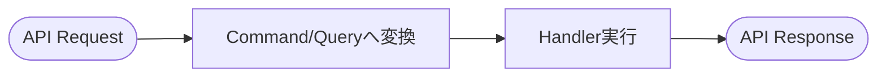

# 第23章　API層は薄く② 入力→DTO→Handlerの流れを固定する🧩✨

この章はひとことで言うと👇
**「どの機能を追加しても、毎回まったく同じ形で書けるテンプレを作る」** だよ〜！😺🧱

---

## 1) まず結論：Queryはこの順番が鉄板だよ🥇✨




APIの中で“やること”を **4ステップ** に固定します👇

1. **入力を受け取る**（APIのRequest DTO）📩
2. **Command/Query DTOに変換**（アプリ層のメッセージ）🔁
3. **Handlerを呼ぶ**（ユースケース実行）🍳
4. **返す**（APIのResponse DTO / HTTP結果）📤

これを守ると、APIが「受け取って渡すだけ」の係になって薄くなるよ🧼✨
Minimal APIでも、Controllerでも同じ考え方でOK！
（Minimal APIのレスポンスの作り方・返せる型は公式ドキュメントにまとまってるよ）([Microsoft Learn][1])

---

## 2) 「DTOが3種類ある」って整理すると迷子にならない🧭📦


初心者が一番ハマるのはここ！😵‍💫
DTOを“役割で”分けると一気にスッキリするよ✨

### ✅ A. API Request/Response DTO（外向きの約束）📮

* 例：`CreateTodoRequest`, `TodoListItemResponse`
* **画面・API仕様に都合がいい形**でOK

### ✅ B. Command/Query DTO（アプリ層の依頼書）📝

* 例：`CreateTodoCommand`, `GetTodoListQuery`
* **ユースケースを実行するための材料**だけ持つ

### ✅ C. Result（Handlerの戻り値）🎁

* 例：`CreateTodoResult`（`TodoId`だけ返す、とか）
* **Entityをそのまま返さない**（読みモデルやAPIに漏れやすいから）🚫

---

## 3) 命名ルールを決めると、脳みそが節約できる🧠💡

おすすめの固定ルール（めっちゃ効く！）👇

* Request：`XxxRequest`
* Response：`XxxResponse`
* Command：`XxxCommand`
* Query：`XxxQuery`
* Handler：`XxxHandler`
* Result：`XxxResult`

これだけで「次どこ作るんだっけ？」が激減するよ😺✨

---

## 4) 実装例：ToDo（Create / Update / GetList）を“テンプレ化”する🛠️🧩

ここからは **Minimal API版** で見せるね！（Controller版も後で出すよ👍）

### 4-1. フォルダの置き場所（例）📁

* `Api/Features/Todos/`（エンドポイントとAPIのDTO）
* `Application/Features/Todos/`（Command/Query/Handler/Result）
* `Infrastructure/`（DBとか）

---

## 4-2. DTOたち（Request/Response と Command/Query/Result）📦✨

```csharp
// Api/Features/Todos/Contracts.cs
namespace Api.Features.Todos;

public sealed record CreateTodoRequest(string Title, DateOnly? DueDate);
public sealed record UpdateTodoRequest(string Title, DateOnly? DueDate, bool IsDone);

public sealed record CreateTodoResponse(Guid TodoId);

public sealed record TodoListItemResponse(
    Guid TodoId,
    string Title,
    DateOnly? DueDate,
    bool IsDone
);

public sealed record PagedResponse<T>(
    IReadOnlyList<T> Items,
    int Page,
    int PageSize,
    int TotalCount
);
```

```csharp
// Application/Features/Todos/Messages.cs
namespace Application.Features.Todos;

public sealed record CreateTodoCommand(string Title, DateOnly? DueDate);
public sealed record UpdateTodoCommand(Guid TodoId, string Title, DateOnly? DueDate, bool IsDone);

public sealed record GetTodoListQuery(string? Search, int Page, int PageSize);

public sealed record CreateTodoResult(Guid TodoId);
public sealed record TodoListItemDto(Guid TodoId, string Title, DateOnly? DueDate, bool IsDone);

public sealed record PagedResult<T>(
    IReadOnlyList<T> Items,
    int Page,
    int PageSize,
    int TotalCount
);
```

---

## 4-3. Handler（ここが“仕事する場所”🍳🔥）

※DB実装は章が進むともっと良くするけど、ここでは「形」を優先してOK👍

```csharp
// Application/Features/Todos/Handlers.cs
namespace Application.Features.Todos;

public interface ICreateTodoHandler
{
    Task<CreateTodoResult> Handle(CreateTodoCommand command, CancellationToken ct);
}

public interface IUpdateTodoHandler
{
    Task<bool> Handle(UpdateTodoCommand command, CancellationToken ct); // true=更新できた
}

public interface IGetTodoListHandler
{
    Task<PagedResult<TodoListItemDto>> Handle(GetTodoListQuery query, CancellationToken ct);
}
```

---

## 4-4. エンドポイント（APIは“薄く”！3〜7行くらいが理想🧼✨）

ここが第23章のメイン！🎯
**入力→変換→Handler→返す** を絶対に崩さないよ💪

```csharp
// Api/Features/Todos/TodosEndpoints.cs
using Application.Features.Todos;
using Microsoft.AspNetCore.Mvc;

namespace Api.Features.Todos;

public static class TodosEndpoints
{
    public static RouteGroupBuilder MapTodos(this IEndpointRouteBuilder app)
    {
        var group = app.MapGroup("/api/todos")
            .WithTags("Todos");

        group.MapPost("/", Create);
        group.MapPut("/{todoId:guid}", Update);
        group.MapGet("/", GetList);

        return group;
    }

    private static async Task<IResult> Create(
        [FromBody] CreateTodoRequest request,
        ICreateTodoHandler handler,
        CancellationToken ct)
    {
        // 1) 入力 → 2) Commandに変換
        var command = new CreateTodoCommand(request.Title, request.DueDate);

        // 3) Handler実行
        var result = await handler.Handle(command, ct);

        // 4) Responseに変換して返す
        var response = new CreateTodoResponse(result.TodoId);

        return Results.Created($"/api/todos/{response.TodoId}", response);
    }

    private static async Task<IResult> Update(
        Guid todoId,
        [FromBody] UpdateTodoRequest request,
        IUpdateTodoHandler handler,
        CancellationToken ct)
    {
        var command = new UpdateTodoCommand(todoId, request.Title, request.DueDate, request.IsDone);

        var updated = await handler.Handle(command, ct);
        return updated ? Results.NoContent() : Results.NotFound();
    }

    private static async Task<IResult> GetList(
        string? search,
        int page,
        int pageSize,
        IGetTodoListHandler handler,
        CancellationToken ct)
    {
        var query = new GetTodoListQuery(search, page <= 0 ? 1 : page, pageSize <= 0 ? 20 : pageSize);

        var result = await handler.Handle(query, ct);

        var response = new PagedResponse<TodoListItemResponse>(
            result.Items.Select(x => new TodoListItemResponse(x.TodoId, x.Title, x.DueDate, x.IsDone)).ToList(),
            result.Page,
            result.PageSize,
            result.TotalCount
        );

        return Results.Ok(response);
    }
}
```

### ✅ポイント（めっちゃ大事）🧠✨

* **APIはロジックしない**（if地獄になりやすい）😇
* **変換はAPI内にあってOK**（ただし薄く！）
* **Handlerは“ユースケースの正しい場所”**（業務ルールもここ寄り）🏛️

---

## 5) エラーも“型”を揃えるとAPIがキレイになる🧯✨

APIが増えると、エラー形式がバラバラで苦しくなるよね😵
ASP.NET Coreは **ProblemDetails** を標準で扱える流れが用意されてるよ。([Microsoft Learn][2])

例えば、全体としてProblemDetailsを使いやすくする設定イメージ👇

```csharp
// Program.cs（例）
var builder = WebApplication.CreateBuilder(args);

builder.Services.AddProblemDetails(); // ProblemDetails生成サービス
var app = builder.Build();

app.UseExceptionHandler();
app.UseStatusCodePages();

app.MapTodos();

app.Run();
```

> 「業務エラー vs 技術エラー」の分け方は第27章でガッツリやるよ🧯✨
> （ここでは“形式を揃えられる”って感覚だけ持てればOK！）

---

## 6) Controller版の“薄い形”も出しておくね📮✨

Minimal APIじゃなくControllerでも、やることは同じ！
（Controllerが太る問題は第22章の続きでここでも効くよ〜👑💦）

```csharp
using Application.Features.Todos;
using Microsoft.AspNetCore.Mvc;

namespace Api.Features.Todos;

[ApiController]
[Route("api/todos")]
public sealed class TodosController : ControllerBase
{
    [HttpPost]
    public async Task<IActionResult> Create(
        [FromBody] CreateTodoRequest request,
        [FromServices] ICreateTodoHandler handler,
        CancellationToken ct)
    {
        var command = new CreateTodoCommand(request.Title, request.DueDate);
        var result = await handler.Handle(command, ct);

        var response = new CreateTodoResponse(result.TodoId);
        return Created($"/api/todos/{response.TodoId}", response);
    }
}
```

---

## 7) コピペ用テンプレ（Create / Update / GetList）📌🧩

### ✅ Create（201 Created）

```csharp
// 1) request → 2) command → 3) handler → 4) response
var command = new XxxCommand(...);
var result = await handler.Handle(command, ct);
var response = new XxxResponse(...);
return Results.Created($"/api/xxx/{response.Id}", response);
```

### ✅ Update（204 NoContent / 404 NotFound）

```csharp
var command = new UpdateXxxCommand(id, ...);
var updated = await handler.Handle(command, ct);
return updated ? Results.NoContent() : Results.NotFound();
```

### ✅ GetList（200 OK + ページング）

```csharp
var query = new GetXxxListQuery(search, page, pageSize);
var result = await handler.Handle(query, ct);
var response = new PagedResponse<XxxItemResponse>(...);
return Results.Ok(response);
```

---

## 8) AI（Copilot / Codex）活用プロンプト例🤖💖

### DTO生成（命名も揃える）

* 「ToDoのCreate/Update/GetList用に、Request/Response/Command/Query/Resultをrecordで作って。命名はXxxRequest/XxxCommand/XxxResultで統一して」

### エンドポイントの薄さチェック👀

* 「このエンドポイントが薄いかレビューして。API層に業務ルールやSQLが混ざってたら指摘して」

### “変換を関数化”する提案

* 「request→command、dto→response の変換を extension method に切り出して薄くして」

※AIが作ったコードは、最後に必ずここだけ確認してね👇

* **APIに業務ルールが入ってない？**
* **Entityをそのまま返してない？**
* **例外握りつぶしてない？**🙈

---

## 9) ミニ演習（15〜30分）⏱️🐣

ToDoに「タグ機能」を追加してみよ〜！🏷️✨

* `POST /api/todos/{id}/tags`（Command）
* `GET /api/todos/tags`（Query：タグ一覧）
* ルール：**APIは変換してHandler呼ぶだけ**を崩さない😺🧩

---

## 10) まとめ🎀

この章のゴールはこれ👇
**「新しい機能を追加しても、毎回同じ形で増やせる」**✨

* 入力（Request）→ 依頼書（Command/Query）→ 実行（Handler）→ 返す（Response）📦📮🍳📤
* APIを薄く保つと、CQRSの良さ（変更しやすい・テストしやすい）が出やすいよ😊
* Minimal APIの返し方（返せる型・TypedResultsなど）は公式で整理されてるから、迷ったらそこに戻ると安心！([Microsoft Learn][1])

次の第24章では、この流れをさらに気持ちよくするために **Dispatcher（小さなMediator）** を自作して「仕組みそのもの」を理解していくよ〜📬✨

[1]: https://learn.microsoft.com/en-us/aspnet/core/fundamentals/minimal-apis/responses?view=aspnetcore-10.0&utm_source=chatgpt.com "Create responses in Minimal API applications"
[2]: https://learn.microsoft.com/en-us/aspnet/core/fundamentals/error-handling-api?view=aspnetcore-10.0&utm_source=chatgpt.com "Handle errors in ASP.NET Core APIs"
