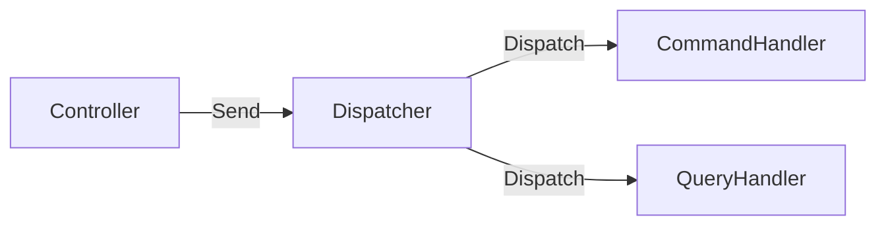

# 第24章　Dispatcherを自作して“仕組み”を理解📬✨（小さなMediatorづくり）

この章は「MediatRみたいな“司令塔”って、結局なにしてるの？🤔」を **自分の手でミニ版を作って理解する回**だよ〜！
結果として、Controllerがスッキリして、CQRSの「型の流れ」が固定されて、設計が一段ラクになるよ🧸💕

ちなみに **C# 14 は .NET 10 と Visual Studio 2026 で試せる**よ（2025/11時点のMicrosoft公式）。([Microsoft Learn][1])
Visual Studio 2026 は 2026/01 も更新が出てる（例：2026/01/20のリリースノート）。([Microsoft Learn][2])

---

## 1) Dispatcherってなに？📮（超ざっくり）




### ✅ ひとことで言うと

**ControllerとHandlerの間に入って「適切なHandlerに配達する係」**だよ📬✨

イメージはこんな感じ👇

* Controller：窓口のお姉さん🧑‍💼「これお願いしまーす」
* Dispatcher：郵便局📮「宛先（Handler）見て配送するね」
* Handler：担当者🧑‍🍳「了解、処理するね」

### ✅ 何がうれしいの？🌸

**Controllerが薄くなる**のが一番うれしい！🥳
そして「Command/Queryの流れ」が固定されて、迷子が減る🧭✨

---

## 2) 今日つくる最小Dispatcherのゴール🎯

### 今回のゴール（最小セット）💡

* `ICommand<TResult>` と `IQuery<TResult>` を作る
* `ICommandHandler<,>` と `IQueryHandler<,>` を作る
* `IDispatcher`（司令塔）を作って、**DIからHandlerを引っ張って実行**
* Controller（またはMinimal API）から `dispatcher.Send(...)` / `dispatcher.Query(...)` で呼ぶ

### 今回やらないこと（やりがち罠）🚫🌀

* 反射で「何でも自動で解決する」超汎用Dispatcher
  → 初学者はここで迷路化しがち😵‍💫（まずは最小でOK！）

---

## 3) ディレクトリ構成（おすすめ）📁✨

Featuresごとにまとめるとスッキリするよ〜🧺

* `Cqrs/`（共通の型）

  * `ICommand.cs`, `IQuery.cs`
  * `ICommandHandler.cs`, `IQueryHandler.cs`
  * `IDispatcher.cs`, `Dispatcher.cs`
* `Features/Todos/`（例）

  * `CreateTodo/`
  * `GetTodoList/`

---

## 4) まずは“型”を作る🧩（Command/Query/Handler）

### 4.1 Command / Query のインターフェース

```csharp
namespace MyApp.Cqrs;

// 書く（状態を変える）
public interface ICommand<TResult> { }

// 読む（状態を変えない）
public interface IQuery<TResult> { }
```

### 4.2 Handlerのインターフェース

```csharp
namespace MyApp.Cqrs;

public interface ICommandHandler<TCommand, TResult>
    where TCommand : ICommand<TResult>
{
    Task<TResult> Handle(TCommand command, CancellationToken ct);
}

public interface IQueryHandler<TQuery, TResult>
    where TQuery : IQuery<TResult>
{
    Task<TResult> Handle(TQuery query, CancellationToken ct);
}
```

ここまでで **「型の道」**ができたよ🛣️✨
次は“配達係”のDispatcher！

---

## 5) Dispatcher（司令塔）を作る📬✨

### 5.1 IDispatcher

ポイントは「型推論で呼べる」形にすること💡
（`Send(command)` って書くだけで動いてほしいよね😉）

```csharp
namespace MyApp.Cqrs;

public interface IDispatcher
{
    Task<TResult> Send<TCommand, TResult>(TCommand command, CancellationToken ct = default)
        where TCommand : ICommand<TResult>;

    Task<TResult> Query<TQuery, TResult>(TQuery query, CancellationToken ct = default)
        where TQuery : IQuery<TResult>;
}
```

### 5.2 Dispatcher本体（DIでHandlerを解決）

```csharp
using Microsoft.Extensions.DependencyInjection;

namespace MyApp.Cqrs;

public sealed class Dispatcher : IDispatcher
{
    private readonly IServiceProvider _sp;

    public Dispatcher(IServiceProvider sp) => _sp = sp;

    public Task<TResult> Send<TCommand, TResult>(TCommand command, CancellationToken ct = default)
        where TCommand : ICommand<TResult>
    {
        var handler = _sp.GetRequiredService<ICommandHandler<TCommand, TResult>>();
        return handler.Handle(command, ct);
    }

    public Task<TResult> Query<TQuery, TResult>(TQuery query, CancellationToken ct = default)
        where TQuery : IQuery<TResult>
    {
        var handler = _sp.GetRequiredService<IQueryHandler<TQuery, TResult>>();
        return handler.Handle(query, ct);
    }
}
```

✅ これで「司令塔がHandlerに配達する」仕組みが完成〜！🎉📬

---

## 6) 例：ToDoで “Command と Query” を1本ずつ作る📝💕

ここからは最小の例を置くね（本質はDispatcherなので、DBはすでにある前提でOKだよ！）

### 6.1 Command：ToDoを追加する✍️

```csharp
namespace MyApp.Features.Todos.CreateTodo;

using MyApp.Cqrs;

public sealed record CreateTodoCommand(string Title) : ICommand<Guid>;
```

Handler：

```csharp
namespace MyApp.Features.Todos.CreateTodo;

using MyApp.Cqrs;

public sealed class CreateTodoHandler : ICommandHandler<CreateTodoCommand, Guid>
{
    // 例：DbContextなどをDIで受ける想定
    public CreateTodoHandler() { }

    public async Task<Guid> Handle(CreateTodoCommand command, CancellationToken ct)
    {
        // ここで保存（例）
        // var entity = new Todo { Id = Guid.NewGuid(), Title = command.Title };
        // db.Todos.Add(entity); await db.SaveChangesAsync(ct);

        await Task.Delay(10, ct); // ダミー
        return Guid.NewGuid();
    }
}
```

### 6.2 Query：ToDo一覧を取る👀

Read DTO：

```csharp
namespace MyApp.Features.Todos.GetTodoList;

public sealed record TodoListItemDto(Guid Id, string Title);
```

Query：

```csharp
namespace MyApp.Features.Todos.GetTodoList;

using MyApp.Cqrs;

public sealed record GetTodoListQuery() : IQuery<IReadOnlyList<TodoListItemDto>>;
```

Handler：

```csharp
namespace MyApp.Features.Todos.GetTodoList;

using MyApp.Cqrs;

public sealed class GetTodoListHandler : IQueryHandler<GetTodoListQuery, IReadOnlyList<TodoListItemDto>>
{
    public GetTodoListHandler() { }

    public async Task<IReadOnlyList<TodoListItemDto>> Handle(GetTodoListQuery query, CancellationToken ct)
    {
        await Task.Delay(10, ct); // ダミー

        return new List<TodoListItemDto>
        {
            new(Guid.NewGuid(), "牛乳を買う🥛"),
            new(Guid.NewGuid(), "レポート提出📄"),
        };
    }
}
```

---

## 7) DI登録（Program.cs）🧷✨

ここを忘れると100%動かないやつ😇（でも大丈夫、テンプレ化すればOK）

```csharp
using MyApp.Cqrs;
using MyApp.Features.Todos.CreateTodo;
using MyApp.Features.Todos.GetTodoList;

var builder = WebApplication.CreateBuilder(args);

// Dispatcher
builder.Services.AddScoped<IDispatcher, Dispatcher>();

// Handlers（最初は手登録が一番わかりやすい✨）
builder.Services.AddScoped<ICommandHandler<CreateTodoCommand, Guid>, CreateTodoHandler>();
builder.Services.AddScoped<IQueryHandler<GetTodoListQuery, IReadOnlyList<TodoListItemDto>>, GetTodoListHandler>();

var app = builder.Build();

app.MapPost("/todos", async (CreateTodoCommand cmd, IDispatcher dispatcher, CancellationToken ct) =>
{
    var id = await dispatcher.Send<CreateTodoCommand, Guid>(cmd, ct);
    return Results.Ok(new { id });
});

app.MapGet("/todos", async (IDispatcher dispatcher, CancellationToken ct) =>
{
    var list = await dispatcher.Query<GetTodoListQuery, IReadOnlyList<TodoListItemDto>>(new GetTodoListQuery(), ct);
    return Results.Ok(list);
});

app.Run();
```

💡 ここ、`Send<CreateTodoCommand, Guid>(...)` の型指定は **最初だけ明示**してるけど、慣れたら推論に寄せる書き方にもできるよ（でも初心者は“明示”が安心☺️）

---

## 8) よくある詰まりポイント🧯💦（あるある5連発）

### ① Handlerを登録し忘れる😇

症状：実行時に「サービスが見つからない」系の例外
対策：**Program.csのAddScopedをチェック✅**

### ② ICommand と IQuery を逆に実装する😵

* QueryなのにDB更新しちゃう
  → “読む”は副作用なし！👀✨

### ③ Dispatcherに業務ロジックを書き始める🍔

Dispatcherは“配達”だけ！📮
ルールはHandler側へ🧠

### ④ 何でも自動スキャンしたくなる（早すぎる抽象化）🌀

最初は **手登録でOK**！
自動化は「困ってから」で十分だよ😉✨

### ⑤ Command/Queryの戻り値が迷子になる🧩

* Commandは「成功/失敗 + ID」くらいが基本（第11章の復習ポイント）✍️
* Queryは画面都合のDTOでOK👀

---

## 9) ミニ演習（15〜30分）⏱️🎀

### 演習A：Deleteを追加してみよ🗑️

* `DeleteTodoCommand(Guid Id) : ICommand<bool>`
* Handlerで削除（ダミーでもOK）
* `/todos/{id}` に `MapDelete`

### 演習B：Queryにフィルタを追加🔎

* `GetTodoListQuery(string? Keyword)`
* Handlerで `Title.Contains(Keyword)` 的な絞り込み（ダミーでもOK）

### 演習C：Dispatcherに“最小ログ”を入れてみる🧾

* Dispatcherで開始/終了ログ（所要時間）を出す
  （第26章の前倒し体験だよ✨）

---

## 10) AI（Copilot / Codex）に投げると強いプロンプト例🤖✨

* 「`IDispatcher` と `Dispatcher` の役割を、初心者向けにたとえ話で説明して。図もつけて」📮🎨
* 「`ICommandHandler<TCommand, TResult>` を使ったサンプルCommandをToDo題材で3つ作って」📝✨
* 「DI登録を忘れた時に起きる例外と、原因の切り分け手順をチェックリスト化して」✅🧯
* 「Dispatcherにロギングを入れると責務が太る。太らせない設計案を2つ出して」🧠⚖️

---

## 11) この章のまとめ🎁✨

* Dispatcherは **Controller → Handler の配達係**📬
* 自作すると「MediatRが何をやってるか」が体感でわかる🧠✨
* コツは **最小で作る**こと！汎用化は後でOK😉

そして次の第25章で「じゃあMediatR入れる？どう判断する？🎒」に進むと、導入判断がめっちゃ上手になるよ〜！

※ちなみに MediatR は 2025/04 に作者の方が商用化方針を発表していて、以降のライセンス形態は注意して確認する流れが増えてるよ（現場ルールに合わせてね🧷）。([jimmybogard.com][3])

[1]: https://learn.microsoft.com/en-us/dotnet/csharp/whats-new/csharp-14?utm_source=chatgpt.com "What's new in C# 14"
[2]: https://learn.microsoft.com/en-us/visualstudio/releases/2026/release-notes?utm_source=chatgpt.com "Visual Studio 2026 Release Notes"
[3]: https://www.jimmybogard.com/automapper-and-mediatr-going-commercial/?utm_source=chatgpt.com "AutoMapper and MediatR Going Commercial"
