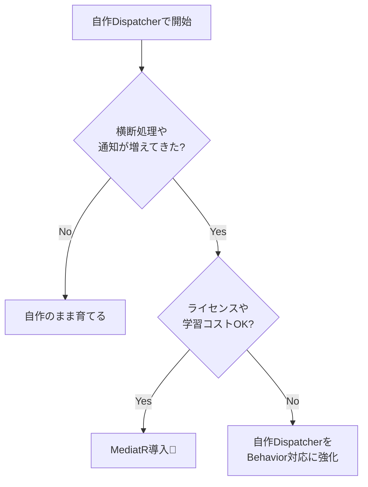

# 第25章：MediatR導入は“後でOK”（採用判断）🎒✨

この章は、「第24章で自作Dispatcherを作ったあなた」が、**“次にMediatRを入れるべき？”を自分で判断できるようになる**ための回だよ〜🥳🧠
（※2025〜2026にかけてMediatRの運用形態・ライセンス周りが動いたので、そこも含めて“最新前提”でいくね🔍）

---

## 1) まず結論：MediatRは「便利だけど、最初から必須じゃない」🙆‍♀️💡




### ✅ MediatRを入れると嬉しいこと

* **Controllerがさらに薄くなる**（`Send()`で投げるだけ）📮
* **横断処理**（Logging/Validation/Transactionなど）を“パイプライン”で統一できる🎢
* **仕組みが枯れてる**＆エコシステムが多い（サンプルや周辺記事も多い）📚

MediatRは「リクエスト/レスポンス」「通知（Notification）」などをアプリ内で仲介してくれるライブラリで、DI登録やパイプライン登録の仕組みも用意されてるよ✨ ([NuGet Gallery][1])

---

## 2) でも注意：導入コストもちゃんとあるよ😵‍💫💸

### 2-1) 依存が増える（学習＋デバッグの難しさ）

* 自作Dispatcherなら追いかける場所が少ない👀
* MediatRはパイプラインや通知を使いだすと、呼び出し経路が増えて最初は迷子になりやすい🌀

### 2-2) ライセンスとキー設定が“現実として必要”🔑⚖️

MediatRは「商用版の提供」と「デュアルライセンス」へ移行していて、公式側からも説明が出てるよ。 ([Jimmy Bogard][2])
さらに、**v13.0.0で“license key が必要”になった**ことが、GitHubのリリースノートに明記されてる📝（キーの設定例もそこに載ってる） ([GitHub][3])

商用ライセンス側は、**サブスクモデル（Standard/Professional/Enterprise等）**で、期限切れでライセンスが失効する旨なども契約書に書かれてるよ📄 
（※ここは会社の運用ルールに直結しがちなので、**必ず社内ルールに従って確認**してね🙏）

### 2-3) セキュリティ面：最近の動きも知っておくと安心🔐

2025/12/03の公式投稿で、.NET 10対応のリリースに合わせて**NuGetパッケージ署名（package signing）**を追加した、という話も出てるよ✨ ([Jimmy Bogard][4])
→ つまり「配布元の正当性を確認しやすくする」方向に動いてる👍

---

## 3) 採用判断の“ざっくりルール”✅🧭（迷ったらこれ）

### ✅ MediatRを入れると良いサイン

* Command/Queryが増えてきて、**横断処理を統一したい**（ログ、検証、計測、トランザクションなど）🎢
* 複数チーム/複数機能で、**“書き方の型”を強制したい**🏗️
* 通知（イベント的なやつ）を使って、**処理の分岐を疎結合にしたい**📣

### ❌ まだ入れなくて良いサイン

* まだ機能が少なくて、Handlerも少ない（自作Dispatcherで十分）🌱
* まずはCQRSの考え方（責務分離）を体に入れたい（道具でごまかさない）💪
* ライセンスや社内審査が重い（導入に時間がかかる）🧾

---

## 4) “自作Dispatcher vs MediatR” 比較メモ📝✨

| 観点         |  自作Dispatcher |                         MediatR |
| ---------- | ------------: | ------------------------------: |
| 学習のしやすさ    | ✅ 最高（仕組みが見える） |                △ パイプラインで迷子になりがち |
| 横断処理の統一    |   △ 自分で作る必要あり | ✅ 仕組みが揃ってる ([NuGet Gallery][1]) |
| エコシステム     |          △ 自力 |                       ✅ 周辺情報が多い |
| ライセンス/鍵    |          ✅ なし |       ⚠️ v13以降キー要 ([GitHub][3]) |
| “現場でよく見る”率 |       △ 現場による |               ✅ 見ること多め（ただし方針次第） |

---

## 5) ミニ導入ハンズオン：1つだけMediatRで動かす🧪🚀

ここでは「注文作成（Command）」「注文一覧取得（Query）」の2本だけをMediatRで通すよ🍀

### 5-1) インストール📦

NuGetで `MediatR` を入れる（CLIでもOK）✨ ([NuGet Gallery][1])

### 5-2) DI登録（Program.cs）🧩

`AddMediatR` でハンドラを自動登録するのが基本形だよ🙆‍♀️ ([NuGet Gallery][1])

```csharp
using MediatR;

var builder = WebApplication.CreateBuilder(args);

builder.Services.AddMediatR(cfg =>
{
    // Handlers を置いてるアセンブリをスキャン
    cfg.RegisterServicesFromAssemblyContaining<Program>();

    // v13+ の場合：必要に応じてライセンスキーを設定（公式リリースノートに例あり）
    // cfg.LicenseKey = builder.Configuration["MediatR:LicenseKey"];
});

var app = builder.Build();
app.MapControllers();
app.Run();
```

※キー設定の例は GitHubリリースノートにも載ってるよ📝 ([GitHub][3])
※キーを置く場所は、**UserSecrets / 環境変数 / 安全な設定管理**に寄せるのが定番だよ🔐

---

## 6) Command：CreateOrderCommand を作る✍️🧾

### 6-1) Command DTO（record）

```csharp
using MediatR;

public sealed record CreateOrderCommand(
    Guid CustomerId,
    IReadOnlyList<CreateOrderItem> Items
) : IRequest<Guid>;

public sealed record CreateOrderItem(Guid ProductId, int Quantity);
```

### 6-2) Handler

```csharp
using MediatR;

public sealed class CreateOrderHandler : IRequestHandler<CreateOrderCommand, Guid>
{
    public async Task<Guid> Handle(CreateOrderCommand request, CancellationToken ct)
    {
        // ここに「業務ルール」「更新」「保存」などを書く
        // 例：在庫チェック → 注文作成 → 保存 → OrderIdを返す

        var newOrderId = Guid.NewGuid();
        await Task.CompletedTask;
        return newOrderId;
    }
}
```

### 6-3) Controller（薄く！薄く！🧼✨）

MediatRは `ISender` / `IMediator` をDIできるよ（登録されるサービス一覧もNuGet側に載ってる） ([NuGet Gallery][1])

```csharp
using MediatR;
using Microsoft.AspNetCore.Mvc;

[ApiController]
[Route("api/orders")]
public sealed class OrdersController : ControllerBase
{
    private readonly ISender _sender;
    public OrdersController(ISender sender) => _sender = sender;

    [HttpPost]
    public async Task<ActionResult<Guid>> Create(CreateOrderCommand command, CancellationToken ct)
    {
        var id = await _sender.Send(command, ct);
        return Ok(id);
    }
}
```

---

## 7) Query：GetOrderListQuery を作る👀📄

```csharp
using MediatR;

public sealed record GetOrderListQuery(int Page, int PageSize) : IRequest<IReadOnlyList<OrderListItemDto>>;

public sealed record OrderListItemDto(Guid OrderId, DateTimeOffset CreatedAt, int ItemCount);
```

```csharp
using MediatR;

public sealed class GetOrderListHandler
    : IRequestHandler<GetOrderListQuery, IReadOnlyList<OrderListItemDto>>
{
    public async Task<IReadOnlyList<OrderListItemDto>> Handle(GetOrderListQuery request, CancellationToken ct)
    {
        // 本来は Read DB / Projection / AsNoTracking / Dapper などがここに来るよ✨
        await Task.CompletedTask;

        return new[]
        {
            new OrderListItemDto(Guid.NewGuid(), DateTimeOffset.UtcNow, 3),
        };
    }
}
```

---

## 8) MediatRの“真価”：横断関心をパイプラインで揃える🎢✨

MediatRは **Behavior** を登録できるよ（公式NuGetの説明にサンプルあり） ([NuGet Gallery][1])
ここでは「処理時間を測る」だけの超ミニ版いくね⏱️

### 8-1) 計測Behavior

```csharp
using MediatR;

public sealed class TimingBehavior<TRequest, TResponse> : IPipelineBehavior<TRequest, TResponse>
    where TRequest : notnull
{
    private readonly ILogger<TimingBehavior<TRequest, TResponse>> _logger;

    public TimingBehavior(ILogger<TimingBehavior<TRequest, TResponse>> logger)
        => _logger = logger;

    public async Task<TResponse> Handle(
        TRequest request,
        RequestHandlerDelegate<TResponse> next,
        CancellationToken ct)
    {
        var start = Stopwatch.GetTimestamp();

        try
        {
            return await next();
        }
        finally
        {
            var end = Stopwatch.GetTimestamp();
            var ms = (end - start) * 1000.0 / Stopwatch.Frequency;

            _logger.LogInformation("Handled {RequestType} in {ElapsedMs}ms",
                typeof(TRequest).Name, ms);
        }
    }
}
```

### 8-2) 登録（Program.cs）

```csharp
builder.Services.AddMediatR(cfg =>
{
    cfg.RegisterServicesFromAssemblyContaining<Program>();
    cfg.AddOpenBehavior(typeof(TimingBehavior<,>));
});
```

これができると、**CommandもQueryも同じ形でログや計測が揃う**よ〜〜〜🫶✨

---

## 9) ミニ演習（めちゃ大事）🎯💪

### 演習A：第24章の自作Dispatcherと「呼び出し側」を比較📝

* Controllerのコード量
* Handlerの見通し
* Loggingを入れる場所（Controller？Handler？共通？）

→ 3行でメモしてね✍️✨（このメモが“採用判断の核”になるよ！）

### 演習B：機能を1本だけ移植する🔁

* まず「Createだけ」MediatRにする
* Queryはまだ自作DispatcherのままでもOK🙆‍♀️
  → “段階移行”できるか、体で覚えるのが勝ち🏆

---

## 10) よくある事故ポイント集😇💥

* **Behaviorを盛りすぎて**、結局どこで何してるか分からなくなる🎢🌀
  → 最初は「Logging」「Validation」「Transaction」のどれか1個だけ！
* **Notificationを乱用して**、処理の順序が曖昧になる📣💦
  → “絶対順序が必要”ならCommand内で完結させた方が安全なこと多い！
* **Handlerが太る**🍔
  → “1ユースケース=1Handler”を死守しよ✨

---

## 11) AI（Copilot/Codex）に頼るならこのプロンプト🤖💞

* 「`CreateOrderCommand` をMediatRで実装して。業務ルール（在庫チェック）と例外設計は分離して」
* 「MediatRの `IPipelineBehavior` で、Logging と Elapsed time を出す実装を提案して」
* 「自作Dispatcher → MediatR への段階移行プランを“影響範囲小さめ”で提案して」

AIに作らせたら、最後にこれだけチェックしてね👀✅

* **責務の境界**（Controller薄い？Handlerはユースケース単位？）
* **例外の扱い**（業務エラーと技術エラーが混ざってない？）
* **共通化のやりすぎ**（抽象化で読みにくくしてない？）

---

## 12) まとめ：第25章のゴール達成🎉✨

* MediatRは便利だけど、**“理解してから入れる”でOK**🎒
* いまのMediatRは **デュアルライセンス＋キー設定**が絡むので、導入時は必ず確認が必要🔑⚖️ ([Jimmy Bogard][2])
* まずは **機能1本だけ移植**して、メリットが勝つかを体験で判断しよう🧪✨

次は第26章で、いよいよ横断関心（Logging）を“統一ルール化”していくよ〜！🧾💖

[1]: https://nugetprodusnc.azure-api.net/packages/Mediatr "
        NuGet Gallery
        \| MediatR 14.0.0
    "
[2]: https://www.jimmybogard.com/automapper-and-mediatr-commercial-editions-launch-today/ "AutoMapper and MediatR Commercial Editions Launch Today"
[3]: https://github.com/LuckyPennySoftware/MediatR/releases "Releases · LuckyPennySoftware/MediatR · GitHub"
[4]: https://www.jimmybogard.com/automapper-16-0-0-and-mediatr-14-0-0-released-with-net-10-support/ "AutoMapper 16.0.0 and MediatR 14.0.0 Released with .NET 10 Support"
