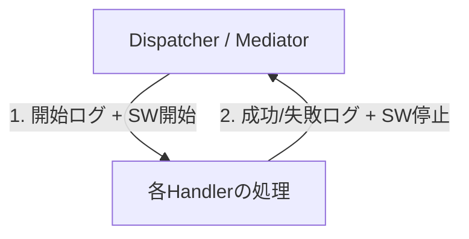

# 第26章　横断関心① Logging（Command/Queryの開始・終了を揃える）🧾⏱️✨

この章は「**CQRSの読み/書き処理が“ちゃんと動いてるか”を、あとから追えるようにする**」回だよ〜！🥳
バグ調査・性能改善・運用のどれでも、ログがあると世界が変わる…！🌏✨

.NET のログは `ILogger` を中心に、**構造化ログ**（あとで検索しやすいログ）を標準で扱えるのが強いよ 💪📌 ([Microsoft Learn][1])
（ちなみに .NET 10 は 2025-11-11 にリリースされた LTS だよ🧡）([Microsoft for Developers][2])

---

## 1) この章のゴール🎯

次の3つができるようになればOK！✅

1. **Command / Query の開始ログ・終了ログ**を必ず出す（成功/失敗も）🟢🔴
2. **所要時間**を必ず出す（重いのを見つける）⏱️
3. どのログも **同じフォーマット**で出る（検索しやすい）🧠✨

---

## 2) “どこで”ログを揃えるのが正解？📍（CQRS的な置き場所）




結論：**入口でまとめて取る**のがいちばんラク！😺✨
つまり…

* Controller / Minimal API → Dispatcher → Handler

この「Dispatcher（あるいはMediator）」のところで、**Command/Query全部の開始・終了**を包むのが気持ちいい👍🎁

### なんでHandlerの中に書かないの？🤔

* 毎回書くのダルい 😵‍💫
* 書き忘れでログが欠ける 🕳️
* 書き方がバラバラになる 🌀

なので、**横断関心（cross-cutting concern）**として入口で統一する！これが第26章の主役だよ🎉

---

## 3) まずはログの“型”を決めよう🧩（テンプレ統一）

ログは **文字列をつなげる**より、**メッセージテンプレート**（`{Name}` みたいな穴あき）で出すのが基本だよ📌
（これが「構造化ログ」の超大事ポイント！）([Microsoft Learn][1])

おすすめテンプレ（この章の結論フォーマット）👇

* 開始：`CQRS {Kind} {Operation} started`
* 成功：`CQRS {Kind} {Operation} succeeded in {ElapsedMs} ms`
* 失敗：`CQRS {Kind} {Operation} failed in {ElapsedMs} ms`

ここで

* `{Kind}` = `"Command"` or `"Query"`
* `{Operation}` = `CreateOrder` とか型名
* `{ElapsedMs}` = ミリ秒

---

## 4) 実装：Dispatcherで開始・終了を包む📬⏱️

ここからがハンズオンだよ！👩‍💻✨
（第24章で作った `Dispatcher` がある前提で、そこにログを追加するイメージ）

### 4-1. Dispatcher（ログ付き）サンプル✅

```csharp
using System.Diagnostics;
using Microsoft.Extensions.Logging;
using Microsoft.AspNetCore.Http;

public interface ICommand<TResult> { }
public interface IQuery<TResult> { }

public interface ICommandHandler<TCommand, TResult>
    where TCommand : ICommand<TResult>
{
    Task<TResult> Handle(TCommand command, CancellationToken ct);
}

public interface IQueryHandler<TQuery, TResult>
    where TQuery : IQuery<TResult>
{
    Task<TResult> Handle(TQuery query, CancellationToken ct);
}

public interface IDispatcher
{
    Task<TResult> Send<TCommand, TResult>(TCommand command, CancellationToken ct = default)
        where TCommand : ICommand<TResult>;

    Task<TResult> Query<TQuery, TResult>(TQuery query, CancellationToken ct = default)
        where TQuery : IQuery<TResult>;
}

public sealed class Dispatcher : IDispatcher
{
    private readonly IServiceProvider _sp;
    private readonly ILogger<Dispatcher> _logger;
    private readonly IHttpContextAccessor _http;

    public Dispatcher(IServiceProvider sp, ILogger<Dispatcher> logger, IHttpContextAccessor http)
    {
        _sp = sp;
        _logger = logger;
        _http = http;
    }

    public async Task<TResult> Send<TCommand, TResult>(TCommand command, CancellationToken ct = default)
        where TCommand : ICommand<TResult>
    {
        return await Execute("Command", command!.GetType().Name, async () =>
        {
            var handler = _sp.GetRequiredService<ICommandHandler<TCommand, TResult>>();
            return await handler.Handle(command, ct);
        });
    }

    public async Task<TResult> Query<TQuery, TResult>(TQuery query, CancellationToken ct = default)
        where TQuery : IQuery<TResult>
    {
        return await Execute("Query", query!.GetType().Name, async () =>
        {
            var handler = _sp.GetRequiredService<IQueryHandler<TQuery, TResult>>();
            return await handler.Handle(query, ct);
        });
    }

    private async Task<TResult> Execute<TResult>(string kind, string operation, Func<Task<TResult>> body)
    {
        var traceId = GetTraceId();

        using var scope = _logger.BeginScope(new Dictionary<string, object?>
        {
            ["TraceId"] = traceId,
            ["CqrsKind"] = kind,
            ["CqrsOperation"] = operation
        });

        _logger.LogInformation("CQRS {Kind} {Operation} started", kind, operation);

        var sw = Stopwatch.StartNew();
        try
        {
            var result = await body();

            sw.Stop();
            _logger.LogInformation(
                "CQRS {Kind} {Operation} succeeded in {ElapsedMs} ms",
                kind, operation, sw.ElapsedMilliseconds);

            return result;
        }
        catch (Exception ex)
        {
            sw.Stop();
            _logger.LogError(
                ex,
                "CQRS {Kind} {Operation} failed in {ElapsedMs} ms",
                kind, operation, sw.ElapsedMilliseconds);

            throw;
        }
    }

    private string GetTraceId()
    {
        // 分散トレーシング（Activity）があればそれを優先
        var activity = Activity.Current;
        if (activity is not null)
            return activity.TraceId.ToString();

        // WebリクエストならASP.NET Coreの識別子がある
        var ctx = _http.HttpContext;
        if (ctx is not null)
            return ctx.TraceIdentifier;

        // バックグラウンド等なら新規で作る
        return Guid.NewGuid().ToString("N");
    }
}
```

**ポイント解説（ここ大事💡）**

* `BeginScope(...)` で **TraceId / 種別 / 操作名** を“全ログに付ける”感じになるよ🧷✨ ([Microsoft Learn][3])
* `try/catch` で **失敗ログを必ず出す**（例外も添える）🔥
* `Stopwatch` で **時間を測る**⏱️
* `TraceId` は `Activity` / `TraceIdentifier` を使うと、あとで追いやすいよ🧵 ([Microsoft Learn][4])

---

## 5) ログが出るか確認しよう👀（appsettingsの最小設定）

開発中は「まず見える」状態にするのが勝ち！🏆
例（よくあるやつ）👇

```json
{
  "Logging": {
    "LogLevel": {
      "Default": "Information",
      "Microsoft.AspNetCore": "Warning"
    }
  }
}
```

ASP.NET Core のログ設定自体の考え方はこのへんが公式にまとまってるよ📚 ([Microsoft Learn][5])

---

## 6) ログに“何を書かないか”ルール🚫（初心者ほどここが事故る😇）

ログは便利だけど、**書きすぎると地獄**になるよ〜😵‍💫💦

### 絶対避けたいログ🙅‍♀️

* パスワード、トークン、Cookie、APIキー 🔑💣
* 個人情報（住所・電話・メール）📛
* DTO丸ごとダンプ（特にCommand）📦🔥

### 書くなら「キーだけ」がおすすめ👍

* `OrderId`
* `UserId`（社内IDみたいなやつ）
* `ItemCount`
* `SearchConditionHash`（検索条件はハッシュで…とか）

---

## 7) もう一歩：高頻度ログは Source Generator で軽くできる🏎️✨（任意）

ログがめっちゃ多いところ（超ホットパス）では、`LoggerMessageAttribute` の **コンパイル時生成**が便利だよ📌
Microsoft Learn が最新めで解説してる！([Microsoft Learn][6])

「今はDispatcherで統一できたら満点💯」だけど、将来の武器として知っておくと強い💪✨

---

## 8) ミニ演習（30〜60分）🧪✨

### 演習A：開始・終了・時間が必ず出ることを確認✅

1. Commandを1回叩く
2. Queryを1回叩く
3. それぞれで

   * started
   * succeeded / failed
   * ms
     が揃ってるか確認👀

### 演習B：例外でも終了ログが出ることを確認🔴

* わざと例外を投げるCommandを作る（例：必ず `throw new InvalidOperationException("BOOM")`）💣
* `failed in ... ms` が出てるか確認！

### 演習C：Scopeが効いてるか確認🧷

* 1リクエスト中に複数ログを出して、同じ `TraceId` が付いてるか見る👀✨

---

## 9) AI（Copilot/Codex）に手伝わせるプロンプト例🤖🪄

そのまま貼ってOKだよ👇（短くて効く！）

* 「CQRSのCommand/Queryログのテンプレを統一したい。開始/成功/失敗/所要時間のメッセージ案を、構造化ログのプレースホルダ付きで提案して」🧾
* 「このログに個人情報や秘密情報が混ざる可能性がある箇所を指摘して、マスキング案も出して」🔐
* 「BeginScopeで付けるべき“最小限のコンテキスト”を提案して（TraceId/Operation/UserIdなど）」🧷

---

## 10) つまずきポイントあるある😵（先に潰そう）

* `LogInformation($"...{x}...")` みたいに **文字列補間**しちゃう
  → 後で検索しにくくなるので、テンプレ `{X}` を使うのがおすすめ📌 ([Microsoft Learn][1])

* すべてのHandlerで同じログを書き始める
  → Dispatcherで統一！🎯

* Queryが遅いのに「どれが遅いか」分からない
  → `{Operation}` と `{ElapsedMs}` を必ず出せば解決⏱️✨

---

## まとめ🎀

この章でやったのは、CQRSを「運用できる形」に近づける第一歩だよ🚶‍♀️✨

* ✅ Command/Queryの開始・終了ログを **入口で統一**
* ✅ 成功/失敗/時間を **必ず出す**
* ✅ `BeginScope` で **TraceId付き**にして追いやすくする🧷

次の第27章（エラー設計）に進むと、**失敗ログがさらに“意味のある形”に進化**するよ🧯✨

[1]: https://learn.microsoft.com/en-us/dotnet/core/extensions/logging?utm_source=chatgpt.com "Logging in C# - .NET"
[2]: https://devblogs.microsoft.com/dotnet/announcing-dotnet-10/ "Announcing .NET 10 - .NET Blog"
[3]: https://learn.microsoft.com/ja-jp/dotnet/api/microsoft.extensions.logging.loggerextensions.beginscope?view=net-9.0-pp&utm_source=chatgpt.com "LoggerExtensions.BeginScope(ILogger, String, Object[]) ..."
[4]: https://learn.microsoft.com/ja-jp/dotnet/core/diagnostics/observability-with-otel?utm_source=chatgpt.com "OpenTelemetry を使用した .NET の監視"
[5]: https://learn.microsoft.com/en-us/aspnet/core/fundamentals/logging/?view=aspnetcore-10.0&utm_source=chatgpt.com "Logging in .NET and ASP.NET Core"
[6]: https://learn.microsoft.com/en-us/dotnet/core/extensions/logger-message-generator?utm_source=chatgpt.com "Compile-time logging source generation - .NET"
