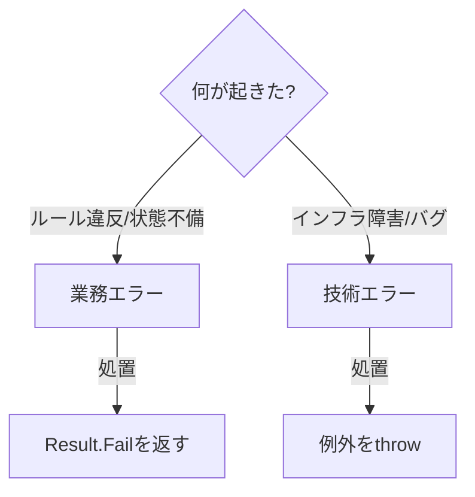

# 第27章　横断関心② エラー設計（業務エラー vs 技術エラー）🧯✨

この章では「失敗の扱い方」をちゃんと決めて、**APIの返し方を統一**します💡
CQRSだと、読み（Query）と書き（Command）で失敗の種類が増えるので、ここを雑にするとすぐ地獄になります😇💦

---

## この章のゴール🎯

* 「これは**業務エラー**？それとも**技術エラー**？」を即分類できる🧠✨
* 失敗を **ProblemDetails（application/problem+json）** で統一して返せる🧾
  （ASP.NET Core は `AddProblemDetails` で標準実装を使えるよ、って公式に書いてあります） ([Microsoft Learn][1])
* Command/Query の Handler が「投げる（throw）」か「返す（Result）」か、迷わなくなる🧭

---

## まず結論：エラー設計の“3ルール”📌✨

1. **業務エラー（想定内の失敗）**は、例外にしない（throwしない）🙅‍♀️
   → `Result` で「失敗」を返す（＝通常フローとして扱う）

2. **技術エラー（想定外/障害/バグ）**は、例外でOK（throwしてOK）💥
   → **グローバル例外処理**で捕まえて、一定の形で返す🧯
   （本番では詳細例外を外に出さないのが大事、と公式も強く注意してるよ） ([Microsoft Learn][1])

3. APIの失敗レスポンスは **ProblemDetails** で統一する🧾✨
   （Problem Details は RFC 9457 が最新で、RFC 7807 を置き換える形になってるよ） ([rfc-editor.org][2])

---

## 1) 業務エラー vs 技術エラーって何？🍰🔧




### ✅ 業務エラー（Business Error）＝「ルール的にダメ」🙅‍♀️

例：

* 在庫が足りない🧺
* 期限切れ⏰
* すでに支払い済みの注文をキャンセルしようとした💳
* 同時更新で競合した（≒状態が衝突）⚔️

👉 **システムとしては正常**。ただし「その操作は許可されない」ってだけ。

---

### ✅ 技術エラー（Technical Error）＝「システムが壊れた/外部が落ちた」💥

例：

* DB接続できない🛑
* タイムアウト⏳
* NullReferenceException（バグ）😱
* 外部APIが落ちてる🌩️

👉 **ユーザーの操作が悪いわけじゃない**ことが多い。
外に詳細を出すと危険なので、返す情報は控えめにするのが基本🔐

---

## 2) “HTTPステータス”のおすすめ対応表📮✨

| 種類                | 例              | おすすめHTTP | ポイント                               |
| ----------------- | -------------- | -------: | ---------------------------------- |
| 入力エラー（Validation） | 必須未入力、桁数違い     |      400 | `ValidationProblemDetails` 相当が便利🧾 |
| 見つからない            | IDが存在しない       |      404 | QueryでもCommandでも起きる👀              |
| 状態の衝突（業務）         | 在庫不足、二重実行、更新競合 |      409 | 「今の状態では無理」って意味にしやすい⚔️              |
| 権限                | 未ログイン/権限不足     |  401/403 | これは業務というよりセキュリティ領域🔐               |
| 技術エラー             | DB障害、バグ        |  500/503 | **詳細はログへ**、レスポンスは薄く🫥              |

---

## 3) 返すボディは ProblemDetails に統一しよ🧾✨

### ProblemDetailsって？👀

APIのエラーを「機械が読める形」で返すための標準フォーマットだよ📦
ASP.NET Core は `AddProblemDetails` で `IProblemDetailsService` の既定実装を登録できて、例外処理やステータスコードページで ProblemDetails を作れるようになります。 ([Microsoft Learn][1])

しかも最新仕様として RFC 9457 があり、RFC 7807 を廃止扱いにしてます📚 ([rfc-editor.org][2])

---

### ProblemDetails に入れたい“実務セット”🎁

* `type`：エラー種別URL（自社のドキュメントURLにするのが定番）🔗
* `title`：短い見出し
* `status`：HTTPステータス
* `detail`：ユーザー向け説明（安全な範囲で）
* `extensions.code`：**安定したエラーコード**（UI/フロントが分岐できる✨）
* `extensions.traceId`：問い合わせ対応が爆速になる🧵

---

## 4) CQRS的には「HandlerはResult、API層でHTTPに変換」が強い💪✨

ポイントはこれ👇
**ドメイン/アプリ層はHTTPを知らない**（＝純粋に業務を語る）
**API層だけがHTTPに変換**する📮

---

## 5) 最小の Result と Error を作る（依存なし版）🧩

### ① Errorの型を作るよ🧯

```csharp
public enum ErrorKind
{
    Validation,
    NotFound,
    Conflict,     // 状態の衝突（在庫不足・更新競合など）
    Forbidden,
    Unauthorized,
    Technical
}

public sealed record AppError(
    string Code,
    string Message,
    ErrorKind Kind,
    IReadOnlyDictionary<string, string[]>? ValidationErrors = null
);
```

### ② Result の型（成功/失敗）を作るよ📦

```csharp
public readonly record struct Result<T>(T? Value, AppError? Error)
{
    public bool IsSuccess => Error is null;

    public static Result<T> Ok(T value) => new(value, null);
    public static Result<T> Fail(AppError error) => new(default, error);
}
```

---

## 6) CommandHandlerで「業務エラーは返す」例🛒🧯

在庫が足りないなら、それは **業務エラー**なので `Fail` で返すよ📦

```csharp
public sealed record CreateOrderCommand(string Sku, int Quantity);

public sealed class CreateOrderHandler
{
    private readonly IInventoryService _inventory;

    public CreateOrderHandler(IInventoryService inventory)
        => _inventory = inventory;

    public async Task<Result<Guid>> Handle(CreateOrderCommand cmd, CancellationToken ct)
    {
        if (cmd.Quantity <= 0)
        {
            return Result<Guid>.Fail(new AppError(
                Code: "VALIDATION_INVALID_QUANTITY",
                Message: "数量は1以上にしてね🙏",
                Kind: ErrorKind.Validation,
                ValidationErrors: new Dictionary<string, string[]>
                {
                    ["quantity"] = new[] { "Quantity must be >= 1." }
                }
            ));
        }

        var ok = await _inventory.TryReserveAsync(cmd.Sku, cmd.Quantity, ct);
        if (!ok)
        {
            return Result<Guid>.Fail(new AppError(
                Code: "ORDER_STOCK_OUT",
                Message: "ごめんね、在庫が足りなかった…🥺",
                Kind: ErrorKind.Conflict
            ));
        }

        // ここでDB保存など（失敗したら例外になってOK＝技術エラー）
        var orderId = Guid.NewGuid();
        return Result<Guid>.Ok(orderId);
    }
}
```

---

## 7) API層で Result → ProblemDetails に変換する（Minimal API例）📮🧾

```csharp
static IResult ToHttpResult<T>(Result<T> result, Func<T, IResult> onSuccess)
{
    if (result.IsSuccess)
        return onSuccess(result.Value!);

    var e = result.Error!;

    return e.Kind switch
    {
        ErrorKind.Validation => Results.ValidationProblem(
            errors: e.ValidationErrors ?? new Dictionary<string, string[]>
            {
                [""] = new[] { "Validation failed." }
            },
            title: "入力チェックエラーだよ🧾",
            statusCode: StatusCodes.Status400BadRequest,
            extensions: new Dictionary<string, object?> { ["code"] = e.Code }
        ),

        ErrorKind.NotFound => Results.Problem(
            title: e.Message,
            statusCode: StatusCodes.Status404NotFound,
            type: $"https://example.com/problems/{e.Code}",
            extensions: new Dictionary<string, object?> { ["code"] = e.Code }
        ),

        ErrorKind.Conflict => Results.Problem(
            title: e.Message,
            statusCode: StatusCodes.Status409Conflict,
            type: $"https://example.com/problems/{e.Code}",
            extensions: new Dictionary<string, object?> { ["code"] = e.Code }
        ),

        ErrorKind.Forbidden => Results.Problem(
            title: e.Message,
            statusCode: StatusCodes.Status403Forbidden,
            type: $"https://example.com/problems/{e.Code}",
            extensions: new Dictionary<string, object?> { ["code"] = e.Code }
        ),

        ErrorKind.Unauthorized => Results.Problem(
            title: e.Message,
            statusCode: StatusCodes.Status401Unauthorized,
            type: $"https://example.com/problems/{e.Code}",
            extensions: new Dictionary<string, object?> { ["code"] = e.Code }
        ),

        _ => Results.Problem(
            title: "サーバー側で問題が起きたよ🧯",
            statusCode: StatusCodes.Status500InternalServerError,
            type: "https://example.com/problems/INTERNAL_ERROR"
        )
    };
}
```

✅ これで Controller/Endpoint はこうなる👇

```csharp
app.MapPost("/orders", async (CreateOrderCommand cmd, CreateOrderHandler handler, CancellationToken ct) =>
{
    var result = await handler.Handle(cmd, ct);
    return ToHttpResult(result, id => Results.Created($"/orders/{id}", new { id }));
});
```

---

## 8) 技術エラーは「グローバル例外処理」で ProblemDetails にする🧯🧾

ASP.NET Core は `AddProblemDetails()` を呼ぶと、例外処理ミドルウェアなどが ProblemDetails を生成できるようになります。 ([Microsoft Learn][1])
本番では `UseExceptionHandler` を使って安全なエラーペイロードを返すのが推奨です。 ([Microsoft Learn][1])

### ① ProblemDetails を登録 + ちょい拡張（traceId追加）🧵

ProblemDetails は `CustomizeProblemDetails` で拡張できるよ✨ ([Microsoft Learn][3])

```csharp
builder.Services.AddProblemDetails(options =>
{
    options.CustomizeProblemDetails = ctx =>
    {
        ctx.ProblemDetails.Extensions["traceId"] = ctx.HttpContext.TraceIdentifier;
    };
});

var app = builder.Build();

app.UseExceptionHandler();
app.UseStatusCodePages();
```

---

### ② さらに上級：特定例外を“狙って翻訳”したいなら IExceptionHandler 🧯✨

`IExceptionHandler` は .NET 8 で導入された「中央で既知の例外を処理する」ための仕組みだよ。 ([Microsoft Learn][4])

（例：EFの同時更新例外を 409 Conflict にしたい、とか⚔️）

---

## 9) Validation まわり：.NET 10 の Minimal API で新しめの動き🆕🔍

Minimal API の検証サポートは **.NET 10 の ASP.NET Core で導入**されて、`IProblemDetailsService` で検証エラーのレスポンスもカスタムできるようになってます✨ ([Microsoft Learn][5])

👉 つまり「入力エラーも ProblemDetails で統一」がやりやすくなったよ🧾💕

---

## 10) ミニ演習（めっちゃ大事）🧠✍️

### 演習A：分類ゲーム🎮（業務？技術？）

次を分類して、HTTPも決めてみてね👇（答えは自分で😉）

1. 期限切れクーポンを適用した
2. 注文IDが存在しない
3. DB接続エラー
4. 数量が0
5. 二重送信で同じ注文が2回作られそう
6. 支払いAPIがタイムアウト
7. すでに発送済みの注文をキャンセル
8. NullReferenceException が出た

---

### 演習B：エラー辞書を作ろう📚

`Errors` クラスに「エラーコードとメッセージ」を集約してみてね✨
（命名が揃うと、運用が超ラクになるよ！）

---

## 11) AI（Copilot/Codex）に頼むと強いプロンプト例🤖✨

* 「業務エラーと技術エラーの一覧を作って、HTTPステータスも提案して」🧠
* 「AppError/Resultの雛形を、最小で保守しやすく作って」🧩
* 「Result→ProblemDetails変換を、重複少なく書き直して」🧹
* 「このAPIの失敗ケースを列挙して、テスト観点を出して」🧪
* 「`type` URL設計（/problems/〜）の命名ルール案を出して」🔗

---

## 12) つまずきポイント集（ここ踏む人多い😇）🕳️

* ❌ **全部 Exception で握りつぶす**（原因不明地獄）🙈
* ❌ 例外メッセージをそのまま `detail` に出す（情報漏えいしがち）🔐💦
* ❌ 業務エラーなのに 500 を返しちゃう（UIが困る）😵
* ❌ エラーコードが毎回バラバラ（フロントが泣く）😭

---

## まとめ🎁✨

* **業務エラーは Result で返す**（想定内の失敗）🧾
* **技術エラーは例外でOK、グローバルで ProblemDetails にする**🧯
* **ProblemDetails + エラーコード + traceId** を揃えると、開発も運用も楽になるよ🚀
* RFCは **9457 が最新**（7807を置き換え）📚 ([rfc-editor.org][2])
* ASP.NET Core は `AddProblemDetails` / `CustomizeProblemDetails` / `IProblemDetailsService` が公式ルートとして整備されてきてるよ✨ ([Microsoft Learn][1])

---

次の第28章は「Validationを共通化（やりすぎ注意）」だよね🔍⚠️
この第27章の `Result → ProblemDetails` 変換を“共通化しすぎて事故る例”も出せるから、続けていこう〜！😺✨

[1]: https://learn.microsoft.com/en-us/aspnet/core/fundamentals/error-handling-api?view=aspnetcore-10.0 "Handle errors in ASP.NET Core APIs | Microsoft Learn"
[2]: https://www.rfc-editor.org/rfc/rfc9457.html?utm_source=chatgpt.com "RFC 9457: Problem Details for HTTP APIs"
[3]: https://learn.microsoft.com/ja-jp/aspnet/core/fundamentals/error-handling?view=aspnetcore-10.0&utm_source=chatgpt.com "ASP.NET Core のエラーを処理する"
[4]: https://learn.microsoft.com/ja-jp/aspnet/core/release-notes/aspnetcore-8.0?view=aspnetcore-10.0&utm_source=chatgpt.com ".NET 8 の ASP.NET Core の新機能"
[5]: https://learn.microsoft.com/ja-jp/aspnet/core/fundamentals/minimal-apis/responses?view=aspnetcore-10.0&utm_source=chatgpt.com "Minimal API アプリケーションで応答を作成する"
