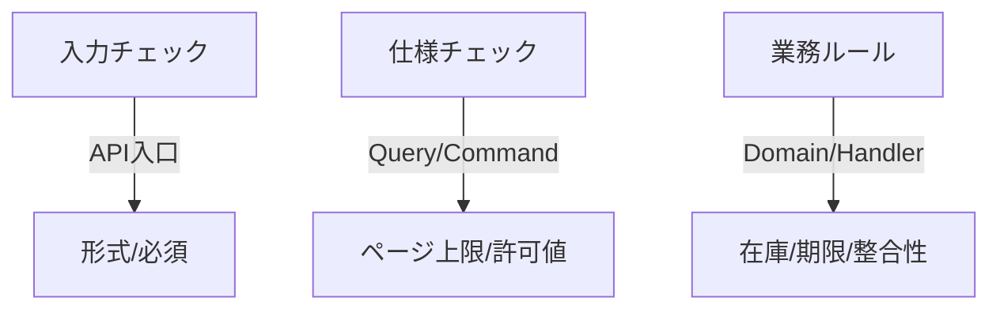

# 第28章　横断関心③ Validationを共通化（やりすぎ注意）🔍🧩⚠️

この章はね、**「バリデーションを賢く“共通化”して、でも沼らない」**がテーマだよ〜！🥰
共通化って気持ちいいけど、やりすぎると一気に迷路になるので、**ちょうどいい境界線**を一緒に作ろうね🧭✨

---

## この章のゴール🎯✨

* ✅ **Validationの種類**（入力チェック / 仕様チェック / 業務ルール）を分けて置ける
* ✅ **共通化していいもの・ダメなもの**を嗅ぎ分けられる👃
* ✅ Command/Query の実行前に **自動でValidationが走る仕組み**を作れる（Dispatcher方式）📬
* ✅ エラーを **きれいな返し方**（ValidationProblem / ProblemDetails）にできる🧯

---

## 1) まずは「Validationを3種類に分ける」🧠🧹



同じ“バリデーション”でも、性格が違う子が混ざってると事故るの…😵‍💫
だから最初に分けちゃうのが最強！

### A. 入力チェック（形式・必須・範囲）🧾✅

例：必須、文字数、数値の範囲、Email形式っぽい、など
→ **API入口**（DTO/Request）でやるのが気持ちいい✨

### B. 仕様チェック（ユースケースの都合）🧩

例：「検索は PageSize 最大100」「並び順は allowed のみ」
→ **Query/CommandごとのValidator**に置くのがわかりやすい👀

### C. 業務ルール（ドメインの掟）🏛️

例：「在庫が足りないと注文できない」「期限切れは不可」
→ **Command側のドメイン寄り**（第27章の“業務エラー”と相性◎）🔥

---

## 2) 共通化が気持ちよく見える瞬間😇✨（そして罠）

よくある流れ👇

* 「CreateのTitleチェック、Updateでも同じだ！」
* 「Searchのページング、別の画面も同じだ！」
* 「じゃあ共通化しよ〜🥳」

…で、こうなると危険⚠️

* ❌ `GenericValidator<T>` みたいな **何でも屋**が爆誕👑💥
* ❌ ルールの変更が「どこに影響するか分からない」🌀
* ❌ 結局みんな共通Validatorを触るのが怖くなる🙈

---

## 3) 共通化の“境界線”ルール📏✨（DRYの誤爆を防ぐ）


### 共通化してOKなやつ✅

* ✅ **変更理由が同じ**（例：PageSize上限は全検索で統一）
* ✅ **意味が同じ**（例：「メールアドレス」＝どこでも同じ意味）
* ✅ **3回以上同じコピペが出た**（目安）📌
* ✅ 小さく部品化できる（拡張メソッド1個とか）🧩

### 共通化しない方がいいやつ❌

* ❌ ユースケースごとに微妙に違う（Createは必須、Updateは任意…とか）
* ❌ “今は同じに見えるだけ”（未来に分岐する匂い）👃
* ❌ 「共通化のための抽象化」が説明コスト高い📚💦

---

## 4) 入口（API）側：最小の入力チェックを“自動”で✨⚡

### Minimal APIを使う場合（DataAnnotationsの自動Validation）🧷

.NET 10 では Minimal API に **組み込みのValidationサポート**が入り、`AddValidation()` で DataAnnotations を自動適用できるよ〜！便利！😆✨ ([Microsoft Learn][1])

```csharp
using System.ComponentModel.DataAnnotations;

var builder = WebApplication.CreateBuilder(args);

// ✅ Minimal APIの組み込みValidationをON
builder.Services.AddValidation();

var app = builder.Build();

app.MapPost("/todos", (CreateTodoRequest req) =>
{
    // ここに来る前に DataAnnotations が自動で走る👍
    return Results.Ok();
});

app.Run();

public sealed record CreateTodoRequest(
    [property: Required, StringLength(50, MinimumLength = 1)] string Title,
    [property: StringLength(200)] string? Note
);
```

> コツ💡：入口は **“形式・必須・範囲”だけ**にして、
> 仕様・業務ルールは Command/Query 側へ寄せるのがスッキリするよ🧼✨

---

## 5) アプリ層（Command/Query）側：FluentValidationは“手動Validation”が今の主流🖐️🔍

ここ超大事！📣
昔は `FluentValidation.AspNetCore` で自動連携〜みたいな流れが多かったんだけど、**今はそのパッケージ自体が「非サポート（unsupported）」になってて、手動で使う方向が推奨**されてるよ。 ([GitHub][2])

そして FluentValidation 本体は最新版だと **.NET 8+ をサポート**って明記されてるよ。 ([FluentValidation][3])

---

## 6) 実装してみよう🛠️✨：ユースケースValidator + “小さな共通部品”だけ

題材：ToDo を想像してね📝💕

### 6-1) Command と Validator（まずは素直に1対1）🍰

```csharp
public sealed record CreateTodoCommand(string Title, string? Note);

```

```csharp
using FluentValidation;

public sealed class CreateTodoCommandValidator : AbstractValidator<CreateTodoCommand>
{
    public CreateTodoCommandValidator()
    {
        RuleFor(x => x.Title)
            .NotEmpty()
            .MaximumLength(50);

        RuleFor(x => x.Note)
            .MaximumLength(200);
    }
}
```

ここまでは「共通化ゼロ」👍
まずはこれでOK！むしろこれが強い💪✨

---

### 6-2) 共通化は“拡張メソッド1個”から🧩✨（やりすぎ防止）

たとえばページング、いろんなQueryで使うよね📄
こういうのは共通化しやすい！

```csharp
public sealed record PageRequest(int Page, int PageSize);
```

共通ルール（小さく！）👇

```csharp
using FluentValidation;

public static class PagingValidationExtensions
{
    public static IRuleBuilderOptions<T, PageRequest> ValidPaging<T>(
        this IRuleBuilder<T, PageRequest> rule)
    {
        return rule
            .NotNull()
            .Must(p => p.Page >= 1).WithMessage("Pageは1以上にしてね🙏")
            .Must(p => p.PageSize is >= 1 and <= 100).WithMessage("PageSizeは1〜100だよ🙏");
    }
}
```

Query側で使う👇

```csharp
using FluentValidation;

public sealed record SearchTodosQuery(string? Keyword, PageRequest Page);

public sealed class SearchTodosQueryValidator : AbstractValidator<SearchTodosQuery>
{
    public SearchTodosQueryValidator()
    {
        RuleFor(x => x.Keyword)
            .MaximumLength(50);

        RuleFor(x => x.Page)
            .ValidPaging(); // ✅共通部品はこれだけ！
    }
}
```

**ポイント💡**
共通化は「抽象クラス」「ジェネリック地獄」じゃなくて、
まずは **“拡張メソッド1個”** がいちばん安全で気持ちいいよ🥰🧩

---

## 7) DispatcherにValidationを差し込む📬✨（Command/Query共通で自動化！）

第24章で作ったDispatcherに、**“実行前にValidatorを探して、あれば実行する”**を足すイメージだよ😺

### 7-1) 例：Validation例外（APIが扱いやすい形に）🧯

```csharp
public sealed class RequestValidationException : Exception
{
    public IReadOnlyDictionary<string, string[]> Errors { get; }

    public RequestValidationException(IReadOnlyDictionary<string, string[]> errors)
        : base("Validation failed.")
    {
        Errors = errors;
    }
}
```

### 7-2) Dispatcher：IValidator<T> があれば実行する🔍

```csharp
using FluentValidation;
using FluentValidation.Results;

public sealed class Dispatcher
{
    private readonly IServiceProvider _sp;

    public Dispatcher(IServiceProvider sp) => _sp = sp;

    public async Task<TResult> SendAsync<TRequest, TResult>(TRequest request, CancellationToken ct = default)
    {
        await ValidateIfExistsAsync(request, ct);

        // ここで本来は Handler を解決して実行する（第24章）
        var handler = _sp.GetRequiredService<IHandler<TRequest, TResult>>();
        return await handler.HandleAsync(request, ct);
    }

    private async Task ValidateIfExistsAsync<TRequest>(TRequest request, CancellationToken ct)
    {
        var validator = _sp.GetService<IValidator<TRequest>>();
        if (validator is null) return; // ✅ Validatorが無いならスルー（柔らかい）

        ValidationResult result = await validator.ValidateAsync(request, ct);
        if (result.IsValid) return;

        var dict = result.Errors
            .GroupBy(e => e.PropertyName)
            .ToDictionary(g => g.Key, g => g.Select(e => e.ErrorMessage).ToArray());

        throw new RequestValidationException(dict);
    }
}
```

> ここが“横断関心”の気持ちいいところ😍✨
> Controller/Endpoint 側で毎回 Validation 呼ぶ必要が減る！

---

## 8) APIにきれいに返す🪄🧾（ValidationProblemでOK！）

Minimal APIならこう👇

```csharp
app.MapPost("/todos", async (CreateTodoRequest req, Dispatcher dispatcher) =>
{
    try
    {
        var cmd = new CreateTodoCommand(req.Title, req.Note);
        var id = await dispatcher.SendAsync<CreateTodoCommand, Guid>(cmd);
        return Results.Created($"/todos/{id}", new { id });
    }
    catch (RequestValidationException ex)
    {
        return Results.ValidationProblem(ex.Errors);
    }
});
```

Controllerなら `ValidationProblem(ex.Errors)` を返す感じでOKだよ🙆‍♀️✨

---

## 9) ミニ演習🎓✨：「共通バリデーションを“1個だけ”作ろう」

やることはこれだけ！👇

* ✅ `PageRequest` を作る
* ✅ `ValidPaging()` を拡張メソッドで作る
* ✅ `SearchXxxQueryValidator` を2個作って両方で使う
* ✅ PageSize の上限を 100 → 200 に変えて、**影響範囲が気持ちよく一括**になるのを体験😆📈

---

## 10) AI拡張（Copilot / Codex）で爆速にするプロンプト例🤖💨✨

### Validatorの叩き台を作らせる🧱

* 「CreateTodoCommandValidator を FluentValidation で作って。Titleは必須で最大50、Noteは最大200」🤖📝

### 共通化やりすぎ判定をさせる⚖️

* 「この共通化はDRYの誤爆になってない？変更理由の観点でレビューして」🕵️‍♀️🤖

### エラーメッセージを“やさしく”整える💬

* 「女子大生向けのやさしいバリデーションメッセージ案を10個出して」🥺✨🤖

---

## 11) “やりすぎ注意”チェックリスト⚠️🧭

当てはまったら黄信号〜🚥😆

* ☑ 共通Validatorが巨大化してきた（100行超え）
* ☑ if/分岐が増えてきた（ユースケース差が混ざってる）
* ☑ `object` / reflection / 属性読み取りで何でもし始めた
* ☑ 「このルールどこで決まってるの？」がすぐ答えられない
* ☑ 共通化の説明に3分以上かかる（初心者が迷子）🌀

---

## まとめ🎀✨

* Validationは **3種類に分ける**と事故りにくい🧠✅
* 共通化は **小さく（拡張メソッド1個）** から始めるのが安全🧩✨
* Dispatcherに差し込むと **横断関心として統一**できて気持ちいい📬💖
* Minimal APIのDataAnnotations自動Validation（`AddValidation()`）も強い⚡ ([Microsoft Learn][1])
* FluentValidationは **手動Validation運用が推奨**の流れ（AspNetCoreパッケージは非サポート）🖐️ ([GitHub][2])

---

次の第29章は「Commandは単体テストが主役」🧪✨だから、
この章で作ったValidatorも **軽くテスト**して「壊れない安心感」を作っていくと最高だよ〜！😺🎉

[1]: https://learn.microsoft.com/en-us/aspnet/core/release-notes/aspnetcore-10.0?view=aspnetcore-10.0&utm_source=chatgpt.com "What's new in ASP.NET Core in .NET 10"
[2]: https://github.com/FluentValidation/FluentValidation.AspNetCore?utm_source=chatgpt.com "ASP.NET Core Integration for FluentValidation"
[3]: https://fluentvalidation.net/?utm_source=chatgpt.com "FluentValidation — FluentValidation documentation"
