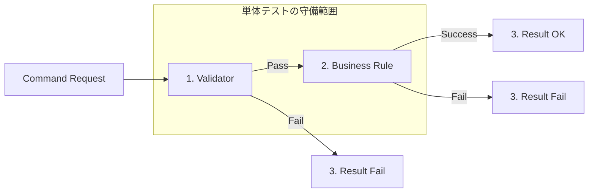

# 第29章　テスト① Commandは単体テストが主役🧪✨

今回は「Command（書き込み側）」を **単体テストで守る** 章だよ〜！🎀
CQRSって「読む（Query）」と「書く（Command）」を分けるけど、**テストの向き不向きも分かれる**のがポイント💡

---

## 1) この章のゴール🎯✨

この章を終えると、こんな感じになれるよ👇😊

* ✅ Command の **業務ルール** を単体テストで守れる
* ✅ DBやWebの都合に左右されない **速いテスト** が書ける
* ✅ 「何をテストすべき？」「何は統合テストでいい？」が判断できる

---

## 2) 2026の「.NETテスト事情」ちょいメモ🗒️⚡

* C# 14 は 2025年11月リリースとして案内されてるよ（=いま最新）🧡 ([Microsoft Learn][1])
* .NET 10 の `dotnet test` は **VSTest** か **Microsoft Testing Platform (MTP)** で実行できるよ（テストランナー選択が .NET 10 SDK から可能）🚀 ([Microsoft Learn][2])

> ただし！最初は難しく考えなくてOK🙆‍♀️
> ふつうに `dotnet test` で回せればまず勝ち！🎉 ([Microsoft Learn][2])

---

## 3) なんで Command は単体テスト向きなの？🤔💖


**Command = 状態を変える**側だよね✍️
そして状態を変えるときって、だいたいこうなる👇

* 「タイトル必須」みたいな入力ルール🧾
* 「期限切れは禁止」みたいな業務ルール📅
* 「同じ名前はNG」みたいな一意性ルール🚫

つまり **ルールの塊** になりやすい！🧱✨
ルールって **テストの主役** なんだよね😊

逆に Query は、SQL/LINQ/JOIN/集計…みたいな「外の世界」の影響が強くて、単体で頑張りすぎると地獄になりがち😵（これは次章でやるね）

---

## 4) Command単体テストで「何を守る？」チェックリスト✅🧠



最低限、ここだけ守れたらかなり強い💪✨

* ✅ 入力チェック（null/空/文字数/範囲）
* ✅ 業務ルール（状態・期限・上限・重複など）
* ✅ 失敗時の戻り値（エラーコード/メッセージ）
* ✅ 成功時に「保存されるべきものが保存されたか」

逆に、単体テストで **無理しなくていい** もの👇😇

* ❌ EF Core のマッピングが正しいか
* ❌ SQLが速いか
* ❌ インデックスが効いてるか

それらは **統合テスト/計測** の世界（後の章）📌

---

## 5) テストしやすい CommandHandler の形🍱✨

単体テストしやすくするコツはシンプル！

### コツA：依存を「注入」して、差し替えられるようにする🔁

* Repository（保存先）
* 時刻（現在時刻）
* ユーザー情報（必要なら）

### コツB：戻り値を「結果型」にして、例外まみれにしない🧯

例外は「落ちる」から、テストも読みづらくなりやすい🥲
業務エラーは **戻り値で表現**できると超ラク✨

---

## 6) ミニ題材：ToDoの「作成Command」📝🐣

要件はこんな感じにするよ👇

* タイトルは必須（空はダメ）
* タイトルは100文字まで
* 期限（DueDate）が過去ならダメ
* 同じタイトルが既にあるならダメ（重複禁止）

---

## 7) 実装（アプリ側）✍️🧩

### 7-1) Command結果（成功/失敗）🎁

```csharp
namespace TodoApp;

public sealed record CommandResult<T>(
    bool IsSuccess,
    T? Value,
    string? ErrorCode,
    string? ErrorMessage)
{
    public static CommandResult<T> Success(T value)
        => new(true, value, null, null);

    public static CommandResult<T> Fail(string code, string message)
        => new(false, default, code, message);
}
```

### 7-2) Entity / Repositoryインターフェイス📦

```csharp
namespace TodoApp;

public sealed record TodoItem(
    Guid Id,
    string Title,
    DateOnly? DueDate,
    DateTimeOffset CreatedAtUtc);

public interface ITodoRepository
{
    Task<bool> ExistsTitleAsync(string title, CancellationToken ct);
    Task AddAsync(TodoItem item, CancellationToken ct);
}
```

### 7-3) Command / Handler 🧑‍🍳

```csharp
namespace TodoApp;

public sealed record CreateTodoCommand(string Title, DateOnly? DueDate);

public sealed class CreateTodoHandler
{
    private readonly ITodoRepository _repo;
    private readonly TimeProvider _time;

    public CreateTodoHandler(ITodoRepository repo, TimeProvider time)
    {
        _repo = repo;
        _time = time;
    }

    public async Task<CommandResult<Guid>> HandleAsync(
        CreateTodoCommand cmd,
        CancellationToken ct = default)
    {
        // ①入力チェック
        if (string.IsNullOrWhiteSpace(cmd.Title))
            return CommandResult<Guid>.Fail("TITLE_REQUIRED", "タイトルは必須だよ🥺");

        if (cmd.Title.Length > 100)
            return CommandResult<Guid>.Fail("TITLE_TOO_LONG", "タイトルは100文字までだよ✂️");

        // ②業務ルール（期限）
        var today = DateOnly.FromDateTime(_time.GetUtcNow().UtcDateTime);
        if (cmd.DueDate is not null && cmd.DueDate.Value < today)
            return CommandResult<Guid>.Fail("DUE_IN_PAST", "期限が過去になってるよ📅💦");

        // ③業務ルール（重複）
        if (await _repo.ExistsTitleAsync(cmd.Title, ct))
            return CommandResult<Guid>.Fail("DUPLICATE_TITLE", "同じタイトルがもうあるよ😵");

        // ④作成して保存
        var id = Guid.NewGuid();
        var item = new TodoItem(
            id,
            cmd.Title.Trim(),
            cmd.DueDate,
            _time.GetUtcNow());

        await _repo.AddAsync(item, ct);

        return CommandResult<Guid>.Success(id);
    }
}
```

---

## 8) テスト準備（テスト側）🧰🧪

### xUnitでいくよ！🐾

xUnit は .NET 8 以降をサポートするよ（v3）✨ ([xUnit.net][3])
Microsoft Learn にも xUnit での単体テスト手順があるよ📚 ([Microsoft Learn][4])

### 「時間」を固定するために FakeTimeProvider を使う⏰✨

`FakeTimeProvider` を使うと、テストで時間を確定できるよ！
これは Microsoft が提供するテスト向け実装🧡 ([Microsoft Learn][5])

---

## 9) ミニ演習：Commandテストを3本だけ書く🧪✅

### 9-1) テスト用の InMemoryRepository を作る🧺

```csharp
using TodoApp;

public sealed class InMemoryTodoRepository : ITodoRepository
{
    private readonly List<TodoItem> _items = new();

    public Task<bool> ExistsTitleAsync(string title, CancellationToken ct)
        => Task.FromResult(_items.Any(x => x.Title == title));

    public Task AddAsync(TodoItem item, CancellationToken ct)
    {
        _items.Add(item);
        return Task.CompletedTask;
    }

    // テストで確認しやすいように追加（本番には不要でもOK）
    public IReadOnlyList<TodoItem> Items => _items;
}
```

### 9-2) テスト本体（3本）🎉

```csharp
using Microsoft.Extensions.Time.Testing;
using TodoApp;
using Xunit;

public sealed class CreateTodoHandlerTests
{
    [Fact]
    public async Task Succeeds_when_valid()
    {
        // Arrange 🧁
        var repo = new InMemoryTodoRepository();

        var time = new FakeTimeProvider();
        time.SetUtcNow(new DateTimeOffset(2026, 1, 24, 0, 0, 0, TimeSpan.Zero));

        var handler = new CreateTodoHandler(repo, time);

        // Act 🏃‍♀️
        var result = await handler.HandleAsync(new CreateTodoCommand(
            Title: "レポート提出",
            DueDate: new DateOnly(2026, 1, 25)));

        // Assert ✅
        Assert.True(result.IsSuccess);
        Assert.NotEqual(Guid.Empty, result.Value);
        Assert.Single(repo.Items);
        Assert.Equal("レポート提出", repo.Items[0].Title);
    }

    [Fact]
    public async Task Fails_when_title_is_empty()
    {
        // Arrange 🍬
        var repo = new InMemoryTodoRepository();
        var time = new FakeTimeProvider();
        time.SetUtcNow(new DateTimeOffset(2026, 1, 24, 0, 0, 0, TimeSpan.Zero));

        var handler = new CreateTodoHandler(repo, time);

        // Act 🏃‍♀️
        var result = await handler.HandleAsync(new CreateTodoCommand(
            Title: "   ",
            DueDate: null));

        // Assert ✅
        Assert.False(result.IsSuccess);
        Assert.Equal("TITLE_REQUIRED", result.ErrorCode);
        Assert.Empty(repo.Items);
    }

    [Fact]
    public async Task Fails_when_due_date_is_in_the_past()
    {
        // Arrange 🍓
        var repo = new InMemoryTodoRepository();
        var time = new FakeTimeProvider();
        time.SetUtcNow(new DateTimeOffset(2026, 1, 24, 0, 0, 0, TimeSpan.Zero));

        var handler = new CreateTodoHandler(repo, time);

        // Act 🏃‍♀️
        var result = await handler.HandleAsync(new CreateTodoCommand(
            Title: "過去期限のタスク",
            DueDate: new DateOnly(2026, 1, 23)));

        // Assert ✅
        Assert.False(result.IsSuccess);
        Assert.Equal("DUE_IN_PAST", result.ErrorCode);
        Assert.Empty(repo.Items);
    }
}
```

🎊 できた！これで「Commandのルール」が単体テストで守れるようになったよ！

---

## 10) テストの実行方法🏁🖱️

### そのまま `dotnet test` でOK✨

`dotnet test` はテストをビルドして実行する標準コマンドだよ🧪 ([Microsoft Learn][2])

```powershell
dotnet test
```

（Visual Studio なら Test Explorer で ▶ 実行できるよ〜😊）

---

## 11) よくあるつまずきポイント集😵‍💫🩹

### つまずき①：DateTime.Now を直に使ってテストが不安定⏰💥

→ `TimeProvider` + `FakeTimeProvider` で固定しよう✨ ([Microsoft Learn][5])

### つまずき②：HandlerがDB直結でテストが重い🐢

→ Repository をインターフェイスにして、単体テストは InMemory に差し替え👍

### つまずき③：テストが「実装の写経」になる📋

→ “どう実装したか” じゃなくて、**ルール（仕様）** を Assert しよ✨
例：

* 「期限が過去なら必ず失敗」
* 「成功したら保存される」

---

## 12) AI（Copilot / Codex）活用プロンプト例🤖💞

### ①テストケースを出させる（取捨選択する）✅

* 「CreateTodoCommand の仕様はこれ。境界値を含むテストケース案を10個出して。重要度も付けて」

### ②エラーコードの粒度チェック🧯

* 「このエラーコード設計、UI/ログ/保守の観点で過不足ない？改善案ちょうだい」

### ③テストを読みやすくするリファクタ🧼

* 「このテスト、読みやすくするためにArrangeの共通化を提案して。ただし抽象化しすぎないで」

> コツ：AIの案は“採用する前に” **自分のチェックリスト**（何のルールを守りたい？）でふるいにかけるのが最強だよ😺✨

---

## 13) まとめ🎀（ここだけ覚えてたら勝ち🏆）

* Command は **ルールの塊** → 単体テストがいちばん効く🧪✨
* 単体テストは **速い・安定・怖くない** を目指す🏃‍♀️💨
* 時刻みたいな “ブレるもの” は注入して固定（TimeProvider）⏰
* まずは **テスト3本** でOK！少数精鋭で守る✅

---

次の第30章は「Queryは統合寄り（現実路線）」だよ〜🧫✨
「単体で頑張りすぎない判断」を一緒に身につけよっ😊💖

[1]: https://learn.microsoft.com/en-us/dotnet/csharp/whats-new/csharp-version-history?utm_source=chatgpt.com "The history of C# | Microsoft Learn"
[2]: https://learn.microsoft.com/en-us/dotnet/core/tools/dotnet-test?utm_source=chatgpt.com "dotnet test command - .NET CLI"
[3]: https://xunit.net/?utm_source=chatgpt.com "xUnit.net: Home"
[4]: https://learn.microsoft.com/en-us/dotnet/core/testing/unit-testing-csharp-with-xunit?utm_source=chatgpt.com "Unit testing C# in .NET using dotnet test and xUnit"
[5]: https://learn.microsoft.com/en-us/dotnet/standard/datetime/timeprovider-overview?utm_source=chatgpt.com "What is the TimeProvider class - .NET"
