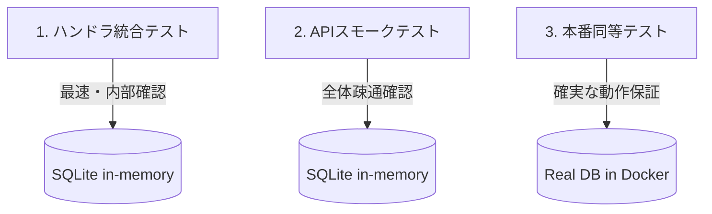

# 第30章　テスト② Queryは統合寄り（現実路線）🧫✨

（＝**DBと一緒に動かして確かめる**のが、いちばん事故が減るよ〜！って話です😊）

---

## この章のゴール🎯💖

この章が終わったら、あなたはこうなれます👇✨

* Query（一覧・検索・集計）が**壊れてないか**を、DB込みでチェックできる🧪
* 「Queryを単体テストで頑張りすぎて沼る😵」を回避できる
* **スモークテスト（最低限の安心）**を短時間で作れる🔥

---

## なんでQueryは“統合テスト寄り”なの？🤔🧠


Queryって、実体はだいたいこう👇

* LINQ / SQL（DBに投げるやつ）
* JOIN・集計・フィルタ・ソート・ページング
* DTO投影（Selectで形を作る）

で、ここがポイント💥
**LINQは「C#で書ける」けど、最後はDBのSQLに変換される**ので、
単体テストでモックしても「本番で動かない」事故が起きやすいんです😇

Microsoftの統合テストの公式ガイドでも、統合テストはDBなどのインフラ込みで動かす前提で説明されていて、EF Coreのテスト用DBについても注意があります。([Microsoft Learn][1])

---

## まず結論：Queryのテストはこの3段階でOK💡🧪



おすすめはこの順番✨（全部やらなくてOK！）

1. **ハンドラ統合テスト**（DB + QueryHandler だけ）🧪
2. **API統合テスト**（HTTPで叩く：スモーク向き）🌐
3. **本番と同じDBで統合**（Testcontainersなど：余裕が出たら）🐳🔥

---

## 大事な注意：EF Coreの“InMemoryプロバイダ”は万能じゃない⚠️🧊

「楽そうだから InMemory 使お〜」ってやりがちなんだけど…
公式でも **InMemoryは“限定的”**、インメモリでやるなら **SQLite推奨**って流れです。([Microsoft Learn][1])

さらにEF Core公式のテスト解説でも、DbSetをモックしてQueryをテストするのは難しくて非推奨寄り、SQLite in-memoryの方が互換性が高い（ただし差は残る）と説明されています。([Microsoft Learn][2])

この章では **SQLite in-memory** を軸にいきます😊🫶

---

# 1️⃣ ハンドラ統合テスト（DB + QueryHandler）🧪✨

## ねらい🎯

* **SQL変換ミス**（Whereが効いてない、Joinで死ぬ、ページング変など）を早めに検知する
* テストは速くしたいので、Webサーバーは立てない（ここ重要）⚡

---

## 手順A：SQLite in-memory を“正しく”使うコツ🔑🧠

SQLiteのin-memoryは **接続（Connection）が閉じるとDBも消える**ので、
テスト中は **接続を開きっぱなし**にします🚪🔓

---

## 例：QueryHandlerの統合テスト（テンプレ）🧪🧸

> ここでは題材として「ToDo一覧Query」を想定して書くね😊
> あなたのプロジェクトの `GetXxxListQueryHandler` に読み替えればOK！

```csharp
using Microsoft.Data.Sqlite;
using Microsoft.EntityFrameworkCore;
using Xunit;

public sealed class GetTodoListQueryIntegrationTests
{
    [Fact]
    public async Task Keywordで絞り込みできる()
    {
        // 1) SQLite in-memory: 接続を開きっぱなしにする
        await using var connection = new SqliteConnection("DataSource=:memory:");
        await connection.OpenAsync();

        // 2) DbContext を SQLite に向ける
        var options = new DbContextOptionsBuilder<AppDbContext>()
            .UseSqlite(connection)
            .Options;

        // 3) スキーマ作成 & Seed
        await using (var setup = new AppDbContext(options))
        {
            await setup.Database.EnsureCreatedAsync();

            setup.TodoItems.AddRange(
                new TodoItem { Title = "牛乳を買う", IsDone = false },
                new TodoItem { Title = "レポート提出", IsDone = true },
                new TodoItem { Title = "牛乳プリン作る", IsDone = false }
            );

            await setup.SaveChangesAsync();
        }

        // 4) テスト対象を実行（QueryHandler）
        await using (var db = new AppDbContext(options))
        {
            var handler = new GetTodoListQueryHandler(db);

            var result = await handler.Handle(new GetTodoListQuery(
                Keyword: "牛乳",
                Page: 1,
                PageSize: 10
            ));

            // 5) Assert（期待どおり絞り込めてる？）
            Assert.Equal(2, result.Items.Count);
            Assert.All(result.Items, x => Assert.Contains("牛乳", x.Title));
        }
    }
}
```

### ここ、テストとしてめちゃ大事💖

* **Seedは最小**でOK（3件とかで十分）🌱
* Assertは「条件が効いてる」ことに絞る（全部チェックしない）🧪✨

---

## よくあるつまずき😵‍💫🌀（そして即解決）

### ❌「no such table…」になる

✅ 原因：SQLite in-memory が消えた（接続が閉じた）
✅ 対策：**接続をOpenしたまま**テスト全体で使う（上の例の通り）🔓

### ❌ テストがたまに落ちる（順序が違う）

✅ 原因：**ORDER BY なし**で “たまたま順” に依存してる
✅ 対策：Query側で必ず `.OrderBy(...)` を入れる📌✨

### ❌ InMemoryだと通るのに本番で死ぬ

✅ あるある…😇
SQLite（または本番DB）で回すと、SQL変換の違いが露出します
→ だからこの章の方針が強い💪([Microsoft Learn][2])

---

# 2️⃣ API統合テスト（スモークテスト向き）🌐🧪

## ねらい🎯

* ルーティング、DI、シリアライズ、フィルタ、例外処理など
  **“APIとして動くか”**をまとめて確認する✨
* Microsoftも `WebApplicationFactory` を使った統合テストを公式で案内しています。([NuGet][3])

---

## 最小の型：Program をテストから参照できるようにする🧩

Minimal APIでもControllerでも、これを `Program.cs` のどこかに置くのが定番です👇

```csharp
public partial class Program { }
```

---

## WebApplicationFactoryでDBをSQLite in-memoryに差し替える（雛形）🧪

```csharp
using Microsoft.AspNetCore.Hosting;
using Microsoft.AspNetCore.Mvc.Testing;
using Microsoft.Data.Sqlite;
using Microsoft.EntityFrameworkCore;
using Microsoft.Extensions.DependencyInjection;
using Microsoft.Extensions.DependencyInjection.Extensions;

public sealed class ApiFactory : WebApplicationFactory<Program>
{
    private SqliteConnection? _connection;

    protected override void ConfigureWebHost(IWebHostBuilder builder)
    {
        builder.ConfigureServices(services =>
        {
            // 既存のDbContext登録を消す
            services.RemoveAll<DbContextOptions<AppDbContext>>();

            // SQLite in-memory: 接続を開きっぱなし
            _connection = new SqliteConnection("DataSource=:memory:");
            _connection.Open();

            services.AddDbContext<AppDbContext>(opt => opt.UseSqlite(_connection));

            // スキーマ作成 & Seed
            var sp = services.BuildServiceProvider();
            using var scope = sp.CreateScope();
            var db = scope.ServiceProvider.GetRequiredService<AppDbContext>();
            db.Database.EnsureCreated();

            db.TodoItems.Add(new TodoItem { Title = "スモーク用", IsDone = false });
            db.SaveChanges();
        });
    }

    protected override void Dispose(bool disposing)
    {
        base.Dispose(disposing);
        if (disposing) _connection?.Dispose();
    }
}
```

---

## APIスモークテスト例（GET叩いてOKなら勝ち🎉）

```csharp
using System.Net;
using Xunit;

public sealed class TodoApiSmokeTests : IClassFixture<ApiFactory>
{
    private readonly ApiFactory _factory;

    public TodoApiSmokeTests(ApiFactory factory) => _factory = factory;

    [Fact]
    public async Task Todo一覧が200で返る()
    {
        var client = _factory.CreateClient();

        var res = await client.GetAsync("/api/todos?page=1&pageSize=10");
        Assert.Equal(HttpStatusCode.OK, res.StatusCode);

        var json = await res.Content.ReadAsStringAsync();
        Assert.Contains("スモーク用", json);
    }
}
```

---

## xUnit v3の小ネタ（困ったらここ疑って🥲）

最近は xUnit v3 も使えるけど、.NET 10 + `WebApplicationFactory` 周りでエラー報告が出てたりします。([Stack Overflow][4])
もしハマったら、まずはテスト基盤を **xUnit v2 系に寄せる**と安定しやすいです🙏（ここは“完成させるのが最優先”でOK！）

---

# 3️⃣ もう一段リアルに：本番と同じDBで統合（余裕が出たら）🐳🔥


SQLiteでもかなり事故は減るけど、**本番がSQL Server/PostgreSQL**なら、
「本番DBでしか起きない癖」もあります😇

そこで便利なのが **Testcontainers**：テスト中だけDockerで本物DBを立てるやつ💪
SQL Serverを立てるモジュールも公式で案内されています。([dotnet.testcontainers.org][5])

そしてDBの掃除（初期化）に **Respawn** を組み合わせると、
テストが速くて安定しやすいです🧹✨([GitHub][6])

（この章では“紹介だけ”にして、やるなら発展編でOK😊）

---

# 4️⃣ ミニ演習（この章のゴールチェック✅🎀）

## 演習1：QueryHandler統合テストを1本作る🧪

* フィルタ（KeywordやStatus）を1個入れる
* 「絞り込みできてる？」だけAssertする

## 演習2：APIスモークテストを1本作る🌐

* GETを叩いて 200 OK
* JSONにSeedした文字が入ってたら勝ち🎉

---

# 5️⃣ AIに手伝ってもらうプロンプト例🤖💬✨

* 「このQuery（LINQ）に対して、落ちやすい境界条件のテストケースを10個出して」
* 「SQLite in-memoryでEF Core統合テストを書くxUnitテンプレを作って（接続は開きっぱなしで）」
* 「このAPIのスモークテストを `WebApplicationFactory` で最小構成にして」

---

## まとめ🌸

Queryは“DBと一緒に”動かしてこそ安心🥹🫶
この章のスタイル（**SQLite in-memory統合 + APIスモーク**）を持っておくと、
CQRSのRead側が一気に「壊れにくい」チームになります🎉✨

次に進むなら、Queryの性能（計測→改善）に入っていく流れが気持ちいいよ〜📏⚡

[1]: https://learn.microsoft.com/en-us/aspnet/core/test/integration-tests?view=aspnetcore-10.0&utm_source=chatgpt.com "Integration tests in ASP.NET Core"
[2]: https://learn.microsoft.com/en-us/ef/core/testing/?utm_source=chatgpt.com "Overview of testing applications that use EF Core"
[3]: https://www.nuget.org/packages/Microsoft.AspNetCore.Mvc.Testing?utm_source=chatgpt.com "Microsoft.AspNetCore.Mvc.Testing 10.0.2"
[4]: https://stackoverflow.com/questions/79835137/net-10-0-integration-tests-error-with-xunit-v3-assembly-fixture-and-webapplicat?utm_source=chatgpt.com "NET 10.0 integration tests error with xunit v3 assembly ..."
[5]: https://dotnet.testcontainers.org/modules/mssql/?utm_source=chatgpt.com "Microsoft SQL Server"
[6]: https://github.com/jbogard/Respawn?utm_source=chatgpt.com "jbogard/Respawn: Intelligent database cleaner for ..."
