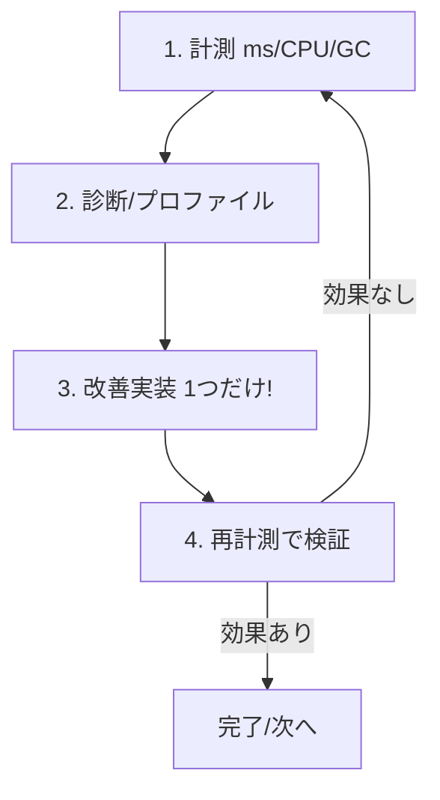

# 第31章　パフォーマンス① “計測してから直す”📏⚡

（合言葉：**体感じゃなくて、数字で話そ！**😺）

この章では「遅いっぽい…🥺」を **ちゃんと測って**、**どこが遅いか当てる**ところまでやるよ！
※直すのは次章（インデックス / N+1）で大きくやるので、ここは **“測り方の型”** を体に入れる回だよ〜💪✨

---

### この章でできるようになること ✅😺

* 「何を」「どの条件で」測るかを決められる🎯
* **計測のベースライン**（改善前の数字）を作れる📊
* **VSのプロファイラ / dotnet-counters** で “怪しい場所” を見つけられる👀
* 改善アイデアを出しても、**必ず再計測で答え合わせ**できる🔁✨

---

## 1) まず “測る前の約束” を決めよっ🤝📌




パフォーマンスって、測り方がブレるとすぐ事故るの…😇
なので、最初に **測定ルール（実験条件）** を固定するよ！

### 1-1. 何を指標にする？（最低これだけでOK）📏

まずはこれだけ覚えよう👇

* **応答時間**：1回のAPIが何msかかった？（平均/中央値/最大）⏱️
* **スループット**：1秒に何回処理できた？（余裕があれば）🚀
* **CPU / メモリ / GC**：重い原因がCPU型？メモリ型？🧠🧊

  * dotnet-counters でGCや例外率も見られるよ📟 ([Microsoft Learn][1])

> ここでのゴール：
> **「遅い」→「どの指標が悪いか」** に言い換えられるようにすること😺✨

---

### 1-2. “測定シナリオ” を決める（1つでいい）🎬

おすすめは **Query（読む側）** から選ぶこと👀
例：

* `GET /orders?keyword=aaa&page=1`（一覧＋検索＋ページング）
* `GET /todos?done=false&sort=updatedAt`

**選び方のコツ**👇

* “重そうな画面” ＝ **検索・集計・一覧** が絡むやつ🔍📄
* 「いつも使う」やつ（本番で効く）✨

---

### 1-3. 測定の落とし穴（ここだけは避けて〜！）⚠️😵‍💫

* **Debugで測る**（遅くなりがちでブレる）
* **1回だけ叩いて判断**（初回はJITやキャッシュで遅いことある）
* **データ量が少なすぎ**（本番と別世界）
* **改善を複数いっぺんに入れる**（何が効いたか不明）

> だから：
> **「同じ条件で、改善前→改善後」** を1個ずつ試すのが正解🙆‍♀️✨

---

## 2) いちばん簡単な “計測の仕組み” を入れよう📮⏱️

### 2-1. API全体の所要時間をログに出す（ミニミドルウェア）🧾✨

「このAPI、何ms？」を自動で出すやつを入れるよ！

```csharp
// RequestTimingMiddleware.cs
using System.Diagnostics;

public sealed class RequestTimingMiddleware(RequestDelegate next, ILogger<RequestTimingMiddleware> logger)
{
    public async Task Invoke(HttpContext context)
    {
        var sw = Stopwatch.StartNew();

        await next(context);

        sw.Stop();
        logger.LogInformation(
            "HTTP {Method} {Path} => {StatusCode} in {ElapsedMs} ms",
            context.Request.Method,
            context.Request.Path,
            context.Response.StatusCode,
            sw.Elapsed.TotalMilliseconds
        );
    }
}
```

Program.cs に追加👇

```csharp
app.UseMiddleware<RequestTimingMiddleware>();
```

これだけで、**全リクエストの時間** がログで見えるようになるよ😺📈
（のちのち「遅いのどれ？」って探すのが超ラクになる✨）

---

## 3) “ベースライン” を作る（改善前の数字）📊🧊

ここからが本番！
「改善した気がする」を禁止して、**数字で現状把握**するよ😼

### 3-1. ローカルでRelease起動（まずこれ）🏁

ターミナル（PowerShell）で👇

```powershell
dotnet run -c Release
```

---

### 3-2. PowerShellで “ざっくり計測” する（一番カンタン）🧪💖

まずは **1回の応答時間** を測るよ！

```powershell
Measure-Command {
  Invoke-RestMethod "https://localhost:5001/orders?keyword=a&page=1"
}
```

でも1回だとブレるので、10回くらい回す👇

```powershell
1..10 | ForEach-Object {
  (Measure-Command {
    Invoke-RestMethod "https://localhost:5001/orders?keyword=a&page=1" | Out-Null
  }).TotalMilliseconds
}
```

出てきたmsをメモしておこう📝✨

* 平均っぽい値
* 最大値（たまに跳ねるやつ）

> ここで “測定ノート” を作るのおすすめだよ📓
> 「日付 / 対象API / データ件数 / 平均ms / 最大ms」だけでOK😺

---

## 4) どこが苦しいか “体調チェック” する（dotnet-counters）🩺📟

次は **アプリの中身** を見るよ！
`dotnet-counters` は「いまCPU高い？ GC暴れてる？」みたいな **健康診断ツール** だよ🧑‍⚕️✨ ([Microsoft Learn][1])

### 4-1. まずプロセスIDを探す🔎

```powershell
dotnet-counters ps
```

### 4-2. 監視スタート（いちばん簡単な形）▶️

```powershell
dotnet-counters monitor --process-id <PID>
```

見どころ（初心者はここだけ見ればOK）👇

* **CPU Usage**：高いままならCPU型の疑い🔥
* **GC Heap Size / Gen 0/1/2 GC**：増え続けたりGC多いとメモリ型の疑い🧊
* **Exception Count**：例外が多いと地味に遅くなる😵

> 「API叩いた瞬間に、どの数値が跳ねる？」を見るのがコツ👀✨

さらに深掘り用に、.NETの診断ツール全体（dotnet-trace / dotnet-dump / dotnet-gcdump / dotnet-monitor）も公式でまとまってるよ📚 ([Microsoft Learn][2])
運用寄りなら `dotnet-monitor` が「本番で診断データ集める」方向で強い子だよ🛰️ ([Microsoft Learn][2])

---

## 5) “犯人の場所” を特定する（Visual Studio プロファイラ）🕵️‍♀️🧠

数字で「遅いのは本当」って確認できたら、次は **どの関数が重いか** を見にいくよ！

Visual Studioには Performance Profiler（CPU/メモリ等）があって、
**ホットパス（時間食ってる場所）** を見つけられる✨

やること（ざっくり）👇

1. **Debug** メニュー → **Performance Profiler**（パフォーマンス プロファイラー）
2. **CPU Usage** を選ぶ（まずはこれだけでOK）
3. 計測開始 → 例のAPIを何回か叩く
4. 停止 → 「時間食ってるメソッド上位」を見る👀

Visual Studio 2026 自体もいろいろ改善が入ってるし、.NET 10 とセットでの体験が整理されてるよ🧰 ([Microsoft Learn][3])
（「F5体験が速くなった」とか、開発の快適さも上がってる系） ([Microsoft Learn][3])

---

## 6) ここまでの “型” を1枚にまとめる（超大事）🧩✨

これが **パフォーマンス改善の黄金テンプレ** だよ😺

1. **遅いと言われた機能** を1つ選ぶ🎯
2. **測定指標** を決める（ms / CPU / GC）📏
3. **ベースライン** を取る（改善前の数字）📊
4. **原因の当たり** をつける（Counters / Profiler）🕵️
5. **変更は1個だけ** 入れる🔧
6. **同じ条件で再測定**🔁
7. **ノートに残す**（未来の自分が助かる）📓💕

---

## 7) ミニ演習（この章のゴールにピッタリ）🎒✨

### 演習A：遅いQueryを1個 “発見” する🔍

* あなたのプロジェクトで「一覧」「検索」「集計」っぽいQueryを1本選ぶ
* Releaseで起動
* PowerShellで10回計測して、平均と最大をメモ📝

### 演習B：Countersで “体調” をメモする🩺

* APIを叩いたとき

  * CPUが跳ねる？
  * GCが増える？
  * 例外が増える？
    どれか1個だけでも観察して、メモに残す😺

### 演習C：VSプロファイラで “重い場所TOP3” を書く🕵️

* CPU Usageで測って
* 時間を食ってるメソッドTOP3の名前を書く（正確に）✍️

> この3つができたら、次章の「N+1 / インデックス」で勝てる準備完了だよ🎉✨

---

## 8) AI拡張（Copilot / Codex）に手伝わせるプロンプト例🤖💬✨

### 計測計画を作らせる（最初に便利）

```text
次のAPIの性能を改善したい。まず「計測→原因切り分け→改善→再計測」の手順を
チェックリスト形式で作って。測定条件（データ量、回数、Release等）も含めて。
対象API: GET /orders?keyword=a&page=1
```

### “どの指標を見るべき？” を聞く

```text
dotnet-countersで見るべき指標を、CPU型 / メモリ(GC)型 / DB型 の3パターンで整理して。
それぞれ、どの数値がどう動くと疑うべきかも教えて。
```

### プロファイラ結果を読ませる（テキスト化して貼る）

```text
VSのCPUプロファイラで上位に出たメソッド名はこれ：
1) Xxx
2) Yyy
3) Zzz
CQRSのQuery側として、よくある原因仮説を5つ挙げて。今は最適化案より「切り分け手順」を優先して。
```

---

## 9) まとめ😺📌

* 速くする前に、まず **測って事実確認** 📏
* ベースラインがない改善は、だいたい気分🥺
* `dotnet-counters` で体調チェック📟、VSプロファイラで犯人捜し🕵️
* 変更は1個ずつ、再計測で勝ち確🔁✨
 
 

---

### ちょい豆知識（2026年1月時点）🫘

.NET 10 は **LTS** で、2025-11-11にリリース、2026-01-13時点で 10.0.2 が最新パッチとして案内されてるよ📌 ([Microsoft][4])
C# 14 も .NET 10 / Visual Studio 2026 と一緒に触れる前提で整理されてる✨ ([Microsoft Learn][5])

---

次の第32章は、ここで見つけた「怪しいポイント」を、**N+1 とインデックス**で “ちゃんと直す” 回だよ📌📌📌
第31章の演習Cで出た「重いメソッドTOP3」だけ教えてくれたら、それを題材にして第32章をめちゃ具体的に作れるよ😺💖

[1]: https://learn.microsoft.com/ja-jp/dotnet/core/diagnostics/dotnet-counters?utm_source=chatgpt.com "dotnet-counters 診断ツール - .NET CLI"
[2]: https://learn.microsoft.com/ja-jp/dotnet/core/additional-tools/?utm_source=chatgpt.com "その他のツール - .NET"
[3]: https://learn.microsoft.com/ja-jp/visualstudio/releases/2026/release-notes?utm_source=chatgpt.com "Visual Studio 2026 リリース ノート"
[4]: https://dotnet.microsoft.com/en-us/platform/support/policy/dotnet-core?utm_source=chatgpt.com "NET and .NET Core official support policy"
[5]: https://learn.microsoft.com/en-us/dotnet/csharp/whats-new/csharp-14?utm_source=chatgpt.com "What's new in C# 14"
