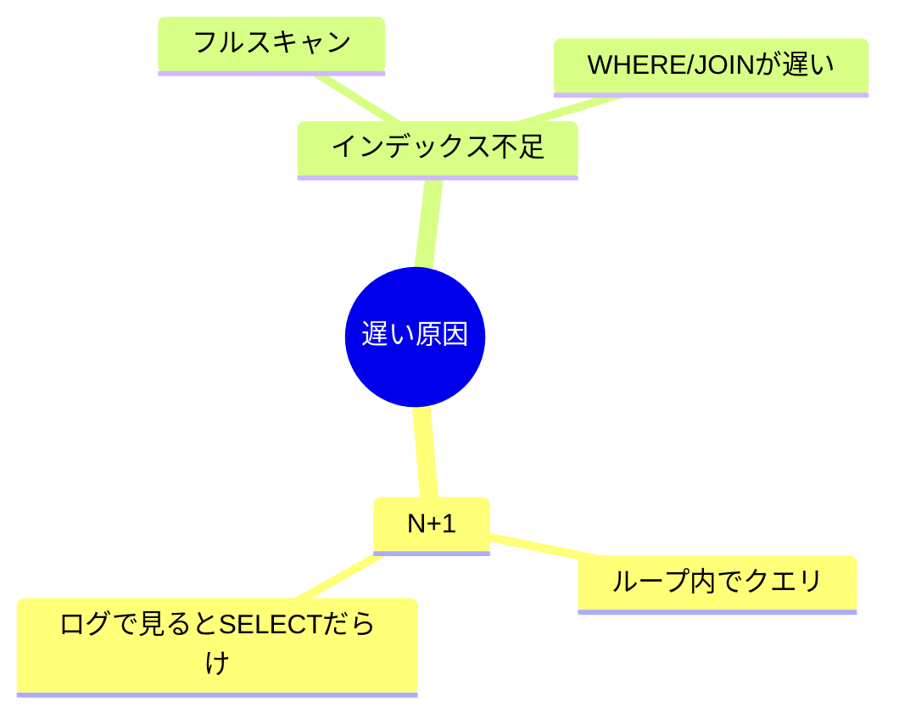

# 第32章　パフォーマンス② インデックスとN+1の超基本📌

この章は「**読み取りが遅い**」ときに、いちばん出やすい原因トップ2（**N+1** と **インデックス不足**）を、手を動かして直せるようにする回だよ〜！🧸💨

---

## この章のゴール🎯✨

読み終わったら、こんなことができるようになるよ👇

* ✅ ログを見て「N+1起きてる…！」って気付ける👀
* ✅ N+1を**3つの定番パターン**で直せる🔧
* ✅ 「どの列にインデックス貼る？」を**手順で決められる**📌
* ✅ EF Core のマイグレーションでインデックスを追加できる🧱（SQL Server の Include 列も✨）

※EF Core 10 は .NET 10 が必要で、2025年11月リリースのLTSだよ〜（サポートは 2028-11-10 まで）📅✨
([Microsoft Learn][1])

---

## 1) N+1問題ってなに？🐛💥（超ざっくり）




**1回で終わるはずの読み取りが、ループのせいで何回もDBに行っちゃう**やつ！

* 親を1回読む（1回）
* 子を親の数だけ読む（N回）
* 合計 **1 + N** 回（場合によっては 1 + 2N とか）😇

EF Core のパフォーマンス注意点としても「ラウンドトリップ増えすぎ（N+1）」は定番の罠だよ〜って言われてるよ📚
([Microsoft Learn][2])

---

## 2) N+1を見つける最短ルート👀🧾

### まずは「SQLログを出す」🔦

Program.cs（または Startup 相当）でログを出すと、**同じ形のSELECTがいっぱい**見えるようになるよ！

```csharp
builder.Services.AddDbContext<AppDbContext>(opt =>
{
    opt.UseSqlServer(builder.Configuration.GetConnectionString("App"));
    opt.LogTo(Console.WriteLine, LogLevel.Information);

    // 開発中だけON推奨（個人情報がログに出る可能性あるよ⚠️）
    opt.EnableSensitiveDataLogging();
});
```

さらに、クエリに目印を付けるとログで探しやすいよ🔖✨

```csharp
var orders = await db.Orders
    .TagWith("Orders list (chapter32)")
    .AsNoTracking()
    .ToListAsync();
```

---

## 3) N+1を“わざと”起こす実験🧪（そしてログで確認）

題材：ミニECの「注文一覧」だよ🛒✨
（Order / OrderItem / Customer がいる想定）

### ❌ダメ例：foreachの中でDBアクセスしちゃうやつ😵‍💫

```csharp
app.MapGet("/orders/bad", async (AppDbContext db) =>
{
    var orders = await db.Orders
        .OrderByDescending(o => o.CreatedAt)
        .Take(50)
        .AsNoTracking()
        .Select(o => new OrderRowDto
        {
            Id = o.Id,
            CustomerId = o.CustomerId,
            CreatedAt = o.CreatedAt,
            Status = o.Status,
            TotalAmount = o.TotalAmount,
        })
        .ToListAsync();

    // 👇ここが地獄のはじまり（N+1）😇
    foreach (var o in orders)
    {
        o.ItemCount = await db.OrderItems.CountAsync(i => i.OrderId == o.Id);
        o.CustomerName = await db.Customers
            .Where(c => c.Id == o.CustomerId)
            .Select(c => c.Name)
            .SingleAsync();
    }

    return orders;
});

public sealed class OrderRowDto
{
    public int Id { get; set; }
    public int CustomerId { get; set; }
    public DateTime CreatedAt { get; set; }
    public string Status { get; set; } = "";
    public decimal TotalAmount { get; set; }

    public int ItemCount { get; set; }
    public string CustomerName { get; set; } = "";
}
```

💡ログを見ると…

* Orders を取る SELECT が 1回
* Count の SELECT が 50回
* CustomerName の SELECT が 50回
  → **合計101回**みたいな感じになるよ（データ量で変わるけど）🫠

---

## 4) N+1の直し方3パターン🔧✨（現場で一生使うやつ）

### パターンA：まとめて取って Dictionary で引く（超現実的）📦

「必要なIDを先に集めて、まとめて取る」作戦！

```csharp
app.MapGet("/orders/fix-batch", async (AppDbContext db) =>
{
    var orders = await db.Orders
        .OrderByDescending(o => o.CreatedAt)
        .Take(50)
        .AsNoTracking()
        .Select(o => new OrderRowDto
        {
            Id = o.Id,
            CustomerId = o.CustomerId,
            CreatedAt = o.CreatedAt,
            Status = o.Status,
            TotalAmount = o.TotalAmount,
        })
        .ToListAsync();

    var orderIds = orders.Select(x => x.Id).ToArray();
    var customerIds = orders.Select(x => x.CustomerId).Distinct().ToArray();

    var counts = await db.OrderItems
        .Where(i => orderIds.Contains(i.OrderId))
        .GroupBy(i => i.OrderId)
        .Select(g => new { OrderId = g.Key, Count = g.Count() })
        .ToDictionaryAsync(x => x.OrderId, x => x.Count);

    var customerNames = await db.Customers
        .Where(c => customerIds.Contains(c.Id))
        .Select(c => new { c.Id, c.Name })
        .ToDictionaryAsync(x => x.Id, x => x.Name);

    foreach (var o in orders)
    {
        o.ItemCount = counts.GetValueOrDefault(o.Id);
        o.CustomerName = customerNames.GetValueOrDefault(o.CustomerId) ?? "(unknown)";
    }

    return orders;
});
```

✅ DBアクセスはだいたい **3回**くらいに減るよ（Orders / Items集計 / Customers）🎉

---

### パターンB：最初からDTOに投影して「1クエリで終わらせる」（おすすめ）🌟

一覧APIはこれが気持ちいい〜！

```csharp
app.MapGet("/orders/fix-projection", async (AppDbContext db) =>
{
    return await db.Orders
        .OrderByDescending(o => o.CreatedAt)
        .Take(50)
        .AsNoTracking()
        .Select(o => new
        {
            o.Id,
            o.CreatedAt,
            o.Status,
            CustomerName = o.Customer.Name,
            ItemCount = o.Items.Count,
            o.TotalAmount
        })
        .ToListAsync();
});
```

✨ポイント

* 「一覧」は **必要な形に Select で作る**のが強い💪
* 返すのが Entity じゃなく DTO（または匿名型）なら、余計なものを取らずに済むよ🥰

---

### パターンC：Include/ThenInclude（ただし注意あり）⚠️

Entityごと返すなら Include は便利だけど、**コレクションを複数Includeすると“別の爆発”**が起きることがあるよ…（デカルト積💥）

EF Core には Single Query と Split Query の話があって、状況によって `AsSplitQuery()` が有効になるよ〜って公式にもあるよ📚
([Microsoft Learn][3])

---

## 5) インデックス超入門📌（“どこに貼るか”の決め方）

インデックスはね、超ざっくり言うと…

> 本の「索引（目次＋単語索引）」みたいなもの📖✨
> 探すのが速くなる代わりに、更新がちょい重くなる🥲

### 手順はこれだけ🧠✨

1. **遅いクエリを1個選ぶ**（ログから拾う）🧾
2. WHERE / JOIN / ORDER BY に出てくる列を拾う🔍
3. SELECTで返してる列のうち、よく使うものは「含める（include）」候補📎

SQL Server だと「キー列」だけじゃなくて、**INCLUDE列（非キー列）**を付けられるよ。そうすると“テーブルに戻らなくて済む”ことがあるのが強い✨
([Microsoft Learn][4])

あと、インデックス設計の公式ガイドも「キー列/含める列」「フィルター付き」などの考え方を整理してくれてるよ📚
([Microsoft Learn][5])

---

## 6) EF Coreでインデックスを追加する🧱✨（Include列もいけるよ）

EF Core のインデックス設定は公式ドキュメントにまとまってるよ📚
([Microsoft Learn][6])

### 例：注文一覧の典型クエリ（イメージ）🛒

* CustomerId で絞る
* Status でも絞る
* CreatedAt の新しい順で並べる
* 一覧に TotalAmount も出す

このときのインデックス例👇

```csharp
protected override void OnModelCreating(ModelBuilder modelBuilder)
{
    modelBuilder.Entity<Order>()
        .HasIndex(o => new { o.CustomerId, o.Status, o.CreatedAt })
        .HasDatabaseName("IX_Orders_Customer_Status_CreatedAt")
        .IncludeProperties(o => new { o.TotalAmount });
}
```

* `IncludeProperties` は SQL Server 向けの拡張で、公式APIとして存在するよ📎
  ([Microsoft Learn][7])

### インデックスの並び順（DESC）もできるよ📉

公式には `IsDescending` があるよ（AllDescending や列ごとの指定もOK）📚
([Microsoft Learn][8])

---

## 7) ミニ演習🎮✨（今日ここまでやれたら強い！）

### 演習A：N+1退治🧹

* `/orders/bad` を叩く
* ログで「SQLが大量に出てる」ことを確認👀
* `/orders/fix-batch` または `/orders/fix-projection` に置き換える
* ログで「SQLが数回に減った」ことを確認🎉

### 演習B：インデックスで速くする📌

* 注文一覧に「CustomerIdで絞る＋新しい順」を入れる
* そのクエリ用に `HasIndex(...)` を追加
* マイグレーション反映後、同じクエリを叩いて体感差を見る🚀
  （できればSSMSで実行プランも見れたら最高〜！😺）

---

## 8) Copilot / Codex に頼るときのプロンプト例🤖✨

* 「このAPIでN+1が起きてそう。ログから怪しい箇所を推理して、修正案を3パターン出して」🕵️‍♀️
* 「このLINQを“1クエリのDTO投影”に書き換えて（必要列だけ）✂️」
* 「SQL Server のインデックス案を、WHERE/JOIN/ORDER BY/SELECTから提案して。キー列とINCLUDE列も分けて」📌

👉でも最後は必ずログで確認ね！「減った気がする」じゃなくて「SQL回数が減った」が正義💪😆

---

## まとめ✅💖

* N+1は「**foreachの中でDB**」がだいたい犯人😇
* 直し方は

  * まとめて取る（Dictionary）📦
  * DTO投影で1クエリ🌟（おすすめ）
  * Includeは便利だけど爆発注意💥（必要ならSplit Queryも検討）([Microsoft Learn][3])
* インデックスは「WHERE/JOIN/ORDER BYがキー」「SELECTはINCLUDE候補」📌([Microsoft Learn][4])
 
 

---

次の第33章はキャッシュ🧊だよね！
この章で作った「速い一覧」に、**短時間キャッシュ**を乗せると“効いた感”が出て楽しいよ〜😺✨

[1]: https://learn.microsoft.com/en-us/ef/core/what-is-new/ef-core-10.0/whatsnew?utm_source=chatgpt.com "What's New in EF Core 10"
[2]: https://learn.microsoft.com/ja-jp/ef/core/performance/?utm_source=chatgpt.com "パフォーマンスの概要 - EF Core"
[3]: https://learn.microsoft.com/en-us/ef/core/querying/single-split-queries?utm_source=chatgpt.com "Single vs. Split Queries - EF Core"
[4]: https://learn.microsoft.com/en-us/sql/relational-databases/indexes/create-indexes-with-included-columns?view=sql-server-ver17&utm_source=chatgpt.com "Create Indexes with Included Columns - SQL Server"
[5]: https://learn.microsoft.com/en-us/sql/relational-databases/sql-server-index-design-guide?view=sql-server-ver17&utm_source=chatgpt.com "Index Architecture and Design Guide - SQL Server"
[6]: https://learn.microsoft.com/ja-jp/ef/core/modeling/indexes?utm_source=chatgpt.com "インデックス - EF Core"
[7]: https://learn.microsoft.com/ja-jp/dotnet/api/microsoft.entityframeworkcore.sqlserverindexbuilderextensions.includeproperties?view=efcore-9.0&utm_source=chatgpt.com "SqlServerIndexBuilderExtensions.IncludeProperties メソッド"
[8]: https://learn.microsoft.com/en-us/ef/core/modeling/indexes?utm_source=chatgpt.com "Indexes - EF Core"
