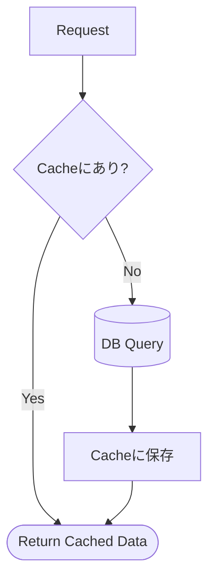

# 第33章　パフォーマンス③ キャッシュ入門（最初は軽く）🧊


「一覧画面が重い〜😭」ってとき、**キャッシュ**はめちゃくちゃ効きます。
ただし、入れ方を間違えると「表示が古い😇」「更新したのに反映されない😇」みたいな事故が起きやすいのも事実。

この章では、**まずは軽いキャッシュ（短時間）**から入れて、**“失効（期限切れ）”と“事故りポイント”を体験**しながら安全に覚えていきます🫶✨

---

## 今日のゴール🎯✨

* キャッシュの基本（何が嬉しい？何が危ない？）を説明できる👀
* Query（読み取り）に **短時間キャッシュ**を入れられる🧊
* 「古い表示になる事故」→「直す（失効/無効化）」を体験できる🧯
* ついでに、**Output Caching** と **HybridCache** の存在も知っておく（2026年の定番）🚀
  ※Output CachingはASP.NET Coreの機能、HybridCacheは公式ライブラリです ([Microsoft Learn][6])

---

## キャッシュってなに？（超ざっくり）🧊



キャッシュは一言でいうと、

> **前に作った結果を、ちょっとだけ保存して、次はそれを使って速くする**✨
 
 

です。

* DB問い合わせ（特に一覧・検索・集計）が重い → キャッシュが効きやすい🔥
* 逆に「毎回内容が変わる」「正確さ最優先」には向かないこともある⚖️

---

## まず知っておく：キャッシュの種類（3つだけ）🍡

### ① メモリキャッシュ（IMemoryCache）🧠🧊

アプリのプロセス内メモリに置くやつ。**いちばん手軽**。
ただし **複数台構成だとズレやすい**（同じユーザーでも別サーバに飛ぶとキャッシュが無い）ので、基本は単体〜小規模向きです。 ([Microsoft Learn][7])

> この章のハンズオンはコレでいくよ！✨

### ② Output Caching（HTTPレスポンス丸ごと）📦🌐

「GETのレスポンス」を丸ごとキャッシュする機能。
**APIが“同じGET”を大量にさばく**ときに強いです。 ([Microsoft Learn][6])

### ③ HybridCache（メモリ＋分散の二段構え）🥷🧊

最近の“いい感じ”枠。
「まずメモリ、なければ分散、なければ作って両方に保存」みたいな流れをスッキリ書けます。しかも **同じキーに同時アクセスが来ても、裏の処理を1回にまとめてくれる**のが強い！ ([Microsoft Learn][8])

---

## CQRS的に、キャッシュはどこに入れる？🧭

おすすめは基本これ👇

✅ **QueryHandler（読み取り側）に入れる**
理由：

* Controllerに入れるより、**再利用しやすい**（APIが増えてもQuery側だけでOK）
* 「読みの最適化」はQuery側の責務と相性よい🎯

---

## キャッシュの“事故りポイント”先に言っとくね😇🧨

### 事故①：表示が古い（stale）📆💦

キャッシュは“昔の結果”を使うので、**更新があった直後に古い表示**になりがち。

### 事故②：キー設計ミスで違う条件が混ざる🗝️😱

例：

* `page=1` と `page=2` なのに同じキーにしちゃった
* `keyword=apple` と `keyword=banana` が同じキー

→ **Queryパラメータは基本キーに入れる**が正解🙆‍♀️

### 事故③：ユーザーごとの情報を共有キャッシュしちゃう🔐😱

「自分だけ見える情報」が、別ユーザーに見えたら大事故。
→ ユーザー依存の表示なら、**ユーザーID等もキーに含める** or そもそもキャッシュしない、を検討⚠️

---

# ハンズオン🧪：ToDo一覧に“10秒キャッシュ”を入れてみる🧊✨

ここでは「ToDo一覧Query」を例にします（ミニECの“商品一覧”でも同じ考え方でOK🛒）

---

## Step 1：Query DTO と Read DTO（例）📦

```csharp
public sealed record TodoListItemDto(
    Guid Id,
    string Title,
    bool IsDone,
    DateTimeOffset CreatedAt
);

public sealed record GetTodoListQuery(
    string? Keyword,
    int Page = 1,
    int PageSize = 20
);

public sealed record TodoListResponse(
    int TotalCount,
    IReadOnlyList<TodoListItemDto> Items
);
```

---

## Step 2：まずは “TTLだけ” でキャッシュ（わざと事故る準備😇）🧊

### ポイント💡

* 「あれば返す」→「なければDB」→「保存」の **Cache-Aside** 方式
* まずは **10秒だけ**（短いほど事故っても安全！）

```csharp
using Microsoft.EntityFrameworkCore;
using Microsoft.Extensions.Caching.Memory;
using Microsoft.Extensions.Logging;
using System.Diagnostics;

public sealed class GetTodoListQueryHandler
{
    private readonly AppDbContext _db;
    private readonly IMemoryCache _cache;
    private readonly ILogger<GetTodoListQueryHandler> _log;

    public GetTodoListQueryHandler(AppDbContext db, IMemoryCache cache, ILogger<GetTodoListQueryHandler> log)
    {
        _db = db;
        _cache = cache;
        _log = log;
    }

    public async Task<TodoListResponse> HandleAsync(GetTodoListQuery query, CancellationToken ct)
    {
        var key = CacheKey(query);

        if (_cache.TryGetValue<TodoListResponse>(key, out var cached))
        {
            _log.LogInformation("🧊 Cache HIT: {Key}", key);
            return cached;
        }

        _log.LogInformation("🥲 Cache MISS: {Key}", key);

        var sw = Stopwatch.StartNew();

        // ここが重い想定（検索/一覧）
        var baseQuery = _db.Todos.AsNoTracking();

        if (!string.IsNullOrWhiteSpace(query.Keyword))
        {
            baseQuery = baseQuery.Where(x => x.Title.Contains(query.Keyword));
        }

        var total = await baseQuery.CountAsync(ct);

        var items = await baseQuery
            .OrderByDescending(x => x.CreatedAt)
            .Skip((query.Page - 1) * query.PageSize)
            .Take(query.PageSize)
            .Select(x => new TodoListItemDto(x.Id, x.Title, x.IsDone, x.CreatedAt))
            .ToListAsync(ct);

        var result = new TodoListResponse(total, items);

        sw.Stop();
        _log.LogInformation("⏱️ DB Query Time: {Ms}ms", sw.ElapsedMilliseconds);

        _cache.Set(
            key,
            result,
            new MemoryCacheEntryOptions
            {
                AbsoluteExpirationRelativeToNow = TimeSpan.FromSeconds(10)
            });

        _log.LogInformation("✅ Cached for 10s: {Key}", key);

        return result;
    }

    private static string CacheKey(GetTodoListQuery q)
        => $"TodoList:v1:kw={q.Keyword ?? ""}:p={q.Page}:ps={q.PageSize}";
}
```

### ここでやること（体験）👩‍💻✨

1. 一覧GETを2回叩く

* 1回目：MISS → DB
* 2回目：HIT → キャッシュ

2. その後、ToDoを追加して **すぐ一覧GET**

* **10秒以内なら、古い一覧が返る**可能性がある（これが事故①）😇🧨

---

## Step 3：事故を直す！書き込みがあったら“まとめて失効”させる🧯✨

TTLだけだと「10秒間は古い」問題が出ます。
なので次は、**Command（書き込み）が成功したら一覧キャッシュを消す**を入れます👍

ただ、一覧キャッシュってキーがいっぱい増えがちで、1個ずつRemoveするのは大変💦
そこでおすすめの入門ワザがこれ👇

✅ **“スタンプ（変更トークン）”でまとめて失効**

* 一覧キャッシュを作るとき、共通トークンを紐づける
* 書き込み成功時にトークンを更新（= 全部いっぺんに期限切れ）

### 3-1：キャッシュ失効用の“スタンプ”サービスを作る🪪

```csharp
using Microsoft.Extensions.Primitives;

public sealed class TodoListCacheStamp
{
    private readonly object _gate = new();
    private CancellationTokenSource _cts = new();

    public IChangeToken Token
    {
        get
        {
            lock (_gate)
            {
                return new CancellationChangeToken(_cts.Token);
            }
        }
    }

    public void Invalidate()
    {
        lock (_gate)
        {
            _cts.Cancel();
            _cts.Dispose();
            _cts = new CancellationTokenSource();
        }
    }
}
```

### 3-2：Query側（キャッシュ作成）でトークンを付ける🧊🧷

```csharp
// 追加：コンストラクタに stamp を注入
private readonly TodoListCacheStamp _stamp;

public GetTodoListQueryHandler(AppDbContext db, IMemoryCache cache, TodoListCacheStamp stamp, ILogger<GetTodoListQueryHandler> log)
{
    _db = db;
    _cache = cache;
    _stamp = stamp;
    _log = log;
}

public async Task<TodoListResponse> HandleAsync(GetTodoListQuery query, CancellationToken ct)
{
    var key = CacheKey(query);

    if (_cache.TryGetValue<TodoListResponse>(key, out var cached))
    {
        _log.LogInformation("🧊 Cache HIT: {Key}", key);
        return cached;
    }

    _log.LogInformation("🥲 Cache MISS: {Key}", key);

    // DBから作る（省略）

    var result = /* ... */;

    _cache.Set(
        key,
        result,
        new MemoryCacheEntryOptions
        {
            AbsoluteExpirationRelativeToNow = TimeSpan.FromSeconds(30), // 少し長めでもOKに
            ExpirationTokens = { _stamp.Token } // ★ここがポイント
        });

    _log.LogInformation("✅ Cached + Stamp: {Key}", key);

    return result;
}
```

### 3-3：Command成功時に stamp をInvalidateする✍️🧯

例：ToDo作成Commandが成功したら…

```csharp
public sealed class CreateTodoCommandHandler
{
    private readonly AppDbContext _db;
    private readonly TodoListCacheStamp _stamp;

    public CreateTodoCommandHandler(AppDbContext db, TodoListCacheStamp stamp)
    {
        _db = db;
        _stamp = stamp;
    }

    public async Task<Guid> HandleAsync(string title, CancellationToken ct)
    {
        var entity = new Todo { Id = Guid.NewGuid(), Title = title, IsDone = false, CreatedAt = DateTimeOffset.UtcNow };

        _db.Todos.Add(entity);
        await _db.SaveChangesAsync(ct);

        _stamp.Invalidate(); // ★書き込み成功 → 一覧キャッシュまとめて失効✨

        return entity.Id;
    }
}
```

### これでどうなる？🎉

* ToDo追加直後に一覧GETしても、**キャッシュが失効してるので最新が出やすい**🙆‍♀️✨
  （TTLだけのときより “古い表示” が減る！）

---

# ミニ演習✏️（超おすすめ）✨

## 演習1：キャッシュキーを“衝突しない”ように作る🗝️

次の条件を全部キーに入れてみてね👇

* keyword
* page / pageSize
* sort（もしあるなら）
* 「ユーザーごと表示」なら userId / tenantId など 🔐

✅ チェック：
「条件が違うのに同じキー」になってない？😱

---

## 演習2：TTLを変えて体感する⏳

* 3秒：古さは減るけど、ヒット率も下がる
* 30秒：速いけど古くなりやすい
* 5分：だいぶ危ない（無効化が必須級）

「あなたのアプリならどこが妥当？」を探すのが大事だよ〜🫶

---

# “もっとラクに・もっと強く”の選択肢も知っておこう🚀

## 1) Output Caching（GETレスポンス丸ごと）📦🌐

使いどころ：

* 「同じGETが何度も来る」
* 「レスポンス生成が重い」
* “公開”系の一覧（商品カタログとか）に相性よし🛒✨

基本形（Minimal APIイメージ）👇

* `AddOutputCache()` でサービス登録
* `UseOutputCache()` でミドルウェア有効化
* 各エンドポイントに `CacheOutput()` を付ける ([Microsoft Learn][6])

> Output Cachingはデフォルトで「GET/HEADだけ」「認証済みはキャッシュしない」「Cookieセットはキャッシュしない」などルールがあります（安全寄り） ([Microsoft Learn][6])

さらにスケールするならRedisストアも使えます（公式で例あり） ([Microsoft Learn][6])

---

## 2) HybridCache（入門の次の一手）🥷🧊

「メモリ＋分散」をまとめて扱える公式ライブラリで、登録も利用も簡単です。

* `Microsoft.Extensions.Caching.Hybrid` を追加
* `AddHybridCache()`
* `GetOrCreateAsync()` で “なければ作る” を書く ([Microsoft Learn][8])

そして強いのがここ👇
同じキーで同時にアクセスが来ても、**裏の取得処理（factory）を1回にまとめてくれる**ので、キャッシュミス時の“殺到”に強いです ([Microsoft Learn][8])

---

# AI（Copilot / Codex）に頼むときのプロンプト例🤖✨

## 例1：QueryHandlerにキャッシュを入れてもらう🧊

```text
次のC# QueryHandlerにIMemoryCacheを追加して、keyword/page/pageSizeを含むキーで10秒キャッシュしてください。
キャッシュヒット/ミスをILoggerで出してください。
さらに書き込み成功時に一覧キャッシュをまとめて無効化できるように、ChangeToken方式のStampクラスも提案してください。
```

## 例2：キー設計レビュー🗝️👀

```text
このキャッシュキー設計で「条件違いが混ざる」「ユーザー間で混ざる」リスクがないかレビューして、改善案も出して。
（キー文字列、含めるべきパラメータ、命名、バージョニング案）
```

---

# まとめ🎀✨（ここだけ覚えればOK版）

* キャッシュは **Query側（読み取り）** に入れるとCQRSと相性よし🧊
* 最初は **短時間TTL** で小さく始める（事故っても軽傷）😇
* でも **TTLだけだと古い表示が起きる** → 書き込み成功時に **無効化** を入れる🧯
* 2026の定番知識として

  * Output Caching（HTTPレスポンス） ([Microsoft Learn][6])
  * HybridCache（メモリ＋分散＋同時ミス強い） ([Microsoft Learn][8])
    も“存在だけ”は押さえておくと強い💪✨

---

次の第34章は「Readモデルを別テーブルにする（Projection入門）」だね🪞📊
その前に、もし今の題材が「ミニEC（商品一覧）」なら、同じ手で“商品一覧Query”にキャッシュ入れる版も作れるよ〜🛒🧊✨

[1]: https://chatgpt.com/c/69735e26-02cc-8322-bda8-6b697a9e4dac "CQRS入門絵で理解"
[2]: https://chatgpt.com/c/697385d9-eb2c-8322-82a4-cb901c3acb0b "API層の設計術"
[3]: https://chatgpt.com/c/69736d47-7470-8320-bcc9-4bcdd65266aa "CQRS Handler分け入門"
[4]: https://chatgpt.com/c/697374d4-5ffc-8321-bb01-d2222db018c6 "CQRS業務ルールの設計"
[5]: https://chatgpt.com/c/6973600a-4760-8321-9624-9dfbe560d0a3 "CQRS適用場面と判断"
[6]: https://learn.microsoft.com/en-us/aspnet/core/performance/caching/output?view=aspnetcore-10.0 "Output caching middleware in ASP.NET Core | Microsoft Learn"
[7]: https://learn.microsoft.com/en-us/aspnet/core/performance/caching/memory?view=aspnetcore-10.0&utm_source=chatgpt.com "Cache in-memory in ASP.NET Core"
[8]: https://learn.microsoft.com/en-us/aspnet/core/performance/caching/hybrid?view=aspnetcore-10.0 "HybridCache library in ASP.NET Core | Microsoft Learn"
