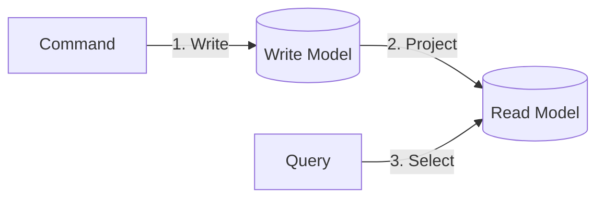

# 第34章　Readモデル分離① “別テーブル”の発想（Projection入門）🪞

この章はね、ひとことで言うと…
**「一覧表示が重い…🥲」を“別テーブル”でスパッと軽くする方法**だよ〜！🚀📄✨

---

## 0. 今日のゴール（できるようになること）🎯💪

* 「読むためだけ」のテーブル（Readモデル）を作れる🧺✨
* Writeモデル（正規化された注文＋明細）から、**一覧に最適化した形**を作れる🧮📦
* CommandのたびにReadモデルを更新する “Projection（投影）” を体験できる🪄
* 「なんで同じデータを二重に持つの？😳」にちゃんと答えられる📣

※この章ではまず **同じDB内に別テーブル**として作るよ（いちばん理解しやすい＆実用的）😊
（次章の第35章で「ちょい遅れ反映＝最終的整合性」もやるよ⏳）

---

## 1. まず困ってるやつ：一覧が重い問題 🐢💦

たとえば「注文一覧」を作るとき、Write側がこんな構造だとするね👇

* Orders（注文）
* OrderItems（注文明細）

で、一覧に「合計金額」「商品数」「最新ステータス」などを出したいとすると…

* JOINが増える
* GROUP BY / SUM / COUNT が増える
* フィルタやソートが複雑になる
* だんだん “検索のためのSQL” が太っていく 🍔

つまり、**一覧を出すたびに毎回“集計料理”を作ってる**状態🍳😵‍💫

---

## 2. 解決の発想：「一覧用に、できあがった料理を置いとこ」🍱✨

そこで登場するのが…

### ✅ Readモデル（Read専用テーブル）

**「一覧表示に必要な形に整えたデータ」を、別テーブルに保存**しちゃう発想だよ📦✨

* Writeモデル：正確・整合性が命（更新しやすい形）🧱
* Readモデル：速さ・検索のしやすさが命（表示しやすい形）⚡
 
 

これを作る作業が…

### ✅ Projection（投影）

Write側の状態から、Read側の“表示用データ”を作って更新すること🪞✨

ちなみに、今やってる環境（.NET 10 / EF Core 10）は **LTS** だよ〜📌
.NET 10 は 2025-11-11 にリリースされ LTS としてサポート中、EF Core 10 も .NET 10 前提の LTS だよ🧡 ([Microsoft][1])

---

## 3. 今回作るReadテーブル（例）🧾✨

### 🎀 注文一覧用テーブル：OrderList（仮）

「一覧に欲しいものだけ」を持つよ👇

* OrderId（注文ID）🔑
* OrderedAt（注文日時）🕒
* CustomerName（購入者名）👤
* Status（状態）📦
* ItemCount（商品数）🔢
* TotalAmount（合計金額）💰
* LastUpdatedAt（更新日時）⏱️

ポイントはこれ👇

✅ **一覧に必要な情報だけ**
✅ なるべく **JOINなしで出せる**
✅ よく使う検索条件（Statusや日時など）に **インデックス貼れる** 📌

---

## 4. 実装の全体像（超ざっくり絵）🎨✨



* Command（作成/追加/状態変更）✍️
  ↓
* Writeモデル更新（Orders/OrderItems）🧱
  ↓
* Projection更新（OrderListテーブルを更新）🪞
  ↓
* Queryは OrderList だけ読む（速い！）⚡📄

---

## 5. 手を動かそう：Projectionを作る 🧑‍💻💖

### ステップA：Readモデル用のEntityを作る 🧩

プロジェクトに「ReadModels/Orders」みたいなフォルダを作って、OrderListRow（名前は好きでOK）を追加するよ✨

```csharp
public sealed class OrderListRow
{
    public Guid OrderId { get; set; }

    public DateTime OrderedAt { get; set; }
    public string CustomerName { get; set; } = "";

    public string Status { get; set; } = "";

    public int ItemCount { get; set; }
    public decimal TotalAmount { get; set; }

    public DateTime LastUpdatedAt { get; set; }
}
```

---

### ステップB：DbContextにReadテーブルを追加する 🧱➕🪞

いちばん簡単なスタートは **同じDbContextにDbSetを追加**する方法だよ（理解が速い）😊

```csharp
public sealed class AppDbContext : DbContext
{
    public DbSet<Order> Orders => Set<Order>();
    public DbSet<OrderItem> OrderItems => Set<OrderItem>();

    // ⭐ 追加：Readモデル
    public DbSet<OrderListRow> OrderList => Set<OrderListRow>();

    protected override void OnModelCreating(ModelBuilder modelBuilder)
    {
        modelBuilder.Entity<OrderListRow>(e =>
        {
            e.ToTable("OrderList");
            e.HasKey(x => x.OrderId);

            e.Property(x => x.CustomerName).HasMaxLength(200);
            e.Property(x => x.Status).HasMaxLength(50);

            // よく検索する列にインデックス📌
            e.HasIndex(x => x.OrderedAt);
            e.HasIndex(x => x.Status);
        });
    }
}
```

💡 Query専用テーブルでも、DB的には普通のテーブルだから、インデックスで超効くよ📌⚡
（EF Coreの「効率の良いクエリ」系の考え方もこの方向だよ〜） ([Microsoft Learn][2])

---

### ステップC：マイグレーションでテーブル作成 🧰✨

コマンド（例）👇
（名前はプロジェクトに合わせてね）

```powershell
dotnet ef migrations add AddOrderListProjection
dotnet ef database update
```

---

## 6. Projection本体：Commandの最後にReadテーブル更新する 🪄✨

### まずは「Projector（投影係）」を作ろう 🧹

Handlerの中に全部書くと太りやすいから、1クラスにまとめるとキレイだよ🫶

```csharp
public sealed class OrderListProjector
{
    private readonly AppDbContext _db;

    public OrderListProjector(AppDbContext db)
    {
        _db = db;
    }

    public async Task UpsertAsync(Order order, CancellationToken ct)
    {
        // order.Items を使って集計する前提（Includeして読み込んでね）
        var itemCount = order.Items.Sum(x => x.Quantity);
        var totalAmount = order.Items.Sum(x => x.UnitPrice * x.Quantity);

        var row = await _db.OrderList.FindAsync(new object[] { order.Id }, ct);

        if (row is null)
        {
            row = new OrderListRow
            {
                OrderId = order.Id
            };
            _db.OrderList.Add(row);
        }

        row.OrderedAt = order.OrderedAt;
        row.CustomerName = order.CustomerName;
        row.Status = order.Status.ToString();

        row.ItemCount = itemCount;
        row.TotalAmount = totalAmount;
        row.LastUpdatedAt = DateTime.UtcNow;
    }

    public async Task DeleteAsync(Guid orderId, CancellationToken ct)
    {
        var row = await _db.OrderList.FindAsync(new object[] { orderId }, ct);
        if (row is null) return;

        _db.OrderList.Remove(row);
    }
}
```

---

### Handler側：SaveChangesの前にUpsertを呼ぶ ✅

たとえば「注文作成Command」ならこんな感じ👇

```csharp
public sealed class CreateOrderHandler
{
    private readonly AppDbContext _db;
    private readonly OrderListProjector _projector;

    public CreateOrderHandler(AppDbContext db, OrderListProjector projector)
    {
        _db = db;
        _projector = projector;
    }

    public async Task<Guid> Handle(CreateOrderCommand cmd, CancellationToken ct)
    {
        var order = Order.Create(cmd.CustomerName, DateTime.UtcNow);

        // 明細追加など…
        foreach (var item in cmd.Items)
        {
            order.AddItem(item.ProductId, item.UnitPrice, item.Quantity);
        }

        _db.Orders.Add(order);

        // ⭐ Projection更新（同じDbContext内なので一緒に保存できる）
        await _projector.UpsertAsync(order, ct);

        await _db.SaveChangesAsync(ct);
        return order.Id;
    }
}
```

### 🌟 ここが超重要ポイント！

この形だと、**Orders/OrderItems と OrderList が同じSaveChangesで保存される**ので
「Writeだけ成功してReadが失敗した😱」みたいな事故が減るよ（入門には最高）🫶✨

---

## 7. Query側：OrderListだけ読む（速い）⚡📄

一覧表示は「OrderListテーブルだけ」を読むから、クエリがスッキリするよ😍

```csharp
public sealed class GetOrderListHandler
{
    private readonly AppDbContext _db;

    public GetOrderListHandler(AppDbContext db)
    {
        _db = db;
    }

    public async Task<IReadOnlyList<OrderListDto>> Handle(GetOrderListQuery q, CancellationToken ct)
    {
        var query = _db.OrderList
            .AsNoTracking(); // ✅ 読むだけなら追跡いらない

        if (!string.IsNullOrWhiteSpace(q.Status))
        {
            query = query.Where(x => x.Status == q.Status);
        }

        query = query.OrderByDescending(x => x.OrderedAt);

        var rows = await query
            .Skip((q.Page - 1) * q.PageSize)
            .Take(q.PageSize)
            .Select(x => new OrderListDto(
                x.OrderId,
                x.OrderedAt,
                x.CustomerName,
                x.Status,
                x.ItemCount,
                x.TotalAmount
            ))
            .ToListAsync(ct);

        return rows;
    }
}
```

EF Coreで「読み取りだけなら追跡しない（AsNoTracking）」は定番の高速化だよ⚡
（読み取りの効率化の基本としてよく出てくるやつ） ([Microsoft Learn][2])

---

## 8. “あるある失敗” と対策 😵‍💫➡️😺

### 失敗①：ReadモデルがWriteモデルと同じ形😇

👉 **メリットが出ない**（JOIN地獄のまま）
✅ 対策：画面に必要な形に“寄せる”！「一覧に何がいる？」から設計📄✨

### 失敗②：更新コマンドでProjection更新を忘れる🙈

👉 一覧が古いまま
✅ 対策：Commandの最後に「Projector呼ぶ」をテンプレ化📌

### 失敗③：Readテーブルが大きくなるのにインデックスなし🐢

👉 結局遅い
✅ 対策：よく使う条件（Status、OrderedAt、CustomerNameなど）に貼る📌✨

---

## 9. ミニ演習（やると強くなる！）🧪💖

### 演習1：検索向けの列を1つ追加してみよ🔍

例：

* 「TotalAmountが一定以上ならHighValue」みたいなフラグを追加して
  一覧でフィルタできるようにする💰✨

### 演習2：ステータス変更Commandでも更新してみよ📦➡️✅

* StatusChangeHandler の最後に UpsertAsync を呼ぶ
* 一覧のStatusが即反映されるのを確認👀✨

---

## 10. AI（Copilot / Codex）に頼むときのコツ🤖🪄

### ✅ 設計相談プロンプト例

* 「注文一覧画面に必要な列を箇条書きで提案して。検索条件も一緒に」📄🔍
* 「OrderList（Readモデル）用のテーブル設計案と、必要そうなインデックス案を出して」📌✨
* 「CommandのたびにProjection更新を忘れないためのテンプレ構成を提案して」🧱🪞

### ✅ コード生成プロンプト例

* 「OrderListProjector（Upsert）をEF Coreで実装して。既存行があれば更新、なければ追加」🪄
* 「OrderListRowのOnModelCreating設定（キー、長さ、インデックス）を書いて」📌

---

## 11. この章のまとめ（1分で復習）⏱️💖

* 一覧が重いのは「毎回JOIN＆集計してる」から🐢
* 解決は「一覧に最適化した別テーブル（Readモデル）」を持つこと🪞✨
* Write更新のたびにReadを更新するのがProjection🪄
* まずは同一DB・同一SaveChangesで作るのが入門に最強🫶
* 次章で「反映がちょい遅れる世界（最終的整合性）」も体験するよ⏳✨

---

もし今の題材が「ミニEC」じゃなくて「ToDo」寄りなら、同じ形で

* ToDo（Write）
* ToDoList（Read：期限・優先度・表示用の整形済み）
  に置き換えて一緒に作れるよ😺✨

[1]: https://dotnet.microsoft.com/en-us/platform/support/policy/dotnet-core?utm_source=chatgpt.com "NET and .NET Core official support policy"
[2]: https://learn.microsoft.com/en-us/ef/core/performance/efficient-querying?utm_source=chatgpt.com "Efficient Querying - EF Core"
