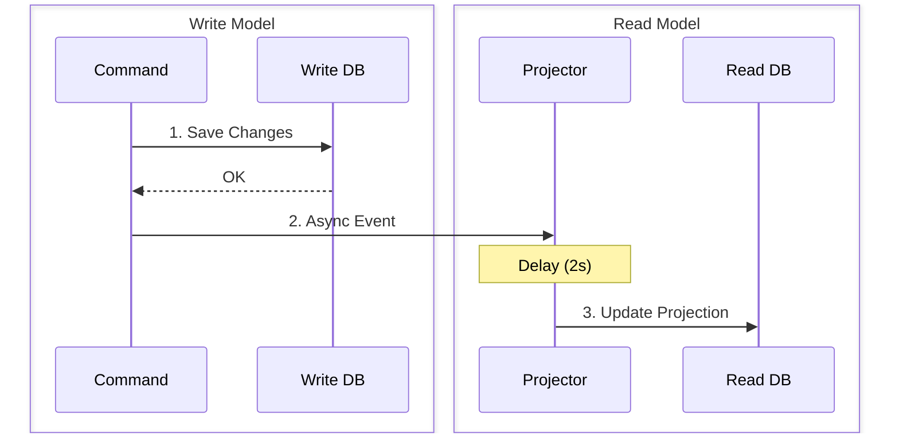

# 第35章　Readモデル分離② 最終的整合性（ゆるく体験）⏳

## この章のゴール🎯

* 「最終的整合性」って言葉を、**ふんわりじゃなく**説明できるようになる🗣️✨
* CQRSでReadモデルを分けたときに起きる「あるある」を**自分で再現**できる🧪
* ユーザーが困らないように、**UI文言・挙動**を設計できるようになる💬🧡

---

## 1) 最終的整合性ってなに？🧠💡

一言でいうと…

**「書き込みは成功してるのに、読む側（Readモデル）には“ちょっと遅れて”反映されることがある」**って状態だよ⏳

CQRSは **Write（更新）** と **Read（参照）** を分けられるのが強みなんだけど、分けた瞬間に…

* Write側DB：更新は即OK✅
* Read側DB（またはRead用テーブル/ビュー/キャッシュ）：更新は**非同期で追いかける**🏃‍♀️💨

になりやすい。だから **「読み取りが一瞬古い」** が起きるの。
これはCQRSの代表的なトレードオフとして、MicrosoftのCQRSパターン解説でも触れられてるよ📚 ([Microsoft Learn][2])

---

## 2) どんなときに困る？😵‍💫（困る順）

### 困りやすい😱

* ユーザーが「保存したのに一覧に出ない！」って不安になる📉
* 「保存ボタンを連打」→二重登録💥（次章の冪等性につながる🔁）
* “今この瞬間の正しさ”が必要な処理（例：決済、在庫引き当て）で事故る💣

### そこまで困らない😌

* ダッシュボード集計、検索インデックス、ランキング、通知、レポート📊
* 「多少遅れてもOK」な一覧画面📄✨

---

## 3) 体験ミニ演習：わざと“反映遅延”を作ってみる🧪⏳



ここが本編だよ〜！
**Write側は即保存**、でも **Readモデル更新は2秒遅延**させて、「一覧にすぐ出ない」を体験するよ🧡

### 今日の構成（超ざっくり図）🪄

* POSTで注文作成（Writeモデルに保存）✍️
* イベントをキューへ投げる📮
* 背景処理（Projection）がReadモデルを更新する（2秒遅延）🪞
* GET一覧はReadモデルを見る👀

---

## 3-1) 最小データモデル（Write / Read）📦

* **Writeモデル**：Orders（真実の台帳📚）
* **Readモデル**：OrderListItems（一覧表示に最適化した表🪞）

> 練習では同じDB内にテーブル分けでOK！本番は別DB/別ストアも多いよ〜🧊

---

## 3-2) コード（Minimal API + EF Core）🚀🧩

### A. Entity / DbContext

```csharp
using Microsoft.EntityFrameworkCore;

public sealed class AppDbContext : DbContext
{
    public AppDbContext(DbContextOptions<AppDbContext> options) : base(options) { }

    public DbSet<Order> Orders => Set<Order>();
    public DbSet<OrderListItem> OrderListItems => Set<OrderListItem>();
}

public sealed class Order
{
    public Guid Id { get; set; }
    public string CustomerName { get; set; } = "";
    public decimal TotalAmount { get; set; }
    public string Status { get; set; } = "Created";
    public DateTimeOffset CreatedAt { get; set; } = DateTimeOffset.UtcNow;
}

public sealed class OrderListItem
{
    public Guid Id { get; set; }
    public Guid OrderId { get; set; }
    public string CustomerName { get; set; } = "";
    public decimal TotalAmount { get; set; }
    public string Status { get; set; } = "";
    public DateTimeOffset CreatedAt { get; set; }
    public DateTimeOffset ProjectedAt { get; set; } = DateTimeOffset.UtcNow;
}
```

---

### B. “イベント”と、インプロセスキュー（Channel）📮

```csharp
using System.Threading.Channels;

public sealed record OrderCreatedEvent(
    Guid EventId,
    Guid OrderId,
    DateTimeOffset OccurredAtUtc,
    string CustomerName,
    decimal TotalAmount
);

public static class ProjectionQueue
{
    // デモ用：プロセス内キュー（本番はService Bus / Kafka等が多いよ）
    public static readonly Channel<OrderCreatedEvent> Channel =
        System.Threading.Channels.Channel.CreateUnbounded<OrderCreatedEvent>();
}
```

---

### C. Command（作成）＝Writeは即保存✅

```csharp
public sealed record CreateOrderCommand(string CustomerName, decimal TotalAmount);

public sealed class CreateOrderHandler
{
    private readonly AppDbContext _db;

    public CreateOrderHandler(AppDbContext db) => _db = db;

    public async Task<Guid> HandleAsync(CreateOrderCommand cmd, CancellationToken ct)
    {
        var order = new Order
        {
            Id = Guid.NewGuid(),
            CustomerName = cmd.CustomerName,
            TotalAmount = cmd.TotalAmount,
            Status = "Created",
            CreatedAt = DateTimeOffset.UtcNow
        };

        _db.Orders.Add(order);
        await _db.SaveChangesAsync(ct); // ✅ Writeは確定

        // ⚠️ デモなので即キュー投入
        // 本番は「DB保存できたのにイベント送れなかった」を防ぐため Outbox を検討するよ（後述）📦
        var ev = new OrderCreatedEvent(
            EventId: Guid.NewGuid(),
            OrderId: order.Id,
            OccurredAtUtc: DateTimeOffset.UtcNow,
            CustomerName: order.CustomerName,
            TotalAmount: order.TotalAmount
        );

        await ProjectionQueue.Channel.Writer.WriteAsync(ev, ct);

        return order.Id;
    }
}
```

---

### D. Projection（Readモデル更新）＝わざと2秒遅延⏳🪞

```csharp
using Microsoft.EntityFrameworkCore;

public sealed class OrderListProjectionWorker : BackgroundService
{
    private readonly IDbContextFactory<AppDbContext> _dbFactory;

    public OrderListProjectionWorker(IDbContextFactory<AppDbContext> dbFactory)
        => _dbFactory = dbFactory;

    protected override async Task ExecuteAsync(CancellationToken stoppingToken)
    {
        var reader = ProjectionQueue.Channel.Reader;

        while (await reader.WaitToReadAsync(stoppingToken))
        {
            var ev = await reader.ReadAsync(stoppingToken);

            // ⏳ 反映遅延をわざと作る（最終的整合性の体験用）
            await Task.Delay(TimeSpan.FromSeconds(2), stoppingToken);

            await using var db = await _dbFactory.CreateDbContextAsync(stoppingToken);

            // 🔁 ちょい先取り：二重イベントが来ても壊れないように “存在チェック”
            //（次章：冪等性で深掘りするよ）
            var exists = await db.OrderListItems.AnyAsync(x => x.OrderId == ev.OrderId, stoppingToken);
            if (exists) continue;

            db.OrderListItems.Add(new OrderListItem
            {
                Id = Guid.NewGuid(),
                OrderId = ev.OrderId,
                CustomerName = ev.CustomerName,
                TotalAmount = ev.TotalAmount,
                Status = "Created",
                CreatedAt = ev.OccurredAtUtc,
                ProjectedAt = DateTimeOffset.UtcNow
            });

            await db.SaveChangesAsync(stoppingToken);
        }
    }
}
```

---

### E. API（WriteとReadで“見る場所”が違うのを体験）👀

```csharp
using Microsoft.EntityFrameworkCore;

var builder = WebApplication.CreateBuilder(args);

builder.Services.AddDbContextFactory<AppDbContext>(opt =>
    opt.UseSqlite("Data Source=app.db"));

builder.Services.AddScoped<CreateOrderHandler>();
builder.Services.AddHostedService<OrderListProjectionWorker>();

var app = builder.Build();

// ついでにDB作成（デモ用）
using (var scope = app.Services.CreateScope())
{
    var factory = scope.ServiceProvider.GetRequiredService<IDbContextFactory<AppDbContext>>();
    await using var db = await factory.CreateDbContextAsync();
    await db.Database.EnsureCreatedAsync();
}

// ✅ Write：注文作成（すぐ成功する）
app.MapPost("/orders", async (CreateOrderCommand cmd, CreateOrderHandler handler, CancellationToken ct) =>
{
    var id = await handler.HandleAsync(cmd, ct);

    // 💡 すぐ一覧に出るとは限らないので 202 Accepted にしておくのもアリ
    return Results.Accepted($"/orders/{id}", new
    {
        OrderId = id,
        Message = "作成できたよ！一覧への反映は少し待ってね⏳"
    });
});

// ✅ Writeモデルを見る（“作成できた事実”の確認用）
app.MapGet("/orders/{id:guid}/write", async (Guid id, IDbContextFactory<AppDbContext> factory, CancellationToken ct) =>
{
    await using var db = await factory.CreateDbContextAsync(ct);
    var order = await db.Orders.FirstOrDefaultAsync(x => x.Id == id, ct);
    return order is null ? Results.NotFound() : Results.Ok(order);
});

// ✅ Readモデルの一覧（反映が遅れるのを体験するポイント）
app.MapGet("/orders/list", async (IDbContextFactory<AppDbContext> factory, CancellationToken ct) =>
{
    await using var db = await factory.CreateDbContextAsync(ct);
    var list = await db.OrderListItems
        .OrderByDescending(x => x.CreatedAt)
        .Take(20)
        .ToListAsync(ct);

    return Results.Ok(list);
});

app.Run();
```

---

## 3-3) 体験のしかた（ここ大事！）🧪✨

1. `POST /orders` を投げる✍️
2. **すぐ** `GET /orders/list` を見る👀 → **出ないことがある**😳
3. `GET /orders/{id}/write` を見る👀 → **Write側にはいる**✅
4. 2秒くらい後に `GET /orders/list` を見る👀 → **Readに反映**🎉

この「えっ、保存できたのに一覧にいない…！」が、最終的整合性の正体だよ⏳🪞
 
 

---

## 4) UI/UX文言：ユーザーを不安にさせない魔法💬🪄✨

最終的整合性って、技術よりも **UXが勝負**になりやすいの…！
（MicrosoftのCQRSでも “Read storeが遅れる＝eventual consistency” って前提で考える話が出てくるよ） ([Microsoft Learn][2])

### 4-1) すぐ使える文言テンプレ（コピペOK）📄✨

**✅ 保存直後のトースト**

* 「保存できたよ！一覧に反映されるまで少し待ってね⏳✨」
* 「更新完了🎉 表示に数秒かかる場合があります🕒」

**✅ 一覧画面の上部メッセージ**

* 「最新状態に更新中…🔄（少し時間がかかることがあります）」
* 「反映待ちのデータがあります⏳」

**✅ 反映が遅れたときの保険**

* 「まだ反映中みたい…🙇‍♀️ 10秒たっても出ないときは再読み込みしてね🔄」
* 「処理が混み合っています😵 少し待ってからもう一度見てね🕒」

### 4-2) UIの“挙動”テンプレ（どれか1つでOK）🧩

* **楽勝で効く**：保存後、一覧に “仮行” を1件挿して「反映待ち⏳」表示
* **堅実**：保存後は詳細画面へ遷移（Commandの戻り値で見せる）➡ 一覧は遅れてOKにする
* **体験良い**：一定時間だけポーリング（例：2秒ごと最大10秒）🔄
* **さらに良い**：WebSocket/SignalRで「反映できたよ」通知📣

---

## 5) 設計の判断基準：「ゆるくてOK」か「絶対ダメ」か⚖️

### 最終的整合性OKになりやすい✅

* 検索、一覧、集計、ランキング、通知、ログ閲覧📊🧾
* 「今すぐ一致しなくてもユーザーが困らない」情報

### 最終的整合性NGになりやすい⛔

* お金、在庫、権限、二重送信が致命傷になる処理💳📦🔐
* “今この瞬間の正しさ”が必須のもの

**迷ったら**：
「ユーザーが“直後に再表示して一致してないと不安になるか？”」で判断すると当たりやすいよ🧡

---

## 6) ちょい上級：本番で事故らせないための“橋渡し知識”🌉🧯

### 6-1) 「DB保存できたのにイベント送れなかった」問題💥

デモでは即キュー投入したけど、本番ではここが地雷になりやすい…！

そこでよく出てくるのが **Transactional Outbox** だよ📦✨

* まずDBに「送信予定イベント（Outbox）」も一緒に保存
* 別プロセスがOutboxを読んで確実に配信

Microsoftのアーキテクチャ解説でも Outbox を信頼性ある配信の方法として説明してるよ📚 ([Microsoft Learn][3])
パターン解説としては microservices.io のまとめも定番📌 ([microservices.io][4])

### 6-2) 「Readモデルが追いついてるか」を可視化する👀📏

* イベント発生時刻 `OccurredAt` と、投影時刻 `ProjectedAt` を持つ
* 差分（ラグ）をログ/メトリクス化
  → 「今は平均1.2秒遅れ」みたいに言えると超強い💪✨

（イベントソーシング系の説明でも、イベント→プロジェクションで遅延が出て eventually consistent になる話が出てくるよ） ([Microsoft Learn][5])

---

## 7) AI（Copilot/Codex）に頼ると爆速になるプロンプト例🤖💨

### UI文言（今回の主役💬）

* 「“保存できたけど一覧反映が遅れる”時の日本語トースト文言を10案。やさしい口調で、短めで」
* 「反映待ち状態の一覧表示文言を、ユーザーが不安にならないように3パターン」

### 実装補助🧩

* 「EF Coreで Orders と OrderListItems の2テーブル。OrderCreatedEvent を受けて OrderListItems を更新する Projection を BackgroundService で書いて」
* 「Channel を使った簡単なインプロセスイベントキュー例を出して。重複イベントに備えて冪等チェックも入れて」

---

## まとめ🎀

* CQRSでReadモデルを分けると、「Readがちょい遅れる（最終的整合性）」が自然に起きるよ⏳🪞 ([Microsoft Learn][2])
* 大事なのは **“遅れるのが悪”じゃなくて、UXでちゃんと扱うこと**💬🧡
* 本番では Outbox などで「イベント配信の確実性」も考えると強い📦✨ ([Microsoft Learn][3])

---

## 次章予告（第36章）ちら見せ👀🔁

次は「冪等性」！
“同じイベントが2回届いても壊れない” をちゃんと作れるようになるよ〜🧱✨

[1]: https://devblogs.microsoft.com/dotnet/announcing-dotnet-10/?utm_source=chatgpt.com "Announcing .NET 10"
[2]: https://learn.microsoft.com/en-us/azure/architecture/patterns/cqrs?utm_source=chatgpt.com "CQRS Pattern - Azure Architecture Center"
[3]: https://learn.microsoft.com/en-us/azure/architecture/databases/guide/transactional-outbox-cosmos?utm_source=chatgpt.com "Transactional Outbox pattern with Azure Cosmos DB"
[4]: https://microservices.io/patterns/data/transactional-outbox.html?utm_source=chatgpt.com "Pattern: Transactional outbox"
[5]: https://learn.microsoft.com/en-us/azure/architecture/patterns/event-sourcing?utm_source=chatgpt.com "Event Sourcing pattern - Azure Architecture Center"
