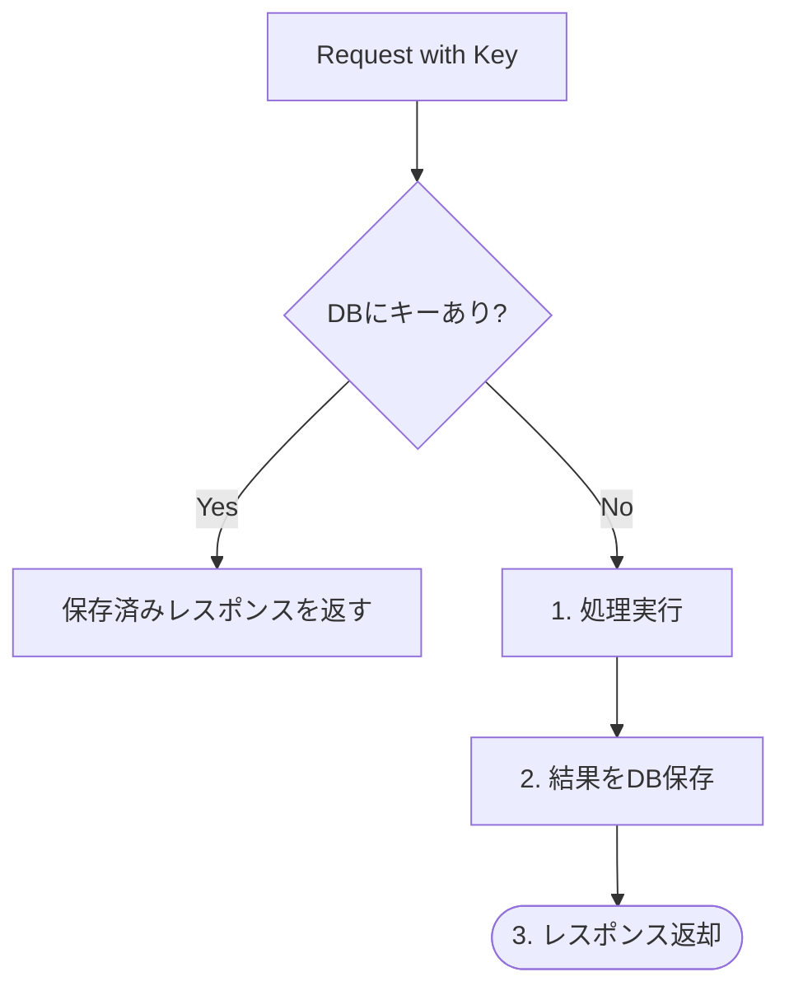

# 第36章　Readモデル分離③ 冪等性（2回走っても壊れない）🔁🧱✨

この章はね、CQRSをやるなら**ほぼ必修**だよ〜！😊
「二重送信」「リトライ」「再実行」が起きても、**DBやReadモデルが壊れない**ようにする考え方と実装をつくるよ💪💕

---

## 1) 冪等性ってなに？（超ざっくり）🍵🔁

**同じ操作を2回やっても、結果が“1回やった時と同じ”になる**性質のことだよ✨
たとえば…

* ✅ 「注文を作成」ボタンを**2回連打**しても、注文が2件できない
* ✅ バックグラウンド処理が**同じイベントを2回処理**しても、Readモデルが二重更新されない
* ✅ ネットワークが不安定で**同じリクエストを再送**しても、事故らない
 
 

HTTPの世界でも「冪等」って定義があって、**PUT/DELETE は冪等、POST は冪等が保証されない**、みたいな話があるよ📮
（※定義そのものは RFC に載ってる） ([RFC エディタ][1])

---

## 2) CQRSで冪等性が“爆重要”な2箇所💣✨

### A. Command API（書き込み）の入口 ✍️📮

POSTで「作成」系をやるとき、**二重送信＝二重作成**になりがち😱
→ ここは「冪等化」して守る価値が高い！

### B. Projection（Readモデル更新）🪞📊

Readモデル更新は、現実には **“少なくとも1回” (at-least-once) 実行**になりやすいのね。
つまり、**同じイベントが2回届く/2回処理される**が普通に起きる😇
→ だから **Projection側は冪等がデフォ**！

---

## 3) よくある「二重」の原因あるある😵‍💫📶

* ユーザーの二度押し👆👆
* ブラウザが「送ったかわからん…」で再送
* モバイル回線でタイムアウト→アプリがリトライ
* バックグラウンド処理が途中で落ちて、再開時に同じメッセージを再処理
* キュー/イベント配送が “同じのを2回渡す” ことがある（仕様として普通）

---

## 4) 実装パターン①：Idempotency-KeyでPOSTを冪等にする🔑✨



### 考え方（めっちゃ大事）🧠

クライアントが **Idempotency-Key**（だいたい GUID）を付けてPOSTする
→ サーバーはそのキーで「これ前やった？」を判定
→ 前やってたら **同じ結果を返す**（再実行しない）🎯

Stripeもこの思想で、キーの寿命や、同じキーで内容が違うとエラーにする…みたいな運用をしてるよ([Stripe ドキュメント][2])
ASP.NET Coreでも同じ方針で実装できるよ〜([milanjovanovic.tech][3])

---

### 4-1) DBに「冪等キーの台帳」を作る🗃️🔑

こんな感じのテーブル（またはEntity）を持つよ：

* `Key`（Idempotency-Key）
* `Route`（どのAPIか）
* `RequestHash`（リクエスト内容のハッシュ）
* `StatusCode`, `ResponseBody`（返す結果を保存）
* `CreatedAt`

「同じキーで、別の内容を送ってきた」事故を防ぐために
**RequestHash** を保存してチェックするのがコツ👌✨

---

### 4-2) Minimal APIのサンプル（超実用版）🧩✨

※SQLiteでもSQL ServerでもOK（ここではDB差分を吸収する書き方にしてるよ）

```csharp
using System.Security.Cryptography;
using System.Text.Json;
using Microsoft.EntityFrameworkCore;

var builder = WebApplication.CreateBuilder(args);
builder.Services.AddDbContext<AppDbContext>(opt =>
    opt.UseSqlite("Data Source=app.db")); // 好きなDBでOK

var app = builder.Build();

app.MapPost("/orders", async (CreateOrderRequest req, HttpContext http, AppDbContext db) =>
{
    // 1) クライアントが送ってくる冪等キー（なければ通常処理にする/必須にするは方針次第）
    var key = http.Request.Headers["Idempotency-Key"].ToString();
    if (string.IsNullOrWhiteSpace(key))
    {
        // 教材としては“必須”にしちゃうのがわかりやすい
        return Results.BadRequest(new { message = "Idempotency-Key を付けてね🙏" });
    }

    var route = "/orders";

    // 2) リクエスト内容のハッシュ（同じキーで別内容を防ぐ）
    var reqBytes = JsonSerializer.SerializeToUtf8Bytes(req);
    var reqHash = Convert.ToHexString(SHA256.HashData(reqBytes));

    // 3) すでに処理済みなら、その結果を返す
    var existing = await db.IdempotencyEntries
        .AsNoTracking()
        .FirstOrDefaultAsync(x => x.Key == key && x.Route == route);

    if (existing is not null)
    {
        if (existing.RequestHash != reqHash)
            return Results.Conflict(new { message = "同じIdempotency-Keyで別内容は送れないよ🙅‍♀️" });

        return Results.Text(existing.ResponseBody, "application/json", statusCode: existing.StatusCode);
    }

    // 4) “最初の1回だけ” 実行する（競合しても壊れないようにDBの一意制約を使う）
    await using var tx = await db.Database.BeginTransactionAsync();

    try
    {
        // 4-1) まずキーを確保（ここで一意制約が効く）
        var entry = new IdempotencyEntry
        {
            Id = Guid.NewGuid(),
            Key = key,
            Route = route,
            RequestHash = reqHash,
            StatusCode = 0,
            ResponseBody = "",
            CreatedAt = DateTimeOffset.UtcNow
        };

        db.IdempotencyEntries.Add(entry);
        await db.SaveChangesAsync();

        // 4-2) ここから“本体”の処理（例：注文作成）
        var orderId = Guid.NewGuid();

        // 本当はWriteモデル保存＋Outbox追加…などをする
        // （ここでは結果だけ作る）
        var responseObj = new { orderId };

        var responseJson = JsonSerializer.Serialize(responseObj);

        // 4-3) 結果を保存（次回以降はこの結果を返す）
        entry.StatusCode = StatusCodes.Status201Created;
        entry.ResponseBody = responseJson;
        await db.SaveChangesAsync();

        await tx.CommitAsync();
        return Results.Text(responseJson, "application/json", statusCode: StatusCodes.Status201Created);
    }
    catch (DbUpdateException)
    {
        // 同時に同じキーが来て、先に誰かが保存した可能性
        await tx.RollbackAsync();

        var saved = await db.IdempotencyEntries
            .AsNoTracking()
            .FirstAsync(x => x.Key == key && x.Route == route);

        if (saved.RequestHash != reqHash)
            return Results.Conflict(new { message = "同じIdempotency-Keyで別内容は送れないよ🙅‍♀️" });

        return Results.Text(saved.ResponseBody, "application/json", statusCode: saved.StatusCode);
    }
});

app.Run();

record CreateOrderRequest(string CustomerName, decimal Total);

class AppDbContext : DbContext
{
    public AppDbContext(DbContextOptions<AppDbContext> options) : base(options) { }

    public DbSet<IdempotencyEntry> IdempotencyEntries => Set<IdempotencyEntry>();

    protected override void OnModelCreating(ModelBuilder modelBuilder)
    {
        modelBuilder.Entity<IdempotencyEntry>()
            .HasIndex(x => new { x.Key, x.Route })
            .IsUnique();
    }
}

class IdempotencyEntry
{
    public Guid Id { get; set; }
    public string Key { get; set; } = default!;
    public string Route { get; set; } = default!;
    public string RequestHash { get; set; } = default!;
    public int StatusCode { get; set; }
    public string ResponseBody { get; set; } = default!;
    public DateTimeOffset CreatedAt { get; set; }
}
```

✅ これで「同じキーのPOST」を何回投げても、**最初の結果が返る**ようになるよ🔁✨

---

## 5) 実装パターン②：Projectionを冪等にする（Inboxで重複排除）📥🪞✨

ここが第36章の本丸〜！🏯✨
Readモデル更新は、同じイベントが2回届く前提で作るのが基本だよ😺

### 5-1) アイデア：Inboxテーブルを作る📥

「このイベントID、処理したっけ？」を記録する台帳ね。

* `InboxMessageId`（イベントID / OutboxMessageId）
* `ProcessedAt`

**InboxMessageId を一意制約**にしておくと、
同じイベントが2回来ても **2回目のINSERTが失敗＝重複だと分かる**✨

---

### 5-2) Projection処理の鉄板アルゴリズム（超重要）🧠🧱

1. トランザクション開始🔒
2. Inboxに `MessageId` をINSERT（重複なら即終了）📥
3. Readモデルを更新🪞
4. Outbox側に「処理済み」を記録（同一DBなら一緒に）✅
5. コミット🎉

これで「途中まで成功して壊れる」みたいなのが激減するよ💪

---

### 5-3) Inbox + ReadモデルのEntity例🧩

```csharp
class InboxMessage
{
    public Guid MessageId { get; set; }
    public DateTimeOffset ProcessedAt { get; set; }
}

class OrderListItem
{
    public Guid OrderId { get; set; }
    public string CustomerName { get; set; } = default!;
    public decimal Total { get; set; }
    public DateTimeOffset CreatedAt { get; set; }
}

protected override void OnModelCreating(ModelBuilder modelBuilder)
{
    modelBuilder.Entity<InboxMessage>()
        .HasKey(x => x.MessageId); // これが“重複排除の要”✨

    modelBuilder.Entity<OrderListItem>()
        .HasKey(x => x.OrderId); // OrderIdが同じなら2回INSERTできない
}
```

---

### 5-4) Projection（イベント処理）例🔁🪞

```csharp
async Task ProjectOrderCreatedAsync(Guid messageId, OrderCreatedV1 ev, AppDbContext db)
{
    await using var tx = await db.Database.BeginTransactionAsync();

    try
    {
        // 1) InboxにイベントIDを登録（重複ならここで落ちる）
        db.InboxMessages.Add(new InboxMessage
        {
            MessageId = messageId,
            ProcessedAt = DateTimeOffset.UtcNow
        });
        await db.SaveChangesAsync();

        // 2) Readモデル更新（同じOrderIdなら2回INSERTできない）
        var exists = await db.OrderListItems.AnyAsync(x => x.OrderId == ev.OrderId);
        if (!exists)
        {
            db.OrderListItems.Add(new OrderListItem
            {
                OrderId = ev.OrderId,
                CustomerName = ev.CustomerName,
                Total = ev.Total,
                CreatedAt = ev.CreatedAt
            });
            await db.SaveChangesAsync();
        }
        // ここを “Upsert” にすると、さらに強いよ💪✨（更新イベントにも対応しやすい）

        await tx.CommitAsync();
    }
    catch (DbUpdateException)
    {
        // Inboxの一意制約に引っかかった＝すでに処理済み
        await tx.RollbackAsync();
        return; // 2回目以降は何もしない😊
    }
}

record OrderCreatedV1(Guid OrderId, string CustomerName, decimal Total, DateTimeOffset CreatedAt);
```

✅ これで、**同じmessageIdを2回処理してもReadモデルが壊れない**🎉

---

## 6) ミニ演習：二重送信 & 二重Projectionでも壊れないのを確認しよう🧪🔁

### 演習A：同じIdempotency-KeyでPOSTを2回投げる📮

例：HTTPファイル（VS / Rider / 拡張機能で実行できるやつ）

```http
POST https://localhost:5001/orders
Content-Type: application/json
Idempotency-Key: 11111111-1111-1111-1111-111111111111

{
  "customerName": "Sakura",
  "total": 1980
}
```

👉 **これを2回送っても**、返ってくる `orderId` は同じになるのが理想だよ🔁✨

---

### 演習B：同じmessageIdでProjectionを2回呼ぶ🪞

* `ProjectOrderCreatedAsync(messageId, ev, db)` を **2回**呼ぶ
* `OrderListItems` を見る
* 行が **1行だけ**になっていれば勝ち🏆✨

---

## 7) つまずきポイント集（ここ超あるある）😇🧯

### 😱「部分成功が残って壊れる」

→ **トランザクション**で「Inbox登録＋Read更新」をまとめるのが効く🔒✨

### 😵「同じキーで内容を変えて送ってきた」

→ **RequestHash**で検知して `409 Conflict` にしよ🙅‍♀️✨
（Stripeも“同じキーの別パラメータ”は事故防止で扱いがあるよ）([Stripe ドキュメント][2])

### 🧊「冪等テーブルが増え続ける」

→ 期限を決めて掃除しよ🧹
例：24時間〜数日で削除、みたいな運用がよくあるよ([Stripe ドキュメント][2])

### 🧨「冪等＝“絶対に1回だけ”だと思ってた」

冪等は **“何回やっても同じ結果”**。
“絶対に1回だけ” (exactly-once) はもっと難しい世界…！なのでまず冪等で守るのが現実的😊

---

## 8) AI（Copilot等）に頼むと捗るプロンプト例🤖✨

* 「ASP.NET Core Minimal APIで Idempotency-Key を使った冪等POSTを実装して。DBはEF Core。重複キーは同じレスポンスを返して」
* 「Inboxテーブルで重複排除するProjectionの実装例。トランザクション境界も含めて」
* 「同じIdempotency-Keyで別リクエストが来たときの設計（409返す、ログ出す、監視項目）を提案して」

🧡 ただし！AIはたまに
「一意制約が無いのに“二重防止できる風”」みたいなコードを出すので、**“DBの一意制約どこ？”**だけは必ずチェックしてね🔍👀

---

## 9) まとめ🎁✨

* 冪等性は「二重送信」「再実行」「リトライ」の事故を止める盾🛡️✨
* Command APIは **Idempotency-Key + 結果保存** が強い🔑
* Projectionは **Inbox（重複排除）+ 一意制約 + トランザクション** が鉄板📥🧱
* “2回走っても壊れない” ができると、CQRSが一気に現実で戦える💪😺

---

必要なら次の第37章（セキュリティ & API契約）につながる形で、

* 「Idempotency-Keyを誰スコープにする？（ユーザー単位？クライアント単位？）」🔐
* 「ログにキーを残す？PIIどうする？」🧾
* 「Rate limitと併用する？」🚦（ASP.NET Coreにも公式のレート制限があるよ）([Microsoft Learn][4])

…みたいな“卒業前の最終チェック”もセットで作れるよ😊✨

[1]: https://www.rfc-editor.org/rfc/rfc9110.html?utm_source=chatgpt.com "RFC 9110: HTTP Semantics"
[2]: https://docs.stripe.com/api/idempotent_requests?utm_source=chatgpt.com "Idempotent requests | Stripe API Reference"
[3]: https://www.milanjovanovic.tech/blog/implementing-idempotent-rest-apis-in-aspnetcore?utm_source=chatgpt.com "Implementing Idempotent REST APIs in ASP.NET Core"
[4]: https://learn.microsoft.com/ja-jp/aspnet/core/performance/rate-limit?view=aspnetcore-10.0&utm_source=chatgpt.com "ASP.NET Core のレート制限ミドルウェア"
