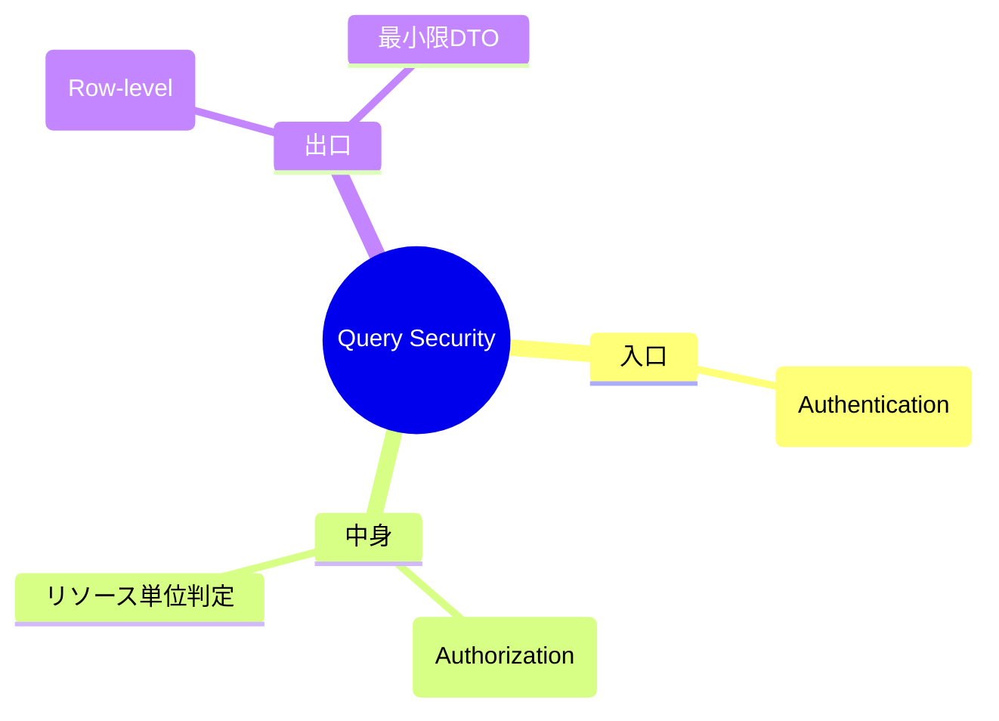

# 第37章　仕上げ（セキュリティ & API契約 & 卒業課題）🎓🔐✨

やることは大きく3つ👇


* **セキュリティ**：特に“Query（読む側）”の漏れを潰す🔍🧯
* **API契約**：壊さずに進化できるAPIにする🧷📜
* **卒業課題**：改善前後の計測レポまで出して、実務レベルで締める📈✍️

（ちなみに 2026/01/24 時点だと .NET 10 は **2025/11/11 リリースのLTS**で、最新パッチは **10.0.2（2026/01/13）**だよ。([Microsoft][5])）

---

## 0. この章でできるようになること ✅🎉

終わるころには、次ができるようになるよ！

* Queryで**「見せてはいけない情報」を絶対に返さない**設計ができる🔐
* APIの変更をするときに、**既存クライアントを壊さない**判断ができる🧠
* OpenAPI（仕様書）とエラー形式を揃えて、**運用しやすいAPI**になる📘
* 卒業課題として「遅い検索画面」を**Read最適化＆計測レポ**まで出せる📈✨

---

## 1. セキュリティ：いちばん事故るのは“Query”😱🔍

### 1-1. まず敵を知ろう（ありがち事故）🧨

実務で多いのはこれ👇

* **権限チェック漏れ（Broken Access Control）**
  → 「他人の注文が見える」「管理者だけの情報が見える」みたいなやつ💥
  これはOWASPでも超重要カテゴリとして強調されてるよ。([owasp.org][6])
* **設定ミス（Security Misconfiguration）**
  → スタックトレース出ちゃう、不要な機能ON、デバッグ設定のまま公開…😇([owasp.org][7])
* **Injection（SQL/LINQ/ログ周り含む）**
  → 「ソート列を文字列で受けて直結」みたいなのが地味に危ない😵‍💫([owasp.org][8])

> CQRSは「読む側が増えやすい」＝**漏れポイントが増えやすい**、って覚えておくと勝ち🏆

---

## 2. “漏れないQuery”の設計：3段ロック🔐🔐🔐



合言葉はこれ👇
**①入口で認証　②Handlerで認可　③Queryで必ず絞る（Row-level security）**
 


### 2-1. ①入口で「基本はログイン必須」にする🙋‍♀️🔑

API全体は原則「認証済みユーザーだけ」に寄せるのが安全だよ。
ASP.NET Coreはポリシーベース認可が基本で、要求（Requirement）＋ハンドラ（Handler）で組めるよ。([Microsoft Learn][9])

---

### 2-2. ②Handlerで「この人がこのリソース見ていい？」を判定する🧑‍⚖️

`[Authorize]` だけだと「リソース（注文など）を取ってから判断」ができないことがある。
そんなときは **Resource-based authorization**（リソースベース認可）を使うよ。([Microsoft Learn][10])

#### 例：注文（Order）を“本人だけ”閲覧できるようにする🧾🔐

```csharp
// 例：ユーザー情報をアプリ内で使うための薄い窓口
public interface IUserContext
{
    string UserId { get; }     // 例: sub / nameidentifier
    bool IsAdmin { get; }
}

// リソース（Order）に対する要求
public sealed class CanViewOrderRequirement : IAuthorizationRequirement { }

// 要求を判定するハンドラ
public sealed class CanViewOrderHandler
    : AuthorizationHandler<CanViewOrderRequirement, Order>
{
    protected override Task HandleRequirementAsync(
        AuthorizationHandlerContext context,
        CanViewOrderRequirement requirement,
        Order resource)
    {
        // 管理者はOK（例）
        if (context.User.IsInRole("Admin"))
        {
            context.Succeed(requirement);
            return Task.CompletedTask;
        }

        // 本人だけOK
        var userId = context.User.FindFirst("sub")?.Value
                     ?? context.User.FindFirst(ClaimTypes.NameIdentifier)?.Value;

        if (userId is not null && resource.UserId == userId)
            context.Succeed(requirement);

        return Task.CompletedTask;
    }
}
```

> ここでのポイント：**「Orderを取ってから」認可できる**こと✨
> こういうのがResource-basedの強さだよ。([Microsoft Learn][10])

---

### 2-3. ③Queryは“必ず絞る”（これが最後の砦）🛡️

認可があっても、Query側で絞らないと漏れることがあるよ😱
（例：一覧検索APIが「全件」返してて、フロント側で絞ってる…みたいな事故）

#### 例：一覧Queryで“必ず自分の注文だけ”に絞る📄

```csharp
public sealed record GetMyOrdersQuery(int Page, int PageSize);

public sealed class GetMyOrdersQueryHandler
{
    private readonly AppDbContext _db;
    private readonly IUserContext _user;

    public GetMyOrdersQueryHandler(AppDbContext db, IUserContext user)
    {
        _db = db;
        _user = user;
    }

    public async Task<IReadOnlyList<OrderListItemDto>> Handle(GetMyOrdersQuery q, CancellationToken ct)
    {
        // ✅ ここが超大事：WHEREで必ず絞る（Row-level security）
        var query = _db.Orders
            .AsNoTracking()
            .Where(o => o.UserId == _user.UserId)
            .OrderByDescending(o => o.CreatedAt)
            .Skip((q.Page - 1) * q.PageSize)
            .Take(q.PageSize)
            .Select(o => new OrderListItemDto(
                o.Id,
                o.CreatedAt,
                o.TotalAmount
            ));

        return await query.ToListAsync(ct);
    }
}

public sealed record OrderListItemDto(
    Guid OrderId,
    DateTimeOffset CreatedAt,
    decimal TotalAmount
);
```

---

## 3. Queryで漏らしがちな“あるある罠”チェックリスト✅😵‍💫

### 3-1. DTOの罠（見せなくていい物まで返す）📦💦

* 内部メモ、管理フラグ、原価、個人情報（住所・電話）などをうっかり返す
* “Entityをそのまま返す”が一番危険😇（DTOにする理由、ここ！）

✅ 対策

* **Read DTOは「画面に必要な最小限」だけ**
* 「返していい項目」だけを列挙する（投影）
  → これ自体が漏れ防止になる✨

---

### 3-2. ソート/フィルタの罠（文字列直結）🌀

「sort=xxxx」をそのままDynamicに当てると事故りやすい💥
✅ 対策：**許可リスト（Whitelist）方式**にする

```csharp
static readonly HashSet<string> AllowedSorts = new(StringComparer.OrdinalIgnoreCase)
{
    "createdAt",
    "totalAmount"
};

public static string NormalizeSort(string? sort)
{
    if (string.IsNullOrWhiteSpace(sort)) return "createdAt";
    if (!AllowedSorts.Contains(sort)) return "createdAt"; // ✅ 不正なら丸める
    return sort;
}
```

---

### 3-3. ログの罠（便利だけど漏れる）📝😱

* アクセストークン、パスワード、住所、カード情報をログに出す → 終わり😇
  ✅ 対策：**ログは「識別子・件数・所要時間・相関ID」中心**にする

---

## 4. API契約（Contract）：壊さず進化する設計🧷📜✨

### 4-1. まず“仕様書＝OpenAPI”を育てよう🌱📘

ASP.NET CoreはOpenAPI生成をサポートしていて、Minimal APIでもOpenAPIドキュメントを出せるよ。([Microsoft Learn][11])
CQRSはエンドポイントが増えるから、仕様書があると未来の自分が助かる🥹

✅ やること（超ざっくり）

* OpenAPIを出す
* 仕様書をレビュー対象にする（PRで差分を見る）
* 「変更は契約を壊してない？」をチェックする

---

### 4-2. エラー形式はProblemDetailsで統一しよ🧯📦

ASP.NET Coreは **RFC 7807** 形式（ProblemDetails）でエラーを返すのを強くサポートしてるよ。([Microsoft Learn][12])
さらに `AddProblemDetails` でミドルウェアが整備されてる。([Microsoft Learn][13])

#### 例：想定内エラーをProblemDetailsで返す（Minimal API例）

```csharp
app.MapPost("/orders", async (CreateOrderCommand cmd, Dispatcher dispatcher) =>
{
    var result = await dispatcher.Send(cmd);

    return result.IsSuccess
        ? Results.Created($"/orders/{result.Value}", new { id = result.Value })
        : Results.Problem(
            title: "注文に失敗しました",
            detail: result.ErrorMessage,
            statusCode: StatusCodes.Status400BadRequest,
            type: "https://example.com/problems/order-failed"
        );
});
```

---

### 4-3. バージョニング：壊すなら“新バージョン”が正義🧊🧷

「APIは一度出すと戻せない」って思うといいよ😇
Microsoftのガイドでも **明示的なバージョニングは重要**って話が出てくる。([Microsoft Learn][14])

#### どんな変更が“壊れる”の？💣

壊れやすい変更👇

* 必須項目を追加する（今まで送ってなくてもOKだったのに…）
* 型を変える（string→intとか）
* 既存フィールドの意味を変える
* ステータスコードやエラー形式を変える（クライアントが依存してる）

壊れにくい変更👇

* **レスポンスにフィールドを追加**（クライアントが無視できる前提ならOK）
* 新しいエンドポイント追加
* 任意項目の追加（デフォルト動作が変わらない）

---

### 4-4. Minimal APIのバージョニング（Asp.Versioning.Http）🧩

Minimal APIは **Asp.Versioning.Http** を使ってバージョニングできるよ。([Microsoft Learn][11])
（コントローラー派でもAsp.Versioning系が定番だよ〜）

```csharp
// 例：Minimal API + API Versioning（雰囲気）
builder.Services.AddApiVersioning()
    .AddApiExplorer(); // OpenAPIと相性よし

var app = builder.Build();

var v1 = app.NewVersionedApi("Orders").MapGroup("/api/v{version:apiVersion}/orders")
    .HasApiVersion(1.0);

v1.MapGet("/{id:guid}", (Guid id) => Results.Ok(new { id }))
  .WithOpenApi();
```

---

## 5. 卒業課題 🎓📈「遅い検索画面を救え！」

### ゴール 🏁✨

「検索が重い画面」を、**Read最適化（Projection/別テーブル/SQL最適化）**で速くして、
**改善前後の計測レポ**まで書く！

---

### 5-1. やることリスト（提出物）📦📝

提出物はこれ👇

1. **遅い検索APIを1つ選ぶ**（例：注文一覧、商品検索、集計付き一覧）
2. 改善前を計測

   * 応答時間（ms）
   * DBクエリ回数（N+1出てない？）
   * 返却件数
3. Read最適化（どれか1つ以上）

   * 投影（必要列だけSelect）
   * JOIN/集計を読みモデルに寄せる
   * 別テーブル（Read専用）を作ってProjection
4. 改善後を計測して比較
5. **セキュリティ自己監査**（下のチェックリスト）
6. OpenAPI更新（差分が分かるように）
7. **レポ提出**（A4 1〜2枚でOK）

---

### 5-2. セキュリティ自己監査チェック✅🔐

この7つを全部YESにできたら合格ライン！

* [ ] 一覧/詳細が **必ずユーザー or テナントで絞られている**
* [ ] 管理者だけの項目がDTOに混ざってない
* [ ] sort/filterに **許可リスト**がある
* [ ] エラーが **ProblemDetails** で統一されてる([Microsoft Learn][12])
* [ ] 例外時にスタックトレースが外に出ない（設定ミス対策）([owasp.org][7])
* [ ] ログに個人情報/秘密情報を出してない
* [ ] 「他人のIDで叩く」テストをした（Broken Access Control対策）([owasp.org][6])

---

### 5-3. レポのテンプレ（そのまま使ってOK）📄✨

* 対象：どの検索API？
* 改善前：平均xxms / P95 xxms / クエリ回数x回
* ボトルネック仮説：N+1、全件取得、集計重い…など
* 改善内容：投影、インデックス、Readモデル、SQL化…
* 改善後：平均xxms / P95 xxms / クエリ回数x回
* セキュリティ確認：チェックリストの結果
* 互換性：API契約を壊してない？壊したなら version をどうした？🧷

---

## 6. 次の発展（必要になったらでOK）🚀🌟

ここまでできたら、もうCQRS入門は卒業🎓✨
次の扉はこのへん：

* **Outbox**：イベントの“出し忘れ”防止📮
* **Saga**：分散トランザクションの現実解🧩
* **イベント駆動CQRS**：Readモデルを非同期で育てる🌱⏳

（いきなり全部やると迷子になるから、“必要になったら”で大丈夫🙆‍♀️）

---

## 7. AIプロンプト集（この章はAIと相性よすぎ）🤖💞

### セキュリティ抜け漏れチェック🔐

* 「このQuery（コード貼る）で、情報漏洩の可能性を列挙して。優先度も付けて」
* 「Broken Access Controlの観点で、攻撃者が試す入力パターンを10個出して」([owasp.org][6])

### API契約・互換性🧷

* 「この変更は破壊的変更？互換性を壊さない代替案を3つ出して」
* 「OpenAPI差分から、クライアントが壊れる可能性がある点を指摘して」([Microsoft Learn][11])

### レポ作成📈

* 「この計測結果を、読みやすい改善レポ（A4 1枚）に整形して」

---

### 最後にひとこと🎓✨

CQRSって「読み書きを分ける」だけじゃなくて、
**“大きくなっても壊れない運用”を作る技術**なんだよね☺️🧷

もしよければ、卒業課題の対象にする「遅い検索API（例：注文一覧）」の仕様や現在のQuery（コード）を貼ってくれたら、
**最短で効く改善案**（投影/インデックス/Readモデル/SQL化のどれが良いか）を一緒に決めて、レポまで作れる形にしてあげるよ📈🔥

[1]: https://chatgpt.com/c/69607df4-2728-8322-8a65-3494f5007acb "開発環境セットアップ"
[2]: https://chatgpt.com/c/6972c89e-f628-8323-b961-a6c3c8dea31e "AI拡張準備ガイド"
[3]: https://chatgpt.com/c/697365b7-07c8-8321-b49d-db168230e93e "第5章 要件作成ガイド"
[4]: https://chatgpt.com/c/69735e26-02cc-8322-bda8-6b697a9e4dac "CQRS入門絵で理解"
[5]: https://dotnet.microsoft.com/ja-jp/platform/support/policy/dotnet-core?utm_source=chatgpt.com ".NET および .NET Core の公式サポート ポリシー"
[6]: https://owasp.org/Top10/2021/A01_2021-Broken_Access_Control/?utm_source=chatgpt.com "A01 Broken Access Control - OWASP Top 10:2021"
[7]: https://owasp.org/Top10/2021/A05_2021-Security_Misconfiguration/?utm_source=chatgpt.com "A05 Security Misconfiguration - OWASP Top 10:2021"
[8]: https://owasp.org/Top10/2021/A03_2021-Injection/?utm_source=chatgpt.com "A03 Injection - OWASP Top 10:2021"
[9]: https://learn.microsoft.com/en-us/aspnet/core/security/authorization/introduction?view=aspnetcore-10.0&utm_source=chatgpt.com "Introduction to authorization in ASP.NET Core"
[10]: https://learn.microsoft.com/en-us/aspnet/core/security/authorization/resourcebased?view=aspnetcore-10.0&utm_source=chatgpt.com "Resource-based authorization in ASP.NET Core"
[11]: https://learn.microsoft.com/en-us/aspnet/core/fundamentals/openapi/aspnetcore-openapi?view=aspnetcore-10.0&utm_source=chatgpt.com "Generate OpenAPI documents"
[12]: https://learn.microsoft.com/en-us/aspnet/core/fundamentals/error-handling-api?view=aspnetcore-10.0&utm_source=chatgpt.com "Handle errors in ASP.NET Core APIs"
[13]: https://learn.microsoft.com/ja-jp/aspnet/core/fundamentals/error-handling?view=aspnetcore-10.0&utm_source=chatgpt.com "ASP.NET Core のエラーを処理する"
[14]: https://learn.microsoft.com/en-us/azure/architecture/best-practices/api-design?utm_source=chatgpt.com "Web API Design Best Practices - Azure Architecture Center"
