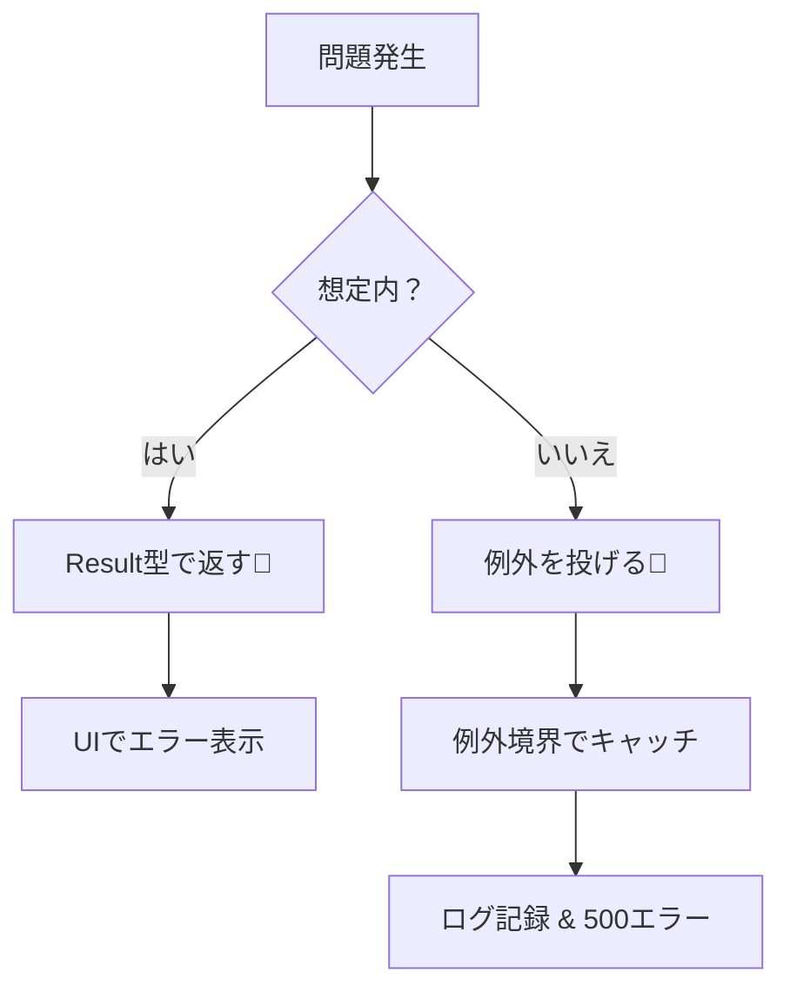
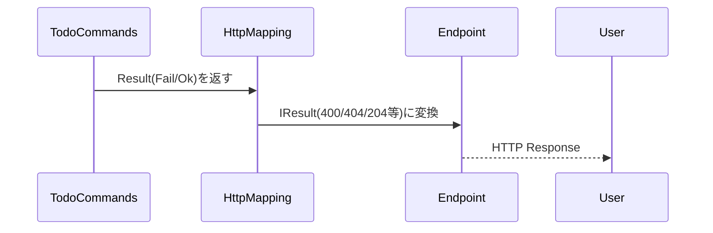

# 第10章：CQSとエラー設計②（例外／Resultの使い分け）🎁🧯

この章は「**失敗をキレイに扱えると、コードが急に“実務っぽく”なる**」回だよ〜😊
特に **Command**（変更する側）と **Query**（見る側）で、失敗の扱いを揃えるのがテーマ！🧠✨

ちなみに本日時点（2026-01-20）だと、.NET は **.NET 10（LTS）** が現行で、C# は **C# 14** が最新だよ〜！🎉（VS 2026 で .NET 10 SDK が入ってる） ([Microsoft for Developers][1])

---

## 1) 今日のゴール🎯✨

この章が終わると、これができるようになるよ！

* Query の失敗（見つからない等）を **例外にしない**で扱える👀🧊
* Command の失敗（バリデーション・業務ルール）を **Result で返せる**🎁✅
* “ユーザー向けのエラー” と “ログ向けの詳細” を分離できる🪞📝
* 例外は「ここで受け止める！」という **例外境界**を作れる🚧🧯

---

## 2) まず大原則：例外は“通常運転”に使わない🙅‍♀️💥

.NET の設計ガイドラインでも、**「通常の制御フローに例外を使うな」**って強く言ってるよ！ ([Microsoft Learn][2])

## ✅ ざっくり覚え方🧠

* **想定内の失敗**（入力が変、在庫がない、もう完了済み、など）
  → **Result / null / NotFound / Validation** で返す✨
* **想定外の事故**（DB落ちた、ネット死んだ、バグで null 参照、など）
  → **例外**でOK（ただし“境界”でまとめて扱う）🧯




---

## 3) Query はどう失敗する？🤔🔍（おすすめ方針つき）

Query の失敗で多いのはこの2つ！

## A. 「見つからない」＝仕様（普通に起こる）👻➡️😌

**おすすめ：`null`（または `T?`）で返す**
「見つからない」を例外にすると、呼び出すたび try/catch 祭りになって地獄になりがち🥺💦

## B. 「入力が変」＝呼び出し側のミス（またはUI入力ミス）📝

* UI/Endpoint 側で先に弾けるなら：**Query は前提が満たされてるものとして書く**👌
* どうしても Query 側で判定したいなら：**Result<T> で返す**もアリ🎁

---

## 4) Command はどう失敗する？✅🔧（Result が一番ハマる）

Command は「変更する」から、失敗が起きやすい！

* 入力が変（バリデーション）📋
* ルール的にダメ（業務ルール）🚫
* 競合（もう完了してた、同時更新、など）⚔️

これを **例外で表現すると、仕様の失敗まで例外扱い**になってしまいがち。
だから Command は **Result（成功/失敗）で返す**が気持ちいいよ〜🎁✨

---

## 5) 入門用 Result 型を作ろう🎁🧱（超シンプル版）


まずは「1章で使い回せる最小セット」でいくね😊

```csharp
public sealed record Error(string Code, string Message, string? Detail = null);

public sealed class Result
{
    public bool IsSuccess { get; }
    public IReadOnlyList<Error> Errors { get; }

    private Result(bool isSuccess, IReadOnlyList<Error> errors)
        => (IsSuccess, Errors) = (isSuccess, errors);

    public static Result Ok() => new(true, Array.Empty<Error>());

    public static Result Fail(params Error[] errors)
        => new(false, errors);
}

public sealed class Result<T>
{
    public bool IsSuccess { get; }
    public T? Value { get; }
    public IReadOnlyList<Error> Errors { get; }

    private Result(bool isSuccess, T? value, IReadOnlyList<Error> errors)
        => (IsSuccess, Value, Errors) = (isSuccess, value, errors);

    public static Result<T> Ok(T value) => new(true, value, Array.Empty<Error>());

    public static Result<T> Fail(params Error[] errors)
        => new(false, default, errors);
}
```

## ✅ Error の “Code” がめっちゃ大事💡

* 表示メッセージ（Message）は後で変わることある
* でも Code があれば **HTTP 409 にする**とか **画面で特別扱い**できる🎮✨

---

## 6) ToDo題材：Query / Command で失敗の扱いを分ける📝🍰

## Query：見つからないなら null でOK👀

```csharp
public sealed record TodoDto(Guid Id, string Title, bool IsDone);

public interface ITodoRepository
{
    Task<TodoItem?> GetByIdAsync(Guid id);
}

public sealed class TodoQueries
{
    private readonly ITodoRepository _repo;
    public TodoQueries(ITodoRepository repo) => _repo = repo;

    public async Task<TodoDto?> GetByIdAsync(Guid id)
    {
        var item = await _repo.GetByIdAsync(id);
        return item is null ? null : new TodoDto(item.Id, item.Title, item.IsDone);
    }
}
```

## Command：想定内の失敗は Result で返す🎁✅

```csharp
public sealed class TodoCommands
{
    private readonly ITodoRepository _repo;
    public TodoCommands(ITodoRepository repo) => _repo = repo;

    public async Task<Result> CompleteAsync(Guid id)
    {
        if (id == Guid.Empty)
            return Result.Fail(new Error("id_required", "IDが空だよ〜🥺"));

        var item = await _repo.GetByIdAsync(id);
        if (item is null)
            return Result.Fail(new Error("not_found", "ToDoが見つからないよ〜👻", $"id={id}"));

        if (item.IsDone)
            return Result.Fail(new Error("already_done", "もう完了済みだよ😉", $"id={id}"));

        item.MarkDone();               // 状態変更！
        await _repo.SaveAsync(item);   // 副作用！

        return Result.Ok();
    }
}
```

ここ、CQS 的に超キレイ✨

* Query：読むだけ（副作用なし）🔍
* Command：変える（副作用あり）🔧

---

## 7) 例外はどこで受け止める？→「例外境界」🚧🧯

おすすめはこう👇

* Command/Query の中で、何でもかんでも try/catch しない🙅‍♀️
* いちばん外側（UI/Endpoint/アプリの入口）で **まとめて捕まえる**✅
* そこで **ログ**して、**ユーザー向け**には安全な返し方に変換する🪞

.NET の API だと、この「外側でまとめて」がお作法になってるよ〜 ([Microsoft Learn][3])

---

## 8) Minimal API での “ユーザー向けエラー” の返し方📨✨（ProblemDetails）

ASP.NET Core では **ProblemDetails（RFC 7807）** っていう定番のエラー形式があって、`.AddProblemDetails()` + `UseExceptionHandler()` などで統一しやすいよ！ ([Microsoft Learn][3])

## まずは土台（全体方針）🧱

```csharp
var builder = WebApplication.CreateBuilder(args);

builder.Services.AddProblemDetails();

var app = builder.Build();

app.UseExceptionHandler(); // 例外をまとめて受け止める🧯
app.UseStatusCodePages();  // 404 なども ProblemDetails にできる✨

app.Run();
```

この “統一感” が強い！✨ ([Microsoft Learn][3])

---

## 9) Query を HTTP に変換する（NotFound は普通に返す）🔍➡️🌐

Minimal API は `Results` / `TypedResults` が使えるよ（`TypedResults` は型が強くてテストもしやすい） ([Microsoft Learn][4])

```csharp
app.MapGet("/todos/{id:guid}", async (Guid id, TodoQueries q) =>
{
    if (id == Guid.Empty)
        return TypedResults.BadRequest();

    var todo = await q.GetByIdAsync(id);
    return todo is null
        ? TypedResults.NotFound()
        : TypedResults.Ok(todo);
});
```

ポイント：**見つからない＝404**、例外じゃない😊✨

---

## 10) Command の Result を HTTP に変換する🎁➡️🌐（超実務っぽい！）

ここがこの章のメインディッシュ🍝✨
「アプリ内部は Result」「外側で HTTP に変換」にすると、依存の向きもキレイになりやすいよ🧭

## Result → IResult 変換ヘルパー（入門版）🛠️

```csharp
public static class ResultHttpMapping
{
    public static IResult ToIResult(this Result result)
    {
        if (result.IsSuccess)
            return TypedResults.NoContent();

        var e = result.Errors[0]; // 入門なのでまず1個だけ扱う！

        return e.Code switch
        {
            "id_required" =>
                TypedResults.ValidationProblem(new Dictionary<string, string[]>
                {
                    ["id"] = new[] { e.Message }
                }),

            "not_found" =>
                TypedResults.Problem(statusCode: StatusCodes.Status404NotFound, title: e.Message),

            "already_done" =>
                TypedResults.Problem(statusCode: StatusCodes.Status409Conflict, title: e.Message),

            _ =>
                TypedResults.Problem(statusCode: StatusCodes.Status400BadRequest, title: e.Message),
        };
    }
}
```

## Endpoint 側は超スッキリ😍

```csharp
app.MapPost("/todos/{id:guid}/complete", async (Guid id, TodoCommands c) =>
{
    var result = await c.CompleteAsync(id);
    return result.ToIResult();
});
```

これで、Command は「ドメイン/アプリ都合の失敗」を Result で表現できて、HTTP のことを知らなくて済む👍✨
（＝責務分離が自然にできる！）




---

## 11) “ユーザー向け”と“ログ向け”を分ける🪞📝（地味に超重要）

## ✅ ユーザー向け

* `Message`：安全で短い（個人情報や内部情報を出さない）🔒

## ✅ ログ向け

* `Detail`：調査できる情報（id、状態、例外内容など）🕵️‍♀️

たとえば `Error("not_found", "見つからないよ", $"id={id}")` みたいに持っておくと便利😊
そしてログには `Detail` + 例外スタックトレースを出す、とかね✨

---

## 12) Console 版だとこう使う🎮🖥️

```csharp
var r = await commands.CompleteAsync(id);

if (r.IsSuccess)
{
    Console.WriteLine("完了したよ〜🎉");
}
else
{
    Console.WriteLine($"失敗: {r.Errors[0].Message} 😢");
    // 開発中は Detail を出してもOK（本番はログへ）
    Console.WriteLine($"(detail: {r.Errors[0].Detail}) 📝");
}
```

Console でも Result は超相性いいよ〜😊✨

---

## 13) AI（Copilot/Codex）に頼むときの“事故らない”指示例🤖🧷

* 「C# で Result / Result<T> を **依存なし**で実装して。Error(Code, Message, Detail) も作って」
* 「Result の Code を見て Minimal API の HTTP ステータスに変換する `ToIResult()` を作って」
* 「Query は `T?` を返し、NotFound は例外にしない方針で ToDo の例を書いて」

💡コツ：AI が “全部例外” に寄せてきたら、すぐこう言う👇

* 「例外は想定外だけ。想定内は Result/null で」って釘を刺す🧷✨

---

## 14) ミニ演習🧩✨（10〜20分）

## 演習A：Command を1つ追加✅

* `RenameTodo(id, newTitle)` を Command として追加
* 失敗パターン：

  * `newTitle` 空 → `title_required`（400/validation）
  * 見つからない → `not_found`（404）
  * 同じ名前 → `no_change`（409 でも 400 でもOK）

## 演習B：Query を1つ追加🔍

* `GetTodos(status)` みたいにフィルタ Query
* status が変な文字列なら Endpoint 側で弾く（BadRequest）

---

## 15) 章末チェックリスト✅🎉

* Query は「見つからない」を例外にしてない？👻❌
* Command の失敗は Result で返せてる？🎁✅
* 例外は“境界”でまとめて扱ってる？🚧🧯
* ユーザー向けメッセージに内部情報が混ざってない？🔒
* Code があるから、HTTP 変換や画面分岐ができる状態？🏷️✨

---

次の章（第11章）で、この設計が **テストがラクになる**ところに直結するよ〜🧪🏆
もし「この章の Result をもう少しだけ実務寄りに（複数エラー対応、ErrorCategory 追加など）」もやりたければ、そこも一緒に整えていこうね😊✨

[1]: https://devblogs.microsoft.com/dotnet/announcing-dotnet-10/?utm_source=chatgpt.com "Announcing .NET 10"
[2]: https://learn.microsoft.com/en-us/dotnet/standard/design-guidelines/exception-throwing?utm_source=chatgpt.com "Exception Throwing - Framework Design Guidelines"
[3]: https://learn.microsoft.com/en-us/aspnet/core/fundamentals/error-handling-api?view=aspnetcore-10.0 "Handle errors in ASP.NET Core APIs | Microsoft Learn"
[4]: https://learn.microsoft.com/en-us/aspnet/core/fundamentals/minimal-apis/responses?view=aspnetcore-10.0 "Create responses in Minimal API applications | Microsoft Learn"
