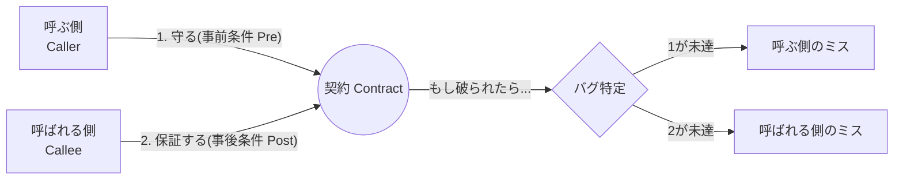
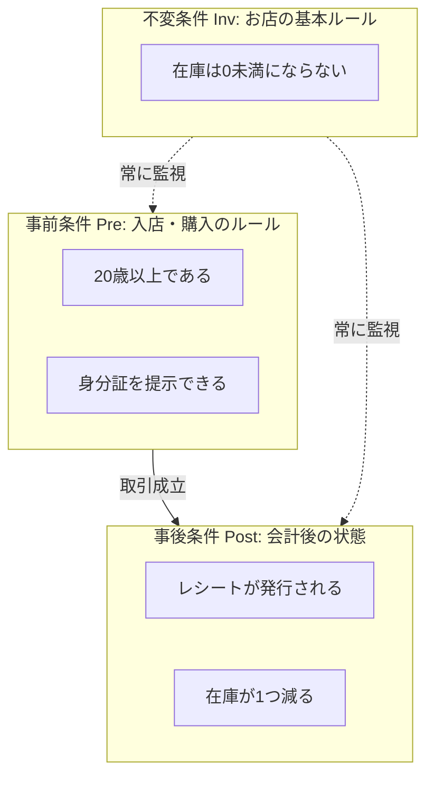

# 第1章 DbCってなに？「約束」で守る設計🤝📌

## 1. この章でつかむこと🎯✨

* DbC（Design by Contract）が「なにをする考え方」なのかを、ふんわりじゃなく説明できるようになる😊🗣️
* 「契約（約束）」を、メソッドやクラスのルールとして言語化できるようになる📝✨
* C#で“それっぽく”DbCを始める最小セット（ガード節＋軽い保証）を体験する🛡️🎁

---

## 1.1 DbCってなに？🤔💡


**DbC（Design by Contract）** は、日本語で「**契約による設計**」と言うよ😊✨

---

## 2. DbCの超ざっくりイメージ：メソッドとクラスの“契約書”📝🤝

DbCは、**「呼ぶ側」と「呼ばれる側」が守る“約束”をハッキリ書く設計**だよ😊✨
この“約束”があると、バグが起きたときにこうなる👇

* 「どっちが悪い？」がすぐ分かる💡

  * 呼ぶ側が約束を破った → 呼ぶ側のミス（バグ）🐞
  * 呼ばれる側が約束を守れなかった → 呼ばれる側のミス（バグ）🐞
* つまり、**責任の境界線がはっきりする**のがDbCの強みなんだ〜✨🧠



DbCの中心は、だいたいこの3つ（この章では“名前だけ”OK）👇

* Pre（事前条件）☎️：呼ぶ側が守ること
* Post（事後条件）🎁：呼ばれた側が保証すること
* Inv（不変条件）🧱：クラスがいつでも守ること

（C#の最新環境では、C# 13 は .NET 9 SDK と Visual Studio 2022 の最新で試せるよ、という位置づけになってるよ） ([Microsoft Learn][1])

---

## 3. 何がうれしいの？ DbCの“効き目”3つ🔍✨

### 3-1. バグの混入点が早く見つかる⚡🐞

約束がコード上にあると、壊れた瞬間に「入口で止められる」ことが増えるよ🚪🛑
結果として、**デバッグ時間が短くなる**✨

### 3-2. コードが読みやすくなる📖🌸

契約は「このメソッド、何を期待して、何を保証するの？」を短く答えてくれる💬
ドキュメントがなくても理解しやすくなるよ😊

### 3-3. テストの作り方が分かる🧪🎯

Pre/Post/Invが見えると、テストがこう作れる👇

* Preを破ったらどうなる？（契約違反の検知）
* Postは本当に満たされる？（正しい保証）
* Invが壊れない？（モデルの健康診断）🏥🧱

---

## 4. よくある誤解：「堅苦しい」じゃなくて「親切」😊💗

### 誤解A：チェック増える＝遅いんじゃ？🐢💦

たしかにチェックは増えるけど、**壊れたまま奥へ進む**ほうが高くつくことが多いよ😵‍💫
入口で止めるのは、トラブルの拡大を防ぐ“保険”みたいなもの🛡️✨

### 誤解B：DbCって専用機能が必要？🤔

C#には、Eiffelみたいな“言語機能としてのDbC”が標準であるわけじゃないよ🙅‍♀️
でも大丈夫！C#では以下で十分「DbCっぽく」できる👇

* ガード節（引数チェック）🛡️
* 例外（契約違反を止める）💥
* Debug.Assert（内部の前提を壊れた瞬間に気づく）🐞🔔
* 型（そもそも不正を作れない）💎🔒

昔の「Code Contracts（System.Diagnostics.Contracts）」は、今の .NET 系では“積極採用される路線”ではなく、プロジェクトが事実上止まっている扱いで語られることが多いよ（そのため、まずはガード節中心が現実的） ([GitHub][2])

---

## 5. 身近な例で理解しよ！コンビニの“契約”🏪📜✨

たとえば「お酒の販売」って、暗黙のルールがあるよね🍺🔞
これを“契約”にするとこう👇

* Pre（事前条件）☎️

  * 年齢が20歳以上である
  * 身分証が必要なら提示できる
* Post（事後条件）🎁

  * 会計が成功したら、レシートが発行される
  * 在庫が1つ減る
* Inv（不変条件）🧱

  * 在庫は0未満にならない（いつ見ても守られてる）



ポイントはこれ👇
「**約束を言葉にできる**」＝「**設計として扱える**」ってこと！🧠✨

---

## 5.1 自分に合ったスタイルで始めよう🪜😊


DbCは、一気に全部やろうとしなくて大丈夫🌱

---

## 6. C#での“最小DbC”の書き方（まずはガード節）🛡️✨

ここでは「銀行口座から送金する」みたいな例で、入口チェック（Pre）をガード節で書いてみるよ💸🏦

### 6-1. まずは Pre を入口で止める🚪🛑

```csharp
using System;
using System.Diagnostics;

public static class TransferService
{
    // 「送金する」：最小DbCサンプル
    public static void Transfer(decimal amount, string fromAccountId, string toAccountId)
    {
        // Pre: 呼ぶ側が守るべき条件（入口でチェック）
        ArgumentException.ThrowIfNullOrEmpty(fromAccountId);
        ArgumentException.ThrowIfNullOrEmpty(toAccountId);

        if (fromAccountId == toAccountId)
            throw new ArgumentException("from と to は別の口座である必要があります。");

        if (amount <= 0)
            throw new ArgumentOutOfRangeException(nameof(amount), "amount は 0 より大きい必要があります。");

        // ここから下は「条件が満たされている世界」なので、ロジックが読みやすくなる✨

        // ...送金処理（例：残高チェック・引き落とし・入金）...

        // Post（例）：このメソッドが終わると「送金が完了している」ことを保証したい
        // ただし、Postの本格運用は第3部で丁寧にやるよ🎁✨

        Debug.Assert(amount > 0, "amount は常に正であるべき（内部前提の確認）");
    }
}
```

* 「ArgumentException.ThrowIfNullOrEmpty」みたいな“ThrowIf〜”系は、**ガード節を短く書くための公式API**として紹介される流れがあるよ🛡️✨ ([Steven Giesel][3])
* 数値チェックは「ArgumentOutOfRangeException.ThrowIfNegativeOrZero」みたいな形も用意されてる（ジェネリック数値対応のものもある）よ🔢🚫 ([Microsoft Learn][4])

### 6-2. どうして“入口で”やるの？🌟

入口で止めると、メリットが大きい👇

* 変な値が中に入らない → 中がシンプルになる🧘‍♀️✨
* 「どこで壊れた？」が入口で確定しやすい🔍
* 例外メッセージが“契約の文章”になる💌

---

## 7. ミニ演習：コンビニのルールを“契約”にしてみよう🏪✍️✨

次のどれかを1つ選んで、**Pre / Post / Inv を日本語で3行**書いてみてね😊🌸
（コードじゃなくてOK！まずは言語化が大事📝✨）

A. 返品受付📦
B. 宅配便の受付📮
C. ポイントカードの付与🎫

書き方のテンプレ👇

* Pre：〜であること
* Post：成功したら〜になっていること
* Inv：いつ見ても〜であること

---

## 8. AI活用ミニ：ガード節の下書きを作ってもらう🤖🛡️✨

Copilot などに、こう頼むと速いよ⚡️（そのまま採用せず、最後は目で確認ね👀✨）

* 「このメソッドの引数に対して、自然な Pre（null/空/範囲/同一チェック）をガード節で追加して」
* 「例外メッセージは、将来読んでも意味が分かる日本語で」

“AIが盛りがち”ポイント👇

* チェックを増やしすぎて読みにくくする😵‍💫
* 仕様エラーと契約違反をごっちゃにする🧨（これは第4章で超大事に扱うよ！）

---

## 9. この章のまとめ🌸✅

* DbCは「呼ぶ側／呼ばれる側の約束」を明確にする設計🤝
* 約束があると、バグが早く見つかって、読むのもテストもラクになる🔍🧪✨
* C#では、まず **ガード節（Pre）** から始めるのが現実的で強い🛡️
* 次章で、Pre / Post / Inv を“3点セット”としてスッキリ整理していくよ🧩✅

[1]: https://learn.microsoft.com/en-us/dotnet/csharp/whats-new/csharp-13?utm_source=chatgpt.com "What's new in C# 13"
[2]: https://github.com/dotnet/runtime/issues/23869?utm_source=chatgpt.com "Then, what's the status of Code Contracts usage in .NET ..."
[3]: https://steven-giesel.com/blogPost/f4bc6fcc-5691-4f72-b9bb-75aeeb59230a?utm_source=chatgpt.com "Table of Contents"
[4]: https://learn.microsoft.com/en-us/dotnet/api/system.argumentoutofrangeexception.throwifnegativeorzero?view=net-10.0&utm_source=chatgpt.com "ArgumentOutOfRangeException.ThrowIfNegativeOrZero<T ..."
