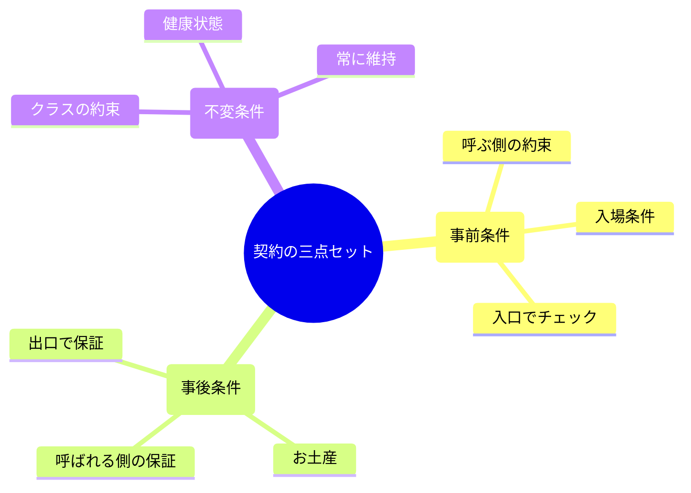
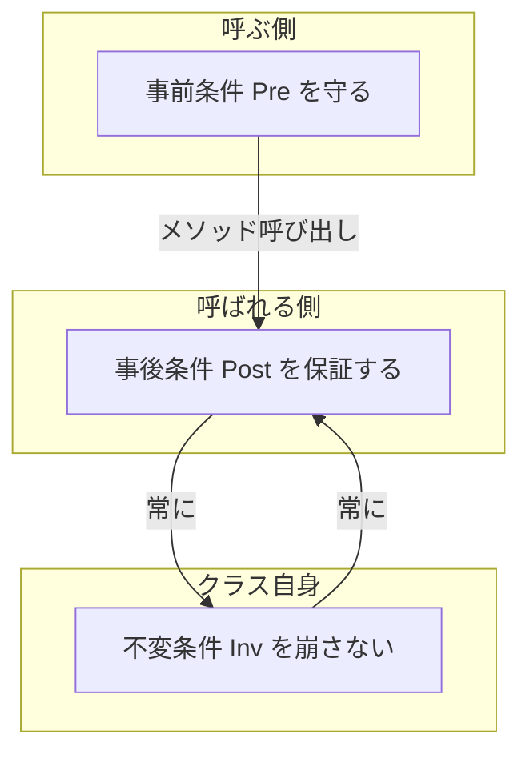
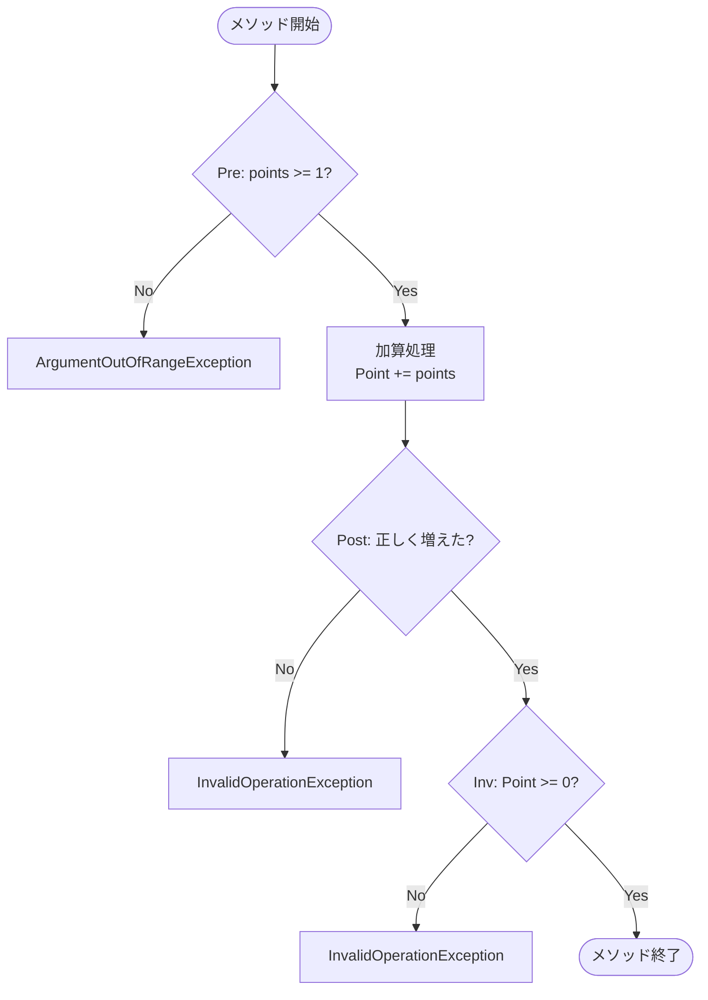

# 第2章 契約の三点セット：Pre / Post / Inv🧩✅

## この章でわかること🎯✨

* Pre（事前条件）/ Post（事後条件）/ Inv（不変条件）の違いが、例つきでスパッと説明できるようになる😊📌
* 「誰が守る約束？」を迷わなくなる（呼ぶ側？呼ばれる側？クラス？）🤝💡
* C#で“最低限の形”として契約を書き始められる🛡️🧱

---

## 1. DbCの「契約」って、なに？📜✨
 
 
 
 DbCの契約は、ざっくり言うとこう👇

* **Inv（不変条件）**：そのクラスがいつでも守ってるべき「健康状態」🏥🧱



いまの主流スタックは **.NET 10（最新LTS）** ＋ **C# 14** あたりが目安だよ〜🧡（最新配布ページと公式情報） ([Microsoft][1])

---

## 2. 契約の三点セットを、超身近にたとえる☕️🍰

## 2.3 カフェで例えると？☕️🥐


DbCを身近な「カフェの注文」でイメージしてみよう☕️

### Pre（事前条件）🚪✅：お客さん側の約束

* 「商品名を言う」
* 「支払い方法が使える」
* 「閉店時間前に来る」

➡️ お店が悪いんじゃなくて、**守ってないと注文が成立しない条件**だよね😌

### Post（事後条件）🎁✅：お店側の保証

* 「注文した商品が渡される」
* 「金額が正しい」
* 「レシートが出る（出す仕様なら）」

➡️ お客さんは、ここが守られるから安心して注文できる🎀

### Inv（不変条件）🏥🧱：お店（システム）の“常識”

* 「レジの在庫数がマイナスにならない」
* 「売上合計は0以上」

➡️ いつ見ても成り立っててほしい“土台”だね🧱✨

---

## 3. Pre（事前条件）＝「呼ぶ側が守る」☎️🛡️

### 3.1 何を書く？（典型パターン）📌

* `null`禁止🙅‍♀️
* 範囲チェック（0以上、上限以下）📏
* 形式チェック（IDの形、日付の妥当性）🗓️

### 3.2 C#での最小例（ガード節）🛡️✨

「まず入口で弾く」って形が一番わかりやすいよ〜！

```csharp
public static int Divide(int a, int b)
{
    if (b == 0) throw new ArgumentException("b must not be 0.", nameof(b)); // Pre
    return a / b;
}
```

ここで大事なのは👇

* **Preは“入口”に置く**（最初に）🚪
* Preが破られてたら、以降の処理は安心して書ける💆‍♀️✨

---

## 4. Post（事後条件）＝「呼ばれた側が保証する」🎁✅

### 4.1 Postは「戻り値」だけじゃないよ🔄

Postで大事なのは

* **戻り値がどうなってるべき？**📦
* **状態がどう変わってるべき？**🧾

たとえば「割引後の価格を返す」なら👇

* 戻り値は0以上（マイナス価格は返さない）
* 割引率が正しく反映されている

### 4.2 C#での“最小Post”の書き方（まずは言語化📝）

Postは最初、コードより **文章** が強い味方だよ😊💗

例）

* Post：`返り値は 0 以上である`
* Post：`返り値は元の価格以下である`

そのあとで、テストやチェックに落とすとスムーズ🧪✨

---

## 5. Inv（不変条件）＝「クラスの健康状態」🏥🧱

Invは、**そのクラスが“存在する限り”ずっと守るルール**だよ💎
（守れないなら、そのクラスは“壊れてる”状態😵‍💫）

### 5.1 例：口座（BankAccount）の不変条件💰

* 残高は 0 以上（`Balance >= 0`）
* 通貨は空じゃない（`Currency`は必須）

### 5.2 最小例：更新のたびに守る🔒

「生成・更新の入口」で守るのがコツだよ〜！

```csharp
public sealed class BankAccount
{
    public decimal Balance { get; private set; }
    public string Currency { get; }

    public BankAccount(decimal initialBalance, string currency)
    {
        if (initialBalance < 0) throw new ArgumentOutOfRangeException(nameof(initialBalance));
        if (string.IsNullOrWhiteSpace(currency)) throw new ArgumentException("currency required.", nameof(currency));

        Balance = initialBalance;
        Currency = currency;

        EnsureInvariant(); // Inv（念のため）
    }

    public void Withdraw(decimal amount)
    {
        if (amount <= 0) throw new ArgumentOutOfRangeException(nameof(amount)); // Pre

        Balance -= amount;

        EnsureInvariant(); // Inv（ここ超大事！）
    }

    private void EnsureInvariant()
    {
        if (Balance < 0) throw new InvalidOperationException("Invariant broken: Balance must be >= 0.");
        if (string.IsNullOrWhiteSpace(Currency)) throw new InvalidOperationException("Invariant broken: Currency required.");
    }
}
```

ポイント✨

* **Pre**：操作に必要な条件（`amount > 0`）
* **Inv**：クラスが“壊れてない”こと（`Balance >= 0`）

---

## 6. ぜったい迷うところ：「誰が守るんだっけ？」早見表🧠📌

* **Inv**：クラス自身が守る（生成・更新経路で崩さない）🏥🧱



---

## 7. ミニ演習：既存メソッドに Pre/Post/Inv を書き起こし📝✨

### お題🎯

次の仕様を、Pre/Post/Invに分解してみよう💡

**仕様：ポイントを加算する**

* `AddPoints(int points)` はポイントを増やす
* ポイントは 0 以上
* 増やす量は 1 以上

### ステップ1：自然言語で書く📝

* Pre：`points は 1 以上`
* Post：`呼び出し後、Point は 呼び出し前より points だけ増える`
* Inv：`Point は 0 以上`

### ステップ2：コードに落とす（例）🧩

```csharp
public sealed class Member
{
    public int Point { get; private set; }

    public Member(int initialPoint)
    {
        if (initialPoint < 0) throw new ArgumentOutOfRangeException(nameof(initialPoint)); // Pre(生成時)
        Point = initialPoint;
        EnsureInvariant(); // Inv
    }

    public void AddPoints(int points)
    {
        if (points < 1) throw new ArgumentOutOfRangeException(nameof(points)); // Pre

        var before = Point;
        Point += points;

        // Post（まずは“検証できる形”にしてみる）
        if (Point != before + points) throw new InvalidOperationException("Postcondition broken: Point didn't increase correctly.");

        EnsureInvariant(); // Inv
    }

    private void EnsureInvariant()
    {
        if (Point < 0) throw new InvalidOperationException("Invariant broken: Point must be >= 0.");
    }
}
```



---

## 8. よくある落とし穴あるある😵‍💫🧨

### 落とし穴1：PreとPostを混ぜる🌀

* 「入力が悪い」のに「結果が悪い」扱いしちゃう
  ➡️ まず **Preで入口**、次に **Postで保証** の順が気持ちいいよ😊✨

### 落とし穴2：Invを書かない（壊れたまま進む）💥

* 途中で状態が壊れてるのに、気づかず別のバグが出る
  ➡️ “壊れやすいクラス”ほどInvが効く🧱💗

### 落とし穴3：契約が長文すぎて読まれない📚💤

➡️ 最初は **1つのメソッドに「重要な2〜3個」** くらいで十分🎀

---

## 9. AIメモ：契約文づくりを爆速にする🤖⚡️

AIにはこう頼むと便利だよ〜（そのままコピペOK）🫶✨

* 「このメソッドのPre/Post/Invを日本語で3つずつ提案して。初心者でも読める言葉で！」
* 「Preは“入口チェックの条件”、Postは“保証”、Invは“クラスの健康状態”として整理して」
* 「曖昧なところがあれば質問してから提案して」

---

## 10. 仕上げチェックリスト✅✨

* Pre：入口で弾く条件が明確？🚪
* Post：戻り値／状態変化が言葉で説明できる？🎁
* Inv：クラスが壊れないルールがある？🏥
* 「誰が守る？」が毎回はっきりしてる？🤝

---

## おまけ：今どきの開発環境の目安📦✨

* .NET は **.NET 10 が最新（LTS）** として配布されているよ🌟 ([Microsoft][1])
* Visual Studio 2022 系は **17.14 系が Current チャネル**として並んでる（2026年1月の更新も掲載あり）🧰✨ ([Microsoft Learn][2])

[1]: https://dotnet.microsoft.com/en-us/download/dotnet?utm_source=chatgpt.com "Browse all .NET versions to download | .NET"
[2]: https://learn.microsoft.com/en-us/visualstudio/releases/2022/release-history "Visual Studio 2022 Release History | Microsoft Learn"
