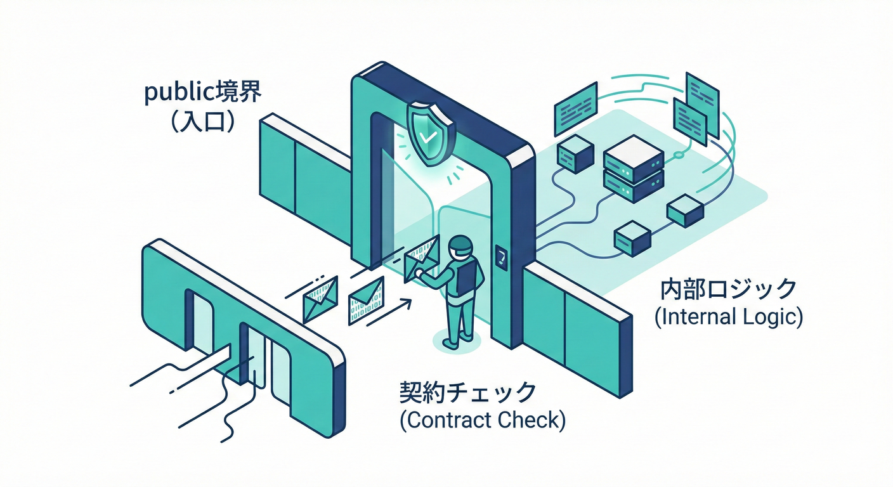
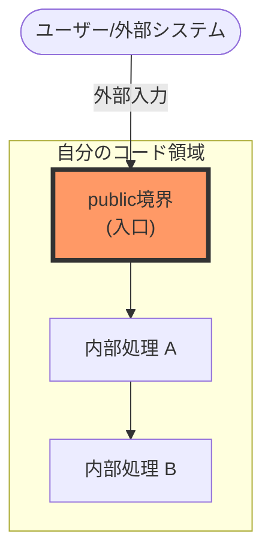
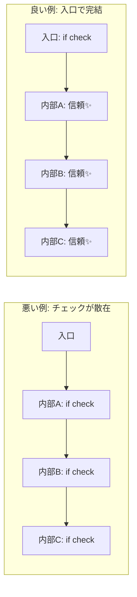
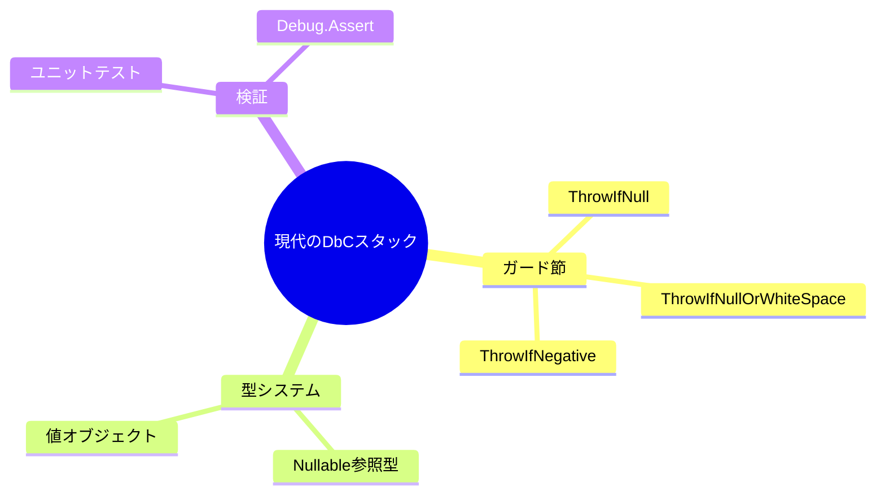

# 第3章 契約を書く場所：いちばん大事なのは“public境界”🚪🌟

## 3.1 「public境界」ってなに？（DbCの“入口”）🗝️✨

ポイントはこれ👇
**「自分のコードが“信じられない入力”を受け取る最初の場所」＝境界**だよ〜！🚪✨

---

## 3.2 境界（public）で守るのが効率的🛡️🚪



DbCでいちばん大切なのは、「**どこで契約をチェックするか？**」なんだ💡
外から呼ばれる入口＝境界**です🚪💡
ここでいう「public境界」は、C#のキーワード「public」だけの話じゃないよ〜！😊

### public境界に含めて考える場所🧭

* **publicメソッド / publicプロパティ**（クラスの外から触れる入口）🔓
* **publicな型（DTO・Request/Response・公開してるモデル）**📦
* **API/GUI/CLIなどの“外部入力”を受け取る場所**（コントローラ、ハンドラなど）🌐🖱️⌨️
* **別プロジェクトや別レイヤーから呼ばれる入口**（internalでも、実質“外部”なら境界扱い）🏢➡️🏠

**「自分のコードが“信じられない入力”を受け取る最初の場所」＝境界**だよ〜！🚪✨



---

## 3.2 なぜ“境界”が最重要？（入口でチェック、内部は信頼）🧘‍♀️🌸

DbCの気持ちいい流れはこれです👇

* **入口（public境界）でしっかりチェック**✅
* **中（private/internalの処理）は“もう安全”としてシンプルに書く**🧼✨

これをやると何が嬉しいの？🎁

* チェックが散らからないから、**修正が1か所で済む**🧹✨
* 「同じチェックがあちこちにある」事故（片方だけ直し忘れ）を防げる🧨🚫



---

## 3.3 “悪い例”と“良い例”（チェックが散る vs 入口に集める）😵‍💫➡️😌✨

### 😵‍💫 悪い例：チェックが内部に散って、何が正しいか分からなくなる

* privateメソッドの奥深くで例外が出る
* 同じチェックが複数に重複する
* 「このメソッドって null OK だっけ？」が迷子になる🌀

```csharp
public sealed class OrderService
{
    public decimal CalculateTotal(string customerId, int itemCount, decimal unitPrice)
    {
        // ここでは何もチェックしない（不安…）
        return CalculateCore(customerId, itemCount, unitPrice);
    }

    private decimal CalculateCore(string customerId, int itemCount, decimal unitPrice)
    {
        if (customerId == null) throw new ArgumentNullException(nameof(customerId));
        if (customerId.Trim().Length == 0) throw new ArgumentException("empty", nameof(customerId));

        if (itemCount <= 0) throw new ArgumentOutOfRangeException(nameof(itemCount));
        if (unitPrice < 0) throw new ArgumentOutOfRangeException(nameof(unitPrice));

        return itemCount * unitPrice;
    }
}
```

これだと、呼ぶ側から見ると「何を守ればいいの？」が見えにくいよね…🥺💭
しかも内部が増えるほど、チェックがあちこちに増殖しがち…🌱🌱🌱

---

### 😌 良い例：public境界で契約を完結させ、内部はスッキリ✨

入口で「契約（Pre）」を満たすことを強制して、内部は信頼して進めます🚪✅

```csharp
public sealed class OrderService
{
    public decimal CalculateTotal(string customerId, int itemCount, decimal unitPrice)
    {
        // ✅ Pre（入口で契約チェック）
        ArgumentException.ThrowIfNullOrWhiteSpace(customerId);
        ArgumentOutOfRangeException.ThrowIfNegativeOrZero(itemCount);
        ArgumentOutOfRangeException.ThrowIfNegative(unitPrice);

        // ここから下は「安全な値しか来ない」前提で書ける✨
        return CalculateCore(customerId, itemCount, unitPrice);
    }

    private static decimal CalculateCore(string customerId, int itemCount, decimal unitPrice)
    {
        // ✅ 追加の引数チェックが不要になってスッキリ！
        return itemCount * unitPrice;
    }
}
```

この「ThrowIf〜」系は、近年の .NET に用意されている“ガード節の定番”だよ〜🛡️✨
（文字列なら ThrowIfNullOrWhiteSpace、nullなら ThrowIfNull など）📌 ([Microsoft Learn][1])

---

## 3.4 “public境界”に書く契約のコツ（短く・強く・迷わない）📝🎀

### ① まずは自然言語で「契約文」を書く🗣️✨

例（さっきのメソッドなら）👇

* customerId は null/空白じゃないこと
* itemCount は 1以上
* unitPrice は 0以上

ここまで書けたら勝ち！🏆
あとはこれを **入口のガード節**に落とすだけ💪😊

---

### ② ガード節は“テンプレ化”すると読みやすさが安定する📐✨

#### よく使う“入口チェック”セット🧰

* null：ArgumentNullException.ThrowIfNull 🧷 ([Microsoft Learn][2])
* 文字列：ArgumentException.ThrowIfNullOrWhiteSpace（空白も弾ける）🧼 ([Microsoft Learn][1])
* 範囲：ArgumentOutOfRangeException.ThrowIfNegative / ThrowIfNegativeOrZero 📏 ([GitHub][3])

「if で例外 new する」より、こういうヘルパーの方がスッキリ＆推奨されやすいよ〜🧁✨ ([Microsoft Learn][4])

---

### ③ “public境界”の中でも、特に重要なのは「公開API」🔑🌟

* 他の人（未来の自分含む）が呼ぶ場所ほど、**契約がドキュメント**になる📘✨
* 境界で落ちると、**原因が入力に近い位置**になる（デバッグがラク）🔍💕

---

## 3.5 ここは注意！「境界でやりすぎ」もあるよ⚠️🍙

境界で全部やればいい…とはいえ、**境界で“複雑な業務判断”までやり始める**と逆に読みにくくなることも😵‍💫

### 境界が向いてる✅

* null / 空 / 範囲 / 形式 / 引数関係（開始<=終了など）🚪🛡️

### 境界に詰め込みすぎ注意⚠️

* 複雑な業務ルール（割引条件が10個ある等）🧩🧠
  → これは「ドメイン側のメソッド」や「専用の型」に寄せた方がキレイになりやすいよ✨

---

## 3.6 ちょい重要な豆知識：「昔のCode Contracts」とDbCは別ものだよ🧓➡️🆕✨

.NET Framework時代には “Code Contracts” という仕組みがあったけど、**.NET 5+ ではサポート対象外**と案内されているよ📌 ([Microsoft Learn][5])

だから今のDbCは、こういう現代寄りの組み合わせで実戦投入する感じになるよ〜🛠️✨

* 入口ガード（ThrowIf〜、例外、Resultなど）🛡️
* Nullable参照型で「そもそも null を減らす」🧷
* テストで「契約が守られる」ことを固定🧪



（C#の言語バージョンも進んでいて、C# 13 は .NET 9、C# 14 は .NET 10 以降が対応、みたいに“言語とランタイムのセット”も意識されてるよ〜）🧠✨ ([Microsoft Learn][6])
（.NET の現行配布も .NET 8/9 が並行で更新されてるよ📦） ([Microsoft][7])

---

## 3.7 ミニ演習：入口の1箇所に検証を集める🧹✅

### お題：このコード、チェックが散ってるので入口に集めよう💪🌸

```csharp
public static class UserService
{
    public static string NormalizeUserName(string name)
    {
        return NormalizeCore(name);
    }

    private static string NormalizeCore(string name)
    {
        if (name == null) throw new ArgumentNullException(nameof(name));
        if (name.Trim().Length == 0) throw new ArgumentException("empty", nameof(name));

        return name.Trim().ToUpperInvariant();
    }
}
```

### ゴール🎯

* publicメソッドでガード節をする
* privateは「安全が保証された前提」でスッキリさせる✨

### 模範解答（例）🧁

```csharp
public static class UserService
{
    public static string NormalizeUserName(string name)
    {
        ArgumentException.ThrowIfNullOrWhiteSpace(name);

        return NormalizeCore(name);
    }

    private static string NormalizeCore(string name)
    {
        return name.Trim().ToUpperInvariant();
    }
}
```

---

## 3.8 AI活用ちょいワザ：契約文→ガード節をサクッと作る🤖⚡️

たとえば、こういうお願いをすると速いよ〜💨✨

* 「このメソッドの Pre 条件を日本語で3つ書いて」📝
* 「Pre を満たすためのガード節（ThrowIf 系）を C# で提案して」🛡️
* 「ガード節が散らばってるから public 入口に集めてリファクタして」🧹

出てきたコードは、**例外の種類（ArgumentNull/ArgumentException/ArgumentOutOfRange）**が意図どおりかだけ最後に目視チェックすると安心だよ👀✅

---

## 3.9 まとめ：第3章の“合言葉”🎀✨

* **契約を書く最優先は public境界（入口）**🚪🌟
* **入口でチェック、内部は信頼**🧘‍♀️✨
* **ガード節は ThrowIf〜 でテンプレ化**🛡️🧰
* **チェックが散ったら、まず入口に集める**🧹✅

[1]: https://learn.microsoft.com/ja-jp/dotnet/api/system.argumentexception.throwifnullorwhitespace?view=net-9.0&utm_source=chatgpt.com "ArgumentException.ThrowIfNullOrWhiteSpace(String ..."
[2]: https://learn.microsoft.com/ja-jp/dotnet/api/system.argumentnullexception.throwifnull?view=net-10.0&utm_source=chatgpt.com "ArgumentNullException.ThrowIfNull Method (System)"
[3]: https://github.com/dotnet/runtime/blob/main/src/libraries/System.Private.CoreLib/src/System/Security/SecureString.cs?utm_source=chatgpt.com "SecureString.cs"
[4]: https://learn.microsoft.com/ja-jp/dotnet/fundamentals/code-analysis/quality-rules/ca1511?utm_source=chatgpt.com "CA1511: ArgumentException スロー ヘルパーを使用する"
[5]: https://learn.microsoft.com/en-us/dotnet/framework/debug-trace-profile/code-contracts?utm_source=chatgpt.com "Code Contracts - .NET Framework"
[6]: https://learn.microsoft.com/en-us/dotnet/csharp/language-reference/language-versioning?utm_source=chatgpt.com "Language versioning - C# reference"
[7]: https://dotnet.microsoft.com/ja-jp/download/dotnet?utm_source=chatgpt.com "ダウンロードするすべての .NET バージョンを参照する"
