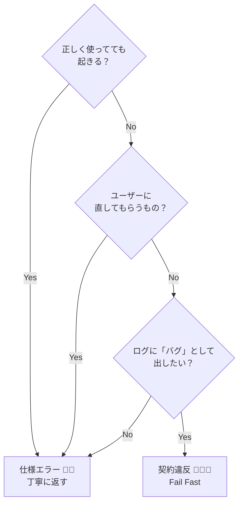
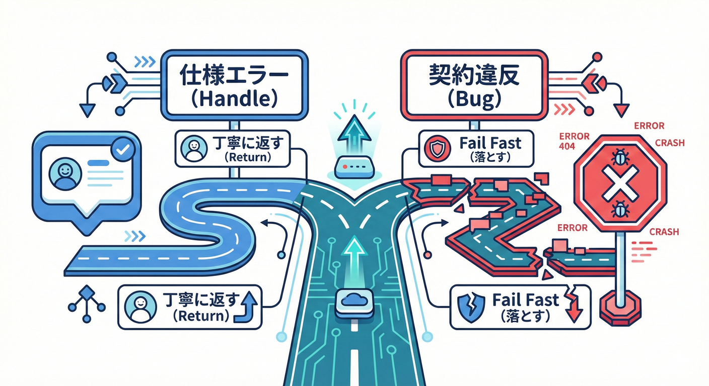
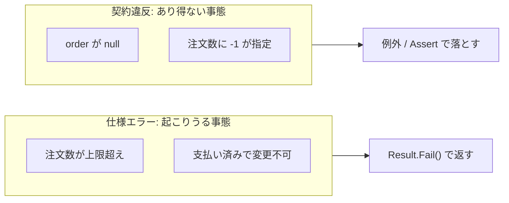
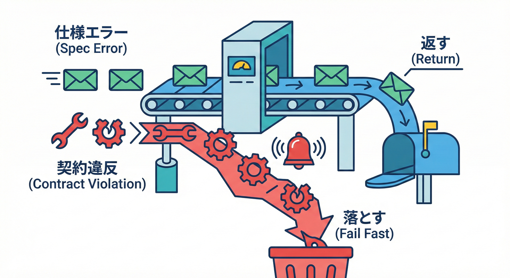

# 第4章 仕様エラー vs 契約違反：混ぜないのが超大事🧨🧠

この章のゴールはこれ👇✨
**「起きたエラーが、仕様エラーなのか？契約違反なのか？」をサクッと判定できて、**
**それぞれに合った“返し方”と“実装の型”を持てるようになること**です💪😊

---

## 4-1. まず結論：混ぜると何が困るの？😵‍💫💥

混ぜると、だいたいこうなります👇

* 仕様エラー（ユーザーの入力ミスとか）を **契約違反として例外で落とす**
  → 画面がエラーだらけ😱 / ログがノイズだらけ📉 / 運用しんどい…
* 契約違反（＝バグ）を **仕様エラーとして握りつぶす**
  → バグが隠れて、後から爆発💣 / “原因不明”が増える😇

だから、最初にここを分けるのが超重要なんです🧠✨

---

## 4-2. 用語をカンタンに決めよう📌✨

### ✅ 契約違反（Contract Violation）🧑‍💻💥

**開発者のミス（＝バグ）**で起きるもの。

* 「呼ぶ側が守るべきルール（Pre）を守ってない」
* 「クラスのルール（Inv）が壊れてる」
* 「本来あり得ない分岐に入った」

👉 **対処**：基本は **直すべき**。
👉 **扱い**：**Fail Fast（早く落として気づく）** が正義🏃‍♀️💨

---

### ✅ 仕様エラー（Specification / Business Error）🙂📩

**ユーザー入力や業務ルール的に“起こり得る”エラー**。

* メール形式が違う📧💦
* 在庫がない📦🚫
* 期限が切れている⌛️😢
* 業務的にその操作ができない（例：発送済みの注文は住所変更できない）🚚🔒

👉 **対処**：丁寧に **返す**（メッセージ、項目別エラーなど）
👉 **扱い**：アプリは落とさない。**期待される拒否**として扱う🌸

---

## 4-3. 迷ったらこれ！判定フローチャート🧭✨

次の質問を順番にすると、だいたいブレません👇😊

### Q1：**正しく使ってても起きる？** 🤔

* **起きる（起こり得る）** → ✅ 仕様エラー🙂📩
* **起きない（起きたらおかしい）** → ✅ 契約違反🧑‍💻💥

### Q2：**このエラーは“ユーザーに直してもらう”もの？** 🧑‍🏫

* **はい** → ✅ 仕様エラー🙂📩（入力や選択の修正）
* **いいえ** → ✅ 契約違反🧑‍💻💥（コード直す）

* **出したくない（想定内）** → ✅ 仕様エラー🙂📩



---

## 4-4. “境界”で分けると世界が平和になる🚪🌈



DbCでめちゃ大事な考え方👇

* **外から入ってくる値**（UI入力、API、ファイル、他サービス）
  → 汚れてるかも🧼⚠️（仕様エラーが起きやすい）
* **ドメイン内部**（自分たちのロジック）
  → 入口でチェック済みの前提✨（契約違反はバグ）

つまりこう👇

* **境界（入口）**：仕様エラーを整えて返す🙂📩
* **内部**：契約違反は早く気づく🧑‍💻💥

---

## 4-5. C#での“返し方”の型（おすすめ）🧩✨

### ① 仕様エラー：Resultで返す🙂📩

「失敗しても想定内」なら、例外じゃなくて **戻り値で表現**が相性いいです🎀

#### ✅ 最小Result（自作）例🧁

```csharp
public sealed record Error(string Code, string Message);

public readonly record struct Result<T>(T? Value, Error? Error)
{
    public bool IsSuccess => Error is null;

    public static Result<T> Ok(T value) => new(value, null);
    public static Result<T> Fail(string code, string message) => new(default, new(code, message));
}
```

#### ✅ 仕様エラーの使い方例（ユーザー入力の拒否）📧🚫

```csharp
public static Result<string> NormalizeEmail(string email)
{
    if (string.IsNullOrWhiteSpace(email))
        return Result<string>.Fail("email.empty", "メールアドレスを入力してね📧");

    email = email.Trim();

    if (!email.Contains('@'))
        return Result<string>.Fail("email.format", "メールアドレスの形式が違うみたい💦");

    return Result<string>.Ok(email.ToLowerInvariant());
}
```

---

### ② 契約違反：例外で落とす（＝バグとして見つける）🧑‍💻💥

「呼び方が悪い」「あり得ない状態」なら、**例外でFail Fast**が基本です⚡️

#### ✅ 引数の契約（Pre）チェック例🛡️

```csharp
public static string ToDisplayName(string firstName, string lastName)
{
    ArgumentException.ThrowIfNullOrWhiteSpace(firstName);
    ArgumentException.ThrowIfNullOrWhiteSpace(lastName);

    return $"{lastName} {firstName}";
}
```

> ここで落ちるなら「呼び出し側がバグってる」可能性が高いので、直すべき💥

#### ✅ 内部の「あり得ない」を即発見（Debug.Assert）🐞🔔

```csharp
using System.Diagnostics;

public static int CalcDiscountRate(int age)
{
    // 想定：このメソッドに来る時点で age は 0..120 のはず（契約）
    Debug.Assert(age is >= 0 and <= 120, "age の契約違反: 0..120 のはず");

    if (age < 12) return 20;
    if (age >= 65) return 15;
    return 0;
}
```

---

## 4-6. “ArgumentExceptionは仕様エラーじゃないの？”問題💭🌀

ここ、初学者が混乱しやすいポイントです🐣🌸

* **ライブラリ/ドメインの public メソッド**に対して
  「呼ぶ側が守るべきルール（Pre）」を破った
  → **契約違反**として `ArgumentException` 系で落とすのは自然💡

* **UI/API の入力**（ユーザーが打った値）が悪い
  → それは **仕様エラー**として “丁寧に返す” のが自然🙂📩

つまり👇
**同じ “不正な値” でも、どこで起きたか（境界か内部か）で扱いが変わる**んです🚪✨

---

## 4-7. Web APIの場合：ProblemDetailsで仕様エラーを返す🧾🌐✨

ASP.NET Core では、APIのエラーを **ProblemDetails（RFC 7807）** 形式で揃えやすいです🧩
特に **バリデーションは ValidationProblemDetails** が便利🎯✨ ([Microsoft Learn][1])

（最小APIでもControllerでも同じ方向性でいけます👍）

---

## 4-8. 実戦：同じ題材で「仕様エラー」と「契約違反」を分けてみる🍔🛒✨

例：注文数を更新するメソッドを考えるよ🍟

### ✅ 仕様エラー（ユーザーがあり得る操作）

* 注文数が上限を超えた（例：在庫の都合で 1〜10）📦
* すでに注文が確定していて変更不可🔒

→ **Resultで返す**（メッセージを出す）🙂📩

### ✅ 契約違反（コードのバグ）

* 内部で「注文数は必ず正」って決めたのに 0 が入ってた😇

→ **例外 or AssertでFail Fast**🧑‍💻💥



---

## 4-9. ミニ演習：どっち？仕分けしてみよう📋✨（超大事）

次のケースを **「仕様エラー🙂📩」or「契約違反🧑‍💻💥」** に分類してね💪🌸

1. ログインIDが空文字だった🙈
2. APIで日付が `2026-13-40` みたいに壊れてた🗓️💥
3. 既に支払い済みの注文をキャンセルしようとした💳🚫
4. `List` の index を間違えて `-1` を渡した📚💥
5. メールアドレスに `@` がない📧💦
6. `Money` は `>= 0` のはずなのに `-100` が入っていた💰😇
7. DB接続が落ちた（タイムアウト）🔌💤
8. 住所の郵便番号が桁数不足だった🏠📮💦
9. 内部状態のフラグが「あり得ない組み合わせ」になってた🚦💥
10. 画像アップロードがサイズ上限超えた🖼️📦🚫

---

### ✅ 解答例（考え方つき）📝✨

* 1. 仕様エラー🙂📩（ユーザーが直せる）
* 2. 仕様エラー🙂📩（外部入力は壊れうる）
* 3. 仕様エラー🙂📩（業務ルールの拒否）
* 4. 契約違反🧑‍💻💥（呼び方がバグ）
* 5. 仕様エラー🙂📩
* 6. 契約違反🧑‍💻💥（不変条件が壊れてる）
* 7. どちらでもない枠（障害）⚠️：運用/リトライ/503系（“バグ”とは別）
* 8. 仕様エラー🙂📩
* 9. 契約違反🧑‍💻💥
* 10. 仕様エラー🙂📩

---

## 4-10. 章末チェックリスト✅🌸

このチェックができたら勝ち🏆✨

## 4.1 仕様エラーと契約違反の違い🤔⚖️



ここ、DbCをマスターするうえで **一番といってもいいくらい大切なポイント** だよ〜！✨
* 境界（入口）で仕様エラーを返し、内部は契約で守る🚪🔒
* 仕様エラーは Result / ValidationProblemDetails など “返す設計” を選べる📩🧾
* 契約違反は例外/Assertで “早く気づく設計” を選べる💥🐞

---

## 参考：2026年の前提として押さえておくメモ🗓️✨

* **.NET 10 は LTS**で、3年間サポート（〜2028年11月）と案内されています📦🛡️ ([Microsoft for Developers][2])
* **C# 14 は .NET 10 上でサポートされる最新C#**として整理されています🧠✨ ([Microsoft Learn][3])
* **Visual Studio 2026** の一般提供（GA）もアナウンスされています💻✨ ([Microsoft for Developers][4])

[1]: https://learn.microsoft.com/en-us/dotnet/api/microsoft.aspnetcore.mvc.validationproblemdetails?view=aspnetcore-10.0&utm_source=chatgpt.com "ValidationProblemDetails Class (Microsoft.AspNetCore.Mvc)"
[2]: https://devblogs.microsoft.com/dotnet/announcing-dotnet-10/?utm_source=chatgpt.com "Announcing .NET 10"
[3]: https://learn.microsoft.com/en-us/dotnet/csharp/whats-new/csharp-14?utm_source=chatgpt.com "What's new in C# 14"
[4]: https://devblogs.microsoft.com/visualstudio/visual-studio-2026-is-here-faster-smarter-and-a-hit-with-early-adopters/?utm_source=chatgpt.com "Visual Studio 2026 is here: faster, smarter, and a hit with ..."
